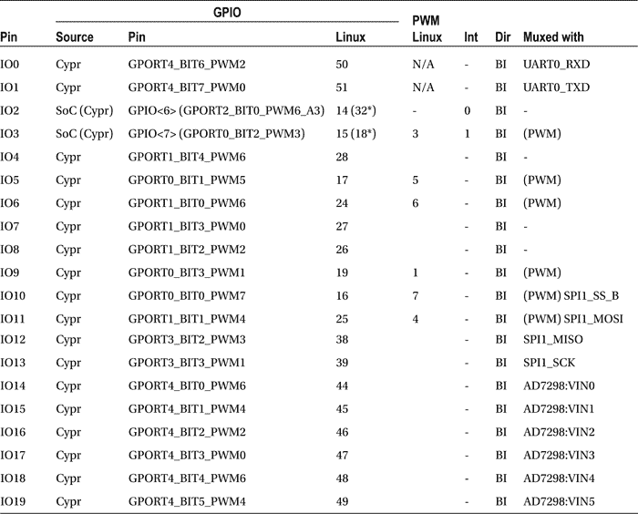
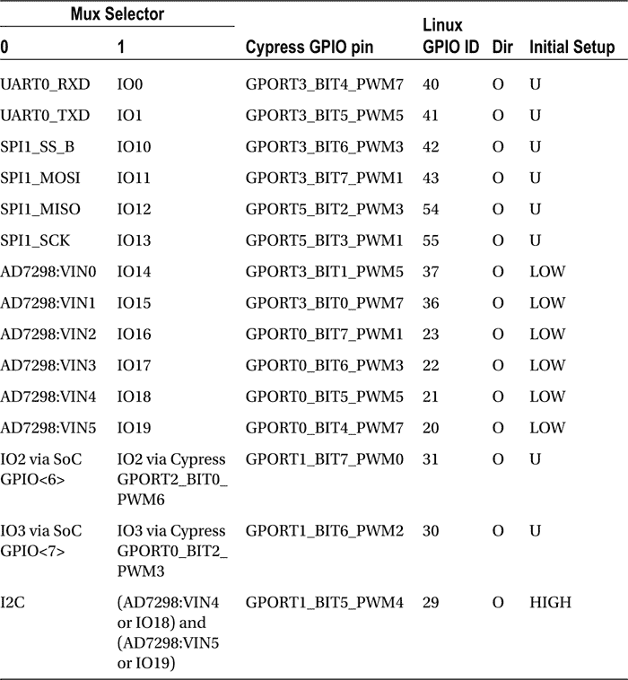

# 十三、附录 A：英特尔Galileo I/O 和多路复用

[A-1](#Tab1)展示了英特尔 Galileo 的 I/O 映射。此表是由英特尔提供的官方端口 I/O 映射，也可通过访问“`https://communities.intel.com/docs/DOC-21920`”找到。

[表 A-1](#_Tab1) 英特尔Galileo I/O 映射



以下是[表 A-1](#Tab1) 的首字母缩写:

*   **Cypr:** Crypress GPIO 扩展器
*   **BI:** 双向
*   **I:** 输入无上拉关闭
*   **Int:** 中断引脚
*   **Dir** :方向

[表 A-2](#Tab2) 展示了英特尔 Galileo 的多路选择器。

[表 A-2](#_Tab2) 。英特尔Galileo多路复用



以下是表 A-2 中[的首字母缩写:](#Tab2)

*   **O:** 输出
*   **Dir:** 方向
*   **U:** 未定义

以下命令演示了一些如何使用 Linux 终端外壳来使用该表的示例:

*   将 IO7 设置为 GPIO 输出:

    ```sh
    echo -n "27" > /sys/class/gpio/export
    echo -n "out" > /sys/class/gpio/gpio27/direction
    echo 0 > /sys/class/gpio/gpio27/value # will set OUTPUT as LOW
    echo 1 > /sys/class/gpio/gpio27/value # will set OUTPUT as HIGH
    ```

*   将 IO7 设置为 GPIO 输入:

    ```sh
    echo -n "27" > /sys/class/gpio/export
    echo -n "in" > /sys/class/gpio/gpio27/direction
    cat /sys/class/gpio/gpio27/value
    ```