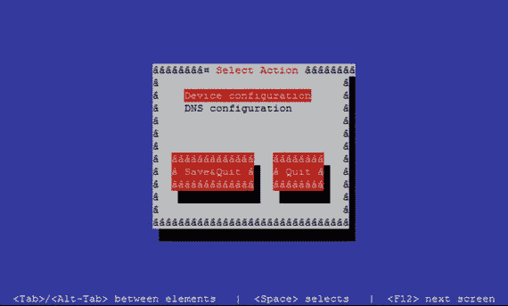
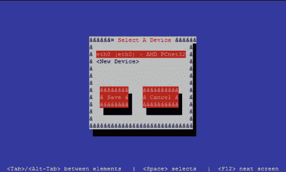
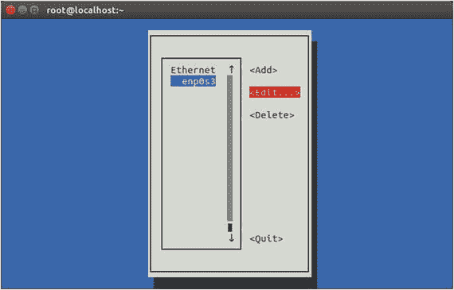
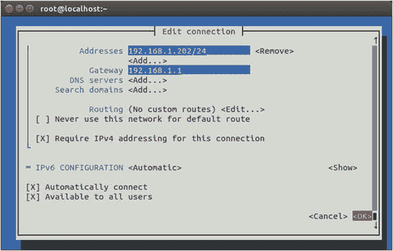

# 3.建立关系网

在这个时代，一台与外界完全隔离的计算机几乎毫无用处。许多日常任务，如发送或接收电子邮件、共享文件或查询数据库，都需要外部连接。

为了进行通信，计算机使用一种叫做网络协议的软件组件。我不会详细讨论不同的网络协议，因为已经有很多关于这个主题的书了。实际上有许多网络协议，但事实上的标准是 TCP/IP 协议。

## 3.1 IPv4

这个协议是由国防高级研究计划局(DARPA)在 70 年代开发的。它是一种分层模型，以四个八位字节的形式为每台计算机分配一个 IP 地址:x.x.x.x。每个地址都有一个关联的掩码，该掩码也由四个八位字节组成。随后，您会看到更多的细节。

正如我前面提到的，一个 IP 地址由四个数字表示，数值范围从 0 到 255。例如，192.168.10.19，198.165.30.40，88.43.53.12 等。这个数字还有另一个相关参数，即子网掩码。子网掩码可以是 255.255.255.0、255.255.0.0、255.240、0.0 等。假设我们有一台具有以下参数的计算机:

IP 地址:192.168.10.19

网络掩码:255.255.255.0

现在我们必须引入一个新的概念，网络地址。这个值将告诉我们两台计算机是在同一个网络中还是在不同的网络中。为了获得网络地址，我们检查二进制的 IP 地址和网络掩码的值。

IP 地址:11000000.10100100005

网络掩码:1111111111.1111111121

网络地址将是 IP 地址的一部分，对应于网络掩码中包含数字 1 的部分。在我们的例子中，它将是

网络地址:11000000.10100100.00001010 192 . 168 . 10

由于网络地址的长度也必须有四个二进制八位数，所以地址的其余部分将以 0 来填充。

网络地址:11000000.10100100.00001010.000000000 192 . 168 . 10 . 0

两台计算机要直接通信，它们必须有相同的网络地址。在我们的示例中，如果我们已经有一台 IP 地址为 192.168.10.19 的服务器，并且网络掩码为 255.255.255.0，我们应该为一台新计算机使用相同的网络地址(当然，还有不同的 IP)。许多有效 IP 地址中的一个可能是这个:

IP 地址:192.168.10.20

网络掩码:255.255.255.0

网络地址:192.168.10.0

因此，一个 IP 地址必须总是有一个相关的掩码；否则，人们将无法确定它属于哪个网络。在前面的示例中，IP 地址和网络掩码被指定为两个独立的值，但是它们可以用缩写形式表示。让我们举最后一个例子。

IP 地址:192.168.10.20

网络掩码:255.255.255.0

如果我们将这些值转换成二进制，我们会得到:

IP 地址:11000000.10101000005

网络掩码:1111111111.1111111121

网络掩码有 24 个 1，所以我们可以这样表示 IP 地址和掩码:192.168.10.20/24。

IP 地址也可以分为许多类别:

A 类:

地址以 0 开头。也就是说，从 1.x.x.x 到 127.x.x.x 的每个地址都被认为是 A 类 IP 地址。

B 类:

地址以 10 开头。这些 IP 地址的范围从 128 到 191.x.x.x。

经典的

在这种情况下，地址以 110 开始。有效的地址范围是 192.x.x.x 到 224.x.x.x。

还有一个 D 类和 E 类，用于特定的目的，但我不会进入这些的细节。

### 特殊地址

还有一些地址是为特定目的而定义的。

一个例子是 IP 地址 127.0.0.1，称为回环。每个使用 TCP 协议的设备都会自动分配到这个地址，即使它没有网络设备，也没有分配到任何其他 IP 地址。通过使用这个环回地址，我们可以在本地测试 TCP 协议。

其他一些网络地址是为了在专用局域网中使用，而不是在互联网上，因为它们可能不是唯一的。这些地址是

10.0.0.0/8 172.16.0.0/12 192.168.0.0/16

因此，属于这些网络的每个 IP 地址都被视为私有地址。

### 3.1.2 单播、多播和广播

IPv4 设备可以直接与另一个 IPv4 设备通信，建立一对一的关系。这叫做单播。

但是可能这个设备想要与具有相同网络地址的所有设备通信。这就是所谓的广播，它由网络地址加上所有主机位组成，所有主机位都是 1。例如，如果一台计算机有 192.168.1.20/24 地址，并且想要发送广播，它会将它发送到 192.168.1.255 地址。

还有第三种情况，在这种情况下，一台计算机希望与同一网络中的其他几台计算机通信，但不是所有的计算机。为此，这些计算机应该共享一个多播地址。这种类型的通信称为多播。

### 3.1.3 以 CentOS 为单位的 IPv4 配置

#### 3.1.3.1 CentOS 6

要临时为 CentOS 服务器分配 IP 地址，我们可以使用`ifconfig`命令。用`-a`参数执行，它将显示所有存在的网络接口，不管它们是否被配置。

```sh
 1   [root@delphos ∼]# ifconfig -a
 2   eth0      Link encap:Ethernet HWaddr 00:0C:29:78:4C:B1
 3             UP BROADCAST RUNNING MULTICAST MTU:1500 Metric:1
 4             RX packets:0 errors:0 dropped:0 overruns:0 frame:0
 5             TX packets:0 errors:0 dropped:0 overruns:0 carrier:0
 6             collisions:0 txqueuelen:1000
 7             RX bytes:0 (0.0 b) TX bytes:55678099 (0.0 b)
 8             Interrupt:19 Base address:0x2000
 9
10   lo        Link encap:Local Loopback
11             inet addr:127.0.0.1 Mask:255.0.0.0
12             inet6 addr: ::1/128 Scope:Host
13             UP LOOPBACK RUNNING MTU:16436 Metric:1
14             RX packets:19843 errors:0 dropped:0 overruns:0 frame:0
15             TX packets:19843 errors:0 dropped:0 overruns:0 carrier:0
16             collisions:0 txqueuelen:0
17             RX bytes:19601819 (18.6 MiB) TX bytes:19601819 (18.6 MiB)

```

我们可以看到我们的服务器中有两个网络接口，`lo` (loopback)，一个内部使用的虚拟网络接口，和`eth0`，它对应于一个以太网卡。最后一个是我们必须用来配置服务器 IP 地址的接口。

```sh
1   [root@delphos ∼]# ifconfig eth0 192.168.1.20 netmask 255.255.255.0 up

```

使用`ifconfig`，我们可以添加一个临时 IP，但是为了使这个改变持久，我们必须修改系统的网络配置。我们可以通过手动编辑`/etc/sysconfig/network-scripts/ifcfg-eth0`文件并添加以下几行来实现:

```sh
1   IPADDR=192.168.10.19
2   BOOTPROTO=none
3   NETMASK=255.255.255.0
4   TYPE=Ethernet

```

我们还必须将行`ONBOOT=no`改为`ONBOOT=yes`，这样网络接口在每次重启后都会被激活。这个过程非常完美，但是使用自动配置工具可能更方便，比如`system-config-network`。这个程序可能默认情况下没有安装，所以我们现在必须安装它。正如您在上一章中看到的，我们可以使用`yum`来识别与命令相关联的包。

```sh
 1   [root@delphos ∼]# yum --disablerepo=* --enablerepo=c6-media provides system-conf\
 2   ig-network
 3   Loaded plugins: fastestmirror
 4   Loading mirror speeds from cached hostfile
 5   * c6-media:
 6   file:///media/CentOS/repodata/repomd.xml: [Errno 14] Could not open/read file://\
 7   /media/CentOS/repodata/repomd.xml
 8   Trying other mirror.
 9   file:///media/cdrecorder/repodata/repomd.xml: [Errno 14] Could not open/read fil\
10   e:///media/cdrecorder/repodata/repomd.xml
11   Trying other mirror.
12   c6-media | 4.0 kB 00:00 ...
13   Warning: 3.0.x versions of yum would erroneously match against filenames.
14   You can use "*/system-config-network" and/or "*bin/system-config-network" to ge\
15   t that behaviour
16   No Matches found
17   [root@delphos ∼]# yum --disablerepo=* --enablerepo=c6-media provides */system-co\
18   nfig-network
19   Loaded plugins: fastestmirror
20   Loading mirror speeds from cached hostfile
21   * c6-media:
22   system-config-network-tui-1.6.0.el6.2-1.el6.noarch : The Network Adminstration
23                                                      : Tool
24   Repo        : c6-media
25   Matched from:
26   Filename    : /usr/share/system-config-network
27   Filename    : /usr/bin/system-config-network
28   Filename    : /etc/pam.d/system-config-network
29   Filename    : /etc/security/console.apps/system-config-network
30   Filename    : /usr/sbin/system-config-network

```

所以，我们用这个命令安装软件包`system-config-network-tui`:`yum –disablerepo=* – enablerepo=c6-media install system-config-network-tui`。一旦安装包，我们就可以用`system-config-network`(图 [3-1](#Fig1) )启动程序。



图 3-1。

`system-config-network`

我们选择设备配置选项，然后按回车键。网络接口列表(图 [3-2](#Fig2) )现在出现在屏幕上。在这种情况下，只有一个。我们选择它并再次按回车键。



图 3-2。

Selecting an interface

我们填写表格，然后单击“确定”“➤保存”“➤保存并点击”(图 [3-3](#Fig3) )。


图 3-3。

Assigning an IP address

如果我们再次检查`/etc/sysconfig/network-scripts/ifcfg-eth0`文件，我们将看到它已经更新了文件内容。尽管如此，我们仍然需要手动将参数`ONBOOT=no`更改为`ONBOOT=yes`。

最后，我们重启服务。

```sh
1   [root@delphos ∼]# service network restart

```

#### 3.1.3.2 CentOS 7

在 CentOS 7 中，默认情况下不安装`ifconfig`命令，因为该命令已被弃用。相反，鼓励使用实用程序`ip`。我们可以这样添加 IP 地址:

```sh
1   [root@Centos7 ∼]# ip address add 192.168.1.202/24 dev enp0s3

```

我们还可以列出接口及其关联的 IP 地址。

```sh
 1   [root@Centos7 ∼]# ip address show
 2   1: lo: <LOOPBACK,UP,LOWER_UP> mtu 65536 qdisc noqueue state UNKNOWN
 3       link/loopback 00:00:00:00:00:00 brd 00:00:00:00:00:00
 4       inet 127.0.0.1/8 scope host lo
 5          valid_lft forever preferred_lft forever
 6       inet6 ::1/128 scope host
 7          valid_lft forever preferred_lft forever
 8   2: enp0s3: <BROADCAST,MULTICAST,UP,LOWER_UP> mtu 1500 qdisc pfifo_fast state UP \
 9   qlen 1000
10       link/ether 08:00:27:a0:46:d2 brd ff:ff:ff:ff:ff:ff
11       inet 192.168.1.202/24 scope global enp0s3
12          valid_lft forever preferred_lft forever

```

正如 CentOS 6 中所发生的那样，我们刚刚分配的 IP 地址将是临时的。如果我们想让它持久化，我们必须编辑`/etc/sysconfig/network-scripts/ifcfg-enp0s3`文件并添加以下几行:

```sh
1   IPADDR=192.168.10.19
2   BOOTPROTO=static
3   NETMASK=255.255.255.0
4   TYPE=Ethernet

```

我们必须设置参数`ONBOOT=yes`，这样每次系统启动时网络接口都会被激活。这样，我们为服务器分配了一个静态 IP 地址，但是使用网络实用程序更方便。在 CentOS 6 中，我们使用了`system-config-network`，但是在 CentOS 7 中没有这个命令。而是必须用`nmtui`(图 [3-4](#Fig4) 和 [3-5](#Fig5) )。



图 3-5。

Editing a connection with `nmtui`


图 3-4。

`nmtui`

由于我们还没有添加默认网关，我们现在将添加它(图 [3-6](#Fig6) )。


图 3-6。

Adding a default gateway with `nmtui`

我们接受变更(图 [3-7](#Fig7) )。



图 3-7。

Adding a default gateway with `nmtui`

我们重启网络服务。

```sh
1   [root@localhost ∼]# service network restart
2   Restarting network (via systemctl):                                  [ OK ]

```

现在我们可以用`ip`命令检查当前配置的默认网关。

```sh
1   [root@localhost ∼]# ip route show
2   default via 192.168.1.1 dev enp0s3 proto static metric 1024
3   192.168.1.0/24 dev enp0s3 proto kernel scope link src 192.168.1.202

```

## 3.2 IPv6

当互联网越来越受欢迎时，有一点变得很明显，总有一天会没有更多的 IPv4 地址可用。IPv4 地址有 4 个字节长，最多允许大约 42 亿个地址，而人类人口大约有 70 亿。显然，并不是每个人都有一台可以连接互联网的电脑——这在发展中国家尤其如此——但每天都有越来越多的人接入互联网，在办公室有一台电脑、在家里有另一台电脑和一部智能手机——所有这些都可以接入互联网——一点也不稀奇。此外，我们应该考虑到互联网上的每台服务器也需要一个唯一的 IP 地址。

考虑到这些事实，认为 IPv4 在未来几年将不再能够满足互联网的需求似乎是相当合理的。为了解决这个问题，IETF(互联网工程任务组)的工程师们非常努力地工作，直到他们提出了一个新的协议，他们称之为 IPv6。IPv6 使用 128 位地址，允许 3.4 * 10ˇ38 个地址，长时间使用应该绰绰有余。IPv6 地址通常以十六进制格式表示为八组 16 位，如下所示:

fe80:0000:0000:0000:020 c:29 ff:fef:d 786/64

“/64”用于表示掩码，正如我在讨论 IPv4 地址时所看到的。这意味着地址的前 64 位将定义网络地址。

当有多个连续的零时，可以省略较大的一组零:fe80::020c:29ff:fedf:d786/64。

与 IPv4 地址一样，一些 IPv6 地址被分配了特殊的角色。以 fe80 开头的地址被认为是本地链路地址，这个概念类似于 IPv4 世界中的私有地址。只要网络接口启用了 IPv6，就会为其分配一个以 fe80 开头的 Ipv6 地址。

我们可以使用`ip`命令为接口`eth0`分配一个 IPv6 地址。

```sh
1   [root@delphos ∼]# ip address add 2000::20c:29ff:fe78:4cb1/64 dev eth0

```

现在我们可以看到分配的新 IP。

```sh
 1   [root@delphos ∼]# ifconfig eth0
 2   eth0      Link encap:Ethernet HWaddr 00:0C:29:78:4C:B1
 3             inet addr:192.168.1.20 Bcast:192.168.1.255 Mask:255.255.255.0
 4             inet6 addr: 2000::20c:29ff:fe78:4cb1/64 Scope:Global
 5             inet6 addr: fe80::20c:29ff:fe78:4cb1/64 Scope:Link
 6             UP BROADCAST RUNNING MULTICAST MTU:1500 Metric:1
 7             RX packets:3911047 errors:25 dropped:14 overruns:0 frame:0
 8             TX packets:264248 errors:0 dropped:0 overruns:0 carrier:0
 9             collisions:0 txqueuelen:1000
10             RX bytes:387910100 (369.9 MiB) TX bytes:57615841 (54.9 MiB)
11             Interrupt:19 Base address:0x2000
12
13   [root@delphos ∼]# ip address show dev eth0
14   2: eth0: <BROADCAST,MULTICAST,UP,LOWER_UP> mtu 1500 qdisc pfifo_fast state UNKNO\
15   WN qlen 1000
16       link/ether 00:0c:29:78:4c:b1 brd ff:ff:ff:ff:ff:ff
17   inet 192.168.1.20/24 brd 192.168.1.255 scope global eth0
18   inet6 2000::20c:29ff:fe78:4cb1/64 scope global
19      valid_lft forever preferred_lft forever
20   inet6 fe80::20c:29ff:fe78:4cb1/64 scope link
21      valid_lft forever preferred_lft forever

```

## 3.3 网络工具

### netstat

每当一个程序必须与网络通信时，它就使用 TCP 协议所称的“端口”端口是在网络中识别网络服务的手段。例如，为了与 web 服务器通信，服务器将使用端口 80。要连接到 FTP 服务器，必须访问端口 21 等。也就是说，对于服务器中运行的每个网络服务，必须有(至少)一个开放的 TCP 端口。

如果我们想知道我们当前有多少个开放端口，我们可以使用`netstat`。默认情况下，它将只显示已建立连接的端口。

```sh
 1   [root@localhost ∼]# netstat
 2   Active Internet connections (w/o servers)
 3   Proto Recv-Q Send-Q Local Address          Foreign Address        Stat\
 4   e
 5   tcp        0      0 192.168.1.20:ssh       192.168.1.1:49775      ESTA\
 6   BLISHED
 7   Active UNIX domain sockets (w/o servers)
 8   Proto RefCnt Flags       Type       State       I-Node Path
 9   unix 2       [ ]         DGRAM                  8587   @/org/kernel/udev/udevd
10   unix 10      [ ]         DGRAM                  10473  /dev/log
11   .
12   .
13   .

```

在这种情况下，我们可以看到我们只有一个连接的 TCP 端口，即 ssh 端口。该命令显示了许多打开的 unix 套接字，但是我们现在忽略它们。我们可以将许多选项传递给`netstat`。一些更有用的是:`-a`，显示所有打开的端口，而不仅仅是那些已经连接的端口；`-p`，识别打开端口的程序；`-t`，为 TCP`-u`，为 UDP 或`-n`，显示端口号而不是端口名。让我们看一个例子。

```sh
 1   [root@localhost ∼]# netstat -aptn
 2   Active Internet connections (servers and established)
 3   Proto Recv-Q Send-Q Local Address          Foreign Address        Stat\
 4   e       PID/Program name
 5   tcp        0      0 0.0.0.0:22             0.0.0.0:*              LIST\
 6   EN      1107/sshd
 7   tcp        0      0 127.0.0.1:25           0.0.0.0:*              LIST\
 8   EN      1183/master
 9   tcp        0      0 0.0.0.0:5672           0.0.0.0:*              LIST\
10   EN      1196/qpidd
11   tcp        0      0 192.168.1.20:22        192.168.1.1:50316      ESTA\
12   BLISHED 6738/sshd
13   tcp        0      0 :::22                  :::*                   LIST\
14   EN      1107/sshd
15   tcp        0      0 ::1:25                 :::*                   LIST\
16   EN      1183/master

```

我们得到所有开放的 TCP 端口的列表，显示端口号和它们相关的程序。

### 3.3.2 升

另一个真正有用的工具是`lsof`。默认情况下很可能不会安装，但是我们可以用`yum`安装，就像我们之前看到的那样。

```sh
1   [root@localhost ∼]# yum --disablerepo=* --enablerepo=c6-media provides lsof
2   Loaded plugins: fastestmirror
3   Loading mirror speeds from cached hostfile
4    * c6-media:
5   lsof-4.82-2.el6.i686 : A utility which lists open files on a Linux/UNIX system
6   Repo        : c6-media
7   Matched from:
8
9   [root@localhost ∼]# yum --disablerepo=* --enablerepo=c6-media install lsof

```

这个工具列出了系统中打开的文件，但是我们可以用它来查看在给定的端口中有什么进程在监听。

```sh
1   [root@localhost ∼]# lsof -i :53
2   COMMAND  PID  USER  FD  TYPE DEVICE SIZE/OFF NODE NAME
3   named   8616 named  20u IPv6  27844      0t0  TCP *:domain (LISTEN)
4   named   8616 named  21u IPv4  27849      0t0  TCP localhost:domain (LISTEN)
5   named   8616 named  22u IPv4  27851      0t0  TCP 192.168.1.20:domain (LISTEN)
6   named   8616 named 512u IPv6  27843      0t0  UDP *:domain
7   named   8616 named 513u IPv4  27848      0t0  UDP localhost:domain
8   named   8616 named 514u IPv4  27850      0t0  UDP 192.168.1.20:domain

```

### 3.3.3 nmap

有时我们必须知道可以通过网络访问的开放端口。可能会发生这样的情况，一个服务正在监听本地机器的一个端口，但是在服务器和客户机之间存在一个防火墙或某种过滤器。在这种情况下，显然，两台计算机之间没有通信。为了证明一个端口是否可访问，我们可以使用`nmap`。

基本语法是`nmap` name_or_ip。

```sh
 1   [root@localhost named]# nmap 192.168.1.20
 2
 3   Starting Nmap 5.21 ( http://nmap.org ) at 2014-08-03 02:31 CEST
 4   mass_dns: warning: Unable to determine any DNS servers. Reverse DNS is disabled.\
 5    Try using --system-dns or specify valid servers with --dns-servers
 6   Nmap scan report for 192.168.1.20
 7   Host is up (0.00071s latency).
 8   Not shown: 998 filtered ports
 9   PORT   STATE SERVICE
10   22/tcp open ssh
11   53/tcp open domain
12   MAC Address: 00:0C:29:78:4C:B1 (VMware)
13
14   Nmap done: 1 IP address (1 host up) scanned in 5.29 seconds
15   [root@localhost named]#

```

我们还可以指定想要检查的端口。

```sh
 1   [root@localhost named]# nmap -p 80,22 192.168.1.20
 2
 3   Starting Nmap 5.21 ( http://nmap.org ) at 2014-08-03 03:05 CEST
 4   mass_dns: warning: Unable to determine any DNS servers. Reverse DNS is disabled.\
 5    Try using --system-dns or specify valid servers with --dns-servers
 6   Nmap scan report for 192.168.1.20
 7   Host is up (0.00024s latency).
 8   PORT   STATE    SERVICE
 9   22/tcp open     ssh
10   80/tcp filtered http
11   MAC Address: 00:0C:29:78:4C:B1 (VMware)
12
13   Nmap done: 1 IP address (1 host up) scanned in 0.08 seconds
14   [root@localhost named]#

```

我们还可以获得更多关于在每个端口监听的服务的信息。

```sh
 1   [root@localhost named]# nmap -sV 192.168.1.20
 2
 3   Starting Nmap 5.21 ( http://nmap.org ) at 2014-08-03 03:07 CEST
 4   Nmap scan report for delphos.olimpus.local (192.168.1.20)
 5   Host is up (0.00034s latency).
 6   Not shown: 998 filtered ports
 7   PORT   STATE SERVICE VERSION
 8   22/tcp open  ssh     OpenSSH 5.3 (protocol 2.0)
 9   53/tcp open  domain
10   MAC Address: 00:0C:29:78:4C:B1 (VMware)
11  
12   Service detection performed. Please report any incorrect results at http://nmap.\
13   org/submit/ .
14   Nmap done: 1 IP address (1 host up) scanned in 16.86 seconds
15   [root@localhost named]#

```

### 3.3.4 平

诊断网络问题的最简单和最有用的工具之一是`ping`。使用`ping`，我们只需向目的地发送一个小数据包。如果数据包到达，目的地通常会应答。

```sh
1   [root@delphos ∼]# ping 192.168.10.23
2   PING 192.168.10.23 (192.168.10.23) 56(84) bytes of data.
3   64 bytes from 192.168.10.23: icmp_seq=1 ttl=63 time=2.76 ms
4   64 bytes from 192.168.10.23: icmp_seq=2 ttl=62 time=1.59 ms

```

### 3.3.5 平 6

Ping6 是 IPv6 版本的`ping`命令。其工作方式相同，但使用的是 IPv6 地址。

```sh
1   [root@CentOS7 ∼]# ping6 2001::20c:29ff:fe78:4cb2
2   PING 2001::20c:29ff:fe78:4cb2(2001::20c:29ff:fe78:4cb2) 56 data bytes
3   64 bytes from 2001::20c:29ff:fe78:4cb2: icmp_seq=1 ttl=64 time=0.083 ms
4   64 bytes from 2001::20c:29ff:fe78:4cb2: icmp_seq=2 ttl=64 time=0.080 ms

```

如果我们尝试 ping 一个本地链路地址(以 fe80 开头的地址)，我们必须指定接口。否则，我们会收到一个错误。

```sh
 1   [root@delphos ∼]# ping6 fe80::20c:29ff:fe78:4cb1
 2   connect: Invalid argument
 3   [root@delphos ∼]# ping6 -I eth0 fe80::20c:29ff:fe78:4cb1
 4   PING fe80::20c:29ff:fe78:4cb1(fe80::20c:29ff:fe78:4cb1) from fe80::20c:29ff:fe78\
 5   :4cb1 eth0: 56 data bytes
 6   64 bytes from fe80::20c:29ff:fe78:4cb1: icmp_seq=1 ttl=64 time=3.70 ms
 7   64 bytes from fe80::20c:29ff:fe78:4cb1: icmp_seq=2 ttl=64 time=0.111 ms
 8   64 bytes from fe80::20c:29ff:fe78:4cb1: icmp_seq=3 ttl=64 time=0.044 ms
 9   ^C
10   --- fe80::20c:29ff:fe78:4cb1 ping statistics ---
11   3 packets transmitted, 3 received, 0% packet loss, time 2300ms
12   rtt min/avg/max/mdev = 0.044/1.285/3.701/1.708 ms

```