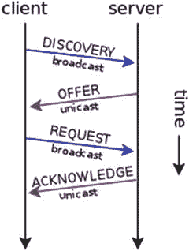
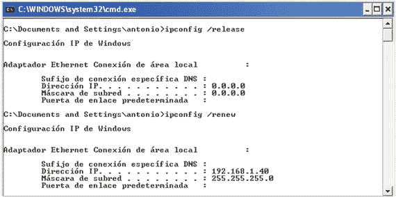
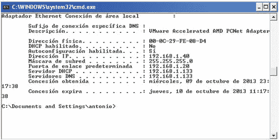
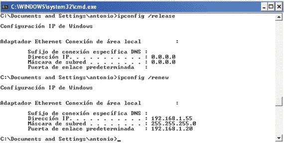
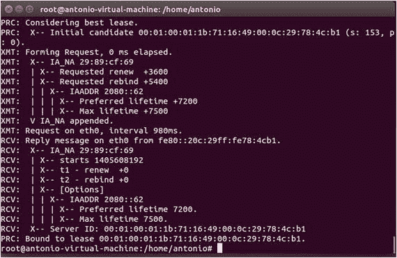
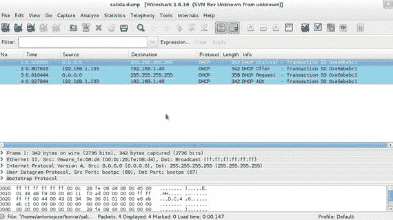
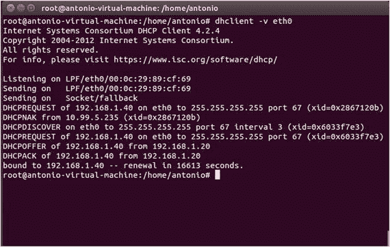
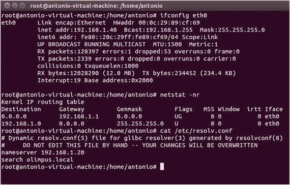

# 5.动态主机配置协议

众所周知，要连接到网络，每台计算机都需要一个 IP 地址。在小型网络中，为每台计算机手动分配不同的 IP 地址不成问题，但是当使用数十或数百台网络设备时，必须非常小心，以免出错。

为了使事情变得简单，我们可以将这个任务委托给 DHCP 服务。DHCP 实际上是为所有网络设备提供 IP 地址。

事实上，它不仅可以提供 IP 地址，还可以提供参数，如默认网关、dns 服务器等。

DHCP 协议的工作方式相当简单(图 [5-1](#Fig1) )。在 DHCPv4 的情况下，DHCP 版本与 IPv4 一起工作，当 DHCP 客户端启动时，它向网络发送 DHCP 发现消息。通过这种方式，它试图找到一个可用的 DHCP 服务器。如果网络中有一台(或多台)DHCP 服务器，它将通过 DHCP offer 消息进行应答。当客户端收到这些 DHCP offer 消息之一时，它将向服务器发回一个 DHCP 请求。服务器依次回复一个 DHCP ack 消息，并分配地址。



图 5-1。

DHCP protocol

在 DHCPv6 的情况下，过程是不一样的，但是它与 DHCPv4 的过程没有太大的不同。这里，客户端发送一个 DHCP 请求消息，服务器用一个广告消息进行回复。一旦客户机接收到广告消息，它就向服务器发回一个请求，然后服务器用一个回复进行应答，从而完成这个过程。

## 5.1 安装 DHCP 服务器

要将 CentOS 服务器转换为 DHCP 服务器，我们只需安装`dhcp`软件包。

```sh
1   [root@CentOS7 ∼]# yum install dhcp

```

这将在`/etc/init.d`中创建一个名为`dhcpd`的新服务。正如我们在安装 DNS 服务时所做的那样，我们将`dhcpd`服务配置为在每次重启时自动启动。

在 centos 6 上:

```sh
1   [root@delphos ∼]# chkconfig dhcpd on

```

在 centos 7 上:

```sh
1   [root@CentOS7 ∼]# systemctl enable dhcpd
2   ln -s '/usr/lib/systemd/system/dhcpd.service' '/etc/systemd/system/multi-user.ta\
3   rget.wants/dhcpd.service'

```

服务器配置将存储在两个不同的文件中:`/etc/dhcp/dhcpd.conf`和`/etc/dhcpd/dhcpd6.conf`。第一个文件将具有与 IPv4 相关联的配置选项，而第二个文件将具有与 IPv6 参数相同的配置选项。全新安装后，两个文件都是空的，但是有两个示例文件可以作为起点:`/usr/share/doc/dhcp-4.1.1/dhcpd.conf.example`和`/usr/share/doc/dhcp-4.1.1/dhcpd6.conf.example`。

Note

根据您使用的 CentOS 版本，示例文件的确切位置会有所不同。例如，如果您使用 CentOS 7，文件将位于`/usr/share/doc/dhcp- 4.2.5/dhcpd.conf.example`和`/usr/share/doc/dhcp-4.2.5/dhcpd6.conf.example`中。

配置新 DHCP 服务器最简单的方法可能是用前面提到的两个示例文件覆盖默认(空)配置文件。

```sh
1   [root@localhost ∼]# cp /usr/share/doc/dhcp-4.1.1/dhcpd.conf.sample /etc/dhcp/dhc\
2   pd.conf
3   cp: overwrite `/etc/dhcp/dhcpd.conf'? y
4   [root@localhost ∼]# cp /usr/share/doc/dhcp-4.1.1/dhcpd6.conf.sample /etc/dhcp/dh\
5   cpd6.conf
6   cp: overwrite `/etc/dhcp/dhcpd6.conf'? y

```

我们将注释掉两个文件中的所有行，开始逐个添加我们的指令。我们可以通过`sed`和`tee`命令轻松做到这一点，如下所示:

```sh
1   [root@localhost ∼]# sed s/^/#/ /etc/dhcp/dhcpd.conf | tee /etc/dhcp/dhcpd.conf
2   [root@localhost ∼]# sed s/^/#/ /etc/dhcp/dhcpd6.conf | tee /etc/dhcp/dhcpd6.conf

```

现在我们准备开始配置我们的 DHCP 服务器。

### 5.1.1 DHCPv4

如果我们看一下`/etc/dhcp/dhcpd.conf`文件，我们可以看到我们可以分配给 DHCP 客户端的许多参数，例如`domain-name`、`domain-servers`等。

从非常基本的配置开始，我们可以创建以下子网:

```sh
1   subnet 192.168.1.0 netmask 255.255.255.0 {
2   range 192.168.1.40 192.168.1.43;
3   }

```

我们已经定义了从 192.168.1.40 到 192.168.1.43 的地址范围，这些地址将分配给 DHCP 客户端。当然，DHCP 服务器应该至少有一个属于 192.168.1.0/24 网络的 IP 地址。我们可以使用以下命令检查文件的语法是否正确:

```sh
1   [root@localhost ∼]# dhcpd -t /etc/dhcp/dhcpd.conf
2   Internet Systems Consortium DHCP Server 4.1.1-P1
3   Copyright 2004-2010 Internet Systems Consortium.
4   All rights reserved.
5   For info, please visit https://www.isc.org/software/dhcp/
6   Not searching LDAP since ldap-server, ldap-port and ldap-base-dn were not specif\
7   ied in the config file

```

在 CentOS 7 中，接口名称比以前在 CentOS 6 中长，因此当检查`dhcpd.conf`文件语法时，我们可能会收到以下警告:

```sh
 1   [root@CentOS7 ∼]# dhcpd -t /etc/dhcp/dhcpd.conf
 2   /etc/dhcp/dhcpd.conf: interface name too long (is 20)
 3   ...
 4   This version of ISC DHCP is based on the release available
 5   on ftp.isc.org. Features have been added and other changes
 6   have been made to the base software release in order to make
 7   it work better with this distribution.
 8
 9   Please report for this software via the CentOS Bugs Database:
10   http://bugs.centos.org/
11  
12   exiting.

```

但是这不应该阻止`dhcpd`服务正常工作。

我们启动服务，客户端将能够接收池中指定的地址。

```sh
1   [root@localhost ∼]# service dhcpd start
2   Starting dhcpd: [ OK ]
3   [root@localhost ∼]#

```

如果客户端是 Windows 电脑，我们可以强制其更新 IP 地址，如图 [5-2](#Fig2) 所示。



图 5-2。

Obtaining an IP address

我们可以看到，分配的 IP 地址是 192.168.1.40。

通过查看`/var/lib/dhcpd/dhcpd.leases`文件，我们也可以在服务器本身中看到它。

```sh
 1   .
 2   .
 3   .
 4   lease 192.168.1.40 {

 5   starts 5 2013/09/13 08:49:48;
 6   ends 5 2013/09/13 20:49:48;
 7   cltt 5 2013/09/13 08:49:48;
 8   binding state active;
 9   next binding state free;
10   hardware ethernet 00:0c:29:fe:08:d4;
11   uid "\001\000\014)\376\010\324";
12   clienthostname
13   "windowscli";
14   }
15   .
16   .
17   .

```

我们之前已经看到，服务器可以通过 DHCP 向客户端提供更多的参数。一个稍微高级一点的例子可能是这个:

```sh
1   subnet 192.168.1.0 netmask 255.255.255.0 {
2   range 192.168.1.40 192.168.1.43;
3   option domain-name-servers 192.168.1.133;
4   option routers 192.168.1.20;
5   }

```

在这种情况下，我们提供默认网关和名称服务器地址。如果我们强迫客户续签租约，这就是我们将看到的情况(图 [5-3](#Fig3) )。



图 5-3。

Renewing the IP lease

动态分配的 IP 可能会随着时间的推移而改变，但是 DHCP 总是允许我们将同一个 IP 分配给某个客户端。为此，我们只需添加以下指令:

```sh
1   host windowscli {

2   hardware ethernet 00:0C:29:FE:08:D4;
3   fixedaddress 192.168.1.55;
4   }

```

一旦`dhcpd`服务重新启动，MAC 地址为 00:0C:29:FE:08:D4 的客户端将始终被分配 IP 192.168.1.55(图 [5-4](#Fig4) )。



图 5-4。

Assigning a fixed IP address

当然，指定的地址不应该包含在任何范围内，比如我们前面定义的范围。否则，我们将冒网络中有两台具有相同 IP 地址的计算机的风险，这根本不是一个好主意！

### 5.1.2 DHCPv6

通过 DHCP 向客户端分配 IPv6 参数的过程与我们看到的 IPv4 几乎相同。但在这种情况下，我们要修改的配置文件是`/etc/dhcp/dhcpd6.conf`。

选项非常相似。例如，要分配单个 IPv6 地址，我们应该添加以下内容:

```sh
1   subnet6 fe80::/64 {

2           range6 fe80::4321 fe80::4322;
3   }

```

完成后，我们启动`dhcpd6`服务。

在 6 分钟内:

```sh
1   [root@delphos dhcp]# service dhcpd6 restart
2   Starting dhcpd (DHCPv6): [ OK ]

```

在 7 度音程中:

```sh
1   [root@CentOS7 ∼]# systemctl restart dhcpd6

```

我们还必须在防火墙中允许到 udpv6 端口 547 的流量。

在 centos 6 上:

```sh
1   [root@delphos dhcp]# ip6tables -I INPUT 2 -m state --state NEW -m udp -p udp --d\
2   port 547 -j ACCEPT

```

在 centos 7 上:

```sh
1   [root@CentOS7 ∼]# firewall-cmd --add-service=dhcpv6
2   success

```

现在我们强迫客户要求租赁。如果客户机是 Linux 计算机，我们使用带有参数(`-6`)的`dhclient`命令来指定 IPv6。

```sh
1   [root@delphos dhcp]# dhclient -6 eth0 -v

```

如果一切按预期进行，我们将在屏幕上看到类似于图 [5-5](#Fig5) 的东西。



图 5-5。

Getting an IP address in Linux

我们可以看到，计算机现在已经分配了新的 IPv6 地址(图 [5-6](#Fig6) )。


图 5-6。

Showing the IP address assigned

在服务器中，我们还可以在`/var/lib/dhcpd/dhcpd6.leases`文件中看到新的租约。

```sh
1   ia-na "\376\017\000\016\000\001\000\001\030\210p\377\000\017\376\343\350]" {
2     cltt 0 2014/08/03 17:34:39;
3     iaaddr 2080::61 {
4       binding state active;
5       preferred-life 27000;
6       max-life 43200;
7       ends 1 2014/08/04 05:34:39;
8     }
9   }

```

## 5.2 故障排除和诊断工具

由于 DHCP 服务器和客户端之间的交互发生在真正的 TCP 连接建立之前，因此可用于检测错误的工具在某种程度上是有限的。

可以做的一件事是使用操作系统工具强制更新 IP 地址。

在 Windows 中:

```sh
1   ipconfig /release
2   ipconfig /renew

```

在 Linux 中:

对于 DHCPv4:

```sh
1   dhclient -r
2   dhclient -s direccion_IP_del_servidor_dhcp

```

对于 DHCPv6:

```sh
1   dhclient -6 -r
2   dhclient -6

```

我们可以进一步监控 DHCP 网络流量。我们可以使用下面的命令轻松做到这一点:

```sh
1   [root@CentOS ∼]# tcpdump -w salida.dump -s 1500 -vv port bootps or port bootpc
2   tcpdump: listening on eth0, link-type EN10MB (Ethernet), capture size 1500 bytes

```

在 CentOS 7 中，我们可能必须指定接口名称。正如我们之前看到的，我们可以用`ip address show`列出接口。

```sh
 1   [root@CentOS7 ∼]# ip address show
 2   1: lo: <LOOPBACK,UP,LOWER_UP> mtu 65536 qdisc noqueue state UNKNOWN
 3       link/loopback 00:00:00:00:00:00 brd 00:00:00:00:00:00
 4       inet 127.0.0.1/8 scope host lo
 5          valid_lft forever preferred_lft forever
 6       inet6 ::1/128 scope host
 7          valid_lft forever preferred_lft forever
 8   2: eno16777736: <BROADCAST,MULTICAST,UP,LOWER_UP> mtu 1500 qdisc pfifo_fast stat\
 9   e UP qlen 1000
10       link/ether 00:0c:29:c4:f2:f2 brd ff:ff:ff:ff:ff:ff
11       inet 192.168.10.23/24 brd 192.168.10.255 scope global eno16777736
12          valid_lft forever preferred_lft forever
13       inet6 fe80::20c:29ff:fec4:f2f2/64 scope link
14          valid_lft forever preferred_lft forever

```

因此，在本例中，我们必须指定接口 eno16777736。

```sh
1   [root@CentOS7 ∼]# tcpdump -i eno16777736 -w salida.dump -s 1500 -vv port bootps \
2   or port bootpc
3   tcpdump: listening on eno16777736, link-type EN10MB (Ethernet), capture size 150\
4   0 bytes

```

当然，我们必须用 eno16777736 代替服务器中的接口名称。

这样，我们告诉`tcpdump`在`salida.dump`文件中记录所有与 DHCPv4 相关的流量(端口 bootps 和 bootpc)。如果我们想要捕获 DHCPv6 流量，命令将类似于:

```sh
1   [root@localhost ∼]# tcpdump -w salidav6.dump -s 1500 -vv -i eth0 ip6

```

当我们想要完成捕获时，我们可以随时通过按 Ctrl+C 来完成。

生成的文件可以被`tcpdump`自己读取。

```sh
 1   [root@localhost ∼]# tcpdump -r salidav6.dump -vv
 2   reading from file salidav6_2.dump, link-type EN10MB (Ethernet)
 3   21:08:00.663163 IP6 (hlim 1, next-header Options (0) payload length: 36) fe80::2\
 4   0c:29ff:fe78:4cb1 > ff02::16: HBH (rtalert: 0x0000) (padn)[icmp6 sum ok] ICMP6, \
 5   multicast listener report v2, length 28, 1 group record(s) [gaddr ff05::1:3 to_e\
 6   x { }]
 7   21:08:01.355955 IP6 (hlim 1, next-header UDP (17) payload length: 113) fe80::f97\
 8   8:3ba9:55c5:1d38.dhcpv6-client > ff02::1:2.dhcpv6-server: [udp sum ok] dhcp6 sol\
 9   icit (xid=5dbf1f (elapsed-time 1500) (client-ID hwaddr/time type 1 time 43447933\
10   9 000ffee3c6cf) (IA_NA IAID:234885118 T1:0 T2:0) (Client-FQDN) (vendor-class) (o\
11   ption-request DNS-name DNS vendor-specific-info Client-FQDN))
12   21:08:01.357247 IP6 (hlim 64, next-header UDP (17) payload length: 96) fe80::20c\
13   :29ff:fe78:4cb1.dhcpv6-server > fe80::f978:3ba9:55c5:1d38.dhcpv6-client: [udp su\
14   m ok] dhcp6 advertise (xid=5dbf1f (client-ID hwaddr/time type 1 time 434479339 0\
15   00ffee3c6cf) (server-ID hwaddr/time type 1 time 460396105 000c29784cb1) (status-\
16   code no addresses))
17   21:08:01.957120 IP6 (hlim 255, next-header ICMPv6 (58) payload length: 32) fe80:\
18   :fd53:b4bf:a082:24ab > fe80::20c:29ff:fe78:4cb1: [icmp6 sum ok] ICMP6, neighbor \
19   solicitation, length 32, who has fe80::20c:29ff:fe78:4cb1
20             source link-address option (1), length 8 (1): 24:be:05:05:4f:a9
21               0x0000: 24be 0505 4fa9
22   21:08:01.957160 IP6 (hlim 255, next-header ICMPv6 (58) payload length: 24) fe80:\
23   :20c:29ff:fe78:4cb1 > fe80::fd53:b4bf:a082:24ab: [icmp6 sum ok] ICMP6, neighbor \
24   advertisement, length 24, tgt is fe80::20c:29ff:fe78:4cb1, Flags [solicited]
25   21:08:01.960569 IP6 (hlim 1, next-header UDP (17) payload length: 115) fe80::3cf\
26   8:8ec6:71e3:61b8.dhcpv6-client > ff02::1:2.dhcpv6-server: [udp sum ok] dhcp6 sol\
27   icit (xid=73811e (elapsed-time 6300) (client-ID hwaddr/time type 1 time 42188220\
28   2 000ffee3de6f) (IA_NA IAID:234885118 T1:0 T2:0) (Client-FQDN) (vendor-class) (o\
29   ption-request DNS-name DNS vendor-specific-info Client-FQDN))
30   21:08:01.963141 IP6 (hlim 255, next-header ICMPv6 (58) payload length: 32) fe80:\
31   :20c:29ff:fe78:4cb1 > ff02::1:ffe3:61b8: [icmp6 sum ok] ICMP6, neighbor solicita\
32   tion, length 32, who has fe80::3cf8:8ec6:71e3:61b8
33             source link-address option (1), length 8 (1): 00:0c:29:78:4c:b1
34               0x0000: 000c 2978 4cb1
35   21:08:01.963671 IP6 (hlim 255, next-header ICMPv6 (58) payload length: 32) fe80:\
36   :3cf8:8ec6:71e3:61b8 > fe80::20c:29ff:fe78:4cb1: [icmp6 sum ok] ICMP6, neighbor \
37   advertisement, length 32, tgt is fe80::3cf8:8ec6:71e3:61b8, Flags [solicited, ov\
38   erride]
39             destination link-address option (2), length 8 (1): 00:0f:fe:e3:de:6f
40   .
41   .
42   .

```

但是在 Wireshark 中打开文件可能会清楚得多。Wireshark 是一款图形网络协议分析器，目前可用于 Linux、MacOS X 和 Windows。可以用`yum` ( `yum install wireshark`)安装在 CentOS 中，也可以直接从 [`www.wireshark.org`](http://www.wireshark.org) 下载，安装在 Windows 或 MacOS X 中

Wireshark 是一个图形应用程序，因此它需要一个图形环境才能运行。在 Windows 和 MacOS X 中这不是问题，但是在 Linux 中，默认情况下可能不会安装图形环境。如果是这样的话，你要用`yum groupinstall desktop`(以 CentOS 为单位)来安装。另一个可能的解决方案是将 X11 协议导出到另一台装有 X windows 的计算机上，但这是我稍后讨论远程访问时会看到的内容(第 [6 章](06.html))。

在任何情况下，如果我们想在不同的机器上打开文件，我们应该转移它们。如果目的电脑是 Linux 盒子，我们可以用`scp`。(详见第 [6 章](06.html)。)或者，如果我们想把文件复制到 Windows 机器上，我们可以使用 [WinSCP](http://winscp.net/eng/index.php) 之类的程序。 [<sup>1</sup>](#Fn1)

一旦文件被传输，我们可以通过文件➤打开在 Wireshark 中打开它，我们将看到类似于图 [5-7](#Fig7) 和 [5-8](#Fig8) 的东西。


图 5-8。

Monitoring the DHCPv6 traffic with Wireshark



图 5-7。

Monitoring the DHCPv4 traffic with Wireshark

在这两种情况下，我们都可以看到服务器和 DHCP 客户端之间的交互。通过点击任何数据包，我们可以看到更多的细节，如提供的地址，租赁时间等。

## 5.3 DHCP 和 DNS 动态更新

正如我们所见，域名系统(DNS)规定一个名称对应于某个 IP 地址。另一方面，DHCP 服务负责为客户端分配 IP 地址。

因此，如果我们的网络中有一个 DNS 和 DHCP 服务器，客户端将被分配到可能会随时间变化的 IP 地址，因此每次发生变化时，名称和相关 IP 的列表都必须相应地更新。为了确保这一点，我们可以使用 DNS 动态更新。这需要对 DNS 和 DHCP 服务器的配置进行一些更改。从现在开始，我将假设您有一个工作的 DNS 服务器，并且至少有一个主区域。我们假设 DNSSEC 没有被激活，所以我们需要`/etc/named.conf`中的以下参数:

```sh
1   dnssec-enable no;
2   dnssec-validation no;

```

另外，区域文件不应该被签名，所以我们应该使用`olimpus.local.zone`而不是`olimpus.local.zone.signed`。

```sh
 1   .
 2   .
 3   .
 4   zone "olimpus.local" IN {
 5   type master;
 6   file "olimpus.local.zone";
 7   notify yes;
 8   };
 9   .
10   .
11   .

```

为了允许动态更新区域文件，我们必须在区域定义中添加以下指令:

```sh
1   allow-update { localhost; };

```

这意味着本地主机有权更新该区域。当然，这只在 DHCP 服务器和 DNS 服务器实际相同的情况下才有效；否则，我们必须用 DHCP 服务器的地址来更改 localhost。`/etc/named.conf`的对应部分应该是这样的:

```sh
 1   .
 2   .
 3   .
 4   zone "olimpus.local" IN {
 5           type master;
 6           file "olimpus.local.zone";
 7           notify yes;
 8           allow-update { localhost; };
 9   };
10  
11   zone "1.168.192.in-addr.arpa" IN {
12           type master;
13           file "192.168.1.zone";
14           notify yes;
15           allow-update { localhost; };
16   };
17
18   zone "0.0.0.0.0.0.0.0.0.0.0.0.0.8.e.f.ip6.arpa" IN {
19           type master;
20           file "fe80.0.0.0.zone";
21           notify yes;
22           allow-update { localhost; };
23   };
24
25   .
26   .
27   .

```

在检查没有错误之后，我们重新启动服务。

```sh
1   [root@centosv6 ∼]# namedcheckconf
2   [root@centosv6 ∼]# service named restart
3   Stopping named: . [ OK ]
4   Starting named: [ OK ]

```

激活该特性时，`bind`不会立即改变区域文件。相反，它为每个存储更改的区域维护一个`jnl`文件。因此，我们必须确保存储区域文件的目录具有适当的权限。

```sh
1   [root@localhost named]# ls -ld /var/named/
2   drwxr-x---. 5 root named 4096 Aug 3 16:25 /var/named/

```

在这种情况下，我们必须向名为的组添加写权限。

```sh
1   [root@localhost named]# chmod g+w /var/named/
2   [root@localhost named]# ls -ld /var/named/
3   drwxrwx---. 5 root named 4096 Aug 3 16:25 /var/named/

```

我们还必须检查 SELinux，因为有一个值可能会受到影响。

```sh
1   [root@centosv6 ∼]# getsebool named_write_master_zones
2   named_write_master_zones > off

```

如果这个值被设置为" off "，那么`bind`将无法创建必要的文件，所以我们不得不用下面的命令来改变它:

```sh
1   [root@centosv6 ∼]# setsebool -P named_write_master_zones on
2   [root@localhost ∼]# getsebool named_write_master_zones
3   named_write_master_zones --> on

```

现在，我们将运行一个小测试来检查一切是否按预期工作。首先，我们看到区域中的寄存器。

```sh
1   [root@localhost ∼]# dig @192.168.1.20 axfr olimpus.local
2
3   ; <<>> DiG 9.7.3-P3-RedHat-9.7.3-8.P3.el6 <<>> @192.168.1.20 axfr olimpus.local
4   ; (1 server found)
5   ;; global options: +cmd
 6   olimpus.local. 172800 IN SOA olimpus.local. root.olimpus.loca\
 7   l. 2014090103 60 7200 604800 172800
 8   olimpus.local. 172800 IN DNSKEY 256 3 5 AwEAAb386KgB7QrWAWBZ9+uS\
 9   aHjHmpW+3TpcGkCfh9T4Znl6BJVb/kPp 6DmfeTRzjFUQSbAGRiI3yvzJ9+iEUhradME=
10   olimpus.local. 172800 IN DNSKEY 257 3 5 AwEAAeGilVrj9hxnmjRY9Yd9\
11   SqrBMwtiqKwfSda3wXhnd3koFZQzVI12 9xRVxEhaXpQvcH4tZG724hE/NF/zq6jIH2q6OtU0poslWLn\
12   RTE4Cte0E MP/Q4dSpSzLqjT4+cPrwFyfgvv7q+dHBHJ0TiWJjeSffFDFcACPfqY3K IFHNxgD3bBwdO\
13   /GXgLDACBVoH7qVCNRBosuji24lmxwYu9qO0qX5sTF1 mhmKpOm4u02CEVhSnTeXlER4XermehqLhOLl\
14   odWlR75EmAYc13SvMS9C oFc66eXEOpSLOl7F9eZQ/RHh/Wobx74moN1uSwP32fTYhJZr3GXOTey+ kf\
15   npvhBIxXRa6nbB2jfLsN0PMb4ZEYTAXOICtevRDYptuM3ytakPd3el Nfrmpx9vxkFMye1/18diS/VWX\
16   D7RBc8wpbK0aQBMYV94dKhBa3F6SV9t bXF7nTadG7k0I+US0kUSfppCjWr+TTwdfvGRe/M7XPM1riBv\
17   /zUgSp7X zOKWdYT2mQjPR4xl21FcsSwytehCWoS+xGEd3y9AaW7RHAwPjeexMR30 458/h1cqQcEsQC\
18   Qltl3uboqjFon3s4iHcHIqtpnBUC/TaonMA39pBTXt VFPO+EV3YJBKFgGf1qZRW9aFAU+BHAnaRt2sv\
19   PmBId7n4O778a14Jgac o4b64Y6Ij3Mx8as5
20   olimpus.local.            172800  IN     NS    delphos.olimpus.local.
21   olimpus.local.            172800  IN     NS    prometheus.olimpus.local.
22   olimpus.local.            172800  IN     MX    10 prometheus.olimpus.local.
23   aphrodite.olimpus.local.  172800  IN     A     192.168.1.22
24   delphos.olimpus.local.    172800  IN     AAAA  fe80::20c:29ff:fe78:4cb1
25   delphos.olimpus.local.    172800  IN     A     192.168.1.20
26   dns.olimpus.local.        172800  IN     CNAME delphos.olimpus.local.
27   mail.olimpus.local.       172800  IN     CNAME prometheus.olimpus.local.
28   prometheus.olimpus.local. 172800  IN     AAAA  fe80::20c:29ff:feeb:4443
29   prometheus.olimpus.local. 172800  IN     A     192.168.1.21
30   vulcan.olimpus.local.     172800  IN     AAAA  fe80::20c:29ff:fedf:d786
31   vulcan.olimpus.local.     172800  IN     A     192.168.1.23
32   olimpus.local.            172800  IN     SOA   olimpus.local. root.olimpus.loca\
33   l. 2014090103 60 7200 604800 172800
34   ;; Query time: 4 msec
35   ;; SERVER: 192.168.1.20#53(192.168.1.20)
36   ;; WHEN: Mon Aug 4 06:49:34 2014
37   ;; XFR size: 16 records (messages 1, bytes 989)

```

我们将尝试添加寄存器`neptune.olimpus.local`并删除寄存器`vulcan.olimpus.local`。为此，我们将使用`nsupdate`工具。当输入`nsupdate`时，我们进入一个新的 shell，在其中我们可以指出我们想要更新的服务器，以及更新的类型。让我们看一个例子。

```sh
1   [root@localhost named]# nsupdate
2   > server 192.168.1.20
3   > update delete vulcan.olimpus.local
4   >
5   > ^C[root@localhost named]#

```

我们连接到服务器 192.168.1.20，并尝试用命令`update delete`删除记录`vulcan.olimpus.local`。之后，我们可以输入“send”来实际执行命令序列，但是按 Enter 键也有同样的效果。一旦完成，我们按 Ctrl+C。

由于我们没有看到任何错误消息，我们可以假设一切正常，但是我们可以用`dig`命令进行检查。

```sh
 1   [root@localhost named]# dig @192.168.1.20 axfr olimpus.local
 2
 3   ; <<>> DiG 9.7.3-P3-RedHat-9.7.3-8.P3.el6 <<>> @192.168.1.20 axfr olimpus.local
 4   ; (1 server found)
 5   ;; global options: +cmd
 6   olimpus.local.          172800  IN    SOA     olimpus.local. root.olimpus.loca\
 7   l. 2014090104 60 7200 604800 172800
 8   olimpus.local.          172800  IN    DNSKEY  256 3 5 AwEAAb386KgB7QrWAWBZ9+uS\
 9   aHjHmpW+3TpcGkCfh9T4Znl6BJVb/kPp 6DmfeTRzjFUQSbAGRiI3yvzJ9+iEUhradME=
10   olimpus.local. 172800 IN DNSKEY 257 3 5 AwEAAeGilVrj9hxnmjRY9Yd9\
11   SqrBMwtiqKwfSda3wXhnd3koFZQzVI12 9xRVxEhaXpQvcH4tZG724hE/NF/zq6jIH2q6OtU0poslWLn\
12   RTE4Cte0E MP/Q4dSpSzLqjT4+cPrwFyfgvv7q+dHBHJ0TiWJjeSffFDFcACPfqY3K IFHNxgD3bBwdO\
13   /GXgLDACBVoH7qVCNRBosuji24lmxwYu9qO0qX5sTF1 mhmKpOm4u02CEVhSnTeXlER4XermehqLhOLl\
14   odWlR75EmAYc13SvMS9C oFc66eXEOpSLOl7F9eZQ/RHh/Wobx74moN1uSwP32fTYhJZr3GXOTey+ kf\
15   npvhBIxXRa6nbB2jfLsN0PMb4ZEYTAXOICtevRDYptuM3ytakPd3el Nfrmpx9vxkFMye1/18diS/VWX\
16   D7RBc8wpbK0aQBMYV94dKhBa3F6SV9t bXF7nTadG7k0I+US0kUSfppCjWr+TTwdfvGRe/M7XPM1riBv\
17   /zUgSp7X zOKWdYT2mQjPR4xl21FcsSwytehCWoS+xGEd3y9AaW7RHAwPjeexMR30 458/h1cqQcEsQC\
18   Qltl3uboqjFon3s4iHcHIqtpnBUC/TaonMA39pBTXt VFPO+EV3YJBKFgGf1qZRW9aFAU+BHAnaRt2sv\
19   PmBId7n4O778a14Jgac o4b64Y6Ij3Mx8as5
20   olimpus.local.          172800  IN    NS    delphos.olimpus.local.
21   olimpus.local.          172800  IN    NS    prometheus.olimpus.local.
22   olimpus.local.          172800  IN    MX    10 prometheus.olimpus.local.
23   aphrodite.olimpus.local. 172800 IN    A     192.168.1.22
24   delphos.olimpus.local.  172800  IN    AAAA  fe80::20c:29ff:fe78:4cb1
25   delphos.olimpus.local.    172800   IN   A     192.168.1.20
26   dns.olimpus.local.        172800   IN   CNAME delphos.olimpus.local.
27   mail.olimpus.local.       172800   IN   CNAME prometheus.olimpus.local.
28   prometheus.olimpus.local. 172800   IN   AAAA  fe80::20c:29ff:feeb:4443
29   prometheus.olimpus.local. 172800   IN   A     192.168.1.21
30   olimpus.local.            172800   IN   SOA   olimpus.local. root.olimpus.loca\
31   l. 2014090104 60 7200 604800 172800
32   ;; Query time: 4 msec
33   ;; SERVER: 192.168.1.20#53(192.168.1.20)
34   ;; WHEN: Mon Aug 4 07:27:58 2014
35   ;; XFR size: 14 records (messages 1, bytes 938)

```

不出所料，不再有`vulcan.olimpus.local`。现在我们将尝试添加新记录。

```sh
 1   [root@localhost named]# nsupdate
 2   > server 192.168.1.20
 3   > update add neptune.olimpus.local 172800 A 192.168.1.240
 4   > update add neptune.olimpus.local 172800 AAAA fe80::20c:29ff:fe78:abcd
 5   > send
 6   >
 7   > ^C[root@localhost named]#
 8  
 9   [root@localhost named]# dig @192.168.1.20 axfr olimpus.local
10
11   ; <<>> DiG 9.7.3-P3-RedHat-9.7.3-8.P3.el6 <<>> @192.168.1.20 axfr olimpus.local
12   ; (1 server found)
13   ;; global options: +cmd
14   olimpus.local.         172800 IN   SOA olimpus.local. root.olimpus.loca\
15   l. 2014090106 60 7200 604800 172800
16   olimpus.local.         172800 IN   DNSKEY 256 3 5 AwEAAb386KgB7QrWAWBZ9+uS\
17   aHjHmpW+3TpcGkCfh9T4Znl6BJVb/kPp 6DmfeTRzjFUQSbAGRiI3yvzJ9+iEUhradME=
18   olimpus.local.         172800 IN   DNSKEY 257 3 5 AwEAAeGilVrj9hxnmjRY9Yd9\
19   SqrBMwtiqKwfSda3wXhnd3koFZQzVI12 9xRVxEhaXpQvcH4tZG724hE/NF/zq6jIH2q6OtU0poslWLn\
20   RTE4Cte0E MP/Q4dSpSzLqjT4+cPrwFyfgvv7q+dHBHJ0TiWJjeSffFDFcACPfqY3K IFHNxgD3bBwdO\
21   /GXgLDACBVoH7qVCNRBosuji24lmxwYu9qO0qX5sTF1 mhmKpOm4u02CEVhSnTeXlER4XermehqLhOLl\
22   odWlR75EmAYc13SvMS9C oFc66eXEOpSLOl7F9eZQ/RHh/Wobx74moN1uSwP32fTYhJZr3GXOTey+ kf\
23   npvhBIxXRa6nbB2jfLsN0PMb4ZEYTAXOICtevRDYptuM3ytakPd3el Nfrmpx9vxkFMye1/18diS/VWX\
24   D7RBc8wpbK0aQBMYV94dKhBa3F6SV9t bXF7nTadG7k0I+US0kUSfppCjWr+TTwdfvGRe/M7XPM1riBv\
25   /zUgSp7X zOKWdYT2mQjPR4xl21FcsSwytehCWoS+xGEd3y9AaW7RHAwPjeexMR30 458/h1cqQcEsQC\
26   Qltl3uboqjFon3s4iHcHIqtpnBUC/TaonMA39pBTXt VFPO+EV3YJBKFgGf1qZRW9aFAU+BHAnaRt2sv\
27   PmBId7n4O778a14Jgac o4b64Y6Ij3Mx8as5
28   olimpus.local.            172800  IN   NS     delphos.olimpus.local.
29   olimpus.local.            172800  IN   NS     prometheus.olimpus.local.
30   olimpus.local.            172800  IN   MX     10 prometheus.olimpus.local.
31   aphrodite.olimpus.local.  172800  IN   A      192.168.1.22
32   delphos.olimpus.local.    172800  IN   AAAA   fe80::20c:29ff:fe78:4cb1
33   delphos.olimpus.local.    172800  IN   A      192.168.1.20
34   dns.olimpus.local.        172800  IN   CNAME  delphos.olimpus.local.
35   mail.olimpus.local.       172800  IN   CNAME  prometheus.olimpus.local.
36   neptune.olimpus.local.    172800  IN   AAAA   fe80::20c:29ff:fe78:abcd
37   neptune.olimpus.local.    172800  IN   A      192.168.1.240
38   prometheus.olimpus.local. 172800  IN   AAAA   fe80::20c:29ff:feeb:4443
39   prometheus.olimpus.local. 172800  IN   A      192.168.1.21
40   olimpus.local.            172800  IN   SOA    olimpus.local. root.olimpus.loca\
41   l. 2014090106 60 7200 604800 172800
42   ;; Query time: 3 msec
43   ;; SERVER: 192.168.1.20#53(192.168.1.20)
44   ;; WHEN: Mon Aug 4 07:33:30 2014
45   ;; XFR size: 16 records (messages 1, bytes 990)

```

记录已成功创建。DNS 服务器准备好从 DHCP 接收更新。但在此之前，我们必须对 DHCP 配置进行一些更改。

在`/etc/dhcpd/dhcpd.conf`文件中，我们必须添加以下几行:

```sh
1   .
2   .
3   .
4   ddns-update-style interim;
5   ignore client-updates;
6   .
7   .
8   .

```

这样，我们就激活了 DNS 动态更新。因为一些客户端可能自己尝试在 DNS 中更新它们的信息，我们告诉服务器忽略它们，这样只有 DHCP 更新这些信息。我们还应该指定要更新的区域。

```sh
1   zone olimpus.local. {
2            primary 192.168.1.20;
3          }
4  
5  
6   zone 1.168.192.in-addr.arpa. {
7            primary 192.168.1.20;
8          }

```

当然，我们还必须用所需的参数更新池定义:

```sh
 1   .
 2   .
 3   .
 4   subnet 192.168.1.0 netmask 255.255.255.0 {
 5           range 192.168.1.40 192.168.1.43;
 6           option domain-name-servers 192.168.1.20;
 7           option routers 192.168.1.1;
 8           option domain-name "olimpus.local";
 9   }
10   .
11   .
12   .

```

现在我们重新启动服务，并在客户端强制进行地址更新(图 [5-9](#Fig9) )。



图 5-9。

Renewing the IP address

我们看到客户端从 DHCP 服务器收到了 IP 地址、网关和 DNS 服务器(图 [5-10](#Fig10) )。让我们看看 DNS 区域是否相应地更新了。



图 5-10。

Renewing the IP address

```sh
 1   [root@localhost named]# dig @192.168.1.20 axfr olimpus.local
 2
 3   ; <<>> DiG 9.7.3-P3-RedHat-9.7.3-8.P3.el6 <<>> @192.168.1.20 axfr olimpus.local
 4   ; (1 server found)
 5   ;; global options: +cmd
 6   olimpus.local. 172800 IN SOA olimpus.local. root.olimpus.loca\
 7   l. 2014090107 60 7200 604800 172800
 8   olimpus.local. 172800 IN DNSKEY 256 3 5 AwEAAb386KgB7QrWAWBZ9+uS\
 9   aHjHmpW+3TpcGkCfh9T4Znl6BJVb/kPp 6DmfeTRzjFUQSbAGRiI3yvzJ9+iEUhradME=
10   olimpus.local. 172800 IN DNSKEY 257 3 5 AwEAAeGilVrj9hxnmjRY9Yd9\
11   SqrBMwtiqKwfSda3wXhnd3koFZQzVI12 9xRVxEhaXpQvcH4tZG724hE/NF/zq6jIH2q6OtU0poslWLn\
12   RTE4Cte0E MP/Q4dSpSzLqjT4+cPrwFyfgvv7q+dHBHJ0TiWJjeSffFDFcACPfqY3K IFHNxgD3bBwdO\
13   /GXgLDACBVoH7qVCNRBosuji24lmxwYu9qO0qX5sTF1 mhmKpOm4u02CEVhSnTeXlER4XermehqLhOLl\
14   odWlR75EmAYc13SvMS9C oFc66eXEOpSLOl7F9eZQ/RHh/Wobx74moN1uSwP32fTYhJZr3GXOTey+ kf\
15   npvhBIxXRa6nbB2jfLsN0PMb4ZEYTAXOICtevRDYptuM3ytakPd3el Nfrmpx9vxkFMye1/18diS/VWX\
16   D7RBc8wpbK0aQBMYV94dKhBa3F6SV9t bXF7nTadG7k0I+US0kUSfppCjWr+TTwdfvGRe/M7XPM1riBv\
17   /zUgSp7X zOKWdYT2mQjPR4xl21FcsSwytehCWoS+xGEd3y9AaW7RHAwPjeexMR30 458/h1cqQcEsQC\
18   Qltl3uboqjFon3s4iHcHIqtpnBUC/TaonMA39pBTXt VFPO+EV3YJBKFgGf1qZRW9aFAU+BHAnaRt2sv\
19   PmBId7n4O778a14Jgac o4b64Y6Ij3Mx8as5
20   olimpus.local. 172800 IN NS delphos.olimpus.local.
21   olimpus.local. 172800 IN NS prometheus.olimpus.local.
22   olimpus.local. 172800 IN MX 10 prometheus.olimpus.local.
23   antonio-virtual-machine.olimpus.local. 21600 IN TXT "0020ebba00f97540d54b8850290\
24   bf1ecb7"
25   antonio-virtual-machine.olimpus.local. 21600 IN A 192.168.1.40
26   aphrodite.olimpus.local. 172800 IN A 192.168.1.22
27   delphos.olimpus.local. 172800 IN AAAA fe80::20c:29ff:fe78:4cb1
28   delphos.olimpus.local. 172800 IN A 192.168.1.20
29   dns.olimpus.local. 172800 IN CNAME delphos.olimpus.local.
30   mail.olimpus.local. 172800 IN CNAME prometheus.olimpus.local.
31   neptune.olimpus.local. 172800 IN AAAA fe80::20c:29ff:fe78:abcd
32   neptune.olimpus.local. 172800 IN A 192.168.1.240
33   prometheus.olimpus.local. 172800 IN AAAA fe80::20c:29ff:feeb:4443
34   prometheus.olimpus.local. 172800 IN A 192.168.1.21
35   olimpus.local. 172800 IN SOA olimpus.local. root.olimpus.loca\
36   l. 2014090107 60 7200 604800 172800
37   ;; Query time: 2 msec
38   ;; SERVER: 192.168.1.20#53(192.168.1.20)
39   ;; WHEN: Mon Aug 4 14:00:23 2014
40   ;; XFR size: 18 records (messages 1, bytes 1077)

```

没错。添加了新记录`antonio-virtual-machine.olimpus.local`。如果我们现在检查反向区域，我们会看到它也被更新了。

```sh
 1   [root@delphos named]# dig -x 192.168.1.40 @192.168.1.20
 2  
 3   ; <<>> DiG 9.7.3-P3-RedHat-9.7.3-8.P3.el6 <<>> -x 192.168.1.40 @192.168.1.20
 4   ;; global options: +cmd
 5   ;; Got answer:
 6   ;; ->>HEADER<<- opcode: QUERY, status: NOERROR, id: 2528
 7   ;; flags: qr aa rd ra; QUERY: 1, ANSWER: 1, AUTHORITY: 2, ADDITIONAL: 4
 8
 9   ;; QUESTION SECTION:
10   ;40.1.168.192.in-addr.arpa.     IN   PTR
11  
12   ;; ANSWER SECTION:
13   40.1.168.192.in-addr.arpa. 21600 IN  PTR antonio-virtual-machine.olimpus.\
14   local.
15
16   ;; AUTHORITY SECTION:
17   1.168.192.in-addr.arpa. 172800  IN   NS      prometheus.olimpus.local.
18   1.168.192.in-addr.arpa. 172800  IN   NS      delphos.olimpus.local.
19
20   ;; ADDITIONAL SECTION:
21   delphos.olimpus.local.  172800  IN   A       192.168.1.20
22   delphos.olimpus.local.  172800  IN   AAAA    fe80::20c:29ff:fe78:4cb1
23   prometheus.olimpus.local. 172800 IN  A       192.168.1.21
24   prometheus.olimpus.local. 172800 IN  AAAA    fe80::20c:29ff:feeb:4443
25
26   ;; Query time: 0 msec
27   ;; SERVER: 192.168.1.20#53(192.168.1.20)
28   ;; WHEN: Mon Aug 4 14:40:14 2014
29   ;; MSG SIZE rcvd: 229

```

### 钥匙的使用

之前，我们使用了指令`allow-update{localhost;};`来允许更新。然而，在这种情况下，使用键更常见，也更合适。

这样，我们可以确保更新 DNS 区域的唯一 DHCP 服务器是正式服务器，而不是网络中可能存在的恶意 DHCP 服务器，因为正确的 DHCP 服务器将是唯一具有正确密钥的服务器。

要生成密钥，我们可以使用在讨论 DNSSEC 时已经看到的`dnssec-keygen`命令。

```sh
1   [root@delphos ∼]# dnssec-keygen -a HMAC-MD5 -b 128 -n HOST dhcp-dns
2   Kdhcp-dns.+157+29271

```

在这个例子中，我们使用算法(`-a` ) HMAC-MD5 来生成长度(`-b`)为 128 字节的密钥。这个密钥将关联到一台机器(`-n HOST`)，确切地说，是 DHCP 服务器。

执行后，工作目录中会生成两个文件。

```sh
1   Kdhcp-dns.+157+29271.key Kdhcp-dns.+157+29271.private.

```

如果我们看到了`.private`文件的内容，我们就看到了键值。

```sh
1   [root@localhost ∼]# cat Kdhcp-dns.+157+48018.private
2   Private-key-format: v1.3
3   Algorithm: 157 (HMAC_MD5)
4   Key: N4+TL8rf+DqJMX8WlZGKQg==
5   Bits: AAA=
6   Created: 20140805052812
7   Publish: 20140805052812
8   Activate: 20140805052812

```

现在我们在`/etc/named.conf`文件中添加一个新条目来定义我们刚刚创建的键。

```sh
 1   .
 2   .
 3   .
 4   key dhcp-dns
 5   {
 6   algorithm HMAC-MD5;
 7   secret N4+TL8rf+DqJMX8WlZGKQg==;
 8   };
 9   .
10   .
11   .

```

显然，我们必须改变区域的定义并替换掉`allow-update{ localhost; };`指令。

```sh
 1   .
 2   .
 3   .
 4   zone "olimpus.local" IN {
 5           type master;
 6           file "olimpus.local.zone";
 7           notify yes;
 8           allow-update { key dhcp-dns; };
 9   };
10
11   zone "1.168.192.in-addr.arpa" IN {
12           type master;
13           file "192.168.1.zone";
14           notify yes;
15           allow-update { key dhcp-dns; };
16   };
17
18   zone "0.0.0.0.0.0.0.0.0.0.0.0.0.8.e.f.ip6.arpa" IN {
19           type master;
20           file "fe80.0.0.0.zone";
21           notify yes;
22           allow-update { key dhcp-dns; };
23   };
24   .
25   .
26   .

```

我们重新启动服务以应用更改，并开始配置 DHCP 服务器。正如我们在 DNS 服务器上所做的那样，我们还必须在`/etc/dhcp/dhcpd.conf`文件中添加一个密钥条目。

```sh
 1   .
 2   .
 3   .
 4   key dhcp-dns
 5   {
 6           algorithm HMAC-MD5;
 7           secret N4+TL8rf+DqJMX8WlZGKQg==;
 8   }
 9   .
10   .
11   .

```

接下来，我们在同一个`dhcpd.conf`文件中更改相应的区域定义。

```sh
 1   .
 2   .
 3   .
 4   zone olimpus.local. {
 5           primary 192.168.1.20;
 6           key dhcp-dns;
 7           }
 8
 9
10   zone 1.168.192.in-addr.arpa. {
11           primary 192.168.1.20;
12           key dhcp-dns;
13           }
14   .
15   .
16   .

```

我们重启 DHCP 服务器，并在客户端强制更新 IP 地址(图 [5-11](#Fig11) )。


图 5-11。

Renewing the IP address

我们可以看到，客户端已被分配了一个新的 IP。让我们看看 DNS 记录是否已经更新。

```sh
 1   [root@localhost ∼]# dig @localhost olimpus.local axfr
 2
 3   ; <<>> DiG 9.7.3-P3-RedHat-9.7.3-8.P3.el6 <<>> @localhost olimpus.local axfr
 4   ; (2 servers found)
 5   ;; global options: +cmd
 6   olimpus.local.          172800  IN     SOA     olimpus.local. root.olimpus.loca\
 7   l. 2014090111 60 7200 604800 172800
 8   olimpus.local.          172800  IN     NS     delphos.olimpus.local.
 9   olimpus.local.          172800  IN     NS     prometheus.olimpus.local.
10   olimpus.local.          172800  IN     MX     10 prometheus.olimpus.local.
11   olimpus.local.          172800  IN     DNSKEY 256 3 5 AwEAAb386KgB7QrWAWBZ9+uS\
12   aHjHmpW+3TpcGkCfh9T4Znl6BJVb/kPp 6DmfeTRzjFUQSbAGRiI3yvzJ9+iEUhradME=
13   olimpus.local.          172800  IN     DNSKEY 257 3 5 AwEAAeGilVrj9hxnmjRY9Yd9\
14   SqrBMwtiqKwfSda3wXhnd3koFZQzVI12 9xRVxEhaXpQvcH4tZG724hE/NF/zq6jIH2q6OtU0poslWLn\
15   RTE4Cte0E MP/Q4dSpSzLqjT4+cPrwFyfgvv7q+dHBHJ0TiWJjeSffFDFcACPfqY3K IFHNxgD3bBwdO\
16   /GXgLDACBVoH7qVCNRBosuji24lmxwYu9qO0qX5sTF1 mhmKpOm4u02CEVhSnTeXlER4XermehqLhOLl\
17   odWlR75EmAYc13SvMS9C oFc66eXEOpSLOl7F9eZQ/RHh/Wobx74moN1uSwP32fTYhJZr3GXOTey+ kf\
18   npvhBIxXRa6nbB2jfLsN0PMb4ZEYTAXOICtevRDYptuM3ytakPd3el Nfrmpx9vxkFMye1/18diS/VWX\
19   D7RBc8wpbK0aQBMYV94dKhBa3F6SV9t bXF7nTadG7k0I+US0kUSfppCjWr+TTwdfvGRe/M7XPM1riBv\
20   /zUgSp7X zOKWdYT2mQjPR4xl21FcsSwytehCWoS+xGEd3y9AaW7RHAwPjeexMR30 458/h1cqQcEsQC\
21   Qltl3uboqjFon3s4iHcHIqtpnBUC/TaonMA39pBTXt VFPO+EV3YJBKFgGf1qZRW9aFAU+BHAnaRt2sv\
22   PmBId7n4O778a14Jgac o4b64Y6Ij3Mx8as5
23   antonio-virtual-machine.olimpus.local. 21600 IN TXT "0020ebba00f97540d54b8850290\
24   bf1ecb7"
25   antonio-virtual-machine.olimpus.local. 21600 IN A     192.168.1.45
26   aphrodite.olimpus.local.        172800  IN      A     192.168.1.22
27   delphos.olimpus.local.          172800  IN      A     192.168.1.20
28   delphos.olimpus.local.          172800  IN      AAAA  fe80::20c:29ff:fe78:4cb1
29   dns.olimpus.local.              172800  IN      CNAME delphos.olimpus.local.
30   G99D02467402cor.olimpus.local. 21600 IN TXT "31cd0178098b2d89febcf6fb6c86a02\
31   352"
32   G99D02467402cor.olimpus.local. 21600 IN A     192.168.1.40
33   mail.olimpus.local.     172800  IN      CNAME prometheus.olimpus.local.
34   neptune.olimpus.local.  172800  IN      A     192.168.1.240
35   neptune.olimpus.local.  172800  IN      AAAA  fe80::20c:29ff:fe78:abcd
36   prometheus.olimpus.local. 172800 IN     A     192.168.1.21
37   prometheus.olimpus.local. 172800 IN     AAAA  fe80::20c:29ff:feeb:4443
38   olimpus.local.            172800 IN     SOA   olimpus.local. root.olimpus.loca\
39   l. 2014090111 60 7200 604800 172800
40   ;; Query time: 1 msec
41   ;; SERVER: ::1#53(::1)
42   ;; WHEN: Tue Aug 5 04:49:47 2014
43   ;; XFR size: 20 records (messages 1, bytes 1156)

```

机器`antonio-virtual-machine` `.olimpus.local`的 IP 地址确实已经更新。

Footnotes [1](#Fn1_source)

WinSCP:Windows[`http://winscp.net/eng/index.php`](http://winscp.net/eng/index.php)免费 SFTP、SCP、FTP 客户端，2016。