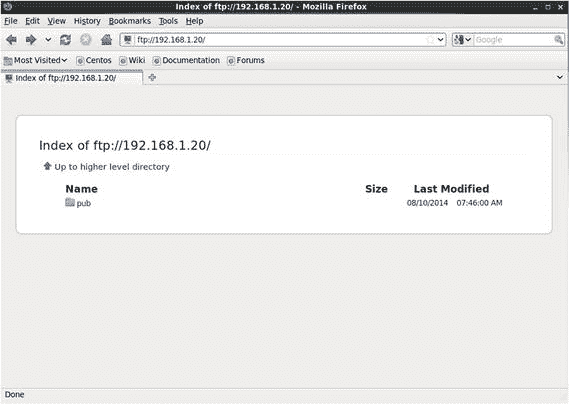
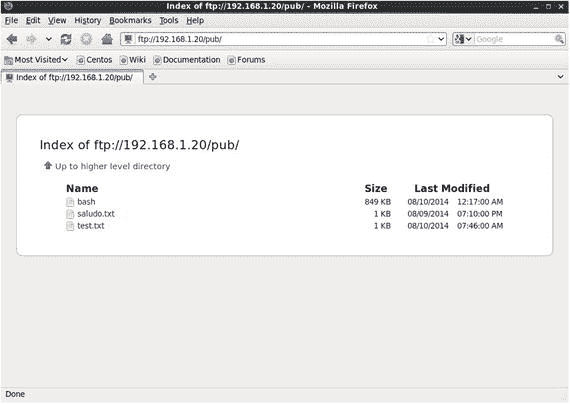
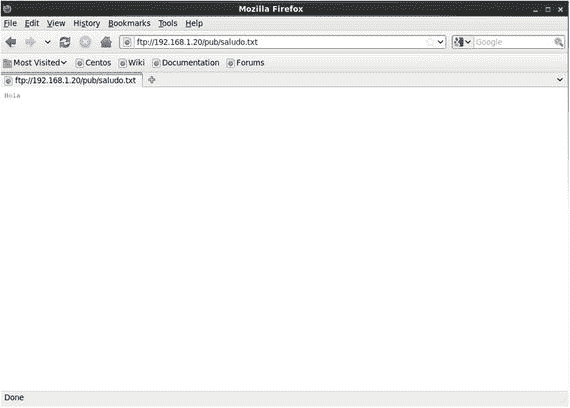
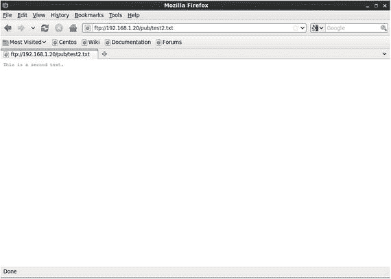
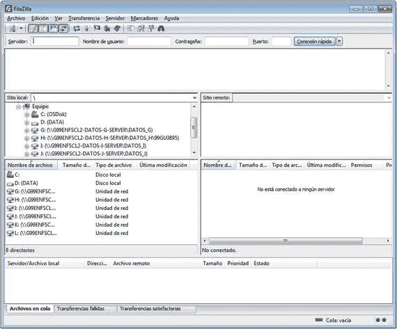
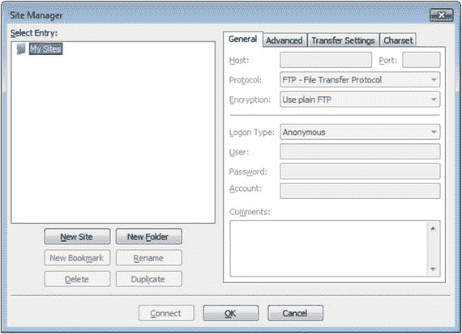
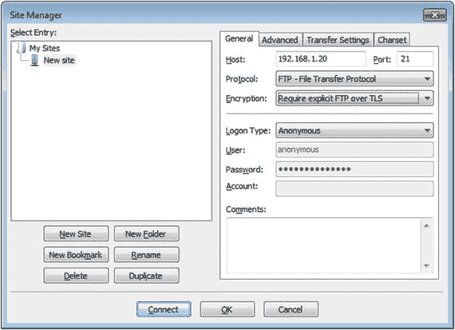
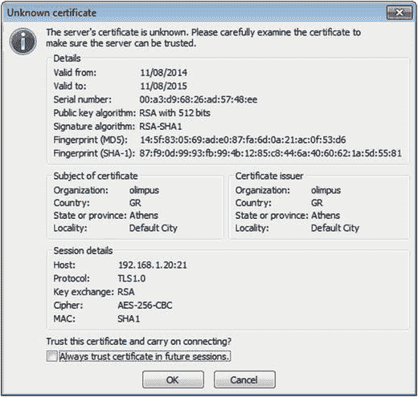
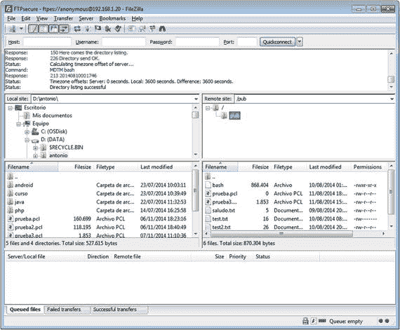

# 8.ftp 服务器

文件传输协议(FTP)是最早开发的网络协议之一。它用于共享文件，这确实是共享网络最明显的优势之一。作为最古老的协议之一，FTP 相对简单。

根据 FTP 处理连接的方式，它有两种不同的工作方式。FTP 使用两种不同的连接:控制连接和数据连接。控制连接是最先建立的，默认情况下使用端口 21。每次请求列表或传输时都会建立数据连接，但这可能以两种不同的方式发生:

1.  服务器使用源端口 20 连接到客户机。这称为主动 FTP，因为是服务器打开连接。当然，客户端必须允许传入的连接。
2.  服务器告诉客户端它可以用来建立数据连接的端口号。在这种情况下，是客户端实际打开了数据连接。这被称为被动 FTP。

## 8.1 在 CentOS 上安装 FTP 服务器

CentOS 中包含的 FTP 服务器是`vsftpd`(非常安全的 ftpd)。它可以按常规方式安装。

```sh
1   [root@localhost2 ∼]# yum install vsftpd

```

`vftpd`服务器的配置文件是`/etc/vsftpd/vsftpd.conf`。一些最重要的选项是:

```sh
1   anonymous_enable=YES

```

允许匿名连接，以及

```sh
1   write_enable=YES

```

能够将文件从客户端上传到服务器。

正如我们已经知道的，一旦安装，就必须启动相关的服务，并确保它在每次计算机重新启动时自动启动。

在 centos 6 上:

```sh
1   [root@localhost2 ∼]# service vsftpd start
2   Starting vsftpd for vsftpd: [ OK ]
3   [root@localhost2 ∼]# chkconfig vsftpd on

```

在 centos 7 上:

```sh
1   [root@CentOS7 ∼]# systemctl start vsftpd
2   [root@CentOS7 ∼]# systemctl enable vsftpd
3   ln -s '/usr/lib/systemd/system/vsftpd.service' '/etc/systemd/system/multi-user.t\
4   arget.wants/vsftpd.service'

```

像往常一样，我们必须允许访问防火墙中的 FTP 端口(20 和 21)。

在 centos 6 上:

```sh
1   [root@delphos ∼]# iptables -I INPUT 2 -p tcp --dport 20 -j ACCEPT
2   [root@delphos ∼]# iptables -I INPUT 2 -p tcp --dport 21 -j ACCEPT

```

在 centos 7 上:

```sh
1   [root@CentOS7 ∼]# firewall-cmd --add-service=ftp
2   success2

```

## 8.2 从 Linux 客户端连接

配置 FTP 服务器后，我们可以用任何密码从另一台计算机作为匿名用户连接，因为它不会被检查。我们必须使用 FTP 客户端。例如，在大多数 Linux 应用程序中，我们可以使用`lftp`或`ftp`。我们会安装这两个。

```sh
 1   [root@prometheus ∼]# yum install ftp
 2
 3
 4   [root@prometheus ∼]# ftp 192.168.1.20
 5   Connected to 192.168.1.20 (192.168.1.20).
 6   220 (vsFTPd 2.2.2)
 7   Name (192.168.1.20:root): anonymous
 8   331 Please specify the password.
 9   Password:
10   230 Login successful.
11   Remote system type is UNIX.
12   Using binary mode to transfer files.
13   ftp> bye
14  221 Goodbye.
15
16   [root@prometheus ∼]# yum install lftp
17
18   [root@prometheus ∼]# lftp 192.168.1.20
19   lftp 192.168.1.20:∼>

```

默认情况下，`lftp`程序建立一个匿名连接。我们可以随时用`bye`断开连接。

默认工作目录为`/var/ftp`，默认为空。我们在这个文件夹中创建了一个文件文本，这样我们以后就可以下载这个文件了。

```sh
1   [root@delphos ∼]# cd /var/ftp/pub/
2   [root@delphos pub]# echo Hola > saludo.txt

```

### 8.2.1 作为匿名用户访问

正如我们之前看到的，我们可以匿名连接到 FTP 服务器。

```sh
 1   [root@prometheus ∼]# ftp 192.168.1.20
 2   Connected to 192.168.1.20 (192.168.1.20).
 3   220 (vsFTPd 2.2.2)
 4   Name (192.168.1.20:root): anonymous
 5   331 Please specify the password.
 6   Password:
 7   230 Login successful.
 8   Remote system type is UNIX.
 9   Using binary mode to transfer files.
10   ftp>

```

为了识别当前的工作目录，我们可以使用`pwd`命令。

```sh
1   ftp> pwd
2   257 "/"

```

现在我们可以搜索`saludo.txt`文件并下载它。

```sh
1   ftp> ls
2   227 Entering Passive Mode (192,168,1,20,144,63).
3   ftp: connect: No route to host

```

如果我们使用 CentOS 6，我们将会看到清单没有执行。这是因为我们为到端口 21 的连接打开了防火墙，但是不允许数据连接。为了在 CentOS 6 中工作，我们必须做一些小的调整。另一方面，在 CentOS 7 中，这些改变是不必要的。

在介绍 FTP 时，我提到过它同时使用控制连接和数据连接。由于 FTP 的特殊性质，处理数据连接可能相当复杂，但是有一个内核模块可以自动为我们处理这个问题。

这个模块是`ip_conntrack_ftp`。我们可以用`modprobe`加载它，然后从客户端重启 FTP 连接。

```sh
 1   [root@delphos pub]# modprobe ip_conntrack_ftp
 2
 3   ftp> bye
 4   221 Goodbye.
 5   [root@prometheus ∼]# ftp 192.168.1.20
 6   Connected to 192.168.1.20 (192.168.1.20).
 7   220 (vsFTPd 2.2.2)
 8   Name (192.168.1.20:root): anonymous
 9   331 Please specify the password.
10   Password:
11   230 Login successful.
12   Remote system type is UNIX.
13   Using binary mode to transfer files.
14   ftp> ls
15   227 Entering Passive Mode (192,168,1,20,183,110).
16   150 Here comes the directory listing.
17   drwxr-xr-x     2 0        0              4096 Aug 09 19:10 pub
18   226 Directory send OK.
19   ftp>

```

如果我们不想在每次重启服务器时手动加载`ip_conntrack_ftp`,我们可以修改文件`/etc/sysconfig/iptables`,并将模块添加到 iptables 模块列表中，这样代码行就像这样:

```sh
1   IPTABLES_MODULES="ip_conntrack_ftp"

```

CentOS 7 会自动加载`ip_conntrack_ftp`模块，因此无需更改任何配置文件。

现在我们将尝试查找并下载`saludo.txt`文件。

```sh
 1   ftp> ls
 2   227 Entering Passive Mode (192,168,1,20,63,110).
 3   150 Here comes the directory listing.
 4   drwxr-xr-x     2 0       0                 4096 Aug 09 19:10 pub
 5   226 Directory send OK.
 6   ftp> cd pub
 7   250 Directory successfully changed.
 8   ftp> ls
 9   227 Entering Passive Mode (192,168,1,20,157,163).
10   150 Here comes the directory listing.
11   -rw-r--r--    1 0        0                 5 Aug 09 19:10 saludo.txt
12   226 Directory send OK.
13   ftp>

```

由于`saludo.txt`是一个文本文件，我们必须激活 ASCII 模式。

```sh
1   ftp> ascii
2   200 Switching to ASCII mode.

```

我们下载文件并退出。

```sh
 1   ftp> get saludo.txt
 2   local: saludo.txt remote: saludo.txt
 3   227 Entering Passive Mode (192,168,1,20,212,55).
 4   150 Opening BINARY mode data connection for saludo.txt (5 bytes).
 5   WARNING! 1 bare linefeeds received in ASCII mode
 6   File may not have transferred correctly.
 7   226 Transfer complete.
 8   5 bytes received in 0.000275 secs (18.18 Kbytes/sec)
 9   ftp> bye
10   221 Goodbye.

```

现在，我们已经在客户机上获得了这个文件。

```sh
1   [root@prometheus ∼]# cat saludo.txt
2   Hola

```

在前面的例子中，我们下载了一个文本文件，所以我们必须激活 ASCII 模式。但是我们也可以下载二进制文件，激活二进制模式。为了查看示例，我们将在 FTP 目录中复制一个二进制文件，并从客户端下载它。

```sh
1   [root@delphos pub]# cp /bin/bash /var/ftp/pub/

```

现在，我们像以前一样从客户端进行连接。

```sh
 1   [root@prometheus ∼]# ftp 192.168.1.20
 2   Connected to 192.168.1.20 (192.168.1.20).
 3   220 (vsFTPd 2.2.2)
 4   Name (192.168.1.20:root): anonymous
 5   331 Please specify the password.
 6   Password:
 7   230 Login successful.
 8   Remote system type is UNIX.
 9   Using binary mode to transfer files.
10   ftp> ls
11   227 Entering Passive Mode (192,168,1,20,203,62).
12   150 Here comes the directory listing.
13   drwxr-xr-x    2 0        0             4096 Aug 10 00:17 pub
14   226 Directory send OK.
15   ftp> cd pub
16   250 Directory successfully changed.
17   ftp> ls
18   227 Entering Passive Mode (192,168,1,20,111,228).
19   150 Here comes the directory listing.
20   -rwxr-xr-x     1 0       0          868404 Aug 10 00:17 bash
21   -rw-r--r--     1 0       0               5 Aug 09 19:10 saludo.txt
22   226 Directory send OK.
23   ftp>

```

但是现在我们激活二进制模式而不是 ASCII 模式。

```sh
 1   ftp> binary
 2   200 Switching to Binary mode.
 3   ftp> get bash
 4   local: bash remote: bash
 5   227 Entering Passive Mode (192,168,1,20,93,208).
 6   150 Opening BINARY mode data connection for bash (868404 bytes).
 7   226 Transfer complete.
 8   868404 bytes received in 0.0661 secs (13141.71 Kbytes/sec)
 9   ftp> bye
10   221 Goodbye.

```

到目前为止，我们都是从服务器下载文件到客户端，但是我们也可以从客户端上传文件到 FTP 服务器。为此，我们需要在配置文件`/etc/vsftpd/vsftpd.conf`中设置这个参数。

```sh
1   anon_upload_enable=YES

```

如果这个参数不存在或者被设置为`NO`，我们改变它并重新加载`vsftpd`服务。

在 centos 6 上:

```sh
1   [root@delphos ∼]# service vsftpd restart
2   Shutting down vsftpd:                         [ OK ]
3   Starting vsftpd for vsftpd:                   [ OK ]

```

在 centos 7 上:

```sh
1   [root@CentOS7 ∼]# systemctl restart vsftpd

```

当然，我们必须给用户上传文件的文件夹中的`chmod`写权限。

```sh
1   [root@CentOS7 ∼]# chmod 777 /var/ftp/pub/

```

此外，我们必须检查与 FTP 服务相关的 SELinux 布尔值。根据我们使用的是 CentOS 6 还是 CentOs 7，这些布尔值的名称会有所不同:

在 centos 6 上:

```sh
1   [root@delphos ∼]# getsebool -a |grep -i ftp
2   allow_ftpd_anon_write --> off
3   allow_ftpd_full_access --> off
4   allow_ftpd_use_cifs --> off
5   allow_ftpd_use_nfs --> off
6   ftp_home_dir --> off
7   ftpd_connect_db --> off
8   httpd_enable_ftp_server --> off

```

在 centos 7 上:

```sh
 1   [root@CentOS7 ∼]# getsebool -a | grep -i ftp
 2   ftp_home_dir --> off
 3   ftpd_anon_write --> off
 4   ftpd_connect_all_unreserved --> off
 5   ftpd_connect_db --> off
 6   ftpd_full_access --> off
 7   ftpd_use_cifs --> off
 8   ftpd_use_fusefs --> off
 9   ftpd_use_nfs --> off
10   ftpd_use_passive_mode --> off
11   httpd_can_connect_ftp --> off
12   httpd_enable_ftp_server --> off
13   sftpd_anon_write --> off
14   sftpd_enable_homedirs --> off
15   sftpd_full_access --> off
16   sftpd_write_ssh_home --> off
17   tftp_anon_write --> off
18   tftp_home_dir --> off

```

我们必须将`allow_ftpd_anon_write`(CentOS 7 中的`ftpd_anon_write`)的值从 off 改为 on。我们可以用`semanage`命令看到这个布尔值的更详细的描述。

```sh
1   [root@delphos ∼]# semanage boolean -l | grep allow_ftpd_anon_write
2   allow_ftpd_anon_write -> off Allow ftp servers to upload files, used\
3   for public file transfer services. Directories must be labeled public_content_r\
4   w_t.

```

所以，我们改变了布尔值。

在 centos 6 上:

```sh
1   [root@delphos ∼]# setsebool allow_ftpd_anon_write on
2   [root@delphos ∼]# getsebool allow_ftpd_anon_write
3   allow_ftpd_anon_write --> on

```

在 centos 7 上:

```sh
1   [root@CentOS7 ∼]# setsebool ftpd_anon_write on
2   [root@CentOS7 ∼]# getsebool ftpd_anon_write
3   ftpd_anon_write --> on

```

我们还必须看到与 FTP 目录相关的上下文。

```sh
1   [root@delphos ∼]# ls -Z /var/ftp/
2   drwxrwxrwx. root root system_u:object_r:public_content_t:s0 pub

```

如果有必要，我们会改变上下文，这样写作也是允许的。

```sh
1   [root@delphos ∼]# chcon -t public_content_rw_t /var/ftp/pub/
2   [root@delphos ∼]# ls -Z /var/ftp/
3   drwxrwxrwx. root root system_u:object_r:public_content_rw_t:s0 pub

```

现在我们准备从客户端上传一个文件。

```sh
 1   [root@prometheus ∼]# ftp 192.168.1.20
 2   Connected to 192.168.1.20 (192.168.1.20).
 3   220 (vsFTPd 2.2.2)
 4   Name (192.168.1.20:root): anonymous
 5   331 Please specify the password.
 6   Password:
 7   230 Login successful.
 8   Remote system type is UNIX.
 9   Using binary mode to transfer files.
10   ftp> pwd
11   257 "/"
12   ftp> ls
13   227 Entering Passive Mode (192,168,1,20,237,214).
14   150 Here comes the directory listing.
15   drwxrwxrwx     2 0       0              4096 Aug 10 07:45 pub
16   226 Directory send OK.
17   ftp> cd pub
18   250 Directory successfully changed.
19   ftp> ascii
20   200 Switching to ASCII mode.
21   ftp> put test.txt
22   local: test.txt remote: test.txt
23   227 Entering Passive Mode (192,168,1,20,189,66).
24   150 Ok to send data.
25   226 Transfer complete.
26   16 bytes sent in 0.00019 secs (84.21 Kbytes/sec)

```

现在我们可以在服务器上看到上传的文件。

```sh
1   ftp> ls
2   227 Entering Passive Mode (192,168,1,20,82,229).
3   150 Here comes the directory listing.
4   -rwxr-xr-x     1 0       0          868404 Aug 10 00:17 bash
5   -rw-r--r--     1 0       0               5 Aug 09 19:10 saludo.txt
6   -rw-------     1 14      50             16 Aug 10 07:46 test.txt
7   226 Directory send OK.
8   ftp>

```

我们还可以从 Firefox 等 web 浏览器访问 FTP 服务器(图 [8-1](#Fig1) )。



图 8-1。

Using Firefox to access the FTP serv er

通过点击 pub，我们将看到它的内容(图 [8-2](#Fig2) )。



图 8-2。

Seeing the pub directory

接下来，通过点击`saludo.txt`，我们可以看到文件内容，因为它是一个文本文件(图 [8-3](#Fig3) )。



图 8-3。

Seeing the content of a file

另一方面，如果我们点击一个二进制文件，比如 bash，我们会被询问是否要下载这个文件(图 [8-4](#Fig4) )。


图 8-4。

Downloading a binary file

有可能在点击`test.txt`这样的文件时，我们会收到一条错误信息(图 [8-5](#Fig5) )。


图 8-5。

Error downloading the file

这意味着与该文件关联的权限不正确。如果我们列出来自服务器的权限，我们会得到以下内容:

```sh
1   [root@delphos ∼]# ls -l /var/ftp/pub/
2   total 860
3   -rwxr-xr-x. 1 root root 868404 Aug       9 20:17 bash
4   -rw-r--r--. 1 root root      5 Aug       9 15:10 saludo.txt
5   -rw-------. 1 ftp  ftp      16 Aug 10 03:46 test.txt

```

正如我们所看到的，只有所有者——在本例中是`ftp`—有权访问`test.txt`文件。这是匿名用户上传文件时 FTP 服务器的默认行为。但是我们可以通过编辑`/etc/vsftpd/vsftpd.conf`文件并包含以下参数来改变这一点:

```sh
1   anon_umask=022

```

重启`vsftpd`服务后，我们就可以上传新文件了。

```sh
 1   [root@prometheus ∼]# ftp 192.168.1.20
 2   Connected to 192.168.1.20 (192.168.1.20).
 3   220 (vsFTPd 2.2.2)
 4   Name (192.168.1.20:root): anonymous
 5   331 Please specify the password.
 6   Password:
 7   230 Login successful.
 8   Remote system type is UNIX.
 9   Using binary mode to transfer files.
10   ftp> cd pub
11   250 Directory successfully changed.
12   ftp> ascii
13   200 Switching to ASCII mode.
14   ftp> put test2.txt
15   local: test2.txt remote: test2.txt
16   227 Entering Passive Mode (192,168,1,20,89,209).
17   150 Ok to send data.
18   226 Transfer complete.
19   26 bytes sent in 0.000339 secs (76.70 Kbytes/sec)
20   ftp>

```

现在权限不同了，其他用户可以读取新上传的文件。

```sh
1   [root@delphos ∼]# ls -l /var/ftp/pub/
2   total 864
3   -rwxr-xr-x. 1 root root 868404 Aug   9 20:17 bash
4   -rw-r--r--. 1 root root      5 Aug   9 15:10 saludo.txt
5   -rw-r--r--. 1 ftp  ftp      26 Aug  10 15:52 test2.txt
6   -rw-------. 1 ftp  ftp      16 Aug  10 03:46 test.txt

```

因此，我们将能够使用 Firefox 查看或下载该文件(图 [8-6](#Fig6) 和 [8-7](#Fig7) )。



图 8-7。

Downloading the file test 2


图 8-6。

Accessing the FTP server with Firefox again

### 8.2.2 作为本地用户连接

除了作为匿名用户连接之外，我们还可以作为本地用户连接。程序几乎完全相同，所以我只提供一个简单的例子。

首先，我们必须确定这个参数在`/etc/vsftpd/vsftpd.conf`文件中是活动的。

```sh
1   # Uncomment this to allow local users to log in.
2   local_enable=YES

```

此外，我们必须更改一个布尔 SELinux 参数。

```sh
1   [root@delphos ∼]# setsebool ftp_home_dir on
2   [root@delphos ∼]# getsebool ftp_home_dir
3   ftp_home_dir --> on

```

假设我们有一个名为 Socrates 的本地用户。如果没有，我们现在就创建它，并为它分配一个新密码。

```sh
1   [root@delphos ∼]# useradd -m socrates
2   [root@delphos ∼]# passwd socrates
3   Changing password for user socrates.
4   New password:
5   BAD PASSWORD: it is based on a dictionary word
6   Retype new password:
7   passwd: all authentication tokens updated successfully.

```

现在我们可以从客户端连接到服务器。

```sh
 1   [root@prometheus ∼]# ftp 192.168.1.20
 2  Connected to 192.168.1.20 (192.168.1.20).
 3  220 (vsFTPd 2.2.2)
 4   Name (192.168.1.20:root): socrates
 5   331 Please specify the password.
 6   Password:
 7   230 Login successful.
 8   Remote system type is UNIX.
 9   Using binary mode to transfer files.
10   ftp> pwd
11   257 "/home/socrates"
12   ftp>

```

我们可以像匿名用户一样下载和上传文件。

## 8.3 从 Windows 客户端连接

我们还可以使用操作系统附带的命令行 FTP 客户端从 Windows 客户端进行连接(图 [8-8](#Fig8) )。


图 8-8。

Using the Windows FTP client

但是更常见的是使用图形客户端，比如 Filezilla(Linux 中也有)。启动程序后，我们将看到如图 [8-9](#Fig9) 所示的屏幕。



图 8-9。

Filezilla

我们只需输入服务器、端口、用户名和密码，然后点击“连接”(图 [8-10](#Fig10) )。


图 8-10。

Connecting to the FTP server with Filezilla

要下载或上传文件，我们只需在本地和远程站点之间拖动文件。

## 8.4 使用 Telnet 分析 FTP

我们将通过使用 Telnet 来学习更多关于 FTP 的知识。我们首先打开一个到 FTP 服务器端口 21 的`telnet`会话。这样，我们就建立了控制连接。

```sh
1   [root@prometheus ∼]# telnet 192.168.1.20 21
2   Trying 192.168.1.20...
3   Connected to 192.168.1.20.
4   Escape character is '^]'.
5   220 (vsFTPd 2.2.2)

```

现在我们指定用户和密码。

```sh
1   USER anonymous
2   331 Please specify the password.
3   PASS anonymous
4   230 Login successful.

```

一旦登录，我们就执行命令。有些命令，如下载或上传文件，需要第二个连接，即数据连接，所以我们将从最简单的命令开始。

```sh
 1   STAT
 2   211-FTP server status:
 3        Connected to 192.168.1.21
 4        Logged in as ftp
 5        TYPE: ASCII
 6        No session bandwidth limit
 7        Session timeout in seconds is 300
 8        Control connection is plain text
 9        Data connections will be plain text
10        At session startup, client count was 1
11        vsFTPd 2.2.2 - secure, fast, stable
12   211 End of status

```

正如我们看到的，`STAT`显示了一些关于 FTP 服务器的信息。如果我们将一个目录的名称作为参数传递，`STAT`将显示该目录的内容。

```sh
 1   STAT .
 2   213-Status follows:
 3   drwxr-xr-x    3 0          0          4096 Aug 09 14:58 .
 4   drwxr-xr-x    3 0          0          4096 Aug 09 14:58 ..
 5   drwxrwxrwx    2 0          0          4096 Aug 10 19:52 pub
 6   213 End of status
 7   STAT pub
 8   213-Status follows:
 9   drwxrwxrwx     2 0          0         4096 Aug 10 19:52 .
10   drwxr-xr-x     3 0          0         4096 Aug 09 14:58 ..
11   -rwxr-xr-x     1 0          0       868404 Aug 10 00:17 bash
12   -rw-r--r--     1 0          0            5 Aug 09 19:10 saludo.txt
13   -rw-------     1 14         50          16 Aug 10 07:46 test.txt
14   -rw-r--r--     1 14         50          26 Aug 10 19:52 test2.txt
15   213 End of status

```

要改变目录，我们可以使用`CWD`命令。

```sh
 1   CWD pub
 2   250 Directory successfully changed.
 3   STAT .
 4   213-Status follows:
 5   drwxrwxrwx 2 0        0        4096 Aug 10 19:52 .
 6   drwxr-xr-x 3 0        0        4096 Aug 09 14:58 ..
 7   -rwxr-xr-x 1 0        0      868404 Aug 10 00:17 bash
 8   -rw-r--r-- 1 0        0           5 Aug 09 19:10 saludo.txt
 9   -rw------- 1 14       50         16 Aug 10 07:46 test.txt
10   -rw-r--r-- 1 14       50         26 Aug 10 19:52 test2.txt
11   213 End of status

```

要返回到父目录，我们键入“CDUP”

```sh
1   CDUP
2   250 Directory successfully changed.
3   STAT .
4   213-Status follows:
5   drwxr-xr-x  3 0          0          4096 Aug 09 14:58 .
6   drwxr-xr-x  3 0          0          4096 Aug 09 14:58 ..
7   drwxrwxrwx  2 0          0          4096 Aug 10 19:52 pub
8   213 End of status

```

如果我们想知道我们当前工作的目录，我们可以输入“PWD”

```sh
1   PWD
2   257 "/"

```

如果我们有适当的权限，我们可以删除文件。我们用`quit`退出会话，以普通用户身份登录，尝试删除一个文件。

```sh
 1   quit
 2   221 Goodbye.
 3   Connection closed by foreign host.
 4   [root@prometheus ∼]# telnet 192.168.1.20 21
 5   Trying 192.168.1.20...
 6   Connected to 192.168.1.20.
 7   Escape character is '^]'.
 8   220 (vsFTPd 2.2.2)
 9   USER antonio
10   331 Please specify the password.
11   PASS antonio
12   230 Login successful.
13   STAT .
14   213-Status follows:
15   drwx------    2  500           500     4096 Aug 09 14:12 .
16   drwxr-xr-x    4  0             0       4096 Aug 10 20:41 ..
17   -rw-------    1  500           500       37 Aug 09 14:12 .bash_history
18   -rw-r--r--    1  500           500       18 Dec 02  2011 .bash_logout
19   -rw-r--r--    1  500           500      176 Dec 02 2011 .bash_profile
20   -rw-r--r--    1  500           500      124 Dec 02 2011 .bashrc
21   -rw-rw-r--    1  500           500        5 Aug 09 14:12 hola
22   213 End of status
23   DELE hola
24   250 Delete operation successful.
25   STAT .
26   213-Status follows:
27   drwx------    2  500           500     4096 Aug 11 23:41 .
28   drwxr-xr-x    4  0             0       4096 Aug 10 20:41 ..
29   -rw-------    1  500           500       37 Aug 09 14:12 .bash_history
30   -rw-r--r--    1  500           500       18 Dec 02  2011 .bash_logout
31   -rw-r--r--    1  500           500      176 Dec 02 2011 .bash_profile
32   -rw-r--r--    1  500           500      124 Dec 02 2011 .bashrc
33   213 End of status
34   quit
35   221 Goodbye.

```

我们可以看到，名为`hola`的文件被成功删除。

到目前为止，我们已经看到了如何用`STAT`命令列出文件。但这不是 FTP 客户端的工作方式。他们基本上打开了一个新的通道——数据通道——并通过该通道传输列表。让我们看一个例子。我们从连接到 FTP 服务器并强制被动模式开始。

```sh
 1   [root@prometheus ∼]# telnet 192.168.1.20 21
 2   Trying 192.168.1.20...
 3   Connected to 192.168.1.20.
 4   Escape character is '^]'.
 5   220 (vsFTPd 2.2.2)
 6   USER anonymous
 7   331 Please specify the password.
 8   PASS anonymous
 9   230 Login successful.
10   CWD pub
11   250 Directory successfully changed.
12   PASV
13   227 Entering Passive Mode (192,168,1,20,204,80).

```

强制被动模式后，系统确认操作并显示六个数字。前四位代表服务器的 IP 地址，在本例中为`192.168.1.20`。最后两个数字代表端口号。要获得端口号，我们必须将第一个数字乘以 256，然后将结果加到第二个数字上。在本例中，端口号为(204*256)+80=52304。

这意味着服务器将开放端口号 52304 进行数据传输。现在我们可以用`LIST`命令请求一个文件列表。

```sh
1   LIST
2   150 Here comes the directory listing.
3   226 Directory send OK.

```

现在，为了获得列表，我们必须打开另一个到端口号 52304 的`telnet`会话。从现在开始，我们将把这个`telnet`会话称为数据会话。

当然，首先，我们必须允许流量进入服务器的这个端口。

在 centos 6 上:

```sh
1   [root@delphos ∼]# iptables -I INPUT 1 -p tcp --dport 52304 -j ACCEPT

```

在 centos 7 上:

```sh
1   [root@CentOS7 ∼]# firewall-cmd --add-port=52304/tcp
2   success

```

现在我们可以建立数据会话了。

```sh
 1   [root@prometheus ∼]# telnet 192.168.1.20 52304
 2   Trying 192.168.1.20...
 3   Connected to 192.168.1.20.
 4   Escape character is '^]'.
 5   -rwxr-xr-x    1 0          0         868404 Aug 10 00:17 bash
 6   -rw-r--r--    1 14         50             0 Aug 11 17:56 prueba.pcl
 7   -rw-r--r--    1 14         50          1853 Aug 11 14:23 prueba3.pcl
 8   -rw-r--r--    1 0          0              5 Aug 09 19:10 saludo.txt
 9   -rw-------    1 14         50            16 Aug 10 07:46 test.txt
10   -rw-r--r--    1 14         50            26 Aug 10 19:52 test2.txt
11   Connection closed by foreign host.

```

下载文件的方式非常相似。我们现在将尝试用`RETR`命令下载一个 ascii 文件。

```sh
 1   [root@prometheus ∼]# telnet 192.168.1.20 21
 2   Trying 192.168.1.20...
 3   Connected to 192.168.1.20.
 4   Escape character is '^]'.
 5   220 (vsFTPd 2.2.2)
 6   USER anonymous
 7   331 Please specify the password.
 8   PASS anonymous
 9   230 Login successful.
10   CWD pub
11   250 Directory successfully changed.
12   TYPE A
13   200 Switching to ASCII mode.
14   PASV
15   227 Entering Passive Mode (192,168,1,20,44,102).

```

在这种情况下，服务器中为数据传输开放的端口号将是 11366。所以，我们在防火墙里打开它。

```sh
1   [root@delphos ∼]# iptables -I INPUT 1 -p tcp --dport 11366 -j ACCEPT

```

现在我们尝试用`RETR`命令下载文件。

```sh
1   RETR saludo.txt
2   150 Opening BINARY mode data connection for saludo.txt (5 bytes).

```

在第二个终端窗口中，我们必须打开一个到端口 11366 的`telne` t 会话，并将输出重定向到一个文件。

```sh
1   [root@prometheus ∼]# telnet 192.168.1.21 11366 > saludo.txt
2   Connection closed by foreign host.

```

一旦传输完成，我们将在第一个`telnet`会话(控制会话)中看到此消息。

```sh
1   226 Transfer complete.

```

## 8.5 安全 FTP

众所周知，FTP 是一种古老的协议，在设计时并没有考虑安全性。我们已经看到，我们可以使用 SSH 协议以安全的方式传输文件(参见第 [6 章](06.html))。但是我们也可以生成一个证书并配置`vsftp`使用 TLS。

### 生成证书

我们已经看到了如何生成一个证书(见第 [7 章](07.html))，所以我现在就不赘述了。首先，我们创建密钥。

```sh
1   [root@delphos ∼]# openssl genrsa -des3 -out FTPsecure.key
2   Generating RSA private key, 512 bit long modulus
3   ...................++++++++++++
4   ....................++++++++++++
5   e is 65537 (0x10001)
6   Enter pass phrase for FTPsecure.key:
7   Verifying - Enter pass phrase for FTPsecure.key:

```

然后，我们生成一个证书请求。

```sh
 1   [root@delphos ∼]# openssl req -new -key FTPsecure.key -out FTPsecure.csr
 2   Enter pass phrase for FTPsecure.key:
 3   You are about to be asked to enter information that will be incorporated
 4   into your certificate request.
 5   What you are about to enter is what is called a Distinguished Name or a DN.
 6   There are quite a few fields but you can leave some blank
 7   For some fields there will be a default value,
 8   If you enter '.', the field will be left blank.
 9   -----
10   Country Name (2 letter code) [XX]:GR
11   State or Province Name (full name) []:Athens
12   Locality Name (eg, city) [Default City]:
13   Organization Name (eg, company) [Default Company Ltd]:olimpus
14   Organizational Unit Name (eg, section) []:
15   Common Name (eg, your name or your server's hostname) []:
16   Email Address []:
17
18   Please enter the following 'extra' attributes
19   to be sent with your certificate request
20   A challenge password []:
21   An optional company name []:
22   [root@delphos ∼]#

```

现在，我们删除与密钥文件相关联的密码。

```sh
1   [root@delphos ∼]# cp FTPsecure.key FTPsecure.key.orig
2   [root@delphos ∼]# openssl rsa -in FTPsecure.key.orig -out FTPsecure.key
3   Enter pass phrase for FTPsecure.key.orig:
4   writing RSA key

```

最后，我们生成证书。

```sh
1   [root@delphos ∼]# openssl x509 -req -days 365 -in FTPsecure.csr -signkey FTPsecu\
2   re.key -out FTPsecure.crt
3   Signature ok
4   subject=/C=GR/ST=Athens/L=Default City/O=olimpus
5   Getting Private key

```

现在我们将密钥和证书文件都复制到`/etc/pki/tls/certs`。

```sh
1   [root@delphos ∼]# cp FTPsecure.key /etc/pki/tls/certs/
2   [root@delphos ∼]# cp FTPsecure.crt /etc/pki/tls/certs

```

### 8.5.2 将 vsftpd 配置为 FTP 安全服务器

因为我们已经有了证书，所以我们可以相应地修改配置文件(/ `etc/vsftpd/vsftpd.conf`)来支持 FTP 安全。我们应该添加以下几行:

```sh
1   ssl_enable=YES
2   allow_anon_ssl=YES
3   ssl_tlsv1=YES
4   ssl_sslv2=NO
5   ssl_sslv3=NO
6   rsa_cert_file=/etc/pki/tls/certs/FTPsecure.crt
7   rsa_private_key_file=/etc/pki/tls/certs/FTPsecure.key
8   ssl_ciphers=HIGH

```

通常，FTP 客户端默认使用被动模式。为了让这种模式与安全连接一起工作，我们必须将以下参数添加到`/etc/vsftpd/vsftpd.conf`文件中。

```sh
1   pasv_enable=YES
2   pasv_max_port=10100
3   pasv_min_port=10090

```

我们明确允许被动模式，并定义了将用于数据连接的端口范围。

我们还必须允许传入流量进入该范围的端口。

在 centos 6 上:

```sh
1   [root@delphos vsftpd]# iptables -I INPUT 2 -p tcp --destination-port 10090:10100\
2   -j ACCEPT

```

在 centos 7 上:

```sh
1   [root@CentOS7 ftp]# firewall-cmd --add-port=10090-10100/tcp
2   success

```

现在，我们重新启动服务并尝试建立安全连接。我们应该考虑到并非所有的 FTP 客户端都支持 FTP Secure，所以我们必须使用一个实际上可以建立安全连接的客户端，例如 Filezilla。

### 8.5.3 与 Filezilla 连接

因为我们必须配置一个安全的连接，所以我们不能简单地建立一个快速连接，就像我们在“从 Windows 客户端连接”一节中所做的那样相反，我们必须访问站点管理器(文件➤站点管理器；参见图 [8-11](#Fig11) 和 [8-12](#Fig12) 。



图 8-12。

Site Manager


图 8-11。

Accessing Site Manager

我们点击新站点并完成表格(图 [8-13](#Fig13) )。



图 8-13。

Defining a new site

当我们点击连接时，我们将看到以下消息(图 [8-14](#Fig14) )。



图 8-14。

Showing the site certificate

接受证书后，我们可以像以前一样上传和下载文件(图 [8-15](#Fig15) )。



图 8-15。

Connected to a secure FTP site