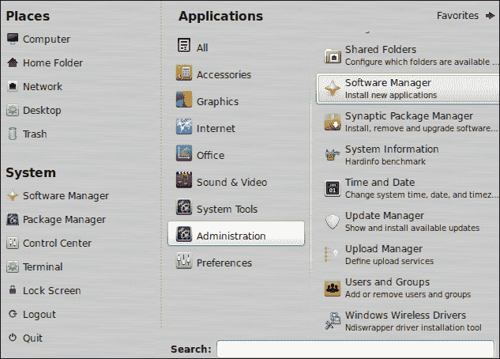
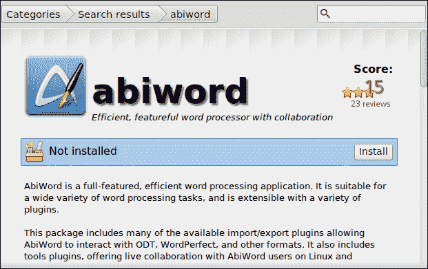
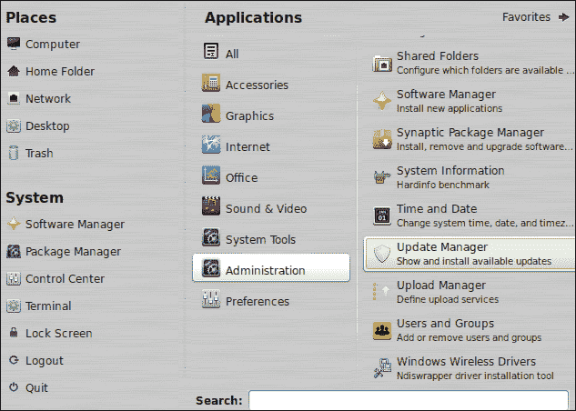

# 第五章。安装、删除和升级软件

*在本章中，您将学习系统管理员完成的最重要和最基本的任务之一。这些任务与软件相关，特别是如何安装、删除和保持操作系统最新。*

在本章中，我们将学习:

*   安装软件
*   删除已安装的软件
*   应用升级

# 安装软件

系统管理员迟早需要在一台或多台机器上安装软件。事实上，对于这种操作系统的用户来说，这是最常见的任务之一。Linux Mint 包括成千上万个可以轻松安装的软件应用程序。请记住，当您安装操作系统时，默认情况下会安装很多软件。此外，还可以安装 Linux Mint 提供的附加软件。为了方便在 Linux Mint 中安装软件的过程，这个操作系统包含了一个名为**软件管理器**T3 的工具。

# 行动时间-安装一个单词文字处理器

我们将使用软件管理器应用程序安装名为**的文本处理器**([http://www.abisource.com](http://www.abisource.com))。让我们看看这是如何做到的:

1.  Click on the **Menu** button and then click on the **All Applications** button located on the right-hand side of the **Favorites** pane:

    

2.  Look for the **Administration** menu option, and click on the **Software Manager** menu option; then a new window will be displayed:

    

3.  在**软件管理器**主窗口右侧的文本框中输入**一个单词**，准备好之后点击*进入*。
4.  Now, you can see a list with a lot of software that is related to your search. Actually, the first result of the list is the text processor that we want to install, which is shown in this screenshot:

    

5.  Double-clicking on an item will display information about the selected item:

    

6.  现在，你可以点击**安装**按钮了。通过这样做，将启动 AbiWord 的安装过程。您可以看到一个进度条，指示安装进度。
7.  为了检查你的系统中是否安装了 AbiWord，你可以打开一个Shell，输入`AbiWord`，然后按*进入*。AbiWord 将被执行，您可以开始使用它。

## *刚刚发生了什么？*

通常，GNU/Linux 发行版包括许多软件，这些软件准备以一种称为**包** 的特定格式安装。软件被组织在不同的包中，一些应用程序需要多个包；这一事实被称为包依赖。Linux Mint 使用 **Debian** ( **DEB** )格式的包，与 Ubuntu Linux 和 Debian 操作系统相同。

软件包通常从计算机的存储位置检索和安装。这个位置被称为存储库，它包含许多可以下载并安装在您的机器上的软件包。

软件管理器是一个由 Linux Mint 开发者专门为 Linux Mint 开发的应用程序。该工具允许您列出、安装和删除软件。从技术上讲，软件管理器是一些命令的前端，例如`apt-get`和`apt-cache`。使用图形用户界面，软件管理器提供了一种简单直观的方法来列出、安装和删除软件，避免使用命令行界面。

为了学习如何安装软件，我们安装了一个简单但有用的文字处理器 AbiWord。您一定已经发现，通过 Linux Mint 提供的软件包安装软件非常容易。你只需要找一个软件，点击**安装**按钮。显然，您可以按照相同的过程在您的机器上安装许多不同的软件。

重要的是要知道，不仅可以在 Linux Mint 中安装以包形式分发的软件，还可以安装以其他格式分发的软件，例如 tarball 和 ZIP 文件。但是，Mint 包含了很多在 DEB 包中分发的软件，所以这种安装方式是可取的。实际上，使用软件管理器在您的 Linux Mint 操作系统上安装软件是一个很好的做法。

## 玩一玩英雄——发现 Linux Mint 提供的软件

当您启动软件管理器时，会显示一个显示不同图标的窗口。每个图标代表 Linux 造币厂中不同类别的软件。比如可以看到**互联网**、**音视频**、**图形**、**办公**等品类。通过单击每一个，您将可以访问属于所选类别的包。您可以尝试单击某个类别，查看该类别的软件包列表，然后尝试安装其中一个软件包。这个过程让你发现有趣的软件，可以安装在你的机器上。

# 删除软件

之前，我们学习了如何在你的 Linux Mint 机器上安装软件。此外，知道如何做相反的步骤是有趣和有用的。您可以使用软件管理器工具按照简单的过程删除计算机上安装的软件。请记住，您可以删除操作系统安装过程中默认安装的软件，或者删除通过软件管理器应用程序安装的软件。

# 行动时间-删除 AbiWord 程序

让我们按照以下步骤从系统中删除一个单词:

1.  点击**菜单**按钮。在窗格左侧**系统**标签后，您会发现一个名为**软件管理器**的选项；点击它。
2.  现在，**软件管理器**即将上线。在搜索框中输入`abiword`，按*进入*。
3.  您将看到一个列表，显示您搜索的巧合；点击第一个**软件管理器**会给你展示一些关于**的信息**。
4.  要从您的系统中删除**，您只需点击**删除**按钮，删除过程将自动开始。**

 **## *刚刚发生了什么？*

正如我们之前评论的，软件管理器允许我们从系统中删除软件。我们只需要寻找合适的包，选择它，然后点击**移除**按钮。这是一个简单明了的过程，在很大程度上帮助了系统管理员。此外，对于不想使用命令行界面的新手用户来说，这非常直观。

在点击**移除**按钮之前，您可以看到一个标签，通知您系统上安装了 AbiWord 软件。当软件未安装时，该标签不同，而是显示**未安装**信息。这是一种简单有效的方法，可以知道您的 Linux Mint 机器上是否安装了特定的软件。

到目前为止，您一定已经意识到我们通过不同于之前在*安装软件*部分中解释的菜单选项启动了软件管理器。它们都是启动这个有用工具的有效方法。

# 升级软件

在发布周期之间， Linux Mint 开发人员升级一些包含在操作系统中的软件。这意味着系统管理员应该检查升级了哪些软件，并决定应该在机器上安装哪些软件。有时，升级后的软件仅应用微小的变化，如简单的改进或不重要的错误修复。然而，有时升级的软件也包括重要的安全错误修复。如果我们不应用它们，我们的机器可能会面临严重的风险。这就是为什么我们经常检查哪些软件已经升级到我们的 Linux Mint 版本。

# 行动时间-通过更新管理器工具升级软件

我们将去发现哪个软件准备升级，然后我们将继续安装它。这是如何做到的:

1.  Click on the **Menu** button on the bottom panel, and then click on the **All Applications** button located at the right-hand side of the **Favorites** pane. Now you can see a menu option called **Administration**; click on it to display a new menu, where you can see the **Update Manager** menu option, as shown in the following screenshot:

    

2.  After clicking on the **Update Manager** menu option, an application with the same name will be launched, as can been seen here:

    

3.  **更新管理器**显示只有一个包可以升级的列表。点击**安装更新**按钮。
4.  将启动 **mintupdate** 包的升级流程；完成此过程后，您将看到一个完整的可升级软件列表。
5.  现在，您已经准备好选择要升级的软件包。选择全部是好的做法；您至少应该安装列为级别 **1** 的软件包。准备好之后，点击**安装更新**按钮。
6.  升级过程结束后，您会在**更新管理器**中看到一个空列表。

## *刚刚发生了什么？*

更新管理器是 Linux Mint 提供的一个有效的应用程序，用于安装已安装软件的新版本，并在您的机器上安装安全升级。当您第一次启动该应用程序时，您将在应用升级的列表中只看到一个项目。此项表示您需要为 **mintupdate** 安装升级，这是更新管理器的代号。显然，在应用其他升级之前，我们需要升级工具本身。一旦这个过程完成，**更新管理器**将再次启动，检查哪些软件可以升级。

准备升级的软件列表显示不同的项目，提供有关软件包名称、已安装版本和可用新版本的信息。此外，还会显示每个项目的编号。该数字范围从 1 到 5，表示基于升级重要性的级别。等级 1 表示 Linux Mint 开发者认证某个包和标有该等级的包应该尽快升级。通常，安全更新使用此级别。下一个级别是那些由 Linux Mint 开发人员推荐升级的包。级别 3 表明应用升级是安全的，但是 Linux Mint 开发人员没有测试它。标有 4 级的包是不安全的，如果升级，会影响系统的稳定性。最后，第 5 级是针对危险的包(处于不稳定的开发阶段或依赖关系中断)，Linux Mint 开发人员知道它们会损坏操作系统。

一般来说，频繁启动软件管理器并只升级那些标记为 1 级和 2 级的包是个好主意。对于 3 级、4 级和 5 级，系统管理员和高级用户应自行决定是否应用升级。此外，您可以标记列出的所有软件包，或者只标记其中的几个。通常，这是系统管理员的任务；做出这种决定的是他或她。默认情况下，列表中仅显示从级别 1 到级别 3 的包以进行升级。您可以通过转到**编辑** | **首选项**来更改此首选项。

## 玩一玩英雄-了解如何在更新管理器中更改首选项

更新管理器的一些首选项可以更改。例如，您可以更改默认显示的升级级别。另外，点击**刷新**按钮后，可以选择刷新信息的频率。另一方面，您可以决定哪些包将被更新管理器忽略。

更新管理器提供的另一个重要选项是选择可以安装哪种软件包以及从哪个服务器安装。默认情况下，选择主包、上游包和导入包。此外，可以添加额外的存储库来代替 Mint 提供的官方存储库。对于服务器，选择 Linux Mint 的主服务器，但是您可以从众多可用镜像中选择一个。

# 总结

读完这一章，你已经学会了如何在你的电脑上处理软件。基本上，我们已经发现了如何执行一些重要的操作，例如安装、删除和升级软件。Linux Mint 为我们提供了两个伟大的应用程序来执行上述与软件相关的操作，即更新管理器和软件管理器。

具体来说，我们包括:

*   linux mint 如何使用软件包分发软件
*   使用软件管理器在 Linux Mint 上添加和删除软件
*   如何通过更新管理器工具升级软件

虽然软件管理器是 Linux Mint 中安装和删除软件的主要工具，但这个操作系统中还包括另一个名为**突触包管理器** 的工具。该工具提供了对包的低级控制，因此您可以在寻找特定包而不是特定应用程序时使用它。请记住，单个应用程序可以分布在多个包中。

在下一章中，我们将学习如何在 Linux Mint 中处理硬件。**