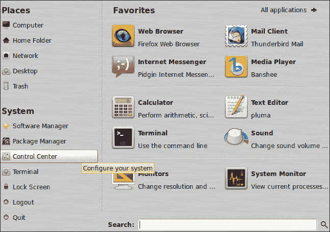
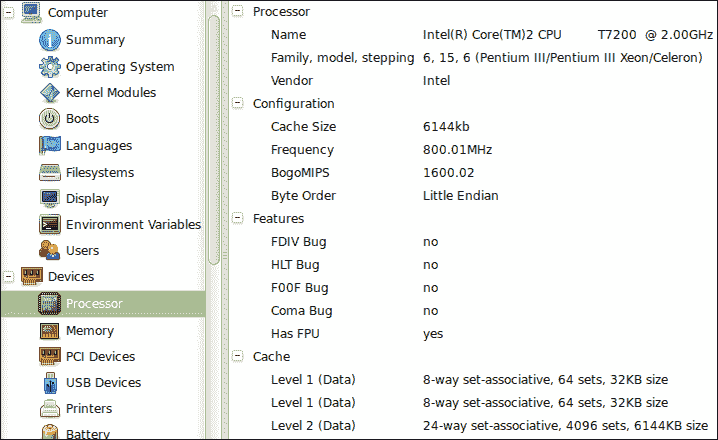
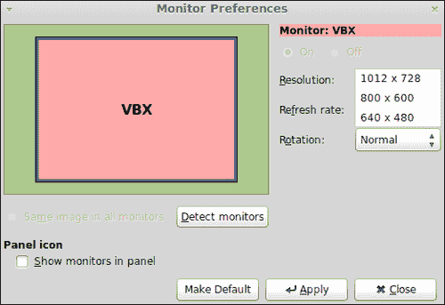
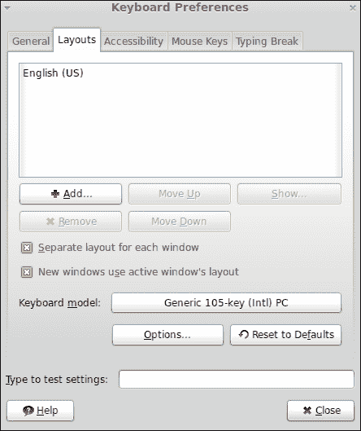
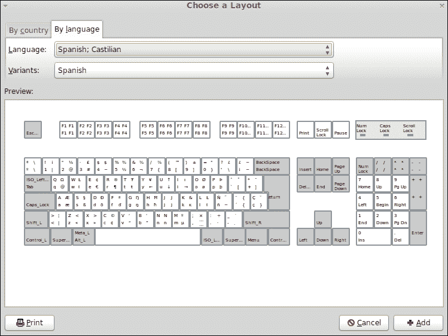
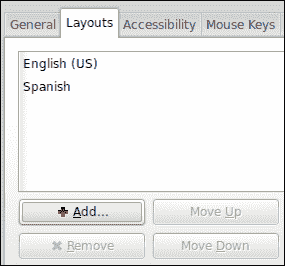

# 第六章。配置硬件

*您的电脑包括并使用不同的硬件和外设，如处理器、键盘、显示器、显卡和声卡。当这些设备正常工作时，您的计算机可以正常工作，没有任何硬件问题。在本章中，我们将学习如何配置计算机的硬件。*

我们将在本章中讨论以下主题:

*   如何检测硬件
*   配置您的显示器
*   如何配置键盘和鼠标
*   配置声音
*   如何安装附加驱动程序

# 检测硬件

在继续配置你的硬件之前，重要的是找出哪些设备在你的计算机内工作。Linux Mint 提供了一个图形工具来获取安装在您计算机上的硬件的信息。此外，我们将学习如何使用命令来显示关于使用 USB 和 PCI 接口的设备的低级信息。

# 行动时间-如何显示设备信息

让我们显示您计算机上运行的设备的信息。为此，请遵循以下步骤:

1.  Click on the **Menu** button from the bottom panel and then click on the **Control Center** menu option belonging to the **System** group, as shown in the following screenshot:

    

2.  Now you can see a new window; click on the **Hardware** menu option:

    

3.  点击**系统信息**链接，你会看到一个新的窗口，它属于一个名为**哈登信息**T4 的应用程序。
4.  On the left-hand side pane of the main window, you'll find a tree structure where the **Devices** icon gives you access to information about hardware installed on your computer, as shown in the following screenshot:

    

## *刚刚发生了什么？*

Linux 造币厂包括用于显示安装在您计算机上的硬件信息的硬件信息。您可以看到许多设备的信息，例如处理器、内存、打印机和连接到计算机的 USB 设备。此外，HardInfo 还为您提供了关于环境变量、用户或引导期间加载的内核模块的其他相关信息。

如果需要获取 HardInfo 提供的任何 HTML 或文本格式的信息，可以通过**生成报告**按钮进行。此报告对于共享计算机上安装的硬件信息非常有用。

另一方面，可以通过**控制中心**访问 HardInfo，这是一个软件工具，为您提供了对许多有用的应用程序的访问，用于配置操作系统的不同方面。

## 使用 dmesg、lspci 和 lsusb 命令玩围棋

虽然，HardInfo 是一个非常直观和易于使用的工具，但您也可以使用其他命令来获取有关安装在您计算机上的硬件的信息。例如，`dmesg` 是一个打印在内核提供的Shell信息上的命令。这意味着如果一个 USB 设备连接到你的电脑，Linux 内核会产生关于这个事实的信息；所以`dmesg`会给你获取这种信息。

要获取连接到电脑的 USB 设备的数据，您可以执行`lsusb`命令。如果您想获得关于您的 PCI 设备的信息，可以使用 `lspci`命令，因为它为您提供了所需信息的完整列表。

# 配置您的显示器

显示器是你电脑最重要的外围设备之一。感谢你的显示器，你可以看到你所有的信息和数据显示在你的电脑上。多个显示器允许您更改一些属性，如屏幕分辨率、旋转和刷新率。我们将学习如何通过 Linux Mint 提供的图形工具来更改其中一些属性。

# 行动时间–更改屏幕分辨率

虽然您可以更改显示器的许多不同属性，但我们将学习如何更改屏幕分辨率；这可以通过以下步骤来实现:

1.  启动**控制中心**应用程序，点击**监视器**链接。
2.  Go to the **Resolution** option, and choose the appropriate resolution for your monitor; a sample is shown in the following screenshot:

    

3.  完成后点击**应用**按钮。

## *刚刚发生了什么？*

由于 Mint 提供的图形工具，更改显示器的一些属性非常容易。您已经学会了如何更改屏幕分辨率；除此之外，您还可以更改显示器的旋转和刷新率。此外，还可以检测哪些显示器连接到您的计算机。基于这种检测，Mint 可以自动为那些监视器选择更好的分辨率。如果您连接了多台显示器，Mint 允许您毫无问题地配置每台显示器。更改属性后，不要忘记点击**应用**按钮，否则您的更改将不会被应用。

# 配置键盘

在之前的部分，你学习了如何配置你的显示器，现在是时候配置另一个重要的外设——你的键盘了。Linux Mint 允许您选择特定的键盘品牌和型号，它还添加了不同的布局，并配置您的键盘以获得可访问性。在本节中，我们将学习如何添加新布局。

# 行动时间-添加新布局

让我们来看看如何在你的键盘上添加西班牙语布局。这是如何做到的:

1.  启动**控制中心，**点击**键盘**按钮。
2.  Click on the **Layouts** tab, which is shown in the following screenshot:

    

3.  点击**添加…** 按钮。
4.  现在，点击**按语言**标签。
5.  Look for the **Spanish; Castilian** option, and select it for the **Language** drop-down menu, as shown in the following screenshot:

    

6.  完成后点击**添加**按钮。
7.  Now you have a **Spanish** layout available for your keyboard, as shown in the following screenshot:

    

## *刚刚发生了什么？*

一些用户会希望使用不同的键盘布局。例如，可能有一些开发人员的母语不是英语，但他们更喜欢使用这种布局进行编程。但是，他们需要使用另一种不同的布局来用法语或西班牙语等语言写作。一次只能选择一个布局，但用户可以随时更改其布局。请记住，在使用之前，您必须添加新布局。

除了为你的键盘配置布局，你还可以配置不同的方面，比如你的键盘的品牌和型号，或者决定光标是否应该在文本字段中闪烁。由于 Linux Mint 提供的图形工具，更改这些属性很容易。

# 配置鼠标

在前面的部分中，我们已经学习了如何配置我们的显示器和键盘，但是我们还有另一个重要的外围设备，它允许我们与计算机进行通信。我们说的是老鼠。Mint 提供了一个简单易用的工具来改变鼠标的属性。

# 行动时间-改变鼠标方向

让我们学习如何将鼠标的方向从右手变为左手。这可以通过以下步骤实现:

1.  再次启动**控制中心**应用，点击**硬件**组上的**键盘**按钮。
2.  在**鼠标定位**组中选择**左手**选项。
3.  完成后点击**关闭**按钮。

## *刚刚发生了什么？*

虽然，我们解释了一个配置鼠标的简单示例，但是 Mint 允许您更改其他属性，例如指针速度、双击超时或在按下 *Ctrl* 键时显示鼠标指针的位置。此外，还可以配置鼠标以获得更好的可访问性。

# 配置声音

如果你的电脑包括声卡，你可以在你的机器中配置声音的行为。Mint 为您提供了一个图形工具来更改和配置与声音相关的许多方面，例如输出音量、声音效果、警报的声音种类，以及启用或禁用窗口和按钮的声音。为了熟悉如何配置声音，我们将学习如何为窗口和按钮启用声音。

# 行动时间-如何启用窗口和按钮声音

让我们学习如何使用 Linux Mint 中包含的图形工具为窗口和按钮启用声音。以下是步骤:

1.  启动**控制中心**。
2.  点击**声音**按钮，之后你会看到一个上下文菜单；点击**启动声音**选项。
3.  现在，您可以进入**声音首选项**窗口；选中**启用窗口和按钮声音**复选框。
4.  点击**关闭**按钮，完成**声音偏好**应用。

## *刚刚发生了什么？*

**声音首选项**窗口允许您配置许多与声音相关的方面。使用此窗口，我们学习了如何为窗口和按钮启用声音。除此之外，您可以使用此窗口更改输出音量，使用静音功能禁用所有声音，或者决定哪些应用程序将使用声音。

# 安装附加驱动程序

在安装过程中，Linux Mint 会检测您的硬件，并为其安装所需的驱动程序。一些 GNU/Linux 发行版没有安装或提供专有的驱动程序；然而，Mint 为我们提供了安装这些类驱动的选项。这是一个好主意，因为它让新手用户的生活更容易。目标是让所有硬件在您的计算机内工作，包括多媒体支持、显示器和显卡。

现代个人电脑包括由不同品牌生产的显卡，需要专有驱动程序。如果制造商发布源代码，就有可能编译它并生成二进制包。这是 Mint 开发人员工作的一部分，他们提供软件，允许我们使用开箱即用的 Linux Mint。

您可以检查 Mint 是否为您的硬件提供了额外的驱动程序。为此，您可以访问**控制中心、**并点击**附加驾驶员**按钮。然后将开始搜索过程，Mint 将通知您可以安装哪些额外的驱动程序。

# 总结

在本章中，我们讨论了如何检测和配置计算机的硬件。我们提供了简单的配置示例，但是由于 Linux Mint 中包含的图形工具，很容易配置键盘、鼠标和显示器等设备。

具体来说，我们涵盖了以下主题:

*   检测连接到计算机的硬件
*   配置键盘、显示器和鼠标等重要外围设备
*   配置声音
*   安装附加驱动程序

Linux Mint 的社区网站提供了关于哪些硬件与 GNU/Linux 的这个发行版兼容的完整信息。该资源被称为*硬件数据* *基地*，可在[http://community.linuxmint.com/hardware](http://community.linuxmint.com/hardware)访问。您可以根据兼容性级别、品牌、类型或薄荷版本来寻找硬件。

在下一章中，我们将学习如何在 Linux Mint 中处理网络。