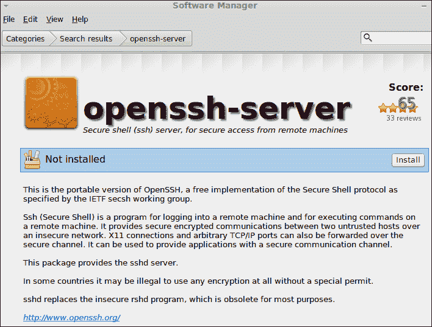
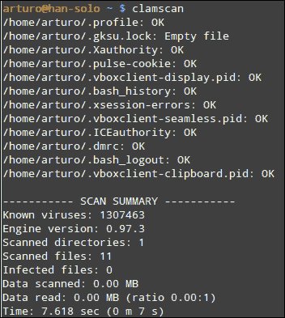
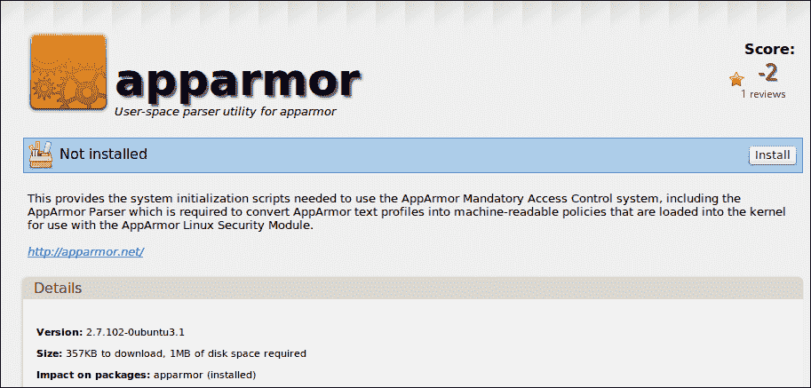
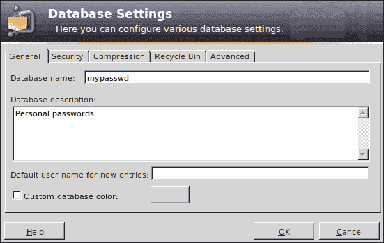
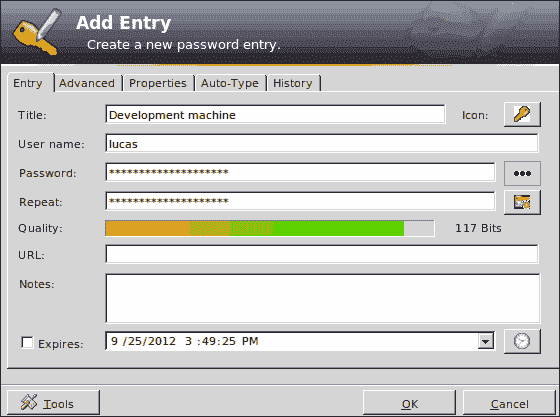

# 第九章。安全

*安全无疑是系统管理员最看重的方面之一。在本章中，我们将学习可以用来保护我们的 Linux Mint 计算机的基本机制和工具。*

在本章中，我们将学习以下主题:

*   运行 SSH 服务器
*   安装防病毒软件
*   安装和配置防火墙
*   为内核使用安全模块
*   建立安全清单

# 运行 SSH 服务器

有时你需要建立一个从你的电脑到服务器的远程连接。此外，用户需要访问您的服务器。远程连接允许您从计算机直接在服务器上执行命令。**远程登录** 是建立计算机间连接最常用的协议之一。但是，Telnet 不是一个安全协议，所以当我们需要安全连接时，还需要其他协议。这里是**安全壳** ( **SSH** )进入游戏的地方。由于 SSH，用户可以从他们的计算机安全地连接到服务器。从技术角度来看，SSH 在服务器和客户端之间创建了一个安全通道。通常，客户端和服务器是不同的机器，但是可以使用同一台机器来扮演两个角色。

# 行动时间-安装和配置 SSH 服务器

我们将安装并配置 **openssh-server** 软件，将我们的计算机用作 ssh 服务器。关于配置，我们的服务器将拒绝根用户的访问，并且将通过`5656`端口访问。

1.  点击**菜单**按钮，再次点击**系统**组内的**软件管理器**按钮。
2.  在**软件管理器**应用程序的文本输入字段中键入`openssh server`。
3.  Select **openssh-server** and then click on the **Install** button.

    

4.  现在你的电脑上安装了 **openssh 服务器**。
5.  点击主菜单中的**终端**按钮，启动 MATE 终端。
6.  我们将使用`vi`编辑器作为根用户编辑一个`/etc/ssh/sshd_config`文件，因此您应该在终端上键入以下命令:

    ```sh
    $ sudo vi /etc/ssh/sshd_config

    ```

7.  在`vi`内输入`i`进入编辑模式。查找包含**许可证登录**的行，并替换为以下行:

    ```sh
    PermitRootLogin no

    ```

8.  让我们继续同一个文件，寻找另一个包含**端口**的行，并用下面的行替换该行:

    ```sh
    Port 5656

    ```

9.  保存`/etc/ssh/sshd_config`文件；你可以点击*退出*键，然后输入`:wq`。
10.  现在是重启 SSH 服务器的时候了，然后你的服务器就会安装好，配置好，可以使用了。您可以通过执行以下命令来测试这一点:

    ```sh
    $ sudo restart ssh

    ```

11.  您可以通过尝试连接 SSH 服务器并在终端上键入以下命令来测试您的 SSH 服务器:

    ```sh
    $ ssh localhost –p 5656

    ```

12.  现在您可以看到一条要求您授权的消息。输入`yes`和你的密码。您现在通过 SSH 协议连接到我们的服务器。

## *刚刚发生了什么？*

多亏了 openssh-server 软件，我们可以创建和配置一个 ssh 服务器，它允许用户通过他们的计算机连接到远程服务器。Linux Mint 默认不安装上述软件，需要使用**软件管理器**或**包管理器**应用程序安装。

一旦 openssh-server 安装在您的计算机上，用户就可以使用 ssh 客户端直接连接到它。这种客户端默认安装在主要的 GNU/Linux 发行版和 Mac OS X 电脑上。

尽管 openssh-server 包含允许我们连接到服务器的默认配置，但建议更改配置以满足我们的要求。这是系统管理员的任务。在我们的示例中，我们不允许通过根用户进行连接，我们将默认的`22`端口更改为`5656`。这些更改为 SSH 连接提供了最低限度的安全性，防止潜在的攻击者试图使用默认端口使用 SSH 协议连接到服务器。由于我们在配置上的改变，我们正在建立一个一级墙。另一方面，如果我们允许根用户连接到我们的 SSH 服务器，有人可以破解连接并获得对我们服务器的根访问，这是不好的。

为了更改 SSH 服务器的配置文件，我们使用了`vi`编辑器，默认安装在 Linux Mint 中。这是一个**模式**编辑器，通过输入`:wq`，我们保存并退出。另一方面，当您键入`i`时，`vi`进入**插入**模式。显然，您可以使用其他编辑器，如`Pluma`来编辑配置文件。

最后，我们使用`restart`命令并通过`ssh`作为参数重新启动 SSH 守护程序。我们将在下一章中更多地讨论守护服务。目前，我们只需要知道`restart`命令用于重启服务。

# 安装杀毒软件

大家都知道 Windows 操作系统需要一个杀毒软件，因为病毒感染微软操作系统家族是很常见的。虽然很难找到影响 GNU/Linux 发行版的病毒，但一个好的做法是在我们的服务器上安装防病毒软件。Linux 最受欢迎的反病毒软件之一是**蛤蜊反病毒软件**([www.clamav.net](http://www.clamav.net))，所以我们将学习如何在我们的服务器上安装它。

# 行动时间-安装蛤蜊反病毒

我们会在电脑上安装 Clam-AV 杀毒软件。

1.  点击**菜单**按钮，再次点击**系统**组内的**软件管理器**按钮。
2.  在**软件管理器**主窗口输入框中输入`clamav`。
3.  单击结果列表的第一个元素。
4.  Now you can click on the **Install** button, and type your password when it is required.

    

5.  一旦安装完成，您可以从命令行使用`clamscan`应用程序。
6.  为了测试我们的反病毒，我们将打开 MATE 终端，扫描我们的`home`目录。您只需要键入以下命令:

    ```sh
    $ clamscan

    ```

7.  The output of `clamscan` should be similar to the following screenshot:

    

## *刚刚发生了什么？*

我们使用了**软件管理器**应用程序来安装应用程序。在这种情况下，我们安装了 Clam-AV 反病毒，其中包含一个名为`clamscan`的主可执行文件。该命令扫描目录并在我们的系统中搜索病毒。扫描完成后，我们会得到一个简单的报告，其中包含有关扫描的文件和目录以及哪些文件和目录被感染的信息。

# 配置防火墙

一个**防火墙** 是计算机安全中最重要的组件之一。从技术角度来看，防火墙是一种屏障，旨在防止未经授权访问计算机中的服务和资源。软件和硬件组件可用于构建防火墙。我们将只关注软件。

防火墙的配置可能非常简单，也可能非常复杂；取决于我们想要应用的安全级别。显然，配置网络服务器和计算机工作站是不同的。为了在 Linux 中使用和配置防火墙，我们可以使用一个名为`iptables`的程序，这是一个基于系统管理员定义的规则的包过滤应用程序。Linux 内核使用不同的内核模块来应用规则，并为计算机创建防火墙。

尽管`iptables`是一个非常好的应用程序，但对于初学者来说并不容易。这个应用程序不使用图形界面，并且*要求*知道如何从命令行应用规则。然而，Linux Mint 包括一个图形用户界面应用程序，它为**简单防火墙** ( `ufw` ) 提供了一个前端，这是一个旨在轻松构建防火墙的软件。我们将学习如何使用这个有用的工具来配置一个简单的防火墙。

# 行动时间-如何配置简单的防火墙

作为在 Linux Mint 中构建防火墙的一个简单示例，我们将配置我们的防火墙，以拒绝对端口`22`的特定 IP ( `192.168.1.66`)的访问。请记住，我们之前将此端口配置为运行 SSH 服务器。

1.  进入主菜单，点击属于**管理**类别的**防火墙配置**按钮。
2.  然后会显示一个新窗口；点击**解锁**按钮，输入密码。
3.  通过选择**状态**中的**开启**选项来激活防火墙。
4.  进入**编辑**菜单，点击**添加规则...**按钮。
5.  点击**高级**选项卡，选择**拒绝**作为第一个下拉选项。然后在**输入框中输入`192.168.1.66`，在端口输入框中输入`22`。**
***   In the **To** input box, type your IP and type `22` again for port. Click on the **Add** button when you're ready:

    

    *   Then click the **Close** button and you'll see how your new rule has been added to the rules list:

    

    *   您的防火墙已配置完毕，现在正在运行。**

 **## *刚刚发生了什么？*

Linux Mint 允许我们通过一个名为`Gufw`的应用程序来配置和运行防火墙。这个工具是配置防火墙的另一个工具`ufw`的简单直观的前端，比`iptables`简单。`Gufw`有三个主要控件，允许我们启用或禁用防火墙，并帮助控制传入和传出流量。一个简单的列表向我们显示了已启用的规则，该列表下面的两个按钮允许我们添加和删除规则。

请记住`ufw`中的默认行为是阻止所有传入流量并允许传出流量。通常，系统管理员更喜欢屏蔽一切，然后配置允许连接的应用程序、端口和协议。这种手法被称为**白名单** 。

基本上，您可以选择三个操作应用于您机器的传入和传出流量:**允许**、**拒绝**和**拒绝**。**拒绝**和**拒绝**动作的区别在于，第一个动作意味着每个数据包都将被丢弃。但是，**拒绝**表示服务器会向客户端发送响应，告知计算机使用了拒绝访问的防火墙。

我们已经使用了高级选项来选择 IP 和端口，但是也可以使用**预配置的**和**简单的**选项卡分别允许或拒绝对应用程序和协议的访问。

## 有一个围棋英雄——使用命令行在启动时禁用防火墙

您已经学习了如何使用 `Gufw`来配置您的防火墙。除了这个工具，你还可以直接从命令行使用`ufw`应用程序。例如，您可以在启动时禁用防火墙。为此，启动 MATE 终端并键入以下命令:

```sh
$ sudo ufw disable

```

执行上述命令后，您将收到一条消息，如下所示:

```sh
Firewall stopped and disabled on system startup

```

# 为内核使用安全模块

Linux 内核提供系统管理员机制来支持对应用程序可以在操作系统内部执行的操作的访问控制策略。目前，**安全增强版 Linux** ( **SELinux** ) 和**应用装甲**(**apparemor**)是这方面最受欢迎的工具。SELinux 是由美国**国家安全局**(**NSA**)开发的，它提供了一套可以适用于不同 GNU/Linux 操作系统的 Linux 内核修改。SELinux 的设计和架构允许系统管理员创建不同的策略，这些策略将应用于操作系统上运行的用户和进程。与 SELinux 相关，我们找到了 AppArmor，一个为 Linux 内核设计的安全模块。由于有了这个模块，可以通过不同的配置文件建立一组策略来限制每个程序可以做什么。如果一个程序包含安全漏洞，AppArmor 可以检测到它，而其他软件不受影响。换句话说，AppArmor 限制程序应用预定义安全配置文件的能力。

AppArmor 和 SELinux 使用 **Linux 安全模块** ( **LSM** ) ，这是一个为 Linux 内核支持不同计算机安全模型的框架。基本上，LSM 提供了基于不同策略实施强制访问控制的工具。

Linux Mint 包括 SELinux 和 AppArmor，但默认情况下并不安装。AppArmor 易于配置、部署和学习，因此我们将了解如何在我们的服务器上安装它。

# 行动时间-安装设备

appmor 的学习曲线很难，所以我们只学习如何安装它。

1.  启动**软件管理器**。
2.  Look for **apparmor**, select it from the list, and click on the **Install** button.

    

3.  一旦安装了 AppArmor，在 MATE 终端上执行以下命令时，可以检查其状态:

    ```sh
    $ sudo apparmor_status 

    ```

4.  We'll see something like the following screenshot:

    

## *刚刚发生了什么？*

我们只是从**软件管理器**应用程序中安装了appamor。Linux Mint 中包含的包提供了不同的可执行命令，如`apparmor_status`和`apparmor_parser`。第一个为我们提供了关于已定义和已启用的概要文件的信息，`apparmor_parser`用于将概要文件加载到 Linux 内核中。

如果您有兴趣了解更多关于如何配置 AppArmor 的信息，您可以查看位于[http://wiki.apparmor.net/index.php/Documentation](http://wiki.apparmor.net/index.php/Documentation)的官方文档。

# 安全管理您的密码

系统管理员每天用密码工作。将连接到服务器、访问资源和管理用户都是需要使用密码的操作。将密码存储在安全的地方非常重要，这对系统的安全至关重要。如果我们可以使用一个工具来存储、读取和更新密码，日常工作将会更容易。执行这些密码任务的最流行软件之一是**KeePass**([http://keepass.info/](http://keepass.info/))一种旨在以安全方式管理密码的工具。基本上，KeePass 只使用用户应该记住的主密码。该主密码锁定存储其他密码的数据库。从技术角度来看，KeePass 使用了两种最安全的加密算法: **AES** 和 **Twofish** 。

# 行动时间-安装和使用 KeePass

我们将学习如何安装并使用 KeePass 存储一些密码。安装 KeePass 后，我们将为一个名为`lucas`的用户创建一个新密码，该用户可以访问开发服务器。

1.  进入**软件管理器**应用，查找 **keepass2** ，选择搜索到的第一项，点击**安装**按钮。
2.  一旦安装了 **KeePass2** ，您可以通过访问主菜单并点击属于**附件**组的 **KeePass2** 菜单选项来启动它。
3.  选择**主窗口工具栏中的**文件**选项，并点击**新建...**菜单选项。**
4.  Then a new window asking for the master password is displayed. We'll type the same password in the **Master password** and **Repeat password** input boxes.

    

5.  Click on **OK** when you're ready and a new dialog window will be displayed. Now, we need to choose a name for a database where passwords will be stored. Choose a name and a database description, then click on the **OK** button:

    

6.  您的新数据库已经创建，并且 **KeePass** 显示一个树小部件，您可以在数据库名称下找到不同的类别。
7.  Now, go to the **Edit** menu and click on the **Add entry...** menu option. You can see a new dialog window. Enter a title and a username, and the password will be generated by default.

    

8.  点击**确定**按钮，将为您的密码创建一个新条目。

## *刚刚发生了什么？*

KeePass 是管理密码的完整工具。您可以使用和创建许多类别来组织您的密码。默认情况下，创建新条目时会生成密码。可以更改配置并决定默认情况下如何生成密码。你肯定已经意识到密码是隐藏的，你只能眼冒金星。要更改密码，点击**密码**输入框旁边的按钮。

每次访问 KeePass 时，都需要键入主密码。然而，当你点击一个条目时，你会看到信息，包括你之前输入的密码。

KeePass 提供的其他有用功能是生成随机密码的能力，尽管您不想使用这个工具来存储它。

# 建立安全检查表

当系统管理员正在配置安全服务器时，使用一个简单的清单来检查一些应该检查的问题是一个非常好的做法。我们将根据我们在本章中学到的概念建立一个清单。具体而言，我们的核对表将包含以下问题:

*   只安装和启用用户需要的服务。
*   基于特定策略构建和运行防火墙。
*   通过 SSH 禁用根访问，并更改此连接服务的默认端口。
*   安装和配置一个防病毒，蛤蜊反病毒是一个很好的选择。
*   让您的系统保持最新。始终为您的操作系统和应用程序安装安全更新。
*   使用 KeePass 或其他密码管理器安全地存储、读取和写入您的密码。
*   选择包含不同类型字符的安全密码。
*   加密您的敏感数据。 **GNU 隐私卫士** ( **GPG** ) 可以帮你做到。另外，Linux Mint 允许你在安装过程中加密你的`home`文件夹。
*   如果您的计算机需要额外的安全性，最好安装并配置一个网络协议分析器，如 **Wireshark** 。此外，还可以安装**Snort**T5 等网络入侵检测工具。

# 总结

在本章中，我们讨论了安全性，这是系统管理员最重要的问题之一。我们发现了一些工具，如 KeePass、Clam-AV、AppArmor 和`Gufw`。

具体来说，我们涵盖了以下主题:

*   运行 SSH 服务器
*   安装蛤蜊反病毒软件
*   使用 Gufw 安装和配置简单的防火墙
*   发现设备和 SELinux
*   安装并使用 KeePass 管理密码
*   定义安全清单

尽管我们已经学习了一些保护计算机安全的基本工具，但我们也可以使用其他工具来达到同样的目的。例如，使用工具来检测网络入侵是一个好主意。在这类软件里面，Snort([http://www.snort.org](http://www.snort.org))是最受欢迎的一款。另一方面，Wireshark([http://www.wireshark.org](http://www.wireshark.org))等工具可以帮助您分析网络中的流量，这对检测潜在的安全风险非常有用。在学习了关于安全性的基本概念和工具之后，您就可以学习如何监控您的系统了，这将在下一章中进行解释。**