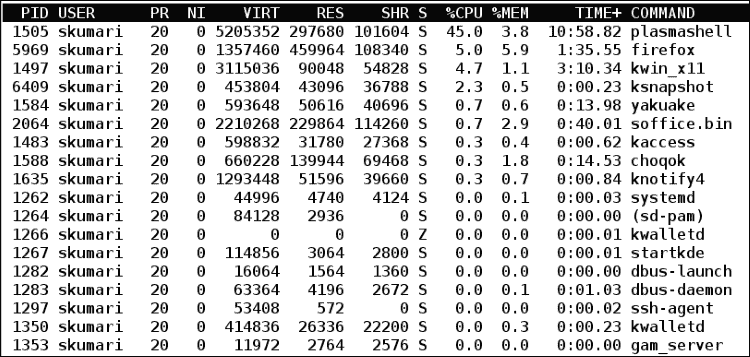
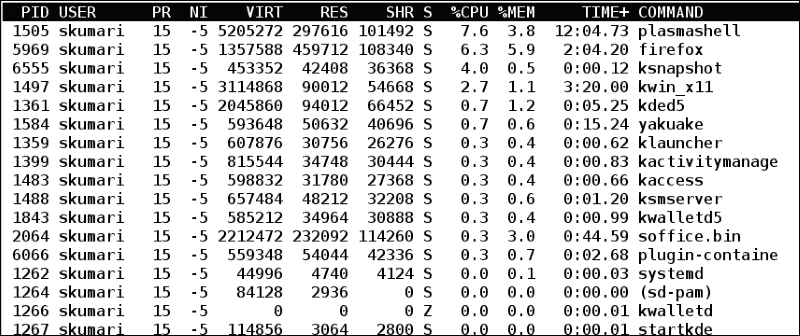
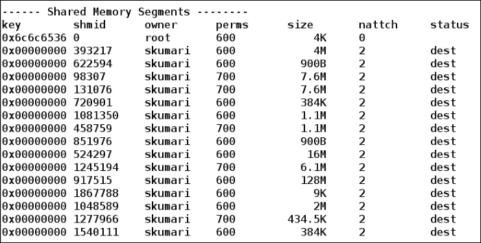

# 第七章。欢迎来到流程

正在执行的程序被称为 **进程**。当操作系统启动时，多个进程开始运行，以提供各种功能和用户界面，以便用户可以轻松执行所需的任务。例如，当我们启动一个命令行服务器时，我们将看到一个带有 bash 或任何其他已经启动的 shell 进程的终端。

在 Linux 中，我们可以完全控制进程。它允许我们创建、停止和终止进程。在本章中，我们将看到如何通过使用`top`、`ps`和`kill`等命令以及更改其调度优先级来创建和管理流程。我们还将看到信号如何导致进程的突然终止，以及使用命令陷阱在脚本中处理信号的方法。我们还将看到进程的一个美丽的特性，叫做进程间通信，它允许它们相互通信。

本章将详细介绍以下主题:

*   进程管理
*   列表和监控流程
*   过程替代
*   进程调度优先级
*   信号
*   随身行李
*   进程间通信

# 过程管理

管理流程非常重要，因为流程是消耗系统资源的东西。系统用户应该小心他们正在创建的流程，以确保一个流程不会影响任何其他关键流程。

## 流程创建和执行

在 bash 中，创建流程非常容易。当一个程序被执行时，一个新的进程被创建。在基于 Linux 或 Unix 的系统中，当创建一个新进程时，会为其分配一个唯一的 ID，这就是所谓的 PID。PID 值始终是从`1`开始的正数。取决于具有`init`或`systemd`的系统，它们总是获得 PID 值 1，因为这将是系统中的第一个进程，并且是所有其他进程的祖先。

PID 的最大值在`pid_max`文件中定义，应该可以在`/proc/sys/kernel/`目录中找到。默认情况下，`pid_max`文件包含值`32768`(最大 PID + 1)，这意味着一个系统中最多可以同时存在`32767`个进程。我们可以根据需要更改`pid_max`文件的值。

为了更好地理解流程创建，我们将从 bash 创建一个新的流程`vi`:

```sh
$ vi hello.txt

```

在这里，我们创建了一个新的流程`vi`，在编辑器中打开`hello.txt`文件来读写文本。调用`vi`命令会导致二进制文件`/usr/bin/vi`执行所需的任务。创建另一个进程的进程称为该进程的父进程。在本例中，`vi`是由 bash 创建的，因此 bash 是流程`vi`的父流程。创建子进程的方法称为分叉。在分叉的过程中，子进程继承父进程的属性，如 GID、真实有效的 UID 和 GID、环境变量、共享内存和资源限制。

要了解上一节创建的`vi`流程的PID，我们可以使用`pidof`和`ps`等命令。例如，在新终端中运行以下命令，以了解`vi`流程的 pid:

```sh
$ pidof vi  # Process ID of vi process
21552
$ ps -o ppid= -p 21552	# Knowing parent PID of vi process
1785

```

一旦任务完成，进程被终止，PID 可以根据需要自由分配给新的进程。

关于每个过程的详细信息可以在`/proc/`目录中找到。在包含详细信息的`/proc/`中，为每个进程创建一个具有 PID 名称的目录。

进程在其生命周期内可以处于以下任何状态:

*   **运行**:在这种状态下，进程要么正在运行，要么准备运行
*   **等待**:进程正在等待资源
*   **已停止**:某个流程已停止；例如，在接收到信号之后
*   **僵尸**:进程已成功退出，但其状态变化尚未得到父进程的确认

## 流程终止

在正常情况下，完成任务后，一个进程终止并释放分配的资源。如果Shell有分叉任何子进程，那么它将等待它们先完成任务(除了后台进程)。在某些情况下，某个进程可能无法正常运行，并且它可能比预期等待或消耗资源的时间更长。在其他一些情况下，可能会发生现在不再需要流程的情况。在这种情况下，我们可以从终端杀死进程并释放资源。

要终止一个进程，我们可以使用`kill`命令。如果在系统上可用，也可以使用`killall`和`pkill`命令。

### 使用杀死命令

`kill`命令向指定进程发送指定信号。如果没有提供信号，则发送默认的`SIGTERM`信号。我们将在本章后面看到更多关于信号的内容。

以下是使用`kill`命令的语法:

```sh
kill PID

```

和

```sh
kill -signal PID

```

要终止一个进程，首先获取该进程的`PID`，如下所示:

```sh
$ pidof firefox    # Getting PID of firefox process if running
1663
$ kill 1663    # Firefox will be terminated
$ vi hello.txt  # Starting a vi process
$ pidof vi
22715
$ kill -SIGSTOP 22715  # Sending signal to stop vi process
[1]+  Stopped                 vi

```

在这里，我们使用`SIGSTOP`信号来停止进程，而不是杀死它。要杀人，我们可以用`SIGKILL`信号或者这个信号的关联值，也就是`9`。

```sh
$ kill -9 22715  # Killing vi process

```

运筹学

```sh
$ kill -SIGKILL 22715  # Killing vi process

```

### 使用 killall 命令

很容易记住一个过程的名字，而不是 PID。 `killall`命令使终止进程变得更加容易，因为它将命令名称作为终止进程的参数。

以下是`killall`命令的语法:

```sh
killall process_name

```

和

```sh
killall -signal process_name

```

例如，我们可以通过名称杀死`firefox`进程，如下所示:

```sh
$ killall firefox  # Firefox application gets terminated

```

## 使用 pkill 命令

`pkill`命令也可以用来通过进程的名称来终止进程。与`killall`命令不同的是，`pkill`命令默认查找所有以参数中指定的名称开始的进程。

例如，以下命令演示了`pkill`如何从参数中指定的部分名称中删除`firefox`进程:

```sh
$ pkill firef    # Kills processes beginning with name firef and hence firefox

```

`pkill`命令要小心使用，因为它会杀死所有匹配的进程，这可能不是我们的本意。使用带有`-l`选项的`pgrep`命令，我们可以确定哪些进程将被`pkill`终止。`pgrep`命令根据其名称和属性查找进程。运行以下命令列出所有进程名称及其 PID，其名称分别以`firef`和`fire`字符串开头:

```sh
$ pgrep firef
 8168 firefox

```

这里，`firefox`为匹配流程名称，其 PID 为`8168`:

```sh
$ pgrep fire
 747 firewalld
 8168 firefox

```

我们还可以告诉`pkill`使用`--exact`或`-x`选项杀死与进程名称完全匹配的进程，如下所示:

```sh
$ pgrep -x -l  firef  # No match found
$ pkill -x fire  # Nothing gets killed
$ pgrep --exact -l firefox	  # Process firefox found
8168 firefox
$ pkill --exact firefox  # Process firefox will be killed

```

pkill 命令还可以通过`-signal_name`选项向所有匹配进程发送特定信号，如下所示:

```sh
$  pkill -SIGKILL firef

```

前面的命令向名称以`firef`开头的所有进程发送`SIGKILL`信号。

# 列表和监控流程

在一个正在运行的系统中，我们经常会注意到突然一个系统的反应很慢。这可能是因为正在运行的应用程序消耗了大量内存，或者某个进程正在执行 CPU 密集型工作。很难预测是哪个应用程序导致系统响应变慢。要知道原因，最好知道所有进程都在运行什么，也知道进程的监控行为(比如消耗的 CPU 或内存量)。

## 上市流程

要知道系统中运行的进程列表，我们可以使用`ps`命令。

### 语法

`ps`命令的语法如下:

```sh
ps [option]

```

使用`ps`命令有很多选项。下表解释了常用选项。

#### 简单流程选择

下表显示了可以组合在一起的多个选项，用于更好地选择结果:

<colgroup><col style="text-align: left"> <col style="text-align: left"></colgroup> 
| 

[计]选项

 | 

描述

 |
| --- | --- |
| `-A`、`-e` | 选择所有进程 |
| `-N` | 选择所有不满足条件的进程，即否定选择 |
| `T` | 选择与当前终端关联的进程 |
| `r` | 将选择仅限于正在运行的进程 |
| `x` | 选择没有控制终端的进程，如引导期间启动的守护程序 |
| `a` | 选择终端上包含所有用户的进程 |

#### 按列表选择流程

以下选项接受以空格或逗号分隔列表形式的单个参数；它们可以多次使用:

<colgroup><col style="text-align: left"> <col style="text-align: left"></colgroup> 
| 

[计]选项

 | 

描述

 |
| --- | --- |
| `-C cmdlist` | 按名称选择进程。选择的名称列表在`cmdlist`中提供。 |
| `-g grplist` | 通过`grplist`参数列表中提供的有效组名选择流程。 |
| `-G grplist` | 通过`grplist`参数列表中提供的真实组名选择进程。 |
| `-p pidlist` | 通过`pidlist`中提到的 PID 选择流程。 |
| `-t ttylist` | 通过`ttylist`中提到的终端选择流程。 |
| `-U userlist` | 通过`userlist`中提到的真实用户标识或姓名选择流程。 |
| `-u userlist` | 通过`userlist`中提到的有效用户标识或名称选择流程。 |

#### 输出格式控制

以下选项用于选择如何显示`ps`命令输出:

<colgroup><col style="text-align: left"> <col style="text-align: left"></colgroup> 
| 

[计]选项

 | 

描述

 |
| --- | --- |
| `-j` | 显示作业格式。 |
| `-f` | 这用于完整格式的列表。它还打印传递给命令的参数。 |
| `u` | 显示面向用户的格式。 |
| `-l` | 显示长格式。 |
| `v` | 显示虚拟内存格式。 |

### 详细列出所有流程

要知道系统上的所有进程，可以使用`-e`选项。要获得更详细的输出，请使用`u`选项:

```sh
$ ps -e u | wc -l    # Total number of processes in system
211
$ ps -e u | tail -n5  # Display only last 5 line of result

```


从输出中我们可以看到所有用户的进程都被显示出来。实际显示输出的命令，即 **ps -e u | tail -n5** ，在`ps`输出中也作为两个独立的运行进程被提及。

在 BSD 风格中，使用`aux`选项获得我们从`-e u`获得的结果:

```sh
$ ps aux

```

在基于 Linux 的操作系统上，aux 以及`-e u`选项都可以正常工作。

### 列出用户运行的所有进程

要知道特定用户正在执行哪些进程，请使用用户名后面的`-u`选项。也可以提供多个用户名，用逗号(，)分隔。

```sh
$ ps u -u root | wc -l
130
$ ps u -u root | tail -n5	# Display last 5 results

```

前面的命令显示以下结果:


我们看到所有进程都作为用户根运行。其余的用户进程已经被过滤掉了。

### 当前终端运行的进程

知道当前终端正在运行哪些进程是有用的。它可以帮助决定是否杀死正在运行的终端。我们可以使用`T`或`t`选项列出当前终端中运行的进程。

```sh
$ ps ut

```

以下命令的输出如下:


从输出中我们可以看到`bash`和`ps uT`命令(我们刚刚执行来显示结果)只是当前终端中正在运行的进程。

### 通过命令名称列出进程

我们也可以使用命令名称后面的`-C`选项通过名称来了解过程细节。多个命令名可以用逗号(`,`)分隔:

```sh
$ ps u -C firefox,bash

```

获得以下输出:


## 流程的树形显示

`pstree`命令以树形结构显示正在运行的进程，非常容易理解进程的父子关系。

使用`-p`选项运行`pstree`命令，以树形格式显示进程，其 PID 号如下:

```sh
$ pstree -p

```


从到`pstree`输出，我们看到所有流程的父流程都是`systemd`。这是作为负责执行其余流程的第一个流程开始的。在括号中，提到了每个进程的 PID 号。我们可以看到`systemd`过程得到的 PID 1 总是固定的。在基于`init`的操作系统上，`init`将是所有进程的父进程，并且具有 PID 1。

要查看进程处理特定 PID 的树，我们可以使用带有 PID 号的`pstree`作为参数:

```sh
$ pstree -p 1627  # Displays process tree of PID 1627 with PID number

```


使用带有`-u`选项的`pstree`命令查看进程和父进程的 UID 何时不同:

```sh
$ pstree -pu 1627

```


我们可以看到，最初`bash`是由用户`skumari`用 PID `1627`运行的。在树的更深处，`sudo`命令作为根命令运行。

## 监控流程

知道一个进程在运行时消耗了多少内存和 CPU 是非常重要的，以确保没有内存泄漏和超 CPU 计算发生。有`top`、`htop`、`vmstat`等命令可以用来监控每个进程消耗的内存和 CPU。这里，我们将讨论`top`命令，因为它预装在基于 Linux 的操作系统中。

`top`命令显示 CPU、内存、交换的动态实时使用情况，以及当前运行的任务数量及其状态。

在没有任何选项的情况下运行`top`会产生以下结果:

```sh
$ top

```


在`top`命令输出中，第一行告诉我们自系统上次启动以来的时间长度、用户数量和平均负载。

第二行告诉我们任务的数量和它们的状态——运行、睡眠、停止和僵尸。

第三行给出了 CPU 使用百分比的详细信息。下表显示了不同的 CPU 使用情况:

<colgroup><col style="text-align: left"> <col style="text-align: left"></colgroup> 
| 

价值

 | 

描述

 |
| --- | --- |
| `us` | 运行不良用户进程所花费的 CPU 时间百分比 |
| `sy` | %的 CPU 时间花在内核空间上，也就是运行内核进程 |
| `ni` | 运行最佳用户进程的 CPU 时间百分比 |
| `id` | 空闲时间的百分比 |
| `wa` | 等待输入/输出完成的时间百分比 |
| `hi` | 服务硬件中断所花费的时间百分比 |
| `si` | 服务软件中断花费的时间百分比 |
| `st` | 虚拟机消耗的时间百分比 |

第四行告诉我们总的、空闲的、已用的和缓冲的内存使用情况。

第五行告诉我们总的、空闲的和使用过的交换内存。

剩下的几行给出了运行进程的详细信息。下表描述了每一列的含义:

<colgroup><col style="text-align: left"> <col style="text-align: left"></colgroup> 
| 

圆柱

 | 

描述

 |
| --- | --- |
| PID | 流程标识 |
| 用户 | 任务所有者的有效用户名 |
| 一对 | 任务优先级(值越低，优先级越高) |
| 镍 | 任务价值不错。负值表示优先级较高，正值表示优先级较低 |
| VIRT | 进程使用的虚拟内存大小 |
| 皇家经济学会(Royal Economic Society) | 非交换物理内存是一个过程 |
| share 分享 | 进程可用的共享内存量 |
| S | 进程状态–D(不间断睡眠)、R(正在运行)、S(正在睡眠)、T(被作业控制信号停止)、T(被调试器停止)、Z(僵尸) |
| %CPU | 进程当前使用的 CPU 百分比 |
| %MEM | 进程当前使用的物理内存百分比 |
| 时间+ | 中央处理器时间，百分之一 |
| 命令 | 命令名称 |

我们也可以在 top 运行时对输出进行重新排序和修改。要查看帮助，请使用*？*或 *h* 键，将显示帮助窗口，其中包含以下详细信息:


根据特定字段排序，最简单的方法是在`top`运行时按下 *f* 键。一个新的窗口打开，显示所有列。打开的窗口如下所示:


使用向上和向下箭头导航并选择一列。按下 *s* 键，然后按下 *q* 切换回顶部输出窗口，根据特定字段进行排序。

这里，我们选择了 NI，然后按下*的*键和*的*键。现在，`top`输出将以`nice`号排序。用列 **NI** 排序后的顶部输出如下:


# 工艺替代

我们知道我们可以使用管道提供一个命令的输出作为另一个命令的输入。例如:

```sh
$ cat file.txt | less

```

这里，`cat`命令输出——即`file.txt`的内容——作为输入传递给 less 命令。我们只能将一个流程(本例中为 cat 流程)的输出重定向为另一个流程的输入。

我们可能需要将多个进程的输出作为另一个进程的输入。在这种情况下，使用过程替代。进程替换允许进程从一个或多个进程的输出中获取输入，而不是从文件中获取输入。

使用进程替换的语法如下:

用列表替换输入文件

```sh
<(list)

```

运筹学

按列表替换输出文件

```sh
>(list)

```

这里，`list`是一个命令或者命令的流水线。进程替换使列表表现得像一个文件，这是通过给列表一个名称，然后在命令行中替换该名称来完成的。

## 区分两个过程的输出

要比较两组数据，我们使用`diff`命令。然而，我们知道`diff`命令将两个文件作为产生 diff 的输入。因此，我们必须首先将两组数据保存到两个单独的文件中，然后运行`diff`。为 diff 保存内容会增加额外的步骤，这并不好。为了解决这个问题，我们可以在执行`diff`时使用流程替换功能。

例如，我们想知道目录中隐藏的文件。在基于 Linux 和 Unix 的系统中，以`.`(点)开头的文件被称为隐藏文件。要查看隐藏文件，`-a`选项与`ls`命令一起使用:

```sh
$ ls -l ~  # Long list home directory content excluding hidden files
$ ls -al ~   # Long list home directory content including hidden files

```

要仅获取目录中的隐藏文件，请对从前面两个命令获得的排序输出运行`diff`命令:

```sh
$ diff  <(ls -l ~ | tr -s " " | sort -k9) <(ls -al ~ | tr -s " " | sort -k9)

```


这里，我们让将命令`ls -l ~ | tr -s " " | sort -k9`和`ls -al ~ | tr -s " " | sort -k9`作为输入数据输入到`diff`命令中，而不是传递这两个文件。

# 流程调度优先级

在进程生存期内，可能需要 CPU 等资源才能保持正常执行。我们知道一个系统中同时运行多个进程，它们可能需要一个 CPU 来完成一个操作。为了共享可用的中央处理器和资源，进行了进程调度，以便每个进程都有机会利用中央处理器。创建进程时，会设置初始优先级值。根据优先级值，进程获得 CPU 时间。

工艺调度优先级范围为`-20`至`19`。这个值也被称为好看的值。nice 值越低，进程的调度优先级越高。因此，具有`-20`的进程将具有最高的调度优先级，而具有尼斯值`19`的进程将具有最低的调度优先级。

要查看过程的良好值，可以使用`ps`或`top`命令。一个过程的相应的好值可以在 NI 列中找到:

```sh
$ ps -l

```


在`ps`输出中，我们可以在`NI`列中看到 bash 和`ps`进程的 nice 值是`0`。

## 更改调度优先级

系统中的每一个进程都有一些优先级，这取决于它的良好价值。根据优先级，进程获得 CPU 时间和其他资源来使用。有时，可能会发生一个进程需要快速执行，但由于调度优先级较低，它等待释放 CPU 资源的时间很长。在这种情况下，我们可能希望增加其调度优先级，以便更快地完成任务。我们可以通过使用`nice`和`renice`命令来更改进程的调度优先级。

### 使用尼斯

`nice`命令启动具有用户定义的调度优先级的进程。默认情况下，用户创建的进程会获得很好的值`0`。要验证这一点，请在没有任何选项的情况下运行`nice`命令:

```sh
$ nice
0

```

让我们创建一个实际消耗 CPU 和资源的新`firefox`进程:

```sh
$ killall firefox  # Terminate any firefox if already running
$ firefox &    # Firefox launched in background
$ top

```


我们可以看到`firefox`的好看值是`0`，CPU 使用率是 8.7%。

现在，我们将杀死当前的`firefox`并推出另一个具有良好价值的`10`。这意味着，`firefox`的优先级将低于其他用户创建的流程。

要创建具有不同 nice 值的流程，`-n`选项与`nice`一起使用:

```sh
$ killall firefox
$ nice -n 10 firefox &

```

运筹学

```sh
$ nice -10 firefox &

```

要查看现在有什么好值`firefox`，请查看`top`输出:

```sh
$ top

```


我们可以看到`firefox`过程有`10`好看的值。为了提供更多的调度优先级，也就是说，为进程设置一个负的 nice 值，需要 root 权限。

以下示例将`firefox`流程设置为更高的调度优先级:

```sh
$  nice -n -10 firefox

```

运筹学

```sh
$ sudo  nice --10 firefox

```

### 使用肾素

`nice`命令只能在进程启动时修改一个好看的值。但是，如果我们想改变一个正在运行的进程的调度优先级，那么应该使用`renice`命令。`renice`命令改变一个或多个正在运行的进程的调度优先级。

使用`renice`的语法如下:

```sh
renice [-n] priority [-g|-p|-u] identifier

```

这里，`-g`选项考虑继承一个参数，即标识符作为 GiD。

`-p`选项考虑继承一个参数，即标识符作为 PiD。

`-u`选项考虑继承一个参数，即作为用户名或 uid 的标识符。

如果没有提供任何选项— `-g`、`-p`或`-u`，则标识符被视为 PID。

例如，我们将改变属于一个用户的所有进程的优先级。首先，查看用户拥有的进程的当前优先级:

```sh
$  top -u skumari    # User is skumari

```



现在，我们将使用`–u`选项使用`renice`修改所有进程的优先级:

```sh
$ sudo renice -n -5 -u skumari

```

让我们来看看用户拥有的流程的新价值`skumari`:

```sh
$ top -u skumari

```



要修改几个流程的调度优先级，使用流程的 PIDs 进行修改。以下示例修改了分别具有 PiD`1505`和`5969`的进程等离子体和火狐:

```sh
$ sudo renice -n 2 -p 1505 5969
$ top -u skumari

```


现在，我们可以看到 process plasmashell 和 Firefox 的好看值是`2`。

# 信号

信号是一个软件中断，用于通知进程外部事件已经发生。在正常执行中，进程保持按预期运行。现在，出于某种原因，用户可能想要取消正在运行的`process`。当进程从终端开始时，当我们点击 *Ctrl* + *c* 键或运行`kill`命令时，它将终止。

当我们在终端运行过程中按下 *Ctrl* + *c* 键时，会产生一个信号`SIGINT`并发送给前台运行的过程。此外，当`kill`命令在进程上被调用时，`SIGKILL`信号产生，进程终止。

## 可用信号

在所有可用信号中，我们将在此讨论常用信号:

<colgroup><col style="text-align: left"> <col style="text-align: left"> <col style="text-align: left"> <col style="text-align: left"></colgroup> 
| 

信号名称

 | 

价值

 | 

默认操作

 | 

描述

 |
| --- | --- | --- | --- |
| 嘘嘘嘘 | one | 学期 | 该信号用于控制过程的挂起或死亡 |
| 信号情报 | Two | 学期 | 该信号用于从键盘中断，如 ctrl + c、ctrl + z |
| 继续走 | three | 核心 | 该信号用于退出键盘 |
| -是啊 | four | 核心 | 它用于非法指令 |
| SIGTRAP(陷阱) | five | 核心 | 该信号用于跟踪或断点陷阱 |
| 西格布 | six | 核心 | 它用于中止信号 |
| 西格弗 | eight | 核心 | 浮点异常 |
| SIGKILL(消歧义) | nine | 学期 | 进程立即终止 |
| 西格尔瑟夫 | Eleven | 核心 | 无效的内存引用 |
| SIGPIPE(烟斗) | Thirteen | 学期 | 破裂的管道 |
| 跟着我 | Fourteen | 学期 | 警报 |
| 是 SIGTERM | Fifteen | 学期 | 终止进程 |
| 西格奇 | Seventeen | 触发器 | 子进程已停止或终止 |
| 停下来 | Nineteen | 停止 | 该信号用于停止该过程 |
| SIGPWR | Thirty | 学期 | 停电 |

在上表中，我们提到了信号名称和值。它们中的任何一个都可以在引用信号时使用。**默认动作**部分中使用的术语含义如下:

*   期限:终止
*   核心:终止进程并转储核心
*   忽略信号
*   停止:停止进程

根据信号的类型，可以采取以下任一措施:

*   一个信号可以被一个进程忽略，这意味着不会采取任何行动。大部分信号可以忽略，除了`SIGKILL`和`SIGSTOP`。`SIGKILL`和`SIGSTOP`信号不能被捕捉、阻挡或忽略。这允许内核在任何时间点终止或停止任何进程。
*   可以通过编写信号处理程序代码来处理信号，该代码指定了接收到特定信号后需要采取的操作。
*   每个信号都有一个默认动作，所以让信号执行默认动作；例如，如果发送了`SIGKILL`信号，则终止该过程。

要知道所有信号及其相应的值，使用带有`–l`选项的`kill`命令:

```sh
$ kill -l

```


当以下列方式使用时，`kill`命令还提供了一种将信号编号转换为名称的方法:

```sh
kill -l signal_number

$ kill -l 9
KILL
$ kill -l 29
IO
$ kill -l 100  # invalid signal number gives error
bash: kill: 100: invalid signal specification

```

要向进程发送信号，我们可以使用`kill`、`pkill`和`kilall`命令:

```sh
$ kill -9 6758  # Sends SIGKILL process to PID 6758
$ killall -1 foo  # Sends SIGHUP signal to process foo
$ pkill -19 firef  # Sends SIGSTOP signal to processes' name beginning with firef

```

# 陷阱

当一个进程正在运行，在此期间我们终止该进程，该进程立即终止，不再做任何进一步的事情。写程序的程序员可能想在程序实际终止之前做一些任务；例如，清理创建的临时目录，保存应用程序状态，保存日志，等等。在这种情况下，程序员希望在实际允许您终止进程之前，先倾听信号并完成所需的任务。

考虑以下 shell 脚本示例:

```sh
#!/bin/bash
# Filename: my_app.sh
# Description: Reverse a file

echo "Enter file to be reversed"
read filename

tmpfile="/tmp/tmpfile.txt"
# tac command is used to print a file in reverse order
tac $filename > $tmpfile
cp $tmpfile $filename
rm $tmpfile
```

该程序从用户文件中获取输入，然后反转文件内容。该脚本创建一个临时文件来保存文件的反向内容，并在以后将其复制到原始文件中。最后，它会删除临时文件。

当我们执行这个脚本时，它可能正在等待用户输入一个文本文件名，或者可能正在反转文件(一个大文件需要更多的时间来反转内容)。在此期间，如果进程终止，则临时文件可能不会被删除。程序员的任务是确保临时文件被删除。

要解决这样的问题，我们可以处理信号，执行必要的任务，然后终止流程。这可以通过使用`trap`命令来实现。此命令允许您在脚本收到信号时执行命令。

使用`trap`的语法如下:

```sh
$ trap action signals

```

在这里，我们可以提供`trap action`进行执行。动作可以是正在执行的命令。

在前面的`trap`语法中，`signals`是指提供一个或多个必须执行动作的信号名称。

以下 shell 脚本演示了`how`陷阱用于在进程收到信号后突然退出之前执行任务:

```sh
#!/bin/bash
# Filename: my_app_with_trap.sh
# Description: Reverse a file and perform action on receiving signals

echo "Enter file to be reversed"
read filename

tmpfile="/tmp/tmpfile.txt"
# Delete temporary file on receiving any of signals
# SIGHUP SIGINT SIGABRT SIGTERM SIGQUIT and then exit from script
trap "rm $tmpfile; exit" SIGHUP SIGINT SIGABRT SIGTERM SIGQUIT
# tac command is used to print a file in reverse order
tac $filename > $tmpfile
cp $tmpfile $filename
rm $tmpfile
```

在此修改后的脚本中，当接收到`SIGHUP`、`SIGINT`、`SIGABRT`、`SIGTERM`或`SIGQUIT`等任何信号时，将执行`rm`、`$tmpfile; exit`。这意味着临时文件将首先被删除，然后您可以退出脚本。

# 进程间通信

一个流程单独可以做某一件事，但不能做所有事。如果两个或多个进程可以以共享结果、发送或接收消息等形式相互通信，这将是一种非常有用和良好的资源利用。在基于 Linux 或 Unix 的操作系统中，两个或多个进程可以使用 IPC 相互通信。

IPC 是进程之间相互通信并由内核管理的技术。

仪表板组合仪表可以通过以下任何方式实现:

*   **命名管道**:这些允许进程读写。
*   **共享内存**:这个是由一个进程创建的，还可以由多个进程读写。
*   **消息队列**:这是一个内存段的结构化有序列表，进程在其中以队列方式存储或检索数据。
*   **信号量**:这个为访问相同资源的进程提供了同步机制。它有计数器，用于控制多个进程对共享资源的访问。

在[第 6 章](06.html "Chapter 6. Working with Files")、*讨论命名管道时，我们学习了如何使用命名管道进行流程通信。*

## 关于使用国际化学品安全方案的国际化学品安全方案的信息

`ipcs`命令提供调用进程具有读取权限的仪表板组合仪表设施的信息。它可以提供关于三种资源的信息:共享内存、消息队列和信号量。

使用`ipcs`的语法如下:

```sh
ipcs option

```

其中选项如下:

<colgroup><col style="text-align: left"> <col style="text-align: left"></colgroup> 
| 

[计]选项

 | 

描述

 |
| --- | --- |
| `-a` | 显示所有资源的信息—共享内存、消息队列和信号量 |
| `-q` | 显示有关活动消息队列的信息 |
| `-m` | 显示有关活动共享内存段的信息 |
| `-s` | 显示有关活动信号量集的信息 |
| `-i ID` | 显示标识的详细信息。与`-q`、`-m`或`-s`选项一起使用。 |
| `-l` | 显示资源限制 |
| `-p` | 显示资源创建者和最后一个操作员的个人识别码 |
| `-b` | 以字节为单位打印尺寸 |
| `--human` | 以人类可读的格式打印尺寸 |

### 国际化学品安全方案提供的清单信息

我们可以在没有选项的情况下或通过`–a`使用`ipcs`命令:

```sh
$ ipcs

```

运筹学

```sh
$ ipcs -a

```


要仅查看共享内存段，我们可以将`ipcs`与`–m`选项一起使用:

```sh
$ ipcs -m --human

```



这里，`--human`选项通过以 KB 和 MB 为单位而不是以字节为单位来提供大小，从而使大小列的可读性更好。

要找到关于资源标识的详细信息，请使用`ipcs`和`-i`选项，后跟资源标识:

```sh
$ ipcs -m -i 393217

```


### 了解最近做 IPCs 的进程的 PID

使用`-p`选项，我们可以知道最近访问特定 IPC 资源的进程的 PID:

```sh
$ ipcs -m -p

```


这里 `cpid`列显示了创建共享内存资源的进程的`pid`，`lpid`指的是最后访问共享内存资源的进程的 PID。

# 总结

读完这一章，你会明白在基于 Linux 和 UNIX 的系统中什么是进程。现在，您应该知道如何创建、停止、终止和监控流程。您还应该知道如何向进程发送信号，并使用`trap`命令在 shell 脚本中管理接收到的信号。您还学习了不同的进程如何使用 IPC on 机制相互通信，以便共享资源或发送和接收消息。

在下一章中，您将了解任务自动化的不同方式，以及它们如何在指定时间运行，而无需任何进一步的人工干预。您还将学习如何以及为什么创建启动文件，以及如何在 shell 脚本中嵌入其他编程语言，如 Python。