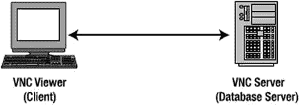
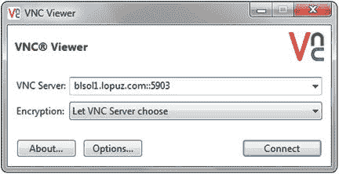
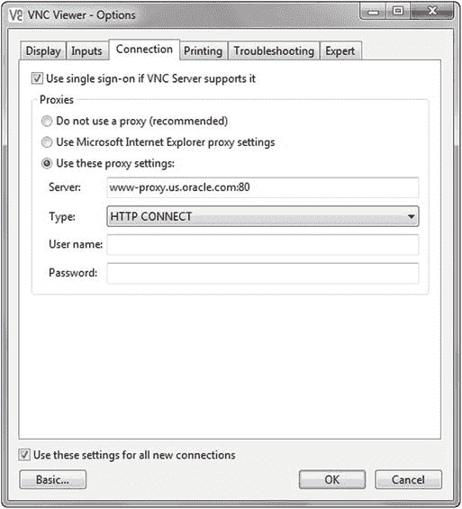
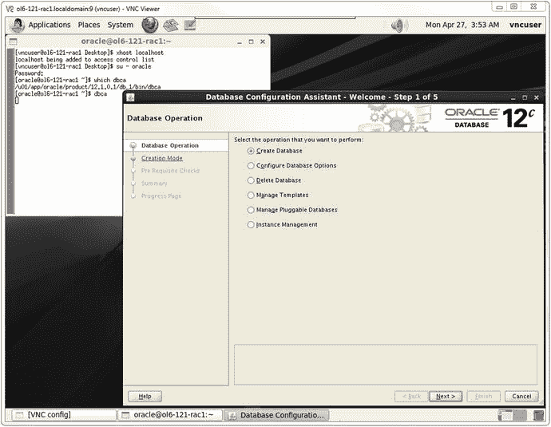

# 第十六章:用 VNC 管理远程服务器

越来越少的数据库管理员在托管 Oracle 数据库的服务器控制台前工作。现在，数据库服务器或数据中心与数据库管理员位于不同的地理区域是很常见的。例如，数据库服务器可能位于纽约市的某个地方，而 DBA 正在奥兰多享受阳光明媚的天气。

DBA 现在可以通过使用他们喜欢的协议，例如`telnet`、`rsh`、`rlogin`和`ssh`，轻松地远程访问数据库服务器；通过使用当今市场上的各种工具。其中一些工具可以免费下载，特别是 PuTTY 和虚拟网络计算(VNC)。

在第一章的[中描述的软件，比如 PuTTY，允许你从 Windows 客户端通过`telnet`或`ssh`远程访问服务器。PuTTY 允许您配置代理设置和`ssh`端口隧道，以及保存配置，这样您就不必每次连接到同一个数据库服务器时都键入所有内容。](01.html)

在大多数情况下，您只需要通过 PuTTY 在命令行模式下访问数据库服务器。然而，有时您可能需要以一种允许您运行基于 GUI 的软件的方式来访问数据库服务器。例如，您可能需要运行 Oracle 的数据库配置助手(DBCA)来创建 Oracle 数据库，或者运行其他一些基于 X Window 系统的软件。在这种情况下，VNC 派上了用场。

VNC 是总部位于英国剑桥的 RealVNC 的瘦客户机产品。VNC 允许您以图形化的方式访问数据库服务器。这个特性对 DBA 很有用，因为 Oracle 需要 X 服务器来显示其基于 Java 的屏幕，以便安装、创建和配置 Oracle 数据库；也适用于 Oracle 监听器设置。换句话说，您可以在本地 VNC 客户端计算机上运行与在数据库服务器控制台上实际运行的相同的基于 GUI 的应用程序。

要运行 VNC，你需要两个组件:服务器和查看器，如图 [16-1](#Fig1) 所示。VNC 服务器组件运行在要监控的计算机上，VNC 查看器组件运行在要监控远程服务器的计算机上。必须先安装这两个组件，然后才能启动 VNC 会话。VNC 可以在大多数操作系统上运行，包括 UNIX(如 Solaris)、Linux、Windows 和 Mac OS。

图 16-1。

VNC connection

除了将输出路由到 VNC 服务器，您还可以将显示路由到目前市场上的其他 X 服务器，如 Cygwin/X、Reflections X 和 Hummingbird。但是，我们推荐使用 VNC，因为它是免费的，并且通常默认包含在大多数 Linux 发行版中，如 Red Hat Enterprise Linux、Novell SUSE Linux Enterprise、Oracle Enterprise Linux (OEL)和 Oracle Solaris。VNC 还具有丰富的功能，如 2048 位 RSA 服务器认证、128 位或 256 位 AES 会话加密、HTTP 代理、文件传输、桌面缩放和屏幕共享。

在本章中，您将学习从哪里下载 VNC 软件，如何在远程 Linux/Solaris 数据库服务器上安装和配置 VNC 服务器，如何在客户端计算机上安装和配置 VNC 浏览器，如何共享和保护您的 VNC 连接，如何配置代理服务器，以及如何解决 VNC 问题。

当您将本章所学付诸实践时，例如使用 VNC 软件随时随地访问和管理您的远程 Linux/Solaris 数据库服务器，您将会体会到作为 DBA 给您带来的好处:灵活性、便利性、与团队成员更好的协作、数据安全性以及为您的公司节省潜在成本。

## 16-1.下载 VNC 软件

### 问题

您希望下载 VNC 软件，以允许您从客户端计算机管理和显示远程 Linux/Solaris 数据库服务器的控制台。您希望在 X Window 系统环境中工作，而不是在命令行提示符下工作。

### 解决办法

运行 VNC 需要两个组件:运行在远程 Linux/Solaris 数据库服务器上的 VNC 服务器和客户端计算机上的 VNC 浏览器。执行以下步骤为两台计算机下载 VNC 软件:

Go to [`https://www.realvnc.com/download/vnc/`](http://www.realvnc.com/products/download.html) and click the Download button that corresponds to the OS and processor type of your system, as well as the type of compressed file you want to download.   Note

要确定您的 Linux 系统的处理器类型，以查看您使用的是 x86、x64 还是 ia64，请发出 Linux 命令`uname -p`或`uname -a`。对于 Solaris 系统，运行操作系统命令`isainfo -vk`。

On the next screen, check the box that says “I have read and accept these terms and conditions” after you review the VNC end user license agreement.   Click the Download button and save the file to a specific directory.  

### 它是如何工作的

要使 VNC 工作，您必须在远程 Linux/Solaris 数据库服务器上下载并安装 VNC 服务器，在客户端计算机上下载并安装 VNC 浏览器。你有三个不同的 VNC 版本可供选择:免费版，个人版，或企业版。免费版最适合个人私用，个人版最适合小规模商业使用，企业版推荐中型或大型商业使用。

默认情况下，免费版包含在大多数 Linux 发行版中，如 Red Hat、SUSE、Oracle Enterprise Linux 和 Oracle Solaris。但是，个人版和企业版比免费版有一些优势，例如加密、身份验证和代理服务器功能。如果您想利用这些特性，请下载企业版并替换免费版，免费版通常作为一个包包含在您的 Linux 发行版中。请注意，企业版和个人版需要许可证密钥才能启动 VNC 服务器。

## 16-2.安装 VNC 软件

### 问题

您希望在远程 Linux/Solaris 数据库服务器上安装 VNC 服务器，并在 Windows 客户端计算机上安装 VNC 查看器，以便管理和访问远程 Linux/Solaris 数据库服务器。

### 解决办法

要使 VNC 工作，您必须在远程 Linux/Solaris 数据库服务器上安装 VNC 服务器，并在客户端计算机上安装 VNC 浏览器。您可以选择在您的服务器上安装 VNC 服务器企业版或免费版。

首先，解压软件包。在这里，VNC 服务器-5.2.3-Solaris-x64.pkg 和 VNC 浏览器-5.2.3-Solaris-x64.pkg 被解压缩。

`root@BLSOL1:∼/Downloads# tar -xzvf VNC-5.2.3-Solaris-x64-PKG.tar.gz`

`x VNC-Server-5.2.3-Solaris-x64.pkg, 39088640 bytes, 76345 tape blocks`

`x VNC-Viewer-5.2.3-Solaris-x64.pkg, 8895488 bytes, 17374 tape blocks`

要安装，您必须以`root`的身份登录，然后运行`pkgadd`命令:

`root@BLSOL1:∼/Downloads# /usr/sbin/pkgadd -d VNC-Server-5.2.3-Solaris-x64.pkg`

`The following packages are available:`

`1  RVNCsrv     VNC Server for Solaris`

`(i386) 5.2.3.8648`

`Select package(s) you wish to process (or ’all’ to process`

`all packages). (default: all) [?,??,q]: all`

`Processing package instance <RVNCsrv> from </root/Downloads/VNC-Server-5.2.3-Solaris-x64.pkg>`

`VNC Server for Solaris(i386) 5.2.3.8648`

`Copyright (C) 2002-2015 RealVNC Ltd.  All rights reserved.`

`Using </> as the package base directory.`

`## Processing package information.`

`## Processing system information.`

`14 package pathnames are already properly installed.`

`## Verifying disk space requirements.`

`## Checking for conflicts with packages already installed.`

`## Checking for setuid/setgid programs.`

`The following files are being installed with setuid and/or setgid`

`permissions:`

`/usr/local/bin/Xvnc <setuid root>`

`/usr/local/bin/vncserver-x11 <setuid root>`

`Do you want to install these as setuid/setgid files [y,n,?,q] y`

`This package contains scripts which will be executed with super-user`

`permission during the process of installing this package.`

`Do you want to continue with the installation of <RVNCsrv> [y,n,?] y`

`Installing VNC Server for Solaris as <RVNCsrv>`

`## Installing part 1 of 1.`

`/usr/lib/cups/backend/vnc`

`/usr/local/bin/Xvnc`

`/usr/local/bin/Xvnc-core`

`/usr/local/bin/vncinitconfig`

`/usr/local/bin/vnclicense`

`/usr/local/bin/vnclicensehelper`

`/usr/local/bin/vnclicensewiz`

`/usr/local/bin/vncpasswd`

`/usr/local/bin/vncpipehelper`

`/usr/local/bin/vncserver-virtual`

`/usr/local/bin/vncserver-virtuald`

`/usr/local/bin/vncserver-x11`

`/usr/local/bin/vncserver-x11-core`

`/usr/local/bin/vncserver-x11-serviced`

`/usr/local/bin/vncserverui`

`/usr/local/lib/vnc/get_primary_ip4`

`/usr/local/lib/vnc/vncelevate`

`/usr/local/man/man1/Xvnc.1`

`/usr/local/man/man1/vncinitconfig.1`

`/usr/local/man/man1/vnclicense.1`

`/usr/local/man/man1/vncpasswd.1`

`/usr/local/man/man1/vncserver-virtual.1`

`/usr/local/man/man1/vncserver-virtuald.1`

`/usr/local/man/man1/vncserver-x11-serviced.1`

`/usr/local/man/man1/vncserver-x11.1`

`/usr/share/vnc/fonts/6x13-ISO8859-1.pcf.gz`

`/usr/share/vnc/fonts/cursor.pcf.gz`

`/usr/share/vnc/fonts/fonts.alias`

`/usr/share/vnc/fonts/fonts.dir`

`/usr/share/vnc/rgb.txt`

`[ verifying class <server> ]`

`/etc/gconf/schemas/realvnc.schemas`

`/usr/share/applications/realvnc-vnclicensehelper.desktop`

`/usr/share/applications/realvnc-vnclicensewiz.desktop`

`/usr/share/applications/realvnc-vncserver-x11.desktop`

`/usr/share/icons/hicolor/48x48/apps/vnclicensewiz48x48.png`

`/usr/share/icons/hicolor/48x48/apps/vncserver48x48.png`

`/usr/share/icons/hicolor/48x48/mimetypes/application-vnclicense-key.png <symbolic link>`

`/usr/share/mime/packages/realvnc-vnclicensehelper.xml`

`[ verifying class <desktop> ]`

`/usr/local/doc/RVNCsvr/LICENSE_en.txt`

`/usr/local/doc/RVNCsvr/README`

`[ verifying class <doc> ]`

`## Executing postinstall script.`

`Checking for xauth... /usr/openwin/bin`

`WARNING: /usr/openwin/bin/xauth is not on your path.`

`CUPS installation not found at /opt/sfw/cups/lib/cups.`

`Please install CUPS from the Solaris Companion CD, then run`

`vncinitconfig -enable-print`

`Updating /etc/pam.d/vncserver`

`Updating /etc/pam.conf... done`

`Looking for font path... /usr/X11/lib/X11/fonts/misc/:unscaled,/usr/X11/lib/X11/fonts/100dpi/:unscaled,/usr/X11/lib/X11/fonts/75dpi/:unscaled,/usr/X11/lib/X11/fonts/misc/,/usr/X11/lib/X11/fonts/Type1/,/usr/X11/lib/X11/fonts/100dpi/,/usr/X11/lib/X11/fonts/75dpi/,/usr/X11/lib/X11/fonts/TrueType/,/usr/X11/lib/X11/fonts/Type1/sun/,/usr/X11/lib/X11/fonts/F3bitmaps/ (from /etc/X11/xorg.conf).`

`Generating private key...done`

`Installed SMF manifest for VNC X11 Service-mode daemon`

`Start or stop the service with:`

`svcadm (enable|disable) application/vncserver-x11-serviced`

`Installed SMF manifest for VNC Virtual-mode daemon`

`Start or stop the service with:`

`svcadm (enable|disable) application/vncserver-virtuald`

`Installation of <RVNCsrv> was successful.`

要在您的 Windows 客户端计算机上安装 VNC 浏览器，您必须以管理员身份登录并双击文件`VNC-5.2.3-Windows.exe`。只需接受默认安装目录`C:\Program Files\RealVNC\VNC Viewer`，并确保至少选择 VNC 浏览器作为要安装的组件之一。

### 它是如何工作的

要使用 VNC 软件从 Windows 客户端计算机管理和访问远程 Linux/Solaris 数据库服务器，必须在远程 Linux/Solaris 数据库服务器上安装 VNC 服务器，并在 Windows 客户端计算机上安装 VNC 查看器。但是，您可以在两台计算机上安装 VNC 服务器和 VNC 查看器，因此您还可以从 Linux/Solaris 数据库服务器管理和访问其他服务器。

## 16-3.手动启动和停止 VNC 服务器

### 问题

您希望在远程 Linux/Solaris 数据库服务器上手动启动和停止 VNC 服务器。

### 解决办法

要在您的 Linux/Solaris 数据库服务器上手动启动 VNC 服务器，请键入`vncserver`和您希望 VNC 服务器监听的端口号。端口号可选，默认值为`1`。以下示例显示了以默认配置启动的 VNC 服务器:

`# vncserver`

下一个示例显示了如何指定端口号。它启动 VNC 服务器监听端口号 7:

`# vncserver :7`

Note

为了让您的桌面看起来和登录到 Linux 服务器的控制台时一样，取消注释或者添加`unset SESSION_MANAGER`和`/etc/X11/xinit/xinitrc`到`$HOME/.vnc/xstartup`文件中。

要手动停止 Linux/Solaris 数据库服务器上的 VNC 服务器，请运行 Linux 命令`vncserver -kill`，并提供启动 VNC 服务器时使用的相同端口号。这里有一个例子:

`# vncserver -kill :7`

### 它是如何工作的

通过运行`vncserver`和一个端口号，在远程 Linux/Solaris 数据库服务器上启动 VNC 服务器。像其他 Linux/Solaris 守护进程一样——比如通常监听端口号 80 的`httpd`和通常监听端口号 22 的`sshd`——VNC 服务器默认监听端口号 5901。如果在运行`vncserver`时包含端口号，则实际端口号为+5900。例如，如果您运行`vncserver :7`，VNC 服务器监听端口号 5907。

第一次在 Linux 服务器上运行 VNC 服务器企业版时，必须发出命令`vnclicense -add <license key>`来安装许可证密钥。但是，如果您使用 VNC 免费版，则不需要许可证密钥。例如，要添加许可证密钥，请使用以下命令:

`# /usr/bin/vnclicense -add FR464-RHDJ6-6WNF4-A4NB2-HR2YA`

Note

您可以在 [`https://www.realvnc.com/purchase/`](https://www.realvnc.com/purchase/) 购买 VNC 牌照。

出于安全原因，您不应该在特权用户下运行 VNC 服务器，比如`root`或`oracle`(换句话说，Oracle RDBMS 软件所有者)。如果您以`root`的身份运行 VNC 服务器，任何远程 VNC 用户在连接到您的 Linux/Solaris 服务器后都将拥有`root`特权，这是一个安全风险。相反，您应该创建一个新的 Linux/Solaris 用户，并从该帐户启动 VNC 服务器。远程用户连接到服务器后，他们可以`su`到`root`或`oracle`执行任何必要的管理任务。

在下面的例子中，`groupadd`命令创建了一个名为`vncuser`的新组；`useradd`命令创建一个名为`vncuser`的新用户，而`-g`选项将这个用户关联到组`vncuser`。`passwd`命令提示您为操作系统用户`vncuser`分配一个新密码:

`# groupadd vncuser`

`# useradd vncuser -g vncuser`

`# passwd vncuser`

Note

有关创建操作系统组和用户的更多详细信息，请参考制作方法 3-12 和 3-14。

第一次为特定 OS 用户启动`vncserver`时，会提示输入密码；相关的 VNC 文件，如安全密钥或`private.key`文件，将在该操作系统用户主目录下的`.vnc`目录中创建。在这里显示的例子中，`su`命令使`vncuser`成为当前操作系统用户，`ls -al $HOME/.vnc`命令显示操作系统用户名`vncuser`的主目录下`.vnc`目录中的文件:

`# su - vncuser`

`$ ls -al $HOME/.vnc`

`total 28`

`drwxrwxr-x  2 vncuser vncuser 4096 Apr 27 01:58 .`

`drwx------ 29 vncuser vncuser 4096 Apr 27 02:00 ..`

`-rw-rw-r--  1 vncuser vncuser 5258 Apr 27 01:59 ol6-121-rac1.localdomain:9.log`

`-rw-rw-r--  1 vncuser vncuser    6 Apr 27 01:58 ol6-121-rac1.localdomain:9.pid`

`-rw-------  1 vncuser vncuser    8 Apr 27 01:56 passwd`

`-rwxr-xr-x  1 vncuser vncuser  654 Apr 27 01:58 xstartup`

VNC 服务器的后续重新启动不会要求您设置密码，也不会重新生成安全密钥。但是，您可以运行 Linux/Solaris 命令`vncpasswd`来更改操作系统用户的 VNC 服务器密码，如下所示:

`$ /usr/bin/vncpasswd`

`Password:`

`Verify:`

如果您忘记了 VNC 服务器监听的端口号，您可以运行 Linux 命令`ps -ef`。下面的例子说明了这一点。在结果中，`Xvnc :9`表示 VNC 服务器正在监听端口号 5909:

`$ ps -ef | grep Xvnc`

`vncuser  10065     1  0 01:58 ?        00:00:01 /usr/bin/Xvnc :9 -desktop ol6-121-rac1.localdomain:9 (vncuser) -auth /home/vncuser/.Xauthority -geometry 1024x768 -rfbwait 30000 -rfbauth /home/vncuser/.vnc/passwd -rfbport 5909 -fp catalogue:/etc/X11/fontpath.d -pn`

`vncuser  11062 10784  0 02:02 pts/0    00:00:00 grep Xvnc`

## 16-4.在 Linux 上自动启动 VNC 服务器

### 问题

您希望 VNC 服务器在您的 Linux 数据库服务器重新启动时自动启动。

### 解决办法

执行以下步骤，确保 VNC 服务器会在 Linux 数据库服务器重新启动时自动启动:

Modify the `/etc/sysconfig/vncservers` file and insert the line `VNCSERVERS="<port#>:<OS_user>"`. In the example, the VNC Server is owned by `vncuser` to listen on port number 5909: `# cat /etc/sysconfig/vncservers` `VNCSERVERS="9:vncuser"`   Check the existence of the file `/etc/init.d/vncserver`. If it is not available, create the file and insert the following lines: `#!/bin/bash` `#` `# chkconfig: - 91 35` `# description: Starts and stops vncserver. \` `#              used to provide remote X administration services.` `# Source function library.` `. /etc/init.d/functions` `# Source networking configuration.` `. /etc/sysconfig/network` `# Check that networking is up.` `[ ${NETWORKING} = "no" ] && exit 0` `unset VNCSERVERARGS` `VNCSERVERS=""` `[ -f /etc/sysconfig/vncservers ] && . /etc/sysconfig/vncservers` `prog=$"VNC server"` `start() {`     `echo -n $"Starting $prog: "`     `ulimit -S -c 0 >/dev/null 2>&1`     `RETVAL=0`     `if [ ! -d /tmp/.X11-unix ]`     `then`         `mkdir -m 1777 /tmp/.X11-unix || :`         `restorecon /tmp/.X11-unix 2>/dev/null || :`     `fi`     `NOSERV=1`     `for display in ${VNCSERVERS}`     `do`         `NOSERV=`         `echo -n "${display} "`         `unset BASH_ENV ENV`         `DISP="${display%%:*}"`         `export USER="${display##*:}"`         `export VNCUSERARGS="${VNCSERVERARGS[${DISP}]}"`         `runuser -l ${USER} -c "cd ∼${USER} && [ -f .vnc/passwd ] && " || \`                                     `"vncserver :${DISP} ${VNCUSERARGS}"`         `RETVAL=$?`         `[ "$RETVAL" -ne 0 ] && break`     `done`     `if test -n "$NOSERV"; then echo -n "no displays configured "; fi`     `[ "$RETVAL" -eq 0 ] && success $"vncserver startup" || \`         `failure $"vncserver start"`     `echo`     `[ "$RETVAL" -eq 0 ] && touch /var/lock/subsys/vncserver` `}` `stop() {`     `echo -n $"Shutting down $prog: "`     `for display in ${VNCSERVERS}`     `do`         `echo -n "${display} "`         `unset BASH_ENV ENV`         `export USER="${display##*:}"`         `runuser ${USER} -c "vncserver -kill :${display%%:*}" >/dev/null 2>&1`     `done`     `RETVAL=$?`     `[ "$RETVAL" -eq 0 ] && success $"vncserver shutdown" || \`         `failure $"vncserver shutdown"`     `echo`     `[ "$RETVAL" -eq 0 ] && rm -f /var/lock/subsys/vncserver` `}` `# See how we were called.` `case "$1" in`   `start)`         `start`         `;;`   `stop)`         `stop`         `;;`   `restart|reload)`         `stop`         `sleep 3`         `start`         `;;`   `condrestart)`         `if [ -f /var/lock/subsys/vncserver ]; then`             `stop`             `sleep 3`             `start`         `fi`         `;;`   `status)`         `status Xvnc`         `;;`   `*)`         `echo $"Usage: $0 {start|stop|restart|condrestart|status}"`         `exit 1` `esac`   Ensure that `/etc/init.d/vncserver` has an execute permission: `# ls -l /etc/init.d/vncserver` `-rw-r--r--. 1 root root 3236 Apr 29  2013 /etc/init.d/vncserver` `# chmod a+x /etc/init.d/vncserver` `# ls -l /etc/init.d/vncserver` `-rwxr-xr-x. 1 root root 3236 Apr 29  2013 /etc/init.d/vncserver`   Create a softlink in `/etc/rc.d/rc3.d` and `/etc/rc.d/rc5.d`: `# ln -s /etc/init.d/vncserver /etc/rc.d/rc5.d/S91vncserver` `# ls -l /etc/rc.d/rc5.d/S91vncserver` `lrwxrwxrwx 1 root root 21 Apr 27 01:46 /etc/rc.d/rc5.d/S91vncserver -> /etc/init.d/vncserver` `# ln -s /etc/init.d/vncserver /etc/rc.d/rc3.d/S91vncserver` `# ls -l /etc/rc.d/rc3.d/S91vncserver` `lrwxrwxrwx 1 root root 21 Apr 27 01:49 /etc/rc.d/rc3.d/S91vncserver -> /etc/init.d/vncserver`   Enable the VNC service using the `chkconfig` command: `# chkconfig --level 35 vncserver on` `# chkconfig --list | grep vnc` `vncserver       0:off   1:off   2:off   3:on   4:off   5:on    6:off`   If possible, log on as `root` and issue the Linux command `reboot` to manually restart your Linux database server. Otherwise, you can manually restart the VNC service by executing the Linux command `/sbin/service vncserver restart`.   Issue the Linux command `ps -ef | grep Xvnc` to verify whether the VNC Server started automatically after the reboot. The following is an example. In the results, the VNC Server is listening on port number 9 running under Linux user `vncuser`: `$ ps -ef | grep Xvnc` `vncuser  10065     1  0 01:58 ?        00:00:01 /usr/bin/Xvnc :9 -desktop ol6-121-rac1.localdomain:9 (vncuser) -auth /home/vncuser/.Xauthority -geometry 1024x768 -rfbwait 30000 -rfbauth /home/vncuser/.vnc/passwd -rfbport 5909 -fp catalogue:/etc/X11/fontpath.d -pn` `vncuser  11752 10784  0 02:10 pts/0    00:00:00 grep Xvnc`  

### 它是如何工作的

在一些大量使用 VNC 的环境中，您可能希望自动重启 VNC 服务器。如果在操作系统级别启用了 VNC 服务，那么在系统启动期间将执行的文件之一就是`/etc/init.d/vncserver`。该脚本依次读取文件`/etc/ sysconfig/vncservers`，该文件包含 VNC 服务器将运行的操作系统用户和 VNC 服务器将监听的端口号。

Note

VNC 服务器自动启动后，您仍然可以手动停止和启动 VNC 服务器，如方法 16-3 中所述。例如，您可能希望手动停止 VNC 服务器，因为运行它的计算机上内存资源不足。

## 16-5.在 Solaris 上自动启动 VNC 服务器

### 问题

您希望 VNC 服务器在 Solaris 数据库服务器重新引导时自动启动。

### 解决办法

执行以下步骤以确保 VNC 服务器在 Solaris 数据库服务器重新引导时自动启动:

Log on as root user to the Solaris server on which you want the VNC Server to run.   Make sure to enable the `Xvnc inetd` services. `# svcadm enable xvnc-inetd`   Modify the `/etc/` services and add the following line if it is not existing yet, as shown here. In this example, the VNC Server will listen on port 5901: `vnc-server   5901/tcp`   Run the `inetadm` command, as shown here: `inetadm -m svc:/application/x11/xvnc-inetd:default exec="/usr/bin/Xvnc \\`      `-geometry 1024x768 -inetd -query localhost -once securitytypes=none" user="vncuser"`   Finally, restart the `xvnc-inetd`: `svcadm restart xvnc-inetd`  

### 它是如何工作的

当用户通过 VNC 客户端连接到 Solaris 服务器时，`inetadm`命令允许`inetd`作为操作系统用户`vncuser`生成一个新的 VNC 实例。VNC 客户端会话应该连接到在`/etc/`服务中定义为`vnc-server`的端口。在前面的示例中，VNC 服务器正在侦听端口 5901。

## 16-6.启动 VNC 浏览器

### 问题

您希望在客户端计算机上启动 VNC 查看器，客户端计算机可以是您的 Windows 计算机，也可以是另一台 Linux 服务器。从该客户机，您希望管理和访问远程 Linux/Solaris 数据库服务器。

### 解决办法

要在 Windows 计算机上启动 VNC 查看器，请运行程序`C:\Program Files\RealVNC\VNC Viewer\vncviewer.exe`或通过选择开始➤所有程序➤ RealVNC ➤ VNC 查看器➤运行 VNC 查看器导航至该程序。将显示一个连接细节对话框，如图 [16-2](#Fig2) 所示。

图 16-2。

VNC Viewer connection details

在“连接详细信息”对话框中，提供远程 Linux/Solaris 数据库服务器的主机名或 IP 地址，以及 VNC 服务器监听的端口号。单击确定按钮进行确认。

要在 Linux/Solaris 服务器上启动 VNC 查看器，请按如下方式运行操作系统命令`/usr/bin/vncviewer`(假设端口号为 1):

`$ /usr/bin/vncviewer BLSOL:1`

系统会提示您输入用户名和密码，如图 [16-3](#Fig3) 所示。根据 VNC 服务器的安全设置，系统可能只提示您输入密码。

图 16-3。

VNC Viewer password prompt

成功验证您的用户名和密码后，将显示您的远程 Linux/Solaris 数据库服务器的屏幕，如图 [16-4](#Fig4) 所示。现在，您可以像在控制台前一样开始访问和管理远程 Linux/Solaris 数据库服务器。

图 16-4。

VNC Viewer screen display

如果您的客户端计算机上没有安装 VNC 浏览器，而您有一个支持 Java 的 web 浏览器，您可以打开 URL `http://<host>:<port>`，其中`<host>`是 VNC 服务器的主机名或 IP 地址，`<port>`是 VNC 服务器监听的端口号减 100。例如，如果 VNC 服务器的 IP 地址是 192.168.2.41，并且服务器正在监听端口号 5901，那么 URL 将是`http://192.168.2.41:5801`。

### 它是如何工作的

在客户端计算机上运行 VNC 查看器之前，必须确保 VNC 服务器正在远程 Linux/Solaris 数据库服务器上运行，并侦听特定的端口号。有关如何安装和启动 VNC 服务器的详细信息，请查看本章中的前五种方法。

但是，如果您的客户端计算机(如网吧或机场的计算机)上未安装 VNC 浏览器，您可以通过支持 Java 的 web 浏览器使用 VNC 浏览器。它提供了极大的灵活性，因为您不再局限于在办公室中执行 DBA 任务。(在当地的咖啡馆工作吧！)但是要确保你的 VNC 连接是安全的，这一点你会在食谱 16-7 中了解到更多。

Note

当连接到 VNC 服务器的免费版时，Java VNC 浏览器不可用。

如果您的远程 Linux/Solaris 数据库服务器上运行着 VNC 服务器企业版，则由于其安全性限制，您不能使用 VNC 浏览器免费版。相反，您必须使用 VNC 浏览器个人版或企业版。

## 16-7.保护 VNC 连接

### 问题

当用户使用 VNC 查看器从您的客户端计算机访问远程 Linux/Solaris 数据库服务器时，您希望保护您的 VNC 连接，并希望有一个良好的身份验证方法。

### 解决办法

要增强用户的身份验证和 VNC 连接的安全性，请在启动 VNC 服务器时设置以下参数:

*   `SecurityTypes`:设置要使用的安全方法。有效值为`None`、`VncAuth`、`RA2`和`RA2ne`。
*   `UserPasswdVerifier`:设置用户认证方式。有效值为`None`、`VncAuth`和`UnixAuth`。

您可以在手动启动 VNC 服务器时传递这些参数。这里有一个例子:

`$ /usr/local/bin/vncserver :9 -SecurityTypes=RA2 -UserPasswdVerifier=UnixAuth`

您还可以配置参数，使其在远程 Linux 数据库服务器重启期间 VNC 服务器自动启动时生效，如方法 16-4 中所述。为此，将下面几行添加到您的`/etc/sysconfig/vncservers`文件中:

`VNCSERVERS="9:vncuser"`

`VNCSERVERARGS[9]="-SecurityTypes=RA2 -UserPasswdVerifier=UnixAuth"`

您在`VNCSERVERARGS`中传递的第一个参数对应于 VNC 服务器正在监听的端口号。在本例中，端口号为 9。

### 它是如何工作的

我们建议您使用最新版本的 VNC 服务器企业版，因为它采用 2048 位 RSA 服务器验证和 128 位 AES 会话加密。如果您使用 VNC 服务器免费版，请注意没有安全功能可用。但是，您必须购买 VNC 服务器企业版的许可证密钥。

Note

要在使用 VNC 服务器免费版时保护与服务器的连接，请通过 SSH 转发 VNC 连接(参考方法 14-7)。

作为一项安全措施，不要以`root`的身份运行 VNC 服务器，因为您不想让用户在连接到服务器后拥有`root`的访问权限。创建另一个具有最低权限的操作系统用户，并在该新的 Linux 用户下运行 VNC 服务器(详情见方法 16-3)。远程用户连接到服务器后，他们可以`su`到`oracle`执行任何需要的 DBA 任务。

要在 VNC 服务器企业版中加密 VNC 连接，将参数`SecurityTypes`设置为`RA2 or RA2ne. RA2ne`意味着认证凭证将被加密，但后续连接不会。对于 VNC 服务器免费版，将`SecurityTypes`参数设置为`VncAuth.`

对于 VNC 服务器企业版，将`UserPasswdVerifier`设置为`UnixAuth`而不是`VncAuth`。这样，操作系统用户的密码在操作系统级别进行管理，这需要较少的维护，因为您不必维护两个密码:一个在 VNC，另一个在操作系统级别。

不要将`SecurityTypes`或`UserPasswdVerifier`设置为`None`，因为这样你就允许任何用户在不提供密码的情况下访问 VNC 服务器。这就像你家里的前门没有锁一样。

## 16-8.通过代理服务器访问 VNC

### 问题

您希望使用 VNC 来访问公司网络之外的远程 Linux/Solaris 数据库服务器，并且您的所有 Internet 连接都要通过代理服务器。

### 解决办法

执行以下步骤在 VNC 查看器中配置代理设置:

Start the VNC Viewer (for details on starting the VNC Viewer, see recipe 16-6).   Provide the appropriate hostname or IP address of the remote Linux/Solaris database server, as well as the corresponding port number where the VNC Server is listening, as shown in Figure [16-5](#Fig5).

图 16-5。

VNC Viewer connection details   Click the Options button and then the Connection tab. The VNC Viewer properties dialog box will appear, as shown in Figure [16-6](#Fig6).

图 16-6。

VNC proxy server configuration   In the Proxies section, select the Use These Proxy Settings radio button, and provide the appropriate hostname or IP address of the corresponding proxy server, the port number where the proxy server is listening, and the proxy type. If you have already configured a proxy setting in Microsoft Internet Explorer, select Use Microsoft Internet Explorer Proxy Settings instead.   Click the OK button.   Click the Connect button.  

### 它是如何工作的

出于安全和性能的原因，大多数公司的互联网连接都要通过代理服务器。这些服务器在 IT 商店中很常见，在这些商店中，数据库管理员在办公室工作时可以访问其客户端或家中的服务器。有关代理服务器的主机名或 IP 地址、端口号以及代理类型的详细信息，请联系您公司的系统或网络管理员。

要使用 VNC 查看器配置代理服务器设置，您必须下载并使用个人版或企业版，因为代理服务器功能在免费版中不可用。代理服务器是 2008 年 5 月发布的 VNC 浏览器 4.4 版中的一项新功能。在 4.4 版之前，您可以使用 PuTTY 配置 SSH 隧道和代理服务器，如方法 1-1 中所述。

## 16-9.用 VNC 运行 X 应用程序

### 问题

您希望在远程 Linux/Solaris 数据库服务器上运行一个 X 应用程序，比如 Oracle DBCA，以便从您的客户机上创建 Oracle 数据库。

### 解决办法

首先，你必须在你的客户端电脑上运行 VNC 浏览器。(有关如何运行 VNC 查看器的详细信息，请查看配方 16-6。)在 VNC 查看器中，打开终端窗口并登录到将成为 Oracle 数据库所有者的操作系统用户:

`$ xhost localhost`

`localhost being added to access control list`

`$ su - oracle`

`Password:`

`$ dbca`

您将看到一个类似于图 [16-7](#Fig7) 的屏幕。

图 16-7。

Running DBCA with VNC

### 它是如何工作的

一旦 VNC 浏览器在您的客户机上可用，并且您可以使用鼠标和键盘，您就可以运行任何 X 应用程序，比如 Oracle 的 DBCA。您运行的任何 X 应用程序看起来和感觉起来就像您在远程 Linux/Solaris 数据库服务器的控制台上运行它一样。

## 16-10.VNC 故障排除

### 问题

您无法访问远程 Linux/Solaris 数据库服务器。您在运行 VNC 服务器或 VNC 浏览器时遇到问题。

### 解决办法

对 VNC 进行故障排除时，您可能需要检查以下部分中描述的区域，以缩小问题原因的范围。

#### VNC 服务器

检查 VNC 服务器是否正在远程 Linux/Solaris 数据库服务器上运行，并且正在侦听您尝试连接的端口号。如果 VNC 服务器根本不运行，请检查您传递给服务器的参数。检查拼写错误或无效参数值等错误。如果可能的话，尝试运行 VNC 服务器，除了端口号之外不使用任何参数，然后一次添加一个参数，直到确定导致问题的参数。

Note

要显示 VNC 服务器选项和参数，请运行操作系统命令`vncserver -list`。

可以查看`$HOME/.vnc/<hostname>:<port#>.log`的日志文件，其中`$HOME`是运行 VNC 服务器的 Linux 用户的主目录，`<hostname>`对应 VNC 服务器的主机名，`<port#>`代表 VNC 服务器监听的端口。

默认情况下，VNC 服务器的日志参数设置为`*:stderr:30`。要配置 VNC 服务器日志文件，需要指定 VNC 参数`-log <logname>:<dest>:<level>`，其中`<logname>`是日志编写器的名称，`<dest>`可以是`stderr`或`stdout`，而`<level>`的范围是从 0 到 100。要在 VNC 服务器日志文件中收集额外的细节，请将`<level>`设置为 100。例如，以下命令启动 VNC 服务器监听端口 9，并在标准错误文件中记录额外的详细信息:

`vncserver :9 -log *:stderr:100`

在监控传入的 VNC 连接时，您应该显示 VNC 服务器日志文件。为此，使用带有`-f`选项的`tail`命令，如下例所示:

`bslopuz@BLSOL1:∼$ tail -f /export/home/bslopuz/.vnc/BLSOL1:9.log`

`<14> 2015-04-27T12:18:44.206Z BLSOL1 Xvnc[22368]: SModulePrint: set printer DELL2155-BAA060-IPv4_via_VNC_from_BLOPUZ-CA as default 1`

`<15> 2015-04-27T12:18:44.206Z BLSOL1 Xvnc[22368]: SystemPrinterMgr: created socket:/tmp/.vnc-bslopuz/print.0x5760_0x2dcc53fe`

`<15> 2015-04-27T12:18:44.206Z BLSOL1 Xvnc[22368]: PrintDownloader: removeFinishedPrintShare() - removing share 768365566`

`<15> 2015-04-27T12:18:44.206Z BLSOL1 Xvnc[22368]: FTMsgWriter: Local releasing 768365566`

`<15> 2015-04-27T12:18:44.207Z BLSOL1 Xvnc[22368]: PrintDownloader: startDownloading()`

`<15> 2015-04-27T12:18:44.207Z BLSOL1 Xvnc[22368]: PrintDownloader: startDownloading() - nothing to download`

`<15> 2015-04-27T12:18:44.207Z BLSOL1 Xvnc[22368]: PrintStream: destroy (1561cd0)`

`<15> 2015-04-27T12:18:44.207Z BLSOL1 Xvnc[22368]: PrintDownloader: Deleted stream 1561cd0`

`<14> 2015-04-27T12:18:44.207Z BLSOL1 Xvnc[22368]: SConnectionST: Encodings TRLE(15) CopyRect(1) Hextile(5) JRLE(22) JPEG(21) ZRLE(16) Zlib(6) RRE(2) Raw(0) CursorWithAlpha(-311) Cursor(-239) DesktopSize(-223)`

`<14> 2015-04-27T12:18:44.207Z BLSOL1 Xvnc[22368]: SConnectionST: Current encoding TRLE`

#### VNC 观察报

为避免任何兼容性问题，请确保您在客户端计算机上使用的 VNC 查看器版本与远程 Linux/Solaris 数据库服务器上的 VNC 服务器版本相匹配。例如，如果 VNC 服务器是企业版第 5 版，请在客户端计算机上使用 VNC 浏览器企业版第 5 版。

如果客户端计算机上的 VNC 查看器仍有问题，请使用互联网浏览器连接到 VNC 服务器。今天的大多数互联网浏览器支持 Java 小程序，使您能够连接。有关如何启动 VNC 浏览器的更多信息，请查看配方 16-5。

#### 连通性

验证您可以从客户端计算机连接到远程 Linux/Solaris 数据库服务器，反之亦然。从客户端计算机的操作系统命令提示符下运行`ping`命令。在以下示例中，远程 Linux/Solaris 数据库服务器的 IP 地址是 192.168.2.41，客户端计算机的 IP 地址是 192.168.2.181:

`C:\>ipconfig`

`Windows IP Configuration`

`Ethernet adapter Local Area Connection:`

`Connection-specific DNS Suffix  . : home`

`IPv4 Address. . . . . . . . . . . : 192.168.2.181`

`Subnet Mask . . . . . . . . . . . : 255.255.255.0`

`Default Gateway . . . . . . . . . : 192.168.2.1`

`Ethernet adapter VirtualBox Host-Only Network:`

`Connection-specific DNS Suffix  . :`

`IPv4 Address. . . . . . . . . . . : 192.168.56.1`

`Subnet Mask . . . . . . . . . . . : 255.255.255.0`

`Default Gateway . . . . . . . . . :`

`C:\>ping BLSOL1`

`Pinging BLSOL1 [192.168.2.41] with 32 bytes of data:`

`Reply from 192.168.2.41: bytes=32 time<1ms TTL=255`

`Reply from 192.168.2.41: bytes=32 time<1ms TTL=255`

`Reply from 192.168.2.41: bytes=32 time<1ms TTL=255`

`Reply from 192.168.2.41: bytes=32 time<1ms TTL=255`

`Ping statistics for 192.168.2.41:`

`Packets: Sent = 4, Received = 4, Lost = 0 (0% loss),`

`Approximate round trip times in milli-seconds:`

`Minimum = 0ms, Maximum = 0ms, Average = 0ms`

此外，反过来执行您的测试。尝试从远程 Linux/Solaris 数据库服务器`ping`客户端计算机。这里有一个例子:

`root@BLSOL1:∼# uname -a`

`SunOS BLSOL1 5.11 11.2 i86pc i386 i86pc`

`root@BLSOL1:∼# traceroute 192.168.2.181`

`traceroute: Warning: Multiple interfaces found; using 192.168.2.41 @ net1`

`traceroute to 192.168.2.181 (192.168.2.181), 30 hops max, 40 byte packets`

`1  192.168.2.181 (192.168.2.181)  0.196 ms *  0.224 ms`

`root@BLSOL1:∼# ping 192.168.2.181`

`192.168.2.181 is alive`

如果使用`ping`命令无法建立连接，请验证您使用的是 VNC 服务器的正确主机名或 IP 地址，并验证 VNC 服务器应该监听的正确端口号。检查是否有防火墙阻止您从客户端计算机连接到远程 Linux/Solaris 数据库服务器，反之亦然。如果必须通过代理服务器连接到远程 Linux/Solaris 数据库服务器，则必须设置代理服务器配置。(配置代理服务器在配方 16-8 中讨论。)

### 它是如何工作的

要使 VNC 软件正常工作，您需要三个组件:在远程 Linux/Solaris 数据库服务器上监听的 VNC 服务器、在客户端计算机上运行的 VNC 查看器，以及两台计算机之间的连接。首先，您必须确定有问题的区域，并从那里开始排除故障。

对于 VNC 服务器，请查看本章中的前五个方法，以确保它安装正确，并且正在远程 Linux/Solaris 数据库服务器上的指定端口号上进行监听。当连接到达 VNC 服务器时，您还可以监视 VNC 服务器日志文件中生成的消息。

在客户端计算机上，您必须检查 VNC 查看器是否正在运行。如果 VNC 查看器不可用或运行不正确，您应该使用支持 Java 的互联网浏览器进行连接，以确保您在 VNC 服务器和 VNC 查看器之间使用相同的版本。

最后但同样重要的是，您可以使用`ping`命令来验证远程 Linux/Solaris 数据库服务器和客户端计算机之间的连通性。如果仍然无法连接，请联系您的系统或网络管理员，以帮助您解决远程 Linux/Solaris 数据库服务器和客户端计算机之间的连接问题。