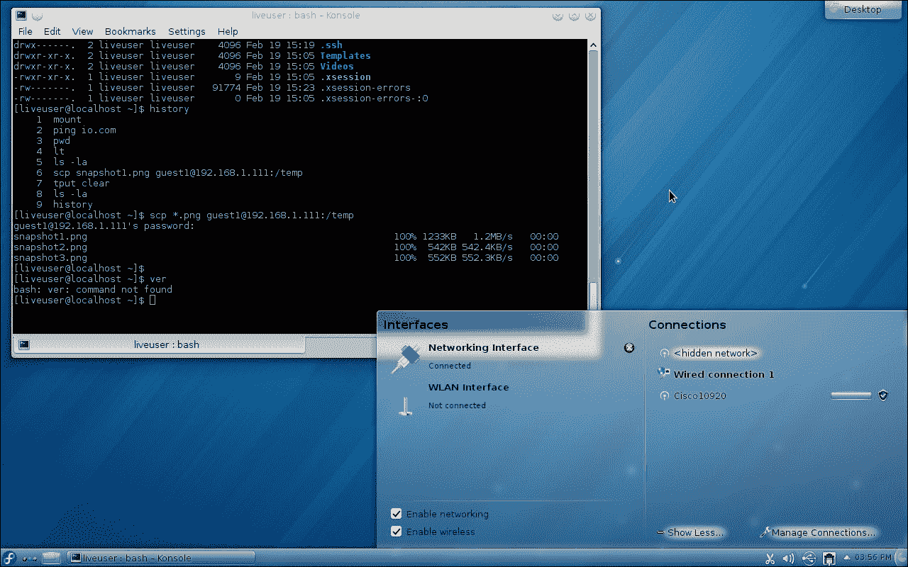
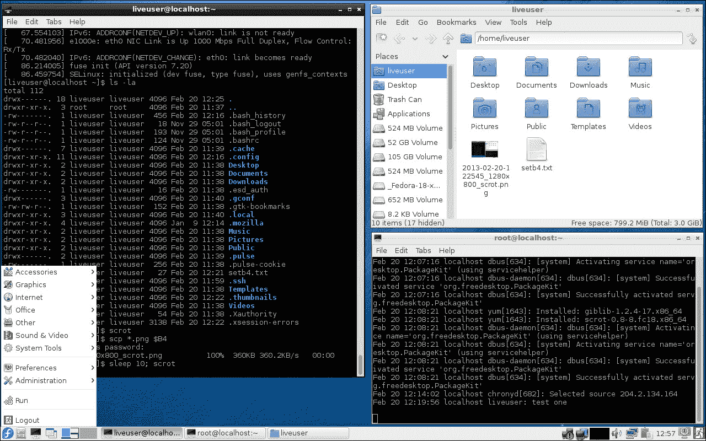
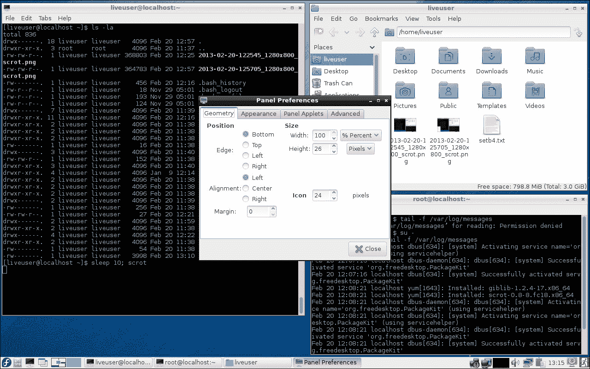
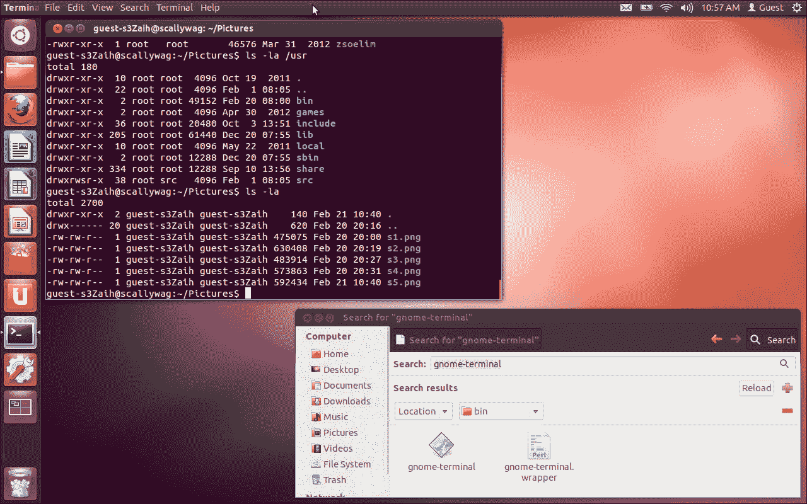

# 第二章。桌面

在本章中，我们将介绍这些桌面环境:

*   GNOME 2
*   KDE 桌面
*   xfce 你好
*   lxd 先生
*   一致
*   伙计

# 简介

电脑桌面通常由窗口、图标、目录/文件夹、工具栏和一些艺术品组成。窗口管理器处理用户看到的内容和执行的任务。桌面有时也被称为**图形用户界面** ( **图形用户界面**)。

有许多不同的桌面可供 Linux 系统使用。以下是一些更常见的概述。

# GNOME 2

**GNOME 2** 是主要由红帽公司开发的桌面环境和 GUI，提供了非常强大且常规的桌面界面。有一个快速访问应用程序的启动器菜单，还有任务栏(称为**面板**)。请注意，在大多数情况下，这些可以位于用户希望的屏幕上。

在 Fedora 14 上运行的 GNOME 2 截图如下:

这显示了桌面、命令窗口和**计算机**文件夹。顶部和底部“行”是面板。从顶部开始，从左侧开始，是**应用程序**、**位置**和**系统**菜单。然后我就有了屏保、火狐浏览器、终端、**进化**、和记事本。中间是锁屏应用，最右边是关于更新、音量控制、Wi-Fi 强度、电池电量、日期/时间和当前用户的通知。请注意，我已经定制了其中的几个，例如时钟。

## 做好准备

如果你有一台运行 GNOME 2 桌面的电脑，你可以继续阅读这一部分。一个很好的方法是运行一个实时映像，它可以从许多不同的 Linux 发行版中获得。

显示 **添加到面板**窗口的截图如下:

## 怎么做...

让我们稍微处理一下这个桌面:

1.  右键单击任务栏上的空白位置，打开该对话框。
2.  让我们添加一些很酷的东西。向下滚动，直到看到**天气报告**，点击，然后点击底部的**添加**按钮。
3.  在面板上，您现在应该会看到类似 **0 F** 的东西。右击它。
4.  这将弹出一个对话框，选择**首选项**。
5.  您现在在**常规**选项卡上。您可以随意在这里更改您想要的任何内容，然后选择**位置**选项卡，并输入您的信息。
6.  完成后，关闭对话框。在我的系统上，正确的信息立即显示出来。
7.  现在让我们添加一些更酷的东西。再次打开**添加到面板**对话框，这次添加**工作空间切换器**。
8.  工作区的默认数量是两个，我建议再增加两个。完成后，关闭对话框。
9.  现在，您将在屏幕右下方看到四个小方框。点击其中一个，你就会进入那个工作区。这是 GNOME 2 非常方便的特性。

## 还有更多...

我觉得 GNOME 2 非常直观，容易上手。它功能强大，可以广泛定制。然而，它确实有一些缺点。它往往有点“重”，在功能较弱的机器上可能表现不佳。它也不总是正确地报告错误。例如，使用 Firefox 打开系统中不存在的本地文件(即`file:///tmp/LinuxBook.doc`)。出现**文件未找到**对话框。现在尝试打开另一个确实存在但您没有权限的本地文件。它不报告错误，事实上似乎什么也没做。如果它发生在你身上，请记住这一点。

# KDE 桌面

**KDE** 台式机是为台式电脑和功能强大的笔记本电脑设计的。它允许广泛的定制，并在许多不同的平台上提供。以下是它的一些特性的描述。

## 做好准备

如果你有一台运行 KDE 桌面的 Linux 机器，你可以跟着做。这些截图来自运行在 Fedora 18 直播媒体图像上的 KDE。

最右侧的桌面图标允许用户访问**工具箱**:

您可以使用此对话框添加面板、小部件、活动、快捷方式、锁定屏幕以及添加更多内容。

底部的默认面板以软呢帽图标开始。该图标被称为**启动应用程序启动器** ，允许用户快速访问某些项目。这些包括**收藏夹**、**应用程序**、一个**计算机**文件夹、**最近使用的**文件夹和一个**离开**按钮。

如果您点击下一个图标，它将调出**活动管理器**。在这里，您可以创建活动并监控它们。下一个图标允许您选择当前处于前台的桌面，下一个项目是当前打开的窗口。最右边是**剪贴板**。

以下是剪贴板菜单截图:

接下来是音量控制、设备通知和网络状态。

以下是 **界面**和**连接**对话框截图:

最后，还有一个显示隐藏图标和时间的按钮。

## 怎么做...

让我们在这个桌面上添加一些东西:

1.  我们应该增加一个控制台。右键单击桌面上的空白区域。一个对话框会出现几个选项；选择 **Konsole** 。你现在应该有一个终端了。
2.  点击一些空白处关闭对话框。
3.  现在让我们再添加一些桌面。右键单击屏幕左下方的第三个图标。将出现一个对话框，点击**添加虚拟桌面**。我个人喜欢其中的四个。
4.  现在让我们在面板上添加一些东西。右键单击面板上的一些空白区域，将鼠标悬停在**面板选项**上；点击**添加小部件**。
5.  您将看到一些小部件。请注意，列表可以滚动查看更多内容。例如，滚动到**网络浏览器**并双击它。
6.  网页浏览器图标会在临近时间出现在面板上。

## 还有更多...

显然，您可以使用 KDE 桌面进行大量定制。我建议尝试所有不同的选择，看看你最喜欢哪一个。

KDE 实际上是一个开源开发者的大社区，KDE 等离子桌面就是其中的一部分。这款台式机可能是评论中最重的一款，但也是最强大的一款。我相信对于需要非常精致的桌面环境的人来说，这是一个不错的选择。

# xfce

**xfce** 是【Linux 和 UNIX 系统的另一个桌面环境。它倾向于非常清晰地运行，并且不使用那么多的系统资源。它非常直观，用户友好。

## 做好准备

以下是我用来写这本书的 Linux 机器上运行的 xfce 的截图:

如果你有一台运行 xfce 桌面的机器，你可以执行这些操作。我推荐 Fedora 网页上的实时媒体图像。

虽然与 GNOME 2 有些相似，但布局有些不同。从顶部的面板开始(**面板 1** )是**应用菜单**，接着是**注销**对话框。接下来是当前打开的窗口。根据当前状态，单击其中一个按钮会将其打开或最小化。下一项是**工作区**我有四个，然后是互联网状态。完整的列表是音量和混音器应用程序以及日期和时间。屏幕内容大多不言自明；我打开了三个终端窗口和**文件管理器**文件夹。

屏幕底部较小的面板称为 **面板 2** 。

## 怎么做...

让我们稍微处理一下面板:

1.  为了更换面板 2，我们必须先解锁。右键点击顶部面板，进入**面板** | **面板首选项**。
2.  Use the arrows to change to panel 2\. See the screenshot below:

    

3.  你可以看到它被锁住了。点击**锁定面板**解锁，然后关闭该对话框。
4.  现在转到面板 2(在底部)，右键单击其中一侧。点击**添加新项目...**。
5.  添加您想要的应用程序。

## 还有更多...

这绝不是 xfce 能做什么的详尽清单。这些功能是模块化的，可以根据需要添加。详见[http://www.xfce.org](http://www.xfce.org)。

# lxd

**LXDE** ( **轻量级 X11 桌面环境**)是为在低资源条件下工作良好而设计的，是一个相对较新的环境。与大多数其他桌面不同，LXDE 的组件没有太多依赖关系，可以独立运行。

## 做好准备

如果你有一台机器使用这个桌面，你可以跟着这个部分。

这是在 Fedora 18 的实时媒体图像上运行的 LXDE 的截图:

如您所见，有两个终端打开，文件管理器。从面板的左边开始是看起来很熟悉的软呢帽图标，它刚刚被点击过。它会调出下拉菜单，如图所示。下一个图标是文件管理器，然后是外部终端。

下一个图标显示“左键点击图标化所有窗口。点击鼠标中键为它们着色”。我选择保持这个图标不变。

接下来是两个桌面图标，然后是事件列表。再往右是无线图标(无线未激活)、有线以太网状态、系统监视器、音量控制和网络管理器小程序。之后是剪贴板管理器、时间、锁屏图标和注销框。

## 怎么做...

让我们稍微用一下这个桌面:

1.  右键单击面板的空白处，将显示一个下拉列表。
2.  Click on **Panel Settings**. The following screen will pop up:

    

3.  让我们改变字体大小。点击**外观**，然后**字体**下的**尺寸**。
4.  使用滚动键将值更改为其他值。变化会立即出现。看起来不错的时候，选择**关闭**。
5.  让我们添加一个应用程序。再次调出面板设置，点击**添加/删除面板项目**。
6.  点击**添加**，向下滚动点击**桌面号/工作区名称**。您当前所在工作区的名称显示在面板的最右侧。我个人非常喜欢这个功能。

## 还有更多...

我发现 LXDE 非常直观快速。我相信它会工作得很好，尤其是在笔记本电脑和移动设备上，因为它们的功耗很高。

# 统一

**Unity** 是的外壳接口，主要用于 Ubuntu 系统上的 GNOME 环境。它被设计成可以在小屏幕上很好地工作，例如，它采用了一个垂直应用切换器。与其他桌面/管理器不同，它本身不是可执行文件的集合，而是使用现有的应用程序。

## 做好准备

如果你有一台运行 Unity 桌面的机器，你可以跟随这一部分。

以下是运行在 Ubuntu 12.04 上的 Unity 的截图:

桌面上是一个 GNOME 终端会话和 **Home** 文件夹。从左侧的垂直面板开始是仪表板主页图标。它允许用户快速找到东西。下面是**主页**文件夹(已经打开)，然后是火狐浏览器。接下来的三个是自由办公室写手、计算器和 Impress。接下来是 Ubuntu 软件中心，用于搜索和购买应用程序。接下来的图标是 Ubuntu One、终端、系统设置、工作区切换器和废纸篓文件夹。

为了完成顶部面板的讨论，最右边是进化图标。接下来是电池状态图标、网络状态(有线和无线)和音量控制。其余图标是时间、切换用户帐户图标和注销按钮。

有趣的是，在这个客户桌面上，终端默认是不可用的。

## 怎么做...

让我们在这个桌面上添加一个终端:

1.  打开**首页**文件夹，然后点击**文件系统**。
2.  双击 **usr** 文件夹，然后双击 **bin** 文件夹。
3.  点击**搜索**打开该对话框。
4.  输入`gnome-terminal`并按*进入*。
5.  双击**侏儒终端**图标。
6.  它将在屏幕上打开，您也可以在左侧面板上看到它的图标。
7.  右键点击该图标，选择**锁定启动器**。你现在有一个终端图标。

Unity 上的顶部面板工作方式与其他桌面略有不同。尝试给定的步骤:

1.  打开**主页**文件夹。
2.  如果您还没有打开终端，请打开它。
3.  现在，点击**主页**文件夹中的某个地方。文本**主文件夹**将显示在面板上。
4.  现在点击**终端**。文本**终端**现在出现。面板上列出的菜单项始终对应于具有焦点的窗口或应用程序。

## 还有更多...

我发现 Unity 与其他台式机非常不同。起初这有点困难，但像其他事情一样，随着时间的推移，它会变得更好。我相信这款台式机会受到对 Linux/UNIX 系统没有太多经验的用户的欢迎。

# 交配

创建 **Mate** 桌面是为了给用户一个类似 GNOME 2 的更高效的环境。我目前使用 Mate 在我的笔记本电脑上运行 Fedora 19，它运行良好。请注意，我下载了 F19 安装光盘，并在安装过程中选择了 Mate。

## 开始

您可以使用 Fedora 网站上的实时图像或完整安装的 DVD 来执行这些步骤，无论您喜欢哪一种。

以下是 Fedora 19 上 Mate 的截图:

你可以看到我已经打开了两个终端。左上角是**应用**下拉菜单，可以浏览运行已安装的应用。下一个是**地点**，允许您访问文档、文件夹和网络地点。接下来是**系统**，可以更改桌面外观和行为，获取帮助，或者注销。图标是文件管理器 Caja，然后是终端。是的，Mate 的人足够聪明，默认包含一个。接下来的图标是火狐，一个邮件应用和一个信使应用。我添加了锁屏**图标**，在中间。右边是音量、无线条、电池状态和日期(我稍微定制了一下)。

左下角是一个图标，可以隐藏所有窗口并显示桌面。最后，最右边是四个工作区。

## 怎么做...

让我们在这个桌面上改变一些事情:

1.  首先我们来添加**锁屏** app。在顶部面板的中间单击鼠标右键。
2.  点击**添加到面板...**。
3.  点击**锁屏**并按照说明操作。关闭对话框。
4.  现在我们来看看时间和日期。左键点击它，你会注意到一个日历显示出来。
5.  再次左键点击时间和日期关闭日历，然后右键点击。点击**首选项**选项卡。
6.  应显示**时钟首选项**窗口。在这里，您可以更改时间和日期的显示方式。我点击了**显示秒**，因为我喜欢看完整的时间。
7.  关闭对话框。

## 还有更多...

如你所见， **Mate** 的工作原理很像 **GNOME 2** 。它非常直观，易于使用。设计师们在制作这个桌面时做得很好。