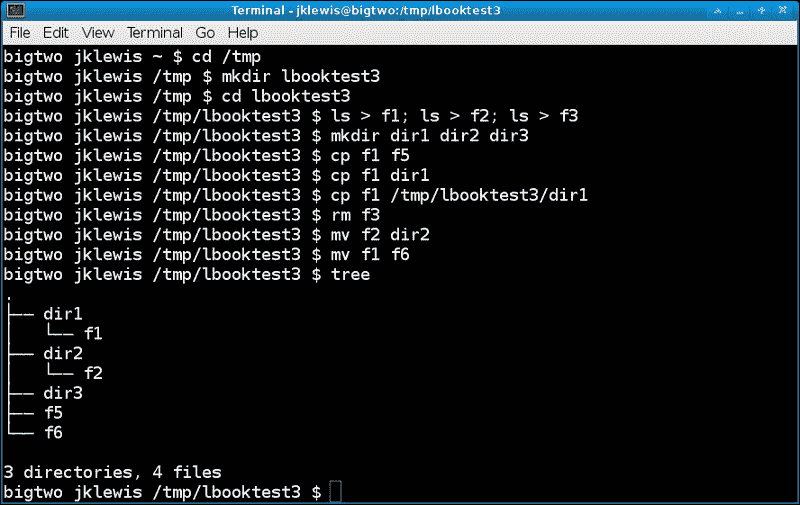

# 第三章。文件和目录

在本章中，我们将介绍:

*   复制、删除和更新文件和目录
*   使用查找和定位查找文件
*   创建文本文件–vim、Emacs 等
*   使用文件命令
*   使用 grep 查找模式
*   使用 ZIP 和 TAR 压缩文件
*   其他有用的命令，如 stat、sum、touch 等

# 简介

您可以将 Linux 文件系统中的所有内容视为字节流。这就是所谓的文件。目录也是包含其他文件的文件。大多数文件位于您计算机的硬盘上。但是，有些在内存中，例如，`/proc``/sys`实际上是虚拟文件系统。文件也可以存储在可移动媒体上，如通用串行总线设备、光盘和其他机器(即 NFS 挂载)。

## 了解索引节点和超级块

文件系统下的每个文件都有一个特殊的编号，称为**索引节点**。索引节点是操作系统存储文件属性的地方，包含以下信息:

*   文件类型，如常规、目录、特殊、链接、套接字、管道或块设备
*   所有者和组信息
*   文件的权限(详见[第 5 章](05.html "Chapter 5. Permissions, Access, and Security")、*权限、访问和安全*
*   文件创建的日期和时间，以及最后一次更改或读取的时间
*   文件大小
*   索引节点还包含一些其他信息

索引节点中不可用的东西是文件本身的完整路径和名称。该文件存储在拥有该文件的进程的**进程号** ( **进程号** ) 下的 `/proc`文件系统中。

超级块 是将文件系统上的所有索引节点联系在一起的东西。它包含管理文件所需的所有信息。对于系统来说非常重要的是，大多数 Linux 文件系统都有超级块的定期备份副本，同时还保留在内存中。

`dumpe2fs`命令可以用来显示超级块的内容。以下是在 Fedora 17 上拍摄的`dumpe2fs`截图:


这显示了这个硬盘上第一个分区的超级块信息。

# 复制、删除和更新文件和目录

在本节中，我们将简要探讨如何复制、删除和更新文件。

## 做好准备

已经写了几本关于文件系统管理的书，所以这只是一个简单的概述。如果你有一台 Linux 机器，你可以试试这些命令。我们将在`/tmp` 文件系统中做所有的事情，所以您不必担心在您的系统上搞砸任何事情。

## 怎么做...

下面是方法给创建一些文件和目录:

1.  转到`/tmp`目录:

    ```sh
    cd /tmp

    ```

2.  制作测试目录:

    ```sh
    mkdir lbooktest3

    ```

3.  转到目录:

    ```sh
    cd lbooktest3

    ```

4.  让我们创建一些文件:

    ```sh
    ls > f1; ls > f2; ls > f3

    ```

5.  另外，创建一些目录:

    ```sh
    mkdir dir1 dir2 dir3

    ```

6.  复制的语法是`cp source-file destination-file`，所以现在运行`cp f1 f5`。这将创建文件`f5`，它是文件`f1`的副本。
7.  可以复制到目录:

    ```sh
    cp f1 dir1

    ```

8.  上面是一个相对路径，因为它从当前目录开始。要使用绝对路径，请执行以下操作:

    ```sh
    cp f1 /tmp/lbooktest3/dir1

    ```

9.  现在让我们从当前目录中删除文件【T0:

    ```sh
    rm f3

    ```

10.  我们把文件`f2`移到`dir2` :

    ```sh
    mv f2 dir2

    ```

11.  `mv`命令也用于重命名文件。将`f1`更名为`f6` :

    ```sh
    mv f1 f6

    ```

12.  要查看该目录的文本模式图形表示，请运行以下命令:

    ```sh
    tree

    ```

13.  可以选择清理我们刚刚做的一切，`cd /tmp`然后运行:

    ```sh
    rm -r lbooktest3

    ```

以下是上述命令的屏幕截图:



## 还有更多...

一个文件可以从你电脑上的另一个位置复制到当前目录。这是使用点运算符执行的:

```sh
 cp /tmp/somefile 

```

你不必先`cd`到一个目录。您可以执行类似以下命令的操作:

```sh
 cp /bin/bash /tmp

```

这非常方便，尤其是在配置机器时。

那么，如果您将一个文件复制到一个已经存在的文件中会发生什么呢？假设您有适当的权限，复制的文件会覆盖另一个文件。此外，使用`rm`时要小心，因为在 Linux 系统上很难恢复被删除的文件。

# 使用查找和定位查找文件

`find`命令通常用于从当前目录开始搜索文件。`locate`命令使用`updatedb`数据库来查找整个系统上的文件或目录(除了一些例外)。

## 怎么做...

让我们使用`find`和`locate` 到寻找一些常见的 Linux 文件:

1.  首先将目录更改为`/usr` :

    ```sh
    cd /usr

    ```

2.  运行以下命令:

    ```sh
    find -name bash

    ```

3.  现在使用通配符来尝试一下:

    ```sh
    find -name bash*

    ```

4.  它还会找到目录:

    ```sh
    find -name bin

    ```

现在假设我们想让寻找一个文件，但是不知道它可能在系统上的什么地方。`find`命令有时也很慢，因为它必须从当前点开始搜索文件系统。这里是`locate`真正派上用场的地方。

1.  对于此示例，您可以在任何目录中。运行以下命令:

    ```sh
    locate gnome-terminal

    ```

2.  现在尝试命令:

    ```sh
    locate vim

    ```

3.  看看这有多快？现在试试:

    ```sh
    locate ifconfig

    ```

4.  要忽略案例，请执行:

    ```sh
    locate -i sudo

    ```

## 还有更多...

`find`命令有 100 多个参数；有关更多信息，请参考手册页。

`locate`命令使用数据库存储文件的位置。该数据库通常由 cron 作业每天晚上自动重新创建。如果要刷新数据库，立即运行`updatedb`命令。请注意，在大型文件系统和/或速度较慢的计算机上，这可能需要一段时间。

# 创建文本文件–vim、Emacs 等

大多数用户可能都熟悉基于图形用户界面的文字处理程序。比如我在用《图书馆员》写这本书。但是，您也可以使用命令行编辑文件。我们有些人甚至更喜欢它。

## 做好准备

假设读者可以访问一台带有文本编辑器的 Linux 机器。我们将从 **vim** 开始，这是一个在每个 Linux/Unix 系统上都可用的文本编辑器。如果系统上没有 **Emacs** ，请尝试用`yum install emacs`或`apt-get install emacs`安装。

## 怎么做...

以下是使用`vi`命令创建和编辑文本文件的方法:

1.  我们去`tmp`目录。运行以下命令:

    ```sh
    cd /tmp

    ```

2.  现在运行:

    ```sh
    vim lbookfile1.txt

    ```

3.  你的终端应该已经通过了 vim。Vim 是无模式的，所以总是要被告知处于什么模式。按下 *A* 键。
4.  Vim 现在应该处于插入模式。您可能会在屏幕底部看到类似`-- INSERT --`的内容。现在输入一些字符。
5.  正常的光标控制键应该是功能性的。编辑完成后，按下*键退出插入模式。*
6.  要进入命令模式，请按冒号键，然后按任意字母。例如，要保存文件，请键入`:w`。
7.  要保存文件并退出 vim，请按 *Esc* ，然后键入`:wq`。

以下是 vim 编辑一个 Java 文件的截图:


现在让我们来看看 Emacs 编辑器:

1.  转到`/tmp`目录:

    ```sh
    cd /tmp

    ```

2.  要在文本模式下启动 Emacs，运行:

    ```sh
     emacs -nw lbooktest3.txt

    ```

3.  它将在编辑模式下启动。键入几行
4.  保存文件，先按 *Ctrl* + *C* ，再按 *Ctrl* + *S* 。
5.  标准光标键应该能让你在屏幕上移动；试试看。
6.  按 *Ctrl* + *H* + *？*调出**帮助**窗口。
7.  要返回原屏幕，请按 *Ctrl* + *X* + *1* 。
8.  要关闭 Emacs 会话，请按 *Ctrl* + *X* ，然后按 *Ctrl* + *C* 。

以下是 Emacs 编辑 Java 文件的截图:


## 还有更多...

Vim 和 Emacs 是非常强大的编辑器。它们最常用于编写代码的程序员和维护 shell 脚本的系统管理员。要获得更多信息，请查阅手册和/或信息页面，或他们的网站。

另外，这里有一张我亲手写的文字编辑的照片:


这是大约 20 年前在 DOS 下用 C 语言写的。我现在已经在 20 多个不同的平台上编译和运行了它。

# 使用文件命令

我们上面谈到了文本文件。一般来说，人类可以相当容易地阅读和编辑文本文件。二进制文件不同，它是(松散地)计算机“读取”的内容。例如，当您运行诸如`vim filename1.txt`的命令时，vim 是一个二进制文件，`filename1.txt`是一个文本文件。

## 怎么做...

以下是运行 Linux `file`命令的示例:

1.  照常将目录更改为【T0:

    ```sh
    cd /tmp

    ```

2.  让我们创建一个文本文件:

    ```sh
    ls > temp1.txt

    ```

3.  是什么样的文件？运行以下命令:

    ```sh
    file temp1.txt

    ```

4.  如您所见，`file`命令可以告诉我们某物是什么样的文件。
5.  现在运行以下命令:

    ```sh
    file /bin/bash

    ```

6.  所有这些信息意味着它是一个二进制文件。它还显示了 bash 是为什么平台编写的，以及一些其他信息。
7.  尝试在系统上的不同文件上运行文件，以了解外面有什么。

### 类型

您必须拥有运行`file`命令的适当权限，因为它必须对文件执行打开操作。

## 还有更多...

我们提到了编辑文本文件。如果你真的知道自己在做什么，二进制文件也可以编辑。这在低级工作中有时是需要的，例如在处理设备驱动程序时。一个二进制编辑器可能看起来像下面的截图:


### 类型

**哦不，我已经编辑了一个文件，但是现在无法保存！**

有时，你可能会陷入似乎无望的文本编辑境地。您已经花了一些时间更改文件，但现在无法保存。该错误通常类似于“权限被拒绝”。通常有两件事会导致这种情况；您不能写入文件所在的目录，或者文件已经存在，但没有适当的可写权限。如果程序允许的话，保存你的工作的最好方法就是简单地把文件写在别的地方，比如`/tmp`里。

这是一个相当简单的例子，但它传达了这个想法。我希望我第一次遇到这种情况时就已经知道了。

## 怎么做...

出现权限错误时，以下是保存文件的方法:

1.  作为普通用户(非超级用户)进入`/usr`目录:

    ```sh
    cd /usr

    ```

2.  现在运行以下命令:

    ```sh
    vim lbookfake1.txt

    ```

3.  它应该正常打开一个空文件。按下 *A* ，然后输入一些文字。
4.  现在按下*键*，输入`:w`。
5.  应该显示写错误，所以保存文件到`/tmp` :

    ```sh
    :w /tmp/lbookfake1.txt

    ```

6.  那应该会成功。然后你可以采取措施来纠正真正的问题(也就是说，不要在你不应该编辑的地方编辑文件！).

# 用 grep 寻找模式

在处理文件时，能够在文本中搜索模式是方便的。例如，这通常用于代码开发。这里我们展示如何使用 **grep** 。

## 做好准备

在这个例子中，我们将使用`dmesg`程序，该程序显示运行内核的信息。如果它不可用，或者如果您的计算机已经运行了很长时间，以下内容可能在您的系统上不太匹配。

## 怎么做...

下面是使用`grep`的一个例子:

1.  运行以下命令:

    ```sh
    cd /tmp

    ```

2.  使用`dmesg`创建一个文件，这样我们就可以搜索一些关于你的系统的信息:

    ```sh
    dmesg > dmesg1.txt

    ```

3.  让我们看看能否确定使用的是什么网络设备。运行:

    ```sh
    grep network dmesg1.txt

    ```

4.  输出可能信息量不是很大。但是如果案件是一个问题呢？尝试以下命令:

    ```sh
    grep -i network dmesg1.txt

    ```

5.  `-i`告诉`grep`忽略案例。现在，您应该看到您的系统正在使用哪个网络驱动程序。现在尝试以下命令:

    ```sh
    grep -i cdrom dmesg1.txt

    ```

6.  `grep`根据搜索结果返回代码。再次运行上面的命令(还记得上箭头快捷方式吗？):

    ```sh
    grep -i cdrom dmesg1.txt

    ```

7.  现在运行以下命令:

    ```sh
    echo $?

    ```

8.  假设找到了文本，返回代码将是`0`。现在搜索一个不应该存在的字符串:

    ```sh
    grep -i jimlewis dmesg1.txt

    ```

9.  运行以下命令:

    ```sh
    echo $?

    ```

10.  The return code should not be `0`.

    ### 类型

    这可能看起来有点倒退，零代表成功，非零代表失败。这在许多 Linux 命令中很常见，因为在许多情况下返回的数字是一个错误代码。

## 还有更多...

`grep`程序可以用多种不同的方式进行大量的搜索。您也可以指定非常复杂的模式。有关更多信息，请参考手册页。此外，我们将在[第 8 章](08.html "Chapter 8. Working with Scripts")、*使用脚本*中再次访问`grep`的返回代码。

# 使用 ZIP 和 TAR 压缩文件

众所周知，一个 Linux 系统有很多文件。一个典型的代码开发项目可能有 1000 多个文件，分布在几个目录中。我们要怎么备份这些东西？

答案是文件打包和压缩。这里我们将展示两个最爱， **ZIP** 和 **TAR** 。

## 做好准备

大多数 Linux 系统都有 ZIP 和 TAR，所以会假设它们已经在你的系统上可用。

## 怎么做...

这里我们将使用`zip`和`unzip`命令进行实验:

1.  运行以下命令:

    ```sh
    cd /tmp

    ```

2.  让我们创建一个临时目录:

    ```sh
    mkdir lbooktemp

    ```

3.  运行以下命令:

    ```sh
    cd lbooktemp

    ```

4.  现在让我们创建一些文件:

    ```sh
    ls > f1.txt; route > f2.txt; dmesg > f3.txt

    ```

5.  然后，再创建一些文件:

    ```sh
    ifconfig > ifconfig.dat; dmesg > dmesg.dat

    ```

6.  让我们把前几个打包压缩成一个文件:

    ```sh
    zip lbook1.zip f1.txt f2.txt f3.txt

    ```

7.  如您所见，zip 的语法是“zip 压缩文件到 ZIP 文件”。我们也可以使用上面的通配符:

    ```sh
    zip lbook1.zip *.txt

    ```

8.  现在让我们包括其他人:

    ```sh
    zip lbook1.zip *.txt *.dat

    ```

9.  解压缩程序用于从压缩文件(也称为档案)中提取文件。使用以下命令创建另一个目录:

    ```sh
    mkdir test

    ```

10.  运行以下命令:

    ```sh
    cp lbook1.zip test

    ```

11.  运行以下命令:

    ```sh
    cd test

    ```

12.  现在解压文件:

    ```sh
    unzip lbook1.zip

    ```

13.  执行`ls -la`命令。你应该像以前一样看文件。
14.  您也可以通过运行以下命令来查看 ZIP 文件的内容，而无需提取任何内容:

    ```sh
    unzip -l zipped-file

    ```

当只有几个文件时，或者当我将它们发送给运行非 Linux 操作系统的人时，我会使用 ZIP。虽然 ZIP 可以用来跨目录，但它通常不能很好地处理一些 Linux 文件。焦油是更好的选择:

1.  我们可以使用和以前相同的文件:CD/tmp/lbooktep
2.  运行`tar cvzf lbook1.tar.gz *.txt`。这将创建一个 gzip 压缩存档文件。
3.  现在跑`file lbook1.tar.gz`。它应该显示类似于下面的输出:

    ```sh
    lbook1.tar.gz: POSIX tar archive (GNU)

    ```

4.  要提取，首先将其复制到测试目录:

    ```sh
    cp lbook1.tar.gz test

    ```

5.  运行以下命令:

    ```sh
    cd test

    ```

6.  运行以下命令:

    ```sh
    tar xvzf lbook1.tar.gz

    ```

7.  执行`ls -la`命令。你应该再看看那些文件。
8.  要查看 tar 档案，请使用`t`(用于讲述)选项:

    ```sh
    tar tvzf lbook1.tar.gz

    ```

9.  现在让我们开始整个目录:

    ```sh
    cd /tmp

    ```

10.  运行以下命令:

    ```sh
    tar cvzf lbooktemp1.tar.gz lbooktemp

    ```

11.  这将获得整个目录，甚至隐藏的文件，如果有的话。

以下是`zip`命令的截图:


## 还有更多...

ZIP 和 TAR 在系统管理中经常被用来备份一切。需要注意的是，“标记”一个系统，将该文件复制到另一台机器上，并“清除”该文件是克隆一个盒子的好方法(我一直都在使用这种方法)。

稍后，当我们在[第 9 章](09.html "Chapter 9. Automating Tasks Using Cron")、*中讨论使用 Cron* 自动化任务时，我将展示我如何每天晚上使用 TAR 备份我的系统。

# 其他有用的命令，如 stat、sum、touch 等

Linux 中有更多的命令可以用来处理文件。在本节中，我将展示如何使用其中的一些。

## 怎么做...

以下是我发现自己一直在使用的一些命令:

1.  运行以下命令:

    ```sh
    cd /tmp

    ```

2.  创建文件:

    ```sh
    dmesg > file1.txt

    ```

3.  现在运行`ls -la`并记住信息。我们以后会用到这个。
4.  使用`stat`命令查看您想要了解的关于文件的几乎所有内容:

    ```sh
    stat file1.txt

    ```

5.  现在假设您已经将该文件发送给了运行 Linux 系统的某个人，并希望确保该文件在发送过程中没有被损坏。运行以下命令:

    ```sh
    sum file1.txt

    ```

6.  The first number is the checksum and the second is the number of blocks for that file. If the other person runs `sum` on his copy of the file and sees the same info, the files are the same.

    ### 类型

    文件名不必匹配。

7.  我们使用重定向操作符创建了很多文件。也可以使用触摸命令:

    ```sh
    touch file2.txt

    ```

8.  由于`file2.txt`不存在，触摸会将其创建为空文件。其实我们来证明一下:

    ```sh
    file file2.txt

    ```

9.  那么，如果我们对现有文件运行 touch 会发生什么呢？它倒空了吗？不，它会更新上面的时间和日期。运行以下命令:

    ```sh
    ls -la file1.txt

    ```

10.  现在运行以下命令:

    ```sh
    touch file1.txt

    ```

11.  再次运行`ls -la`。您应该注意到它现在显示了该文件的当前日期和时间。
12.  假设您只想查看一个文本文件。运行以下命令:

    ```sh
    less file1.txt

    ```

13.  使用`less`命令时，按空格键向下滚动。按*问*退出。
14.  假设我们只想看到该文件的前几行:

    ```sh
    head file1.txt

    ```

15.  `head`命令默认显示前 10 行。最后 10 行怎么样？运行以下命令:

    ```sh
    tail file1.txt

    ```

## 还有更多...

正如我之前说过的，还有很多很多处理文件的命令。而且，在我提到的命令中，我只触及了它们能做什么的表面。与往常一样，请查阅手册页了解更多信息。