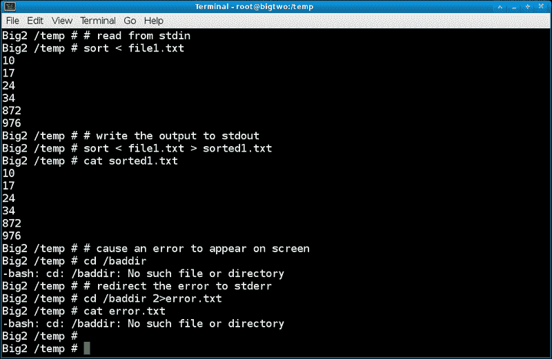
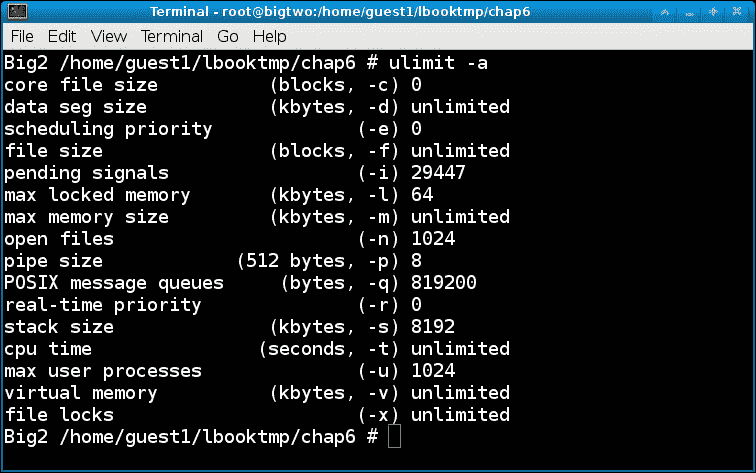

# 第六章。处理

在本章中，我们将涵盖以下主题:

*   理解过程
*   用 ps 检查流程
*   使用 top 检查流程
*   用 nice 改变优先级
*   使用/proc 文件系统观察进程

# 简介

Linux 中运行的所有程序都是进程。在本章中，您将学习如何使用 ps 和 top 查看它们的状态，如何设置它们运行的优先级，以及如何使用/proc 文件系统查看进程的内部。

# 理解过程

每个流程都有一个唯一的标识符，称为 **流程标识符** ( **PID** )。此外，每个流程都有一个**父流程标识符** ( **PPID** ) 。有一个例外，`init`(或`systemd`)。`init`进程启动所有其他进程，PID 为 1。这个过程是特殊的，因为它不能被杀死(任何这样做的尝试通常都是致命的)。

与文件类似，一个进程也有访问权限。这些被称为真实用户和组标识。通过不允许非特权用户访问关键的操作系统任务，这提供了一定程度的保护。内存、打开的文件和其他资源归进程所有，并且与其他进程分开(在大多数情况下)。

从用户的角度来看，进程通常从命令行或桌面启动。以用`vi`编辑文件为例。用户启动会话并与编辑器交互工作。他可以保存文件或编辑另一个文件。只要会话处于活动状态，就会有与之关联的 PID。当用户终止`vi`时，PID 和所有相关资源也终止。该 PID 将被回收，稍后由操作系统再次使用。这样运行的程序称为前台进程。

进程也可以在后台运行。例如在[第 4 章](04.html "Chapter 4. Networking and the Internet")、*联网和互联网*中，我们用`firefox &`命令运行浏览器。“与”符号将进程置于后台，释放该终端用于更多的输入/输出。请注意，来自应用程序(本例中为 Firefox)的消息仍将输出到该终端。这在调试时非常有用。还要注意，在后台运行的进程往往比前台任务的优先级低(稍后会更关注优先级)。在过去，后台进程通常也被称为作业。

每个进程都有一些特殊的文件句柄:

*   **标准输入** ( `stdin`):一个流程从这里开始正常输入(手柄 0)
*   **标准输出** ( `stdout`):一个进程将其正常输出写到这里(手柄 1)
*   **标准错误** ( `stderr`):一个进程将其错误输出写到这里(句柄 2)

以下是显示标准手柄的屏幕截图:



由进程打开的其他文件从句柄 3 开始。有些进程被赋予了特殊的名称。例如，Linux 系统上的许多进程都是在后台运行的，并且在大多数情况下，从来不打算从命令行运行。这些被称为服务或守护进程。超文本传输协议守护进程 ( **HTTPD)** 网络进程就是一个很好的服务例子。

通常，服务会等待一个或多个事件发生，执行一个或多个操作，然后再次返回等待状态。如果一个服务记录任何活动，它通常会记录到`/var/log/<service-name>`目录。

### 注

如果启动后台作业的终端被终止，后台作业也将结束。一些 Linux 发行版会试图警告用户这种情况。

## 怎么做…

以下是可以用来查看进程的命令的简短列表:

*   要查看系统上当前运行的进程的快照:

    ```sh
    ps auxw

    ```

*   查看实时运行中的流程:

    ```sh
    top

    ```

*   要查看所有类型的进程目录:

    ```sh
    ls /proc

    ```

## 还有更多...

一个过程可以衍生出其他过程。它还可以剥离螺纹。线程继承父线程的所有句柄和资源。它一般在编程中用来在主任务运行的同时并发执行一个小任务，并快速返回。

资源有限制吗？是的。`ulimit`命令用于查看和设置过程的硬限制和软限制。用户通常不需要；不过，如果你好奇，可以在你的系统上运行`ulimit -a`。您应该会看到类似以下截图的输出:



有关`ulimit`的更多信息，请参考手册页。

# 用 ps 检查流程

`ps`程序允许用户查看系统上运行的进程的快照。通过使用适当的参数，可以改变输出以包含更多或更少的信息。对于本节，我们将作为根运行，并使用 BSD 风格`ps`。选项可以分组，并且不使用破折号。

## 怎么做...

执行以下步骤运行`ps`:

1.  在没有参数的情况下运行`ps`会产生如下输出:

    ```sh
     Big4 /temp/linuxbook/chap6 # ps
     PID TTY          TIME CMD
     5197 pts/25   00:00:00 su
     5218 pts/25   00:00:00 bash
     17789 pts/25   00:00:00 ps

    ```

2.  因为这不是很有信息量，让我们展示每个有 TTY 的过程:

    ```sh
    ps a

    ```

3.  现在，包括没有 TTY 的过程:

    ```sh
    ps ax

    ```

4.  以更面向用户的格式显示输出:`ps aux`。注意标题的变化。
5.  如果线路在系统末端被切断，使用以下命令添加宽选项:

    ```sh
    ps auxw

    ```

6.  确实有很多产出。下面是一些处理的思路:

    ```sh
    ps auxw | more

    ```

7.  您也可以将输出重定向到文件:`ps auxw > ps-output.txt`，然后使用`more`或`vi`查看。
8.  您也可以使用`grep`查找特定的流程标识。在另一个终端中，运行以下命令:

    ```sh
    vi file1.txt

    ```

9.  现在回到您原来的终端，运行以下命令:

    ```sh
    ps auxw | grep file1.txt

    ```

10.  你应该会看到一行文字`vi file1.txt`。这就是你要找的 PID，也是`ps`最常见的用途之一。
11.  您还可以显示流程的树形视图:

    ```sh
    pstree

    ```

## 它是如何工作的...

`ps` 命令从`/proc`文件系统获取信息。每个运行进程在这里都有一个关联的条目。我们将在本章后面更详细地讨论`/proc`。

## 还有更多...

BSD 样式标题看起来如下所示:

```sh
USER       PID %CPU %MEM    VSZ   RSS TTY      STAT START   TIME COMMAND

```

每个术语的定义如下:

*   `USER`:是流程的所有者
*   `PID`:是流程标识
*   `%CPU`:它给出了 CPU 时间除以进程运行的时间
*   `%MEM`:给出进程内存与物理内存的比例
*   `VSZ`:包含进程的虚拟内存大小
*   `RSS`:包含真实内存驻留集大小
*   `TTY`:表示与该流程关联的终端
*   `STAT`:表示流程状态
*   `START`:给出流程开始的时间
*   `TIME`:给出总的 CPU 时间
*   `COMMAND`:是命令的名字

`ps`命令还有很多其他选项。您可以查看线程，获取安全(`SELinux`)信息，收紧用户名显示的内容，并更改输出格式。你甚至可以修改一些环境变量来改变`ps`的工作方式。有关更多信息，请参见手册页。

下面的截图展示了`ps - auxw`在我的 Fedora 17 系统上的样子:


# 使用 top 检查流程

`top`程序除了实时显示系统状态外，与`ps`类似。您可以使用命令行开关和/或其交互界面来控制它的操作方式。它也可以使用配置文件。你可以用`top`做很多事情。以下是一些可能的例子。

## 做好准备

不需要特殊的设置。这些命令将以 root 用户身份运行。

要获得`top`的帮助，可以运行以下命令行:

```sh
 top -h or -v

```

这些是等效的，并显示了库版本和用法。

`top`的一般语法如下:

```sh
 top -bcHisS -d delay -n iterations -p pid [,pid...]

```

以下是在 Fedora 17 上运行的`top`的截图:


## 怎么做...

以下是使用命令行开关的一些示例:

1.  每 2 秒更新一次屏幕:

    ```sh
    top -d 2

    ```

2.  每半秒更新一次屏幕:

    ```sh
    top -d 0.5

    ```

3.  更新 10 次后退出:

    ```sh
    top -n 10

    ```

4.  两者都要做:

    ```sh
    top -d 0.5 -n 10

    ```

5.  要立即更新屏幕，按空格键或*进入*。
6.  要监控特定的 PID，使用`-p`选项。这将显示`init`(或`systemd`)流程:

    ```sh
    top -p 1

    ```

7.  让我们监控几个过程。首先，运行`ps auxw`并记住四个过程的 PIDs。
8.  然后运行`top`，替换之前获得的 PIDs:

    ```sh
    top -p pid1,pid2,pid3,pid4

    ```

9.  要省略显示空闲进程，请运行以下命令:

    ```sh
    top -i

    ```

10.  要显示线程，运行`top -H`。只监控某个用户的进程，语法为`top -u <username>`。用根试试:

    ```sh
    top -u root

    ```

11.  您可以在批处理模式下运行`top`。例如，将输出保存到文件中:

    ```sh
    top -b -n 10 > top1.txt

    ```

以下是一些使用交互命令的例子。开始`top` 并跟随:

1.  要仅显示特定用户(本例中为 root)拥有的进程，请按`U`，然后输入`root`。
2.  要更改延迟时间，请按`D`，然后通过按 *D* 然后按 *1* 输入时间。
3.  要显示多核机器上的所有 CPU，请按下 *1* (再次按下 *1* 切换回来)。
4.  要切换命令行和程序名的显示，请按 *C* 。
5.  要更改流程的良好设置，请按 *R* ，然后输入所需的优先级。
6.  要激活安全模式，请按 *S* (参见后面解释的安全模式)。
7.  要向流程发送信号，按 *K* 然后输入要发送的信号。在执行此操作之前，请确保您有正确的 PID 和信号。
8.  要写入配置文件，请按`W`。这将在用户的主目录中创建文件`.toprc`，并将在下次启动`top`时使用其中的设置。
9.  要显示帮助屏幕，请按 *H* 。
10.  要退出顶部，请按 *Q* 。

## 它是如何工作的...

以下是上一张截图中前五行的描述:

*   `top`:包含时间、机器正常运行时间、用户数、平均负载
*   `Tasks`:给出任务总数、当前运行数、休眠数、停止数、僵尸数
*   `Cpu(s)`:不同类型的 CPU 状态如下:
    *   **us** :代表用户时间
    *   **sy** :代表系统时间
    *   **ni** :代表美好的时光
    *   **id** :表示空闲时间
    *   **wa** :代表输入输出等待时间
    *   **hi** :给出了服务硬件中断所花费的时间
    *   **si** :给出了服务软件中断所花费的时间
    *   **st** :代表被盗 CPU 时间
*   `Mem`:给出机器内存总量；KBs 中的已用、空闲和缓冲区
*   `Swap`:给出总的交换空间；已用、免费和缓存在 KBs 中

以下是标准标题的定义。请注意，这些可以根据命令行选项或交互式命令进行更改:

*   `PID`:定义流程标识
*   `USER`:保存该任务所有者的用户名
*   `PR`:持有该任务的优先级
*   `NI`:由 nice 值组成(下一节重点介绍)
*   `VIRT`:显示该任务使用的虚拟内存总量
*   `RES`:给出该任务使用的物理内存
*   `SHR`:给出该任务使用的共享内存
*   `S`:代表流程状态，为以下状态之一:
    *   **S** :代表睡觉
    *   **D** :表示不间断睡眠
    *   **R** :显示流程正在运行(或准备运行)
    *   **T** :表示过程已被追溯或停止
    *   **Z** :表示僵尸状态
*   `%CPU`:它给出了自上次更新以来经过的 CPU 时间的份额，用百分比表示
*   `%MEM`:它保存可用物理内存的当前使用份额，以百分比表示
*   `TIME+`:给出该任务开始运行以来使用的总 CPU 时间
*   `COMMAND`:是用来启动这个任务的命令

## 还有更多...

除了用户配置文件，还可以有一个全局文件。它被命名为`/etc/toprc`，仅由下面给出的两行组成:

```sh
S # Line 1: secure mode switch
2.0 # Line 2: delay in seconds

```

该文件由根用户手动创建。如果该文件存在，它将激活安全模式并改变`top`的操作方式:

*   将显示不同版本的帮助屏幕
*   用户不能终止任务
*   用户不能修改任务
*   用户不能更改`top`的延迟间隔

如果`top`没有像您预期的那样工作，请检查用户和根用户的配置文件是否存在。你可以用`top`做很多其他的事情。您可以更改字段的排列和排序方式。您可以更改颜色和高亮显示。还有一个多窗口选项。更多信息，请参见`top`手册页。

以下是我的 Fedora 17 系统上`top`的截图:


# 用 nice 改变优先级

`nice`命令允许您调整进程运行的优先级。现代操作系统通常在任务调度方面做得很好。然而，一个特定的过程有时可能需要一些调整。在这里，我们将展示如何使用`nice`。

优先级被称为精确级别。一个过程的精细程度从最不令人满意的 19 到最令人满意的-20(如果你觉得这是倒退的话，我也觉得是这样)。

最有利的 _____________ 最不利的

20 __________________________________19

最高优先级 ___________________ 最低优先级

你可以从`top`的上一节中回忆起的 NI 专栏。这是最好的设置，在 Fedora 上，一些服务运行在最有利的设置-20。

请注意，更改进程的精确设置并不能保证操作系统会遵守它。这只是给调度者的一个建议。

还要注意，给 nice 的命令不能是内置命令。

`nice`的语法如下:

```sh
 nice [Option]... [Command [Arg] ...]

```

## 怎么做...

现在，让我们运行几个`nice`命令:

1.  要查看当前 nice 值，请自行运行 nice:

    ```sh
    nice 

    ```

2.  现在运行良好:

    ```sh
    nice nice

    ```

3.  看到输出 10 了吗？如果没有给出，这是默认的调整。
4.  现在将其设置为最大值:

    ```sh
    nice -n -20 nice

    ```

5.  最小值:

    ```sh
    nice -n 19 nice

    ```

6.  现在让我们试试别的。在另一个终端中，运行以下命令:

    ```sh
    nice -n 15 vi testfile.txt

    ```

7.  然后找到它的 PID:

    ```sh
    ps auxw | grep testfile.txt

    ```

8.  现在在之前的 PID 上运行【T0:

    ```sh
    top -p <pid>

    ```

9.  好的列应该显示 15 的精度。

以下是显示在 Fedora 17 上运行的`nice`的截图:


## 还有更多...

不像大多数其他的 Linux 程序，没有什么比这更好的了。如果你试图将其设置在最大值 20 以上，它仍将使用 20，如果你试图将其设置在最小值-19 以下，它将使用-19。此外，`top`程序允许您动态调整流程的精确程度。

# 使用/proc 文件系统观察进程

`/proc`文件系统是 Linux 存储与当前运行的进程相关的数据的地方。在大多数情况下，普通用户可能永远不需要知道这些信息。然而，在调试过程中，或者如果您只是想了解 Linux 的一些内部情况，它确实会很有帮助。

## 怎么做...

以下步骤说明如何查看`/proc`中包含的信息:

1.  让我们以根运行的方式在`/proc`中尝试一个实验:

    ```sh
    file uptime

    ```

2.  显示`uptime: empty`，对吗？所以如果我们猫它，应该没有理想的输出，对不对？试试看:

    ```sh
    cat uptime

    ```

3.  哇，那是怎么回事？`/proc`中的文件是特殊的，因为信息是实时读出的。让我们再试一次，运行以下命令:

    ```sh
    cat interrupts

    ```

4.  现在运行`cat version`和`cat meminfo`。
5.  在另一个会话中，运行以下命令:

    ```sh
    vi test5.txt

    ```

6.  让我们找到它的 PID:

    ```sh
    ps auxw | grep “vi test5.txt”

    ```

7.  在`/proc` : `cd /proc/<pid-from-above>`中切换到该目录。
8.  现在将目录更改为**文件描述符** ( **FD** ) 目录:

    ```sh
    cd fd

    ```

9.  运行`ls -la`命令。您应该会看到如下输出:

    ```sh
    Big2 /proc/20879/fd # ls –la.
     total 0
     dr-x------. 2 root root  0 Apr 11 16:27 .
     dr-xr-xr-x. 8 root root  0 Apr 11 16:27 ..
     lrwx------. 1 root root 64 Apr 11 16:27 0 -> /dev/pts/10
     lrwx------. 1 root root 64 Apr 11 16:27 1 -> /dev/pts/10
     lrwx------. 1 root root 64 Apr 11 16:27 2 -> /dev/pts/10
     lrwx------. 1 root root 64 Apr 11 16:27 4 -> /tmp/.test5.txt.swp

    ```

可以看到这确实是我们`vi`编辑`test5.txt`文件的会话。请注意，显示的文件是由`vi`创建的临时文件，在执行过程中保持打开状态。

## 还有更多...

以下截图显示了 Fedora 17 系统上的`/proc`目录列表:


那么这一切意味着什么呢？正如你可能已经猜到的，这些数字是进程标识。每个进程在这里都有一个编号，这些编号实际上是目录，包含了您想要知道的关于该进程的所有信息。

以下是其中一些文件的用途。我没有列出每一个，但涵盖了我认为最有趣的:

*   `buddyinfo`:包含关于节点和内存的数据
*   `cgroups`:包含 CPU 组的数据
*   `cmdline`:是启动进程的命令行
*   `consoles`:给出控制台的信息
*   `cpuinfo`:它有一个非常有用的列表，列出了您系统中的 CPU
*   `crypto`:包含系统中可用的加密程序的信息
*   `devices`:有设备列表
*   `diskstats`:有磁盘统计列表
*   `dma`:有 DMA 列表
*   `filesystems`:给出了可用文件系统的列表
*   `interrupts`:它包含系统正在使用的中断的非常详细的列表
*   `iomem`:给出输入输出内存信息
*   `ioports`:给出输入输出端口信息
*   `kallsyms`:它由操作系统符号列表组成
*   `kcore`:代表这台机器的记忆图像
*   `meminfo`:它包含系统如何使用内存的非常详细的列表
*   `modules`:包含系统使用的模块列表
*   `mounts`:它包含系统中已装载文件系统(真实和虚拟)的列表
*   `partitions`:包含分区列表
*   `slabinfo`:它包含一个板内存对象列表
*   `softirqs`:又是一个 IRQ 列表
*   `uptime`:给出机器启动的时间(参见`uptime`命令)
*   `version`:是内核版本(见`uname`命令)
*   `vmstat`:给出虚拟内存统计
*   `zoneinfo`:这是另一个相当详细的内存列表

除了少数例外，您可以对这些文件中的大部分进行分类，以获取重要的内部数据。注意，不要使用`kcore`文件。不要试图编辑这些文件。此外，如果你打开一个文件，似乎什么也没发生，按下 *Ctrl* 和 *C* 应该会让你退出。

用 C 语言编写的程序可以利用`/proc`中的信息做一些相当酷的事情。例如，我开发的代码可以让程序确定它是正常运行到屏幕上，还是重定向到一个文件。然后，程序可以采取适当的措施，例如，如果运行正常，则清除屏幕，如果重定向到文件，则不清除屏幕。这样，控制代码就不会嵌入到文件中。我有另一个 C 代码，可以确定程序当前打开的任何文件的完整路径和文件名。

以下是`top`的另一张截图:


这是通过运行 `top`然后按 *Z* 创建的。你可以定制`top`很多。有关更多信息，请参见手册页。