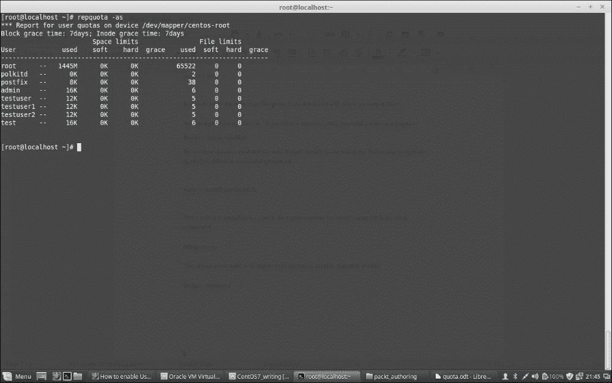
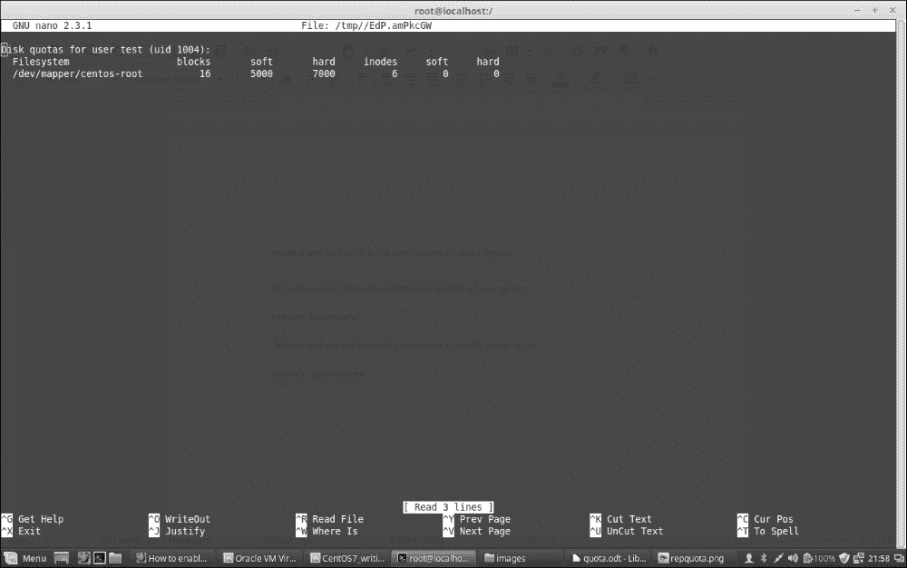
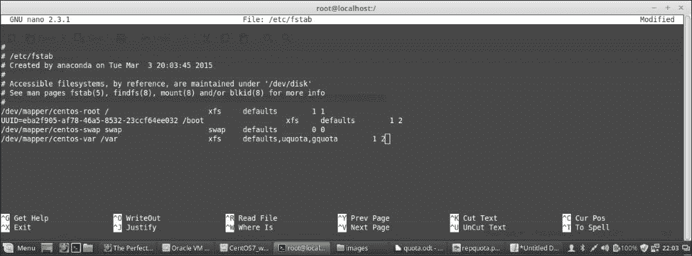
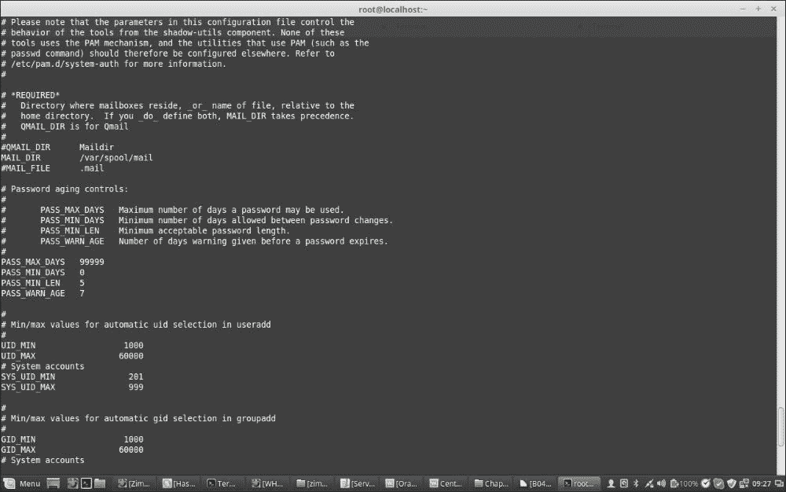
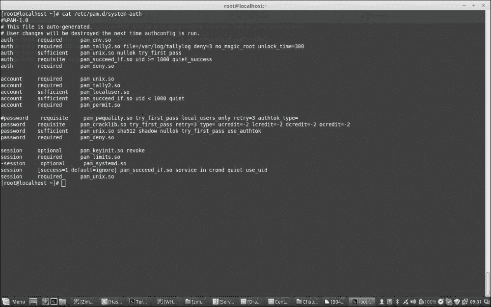
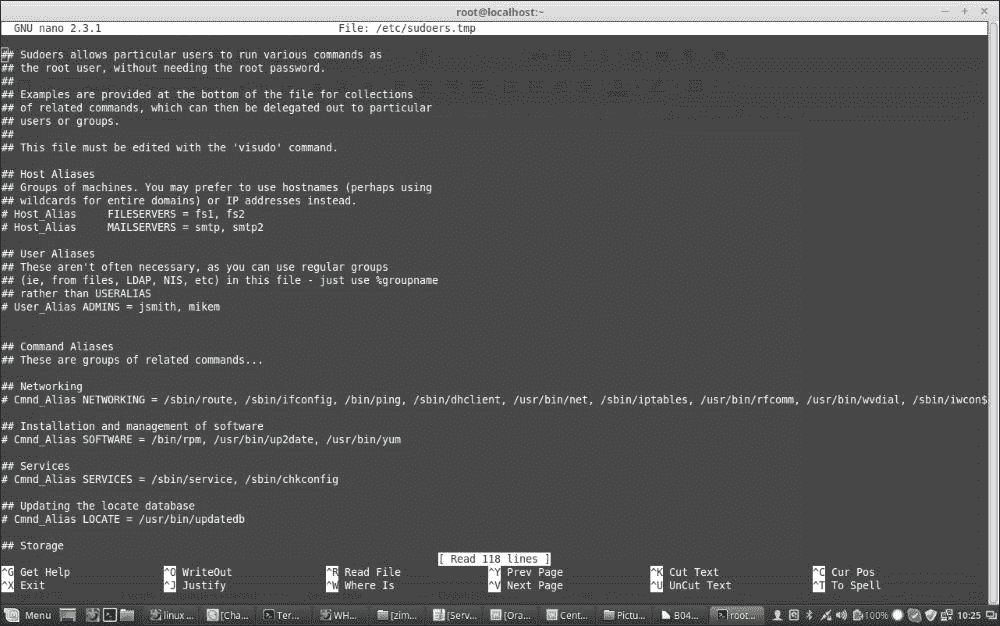

# 一、高级用户管理

在本章中，我们将介绍一些高级用户和组管理场景，以及一些如何处理高级选项的示例，例如密码过期、管理 sudoers 等。在这里，我们假设已经成功安装了 CentOS 7 以及根和用户凭据，就像我们在传统格式中所做的那样。此外，本章中的命令示例假设您已登录或切换到 root 用户。

将涵盖以下主题:

*   从图形用户界面和命令行管理用户和组
*   定额
*   密码老化
*   数独

# 从 GUI 和命令行管理用户和组

我们可以通过一个简单的命令，从命令行使用`useradd`向系统添加一个用户，如下所示:

```sh
useradd testuser

```

这会在`/etc/passwd`文件中创建用户条目，并且会自动为`/home`中的用户创建`home`目录。`/etc/passwd`条目如下所示:

```sh
testuser:x:1001:1001::/home/testuser:/bin/bash

```

但是我们都知道，用户处于锁定状态，除非我们使用以下命令为用户添加密码，否则无法登录系统:

```sh
passwd testuser

```

这将反过来修改`/etc/shadow`文件，同时解锁用户，用户将能够登录系统。

默认情况下，前面的命令集将在系统上为`testuser`用户创建一个用户和一个组。如果我们希望某一组用户成为一个公共组的一部分，会怎么样？我们将使用`-g`选项和`useradd`命令为用户定义组，但是我们必须确保该组已经存在。因此，要创建`testuser1`、`testuser2`、`testuser3`等用户，并使成为名为`testgroup`的公共组的一部分，我们将首先创建该组，然后使用`-g`或`-G`开关创建用户。所以，我们将这样做:

```sh
# To create the group :
groupadd testgroup
# To create the user with the above group and provide password and unlock
user at the same time :

useradd testuser1 -G testgroup
passwd testuser1

useradd testuser2 -g 1002
passwd testuser2

```

这里同时使用了`-g`和`-G`。两者的区别在于:使用`-G`，我们用其默认组创建用户，并将用户分配到通用的`testgroup`中，但是使用`-g`，我们创建的用户只是`testgroup`的一部分。在这两种情况下，我们可以使用`gid`或者从`/etc/group`文件中获得的组名。

对于高级用户创建，我们可以使用更多的选项；例如对于`uid`小于 500 的系统用户，我们必须使用`-r`选项，这将在系统上创建一个用户，但是`uid`将小于 500。我们也可以用`-u`来定义一个特定的`uid`，它必须是唯一的并且大于 499 的。我们可以使用`useradd`命令的常见选项有:

*   `-c`:此选项用于评论，一般定义用户的真实姓名，如`-c "John Doe"`。
*   `-d`:该选项用于定义`home-dir`；默认情况下，`home`目录在`/home`中创建，如`-d /var/<user name>`。
*   `-g`:该选项用于组名或用户默认组的组号。该组必须已经在更早的时候创建。
*   `-G`:该选项用于附加组名或组号，用逗号分隔，用户是其中的成员。同样，这些组也一定是在更早的时候创建的。
*   `-r`:此选项用于创建一个 UID 小于 500 且没有`home`目录的系统账户。
*   `-u`:该选项为为用户的用户 ID。它必须是唯一的并且大于 499。

我们在使用`passwd`命令时也很少使用快速选项。这些是:

*   `-l`:这个选项是锁定用户账户的密码
*   `-u`:这个选项是解锁用户账户的密码
*   `-e`:这个选项是让用户的密码过期
*   `-x`:此选项为定义密码有效期的最大天数
*   `-n`:该选项用于定义密码有效期的最短天数

# 配额

为了控制 Linux 文件系统中使用的磁盘空间，我们必须使用配额，这使我们能够控制磁盘空间，从而在很大程度上帮助我们解决磁盘空间不足的问题。为此，我们必须在 Linux 系统上启用用户和组配额。

在 CentOS 7 中，默认情况下不会启用用户和组配额，因此我们必须先启用它们。

要检查配额是否已启用，我们发出以下命令:

```sh
mount | grep ' / '

```


图像显示根文件系统被启用，没有配额，如输出中的`noquota`所述。

现在，我们必须在根(`/`)文件系统上启用配额，为此，我们必须首先编辑文件`/etc/default/grub`并将以下内容添加到`GRUB_CMDLINE_LINUX`:

```sh
rootflags=usrquota,grpquota

```

文件`GRUB_CMDLINE_LINUX`中的行应如下所示:

```sh
GRUB_CMDLINE_LINUX="rd.lvm.lv=centos/swap vconsole.font=latarcyrheb-sun16 rd.lvm.lv=centos/root crashkernel=auto  vconsole.keymap=us rhgb quiet rootflags=usrquota,grpquota"

```

cat `/etc/default/grub`命令的输出应该如下图所示:


由于我们必须反映我们刚才所做的更改，我们应该使用以下命令备份 grub 配置:

```sh
cp /boot/grub2/grub.cfg /boot/grub2/grub.cfg.original

```

现在，我们必须使用刚才使用命令所做的更改来重建 grub:

```sh
grub2-mkconfig -o /boot/grub2/grub.cfg

```

接下来，重新启动系统。完成后，登录并使用我们之前使用的命令验证配额是否已启用:

```sh
mount | grep ' / '

```

它现在应该向我们显示配额已启用，并将向我们显示如下输出:

```sh
/dev/mapper/centos-root on / type xfs (rw,relatime,attr2,inode64,usrquota,grpquota)

```

在图像前添加以下导入，并将 CIT 样式应用于**挂载| grep ' / '**


现在，由于配额已启用，我们将进一步安装配额，使用以下内容为不同的用户和组操作配额，以此类推:

```sh
yum -y install quota

```

安装配额后，我们使用以下命令检查用户的当前配额:

```sh
repquota -as

```

前面的命令将以人类可读的格式报告用户配额。



从前面的截图来看，我们有两种方式可以限制用户和组的配额；一种是为使用的磁盘空间大小设置软限制和硬限制，另一种是通过限制用户或组可以创建的文件数量来限制用户或组。在这两种情况下，使用软限制和硬限制。软限制是当达到软限制时警告用户的东西，硬限制是他们不能绕过的限制。

我们将使用以下命令修改用户配额:

```sh
edquota -u username

```

前面的命令输出应该如下图所示:



现在，我们将使用以下命令修改组配额:

```sh
edquota -g groupname

```


如果您有其他单独安装的分区，您必须修改`/etc/fstab`文件命令，通过在特定分区的默认值后添加`usrquota`和`grpquota`来启用文件系统上的配额，如下图所示，我们已经为`/var`分区启用了配额:



一旦完成启用配额，重新装载文件系统并运行以下命令:

```sh
To remount /var :
mount -o remount /var
To enable quota :
quotacheck -avugm
quotaon -avug

```

配额是所有系统管理员用来处理用户或组在服务器上消耗的磁盘空间并限制空间使用的东西。因此，它可以帮助他们管理系统上的磁盘空间使用情况。在这方面，应该注意的是，您在安装之前进行规划，并相应地创建分区，以便正确使用磁盘空间。总是建议使用多个独立的分区，如`/var`和`/home etc`，因为通常这些分区在 Linux 系统上占用的空间最大。因此，如果我们将它们保存在一个单独的分区上，它将不会耗尽根(`/`)文件系统空间，并且将比使用仅作为根挂载的整个文件系统更安全。

# 密码老化

让密码老化是一个好的策略，这样用户就被迫以一定的时间间隔更改密码。这反过来也有助于保持系统的安全性。

我们可以使用`chage`到配置密码在用户第一次登录系统时过期。

### 注

注意:如果用户使用 SSH 登录系统，此过程将不起作用。

这种使用`chage`的方法将确保用户被迫立即更改密码。

### 类型

如果我们只使用`chage <username>`，它将显示指定用户的当前密码时效值，并允许交互更改。

需要执行以下步骤来完成密码老化:

1.  锁定用户。如果用户不存在，我们将使用`useradd`命令创建用户。但是，我们不会为用户分配任何密码以保持锁定。但是，如果用户已经存在于系统中，我们将使用`usermod`命令锁定用户:

    ```sh
    Usermod -L <username>

    ```

2.  使用以下命令强制立即更改密码:

    ```sh
    chage -d 0 <username>

    ```

3.  解锁账户。这可以通过两种方式实现。一种是分配初始密码，另一种是分配空密码。我们将采用第一种方法，因为第二种方法虽然可行，但在安全性方面不是好的做法。因此，下面是我们分配初始密码的方法:
    *   使用 Python 命令启动命令行 Python 解释器:

        ```sh
        import crypt; print
        crypt.crypt("Q!W@E#R$","Bing0000/")

        ```

    *   这里，我们使用了带有字母数字字符的盐组合的`Q!W@E#R$`密码:`Bing0000`后跟一个`/`字符。输出是加密密码，类似`BiagqBsi6gl1o`。
    *   按 *Ctrl* + *D* 退出 Python 解释器。
4.  At the shell, enter the following command with the encrypted output of the Python interpreter:

    ```sh
    usermod -p "<encrypted-password>" <username>

    ```

    所以，在这里，在我们的例子中，如果用户名是`testuser`，加密输出是`" BiagqBsi6gl1o"`，我们将做:

    ```sh
    usermod -p "BiagqBsi6gl1o" testuser

    ```

现在，在首次使用`Q!W@E#R$`密码登录时，将提示用户输入新密码。

## 设置密码策略

这是一些文件中定义的一组规则，系统用户在设置时必须遵守。这是安全的一个重要因素，因为许多安全漏洞历史中有一个是从黑客攻击用户密码开始的。这就是大多数组织为其用户设置密码策略的原因。所有用户和密码都必须遵守这一点。

密码策略通常由以下内容定义:

*   密码老化
*   密码长度
*   密码复杂性
*   限制登录失败
*   限制以前的密码重复使用

## 配置密码时效和密码长度

密码时效和密码长度在`/etc/login.defs`中定义。老化基本上意味着密码可能被使用的最大天数、密码更改之间允许的最小天数以及密码过期前的警告次数。长度是指创建密码所需的字符数。要配置密码时效和长度，我们应该编辑`/etc/login.defs`文件，并根据组织设置的策略设置不同的`PASS`值。

### 注

注意:此处定义的密码时效控制不影响现有用户；它只影响新创建的用户。因此，在开始设置系统或服务器时，我们必须设置这些策略。我们修改的值是:

*   `PASS_MAX_DAYS`:密码可以使用的最大天数
*   `PASS_MIN_DAYS`:密码更改之间允许的最小天数
*   `PASS_MIN_LEN`:可接受的最小密码长度
*   `PASS_WARN_AGE`:密码到期前给予的天数警告

让我们看一下`login.defs`文件的一个示例配置:



## 配置密码复杂性并限制重复使用的密码

通过编辑`/etc/pam.d/system-auth`文件，我们可以将密码复杂度和重复使用的密码数量配置为拒绝。密码复杂性是指密码中使用的字符的复杂性，重复使用的密码拒绝是指拒绝用户过去使用的所需密码数量。通过设置复杂性，我们强制在密码中使用所需数量的大写字符、小写字符、数字和符号。除非满足规则设置的复杂性，否则系统将拒绝输入密码。我们使用以下术语来做到这一点:

*   **在密码中强制大写字符** : `ucredit=-X`，其中`X`是密码中要求的大写字符数。
*   **强制密码中的小写字符** : `lcredit=-X`，其中`X`是密码中需要的小写字符数。
*   **强制密码中的数字** : `dcredit=-X`，其中`X`为密码中需要的数字个数。
*   **强制在密码中使用符号** : `ocredit=-X`，其中`X`是密码中需要的符号数。例如:

    ```sh
    password requisite pam_cracklib.so try_first_pass retry=3 type= ucredit=-2 lcredit=-2 dcredit=-2 ocredit=-2

    ```

*   **拒绝重复使用的密码** : `remember=X`，其中`X`是要被拒绝的过去密码数。例如:

    ```sh
    password sufficient pam_unix.so sha512 shadow nullok try_first_pass use_authtok remember=5

    ```

现在我们来看一下`/etc/pam.d/system-auth`的一个配置示例:


## 配置登录失败

我们在`/etc/pam.d/password-auth`、`/etc/pam.d/system-auth`和`/etc/pam.d/login`文件中设置用户允许的登录失败次数。当用户登录失败次数高于此处定义的次数时，账户被锁定，只有系统管理员才能解锁账户。要对此进行配置，请对文件进行以下添加。以下`deny=X`参数对此进行配置，其中`X`是允许的失败登录尝试次数。

将这两行添加到`/etc/pam.d/password-auth`和`/etc/pam.d/system-auth`文件中，并且只将第一行添加到`/etc/pam.d/login`文件中:

```sh
auth        required    pam_tally2.so file=/var/log/tallylog deny=3 no_magic_root unlock_time=300
account     required    pam_tally2.so

```

以下截图为`/etc/pam.d/system-auth`文件示例:



以下是一个样本`/etc/pam.d/login`文件:


要查看故障，使用以下命令:

```sh
pam_tally2 –user=<User Name>

```

要重置失败的尝试并使用户能够再次登录，请使用以下命令:

```sh
pam_tally2 –user=<User Name> --reset

```

# 苏多尔斯

用户权限分离是 Linux 操作系统的主要特性之一。普通用户在有限的特权会话中操作，以限制他们对整个系统的影响范围。我们已经知道的 Linux 上存在的一个特殊用户是`root`，拥有超级用户权限。此帐户没有任何对普通用户的限制。用户可以通过多种不同的方式以超级用户或超级用户权限执行命令。

主要有三种不同的方法获得系统上的根权限:

*   以`root`身份登录系统。
*   以任何用户身份登录系统，然后使用`su -`命令。这将要求您输入`root`密码，一旦通过身份验证，将为您提供根 shell 会话。我们可以使用 *Ctrl* + *D* 或者使用`exit`命令断开这个根壳。一旦退出，我们将回到正常的用户Shell。
*   使用`sudo`以 root 权限运行命令，无需生成`root` shell 或以 root 身份登录。该`sudo`命令工作如下:

    ```sh
    sudo <command to execute>
    ```

与`su`不同，`sudo`会请求调用命令的用户的密码，而不是根密码。

`sudo`默认不工作，需要设置后才能正常工作。

在下一节中，我们将看到如何配置`sudo`和修改`/etc/sudoers`文件，使其按照我们希望的方式工作。

## 视觉化

使用`/etc/sudoers`文件修改`sudo`或实现，`visudo`是使我们能够编辑文件的命令。

### 注

注意:不应使用普通文本编辑器编辑此文件，以免在使用其他进程更新文件时出现潜在的竞争情况。相反，应该使用`visudo`命令。

`visudo`命令正常打开一个文本编辑器，但是在保存时验证文件的语法。这可以防止配置错误阻止`sudo`操作。



默认情况下，`visudo`在 vi 编辑器中打开`/etc/sudoers`文件，但是我们可以将其配置为使用`nano`文本编辑器。为此，我们必须确保`nano`已经安装，或者我们可以使用以下方式安装`nano` :

```sh
yum install nano -y

```

现在，我们可以通过编辑`~/.bashrc`文件将其更改为使用`nano`:

```sh
export EDITOR=/usr/bin/nano

```

然后，使用以下命令获取该文件:

```sh
. ~/.bashrc

```

现在，我们可以使用`visudo`和`nano`来编辑`/etc/sudoers`文件。那么，让我们使用`visudo`打开`/etc/sudoers`文件，了解一些事情。

我们可以为不同的命令集、软件、服务、用户、组等使用不同种类的别名。例如:

```sh
Cmnd_Alias NETWORKING = /sbin/route, /sbin/ifconfig, /bin/ping, /sbin/dhclient, /usr/bin/net, /sbin/iptables, /usr/bin/rfcomm, /usr/bin/wvdial, /sbin/iwconfig, /sbin/mii-tool
Cmnd_Alias SOFTWARE = /bin/rpm, /usr/bin/up2date, /usr/bin/yum
Cmnd_Alias SERVICES = /sbin/service, /sbin/chkconfig

```

我们可以使用这些别名为用户或组分配一组命令执行权限。例如，如果我们想将`NETWORKING`命令集分配给组`netadmin`，我们将定义:

```sh
%netadmin ALL = NETWORKING

```

否则，如果我们希望允许车轮组用户运行所有命令，我们将执行以下操作:

```sh
%wheel  ALL=(ALL)  ALL

```

如果我们希望特定用户`john`能够访问所有命令，我们将执行以下操作:

```sh
john  ALL=(ALL)  ALL

```

我们可以创建成员重叠的不同用户组:

```sh
User_Alias      GROUPONE = abby, brent, carl
User_Alias      GROUPTWO = brent, doris, eric,
User_Alias      GROUPTHREE = doris, felicia, grant

```

组名必须以大写字母开头。然后，我们可以允许`GROUPTWO`的成员通过创建如下规则来更新`yum`数据库和分配给前面软件的所有命令:

```sh
GROUPTWO    ALL = SOFTWARE

```

如果我们没有指定要运行的用户/组，`sudo`默认为根用户。

我们可以通过创建一个`command alias`并将其用于`GROUPTHREE`的规则中，允许`GROUPTHREE`的成员关闭并重启机器:

```sh
Cmnd_Alias      POWER = /sbin/shutdown, /sbin/halt, /sbin/reboot, /sbin/restart
GROUPTHREE  ALL = POWER

```

我们创建了一个名为`POWER`的命令别名，它包含关闭和重启机器的命令。然后我们允许`GROUPTHREE`的成员执行这些命令。

我们还可以创建`Runas`别名，它可以替换规则中指定给用户执行命令的部分，如下所示:

```sh
Runas_Alias     WEB = www-data, apache
GROUPONE    ALL = (WEB) ALL

```

这将允许属于`GROUPONE`成员的任何人以`www-data`用户或`apache`用户的身份执行命令。

请记住，稍后，当两者发生冲突时，规则将覆盖以前的规则。

有许多方法可以让你更好地控制`sudo`如何处理命令。以下是一些例子:

与`mlocate`包关联的`updatedb`命令相对无害。如果我们希望允许用户以 root 权限执行，而不必键入密码，我们可以制定如下规则:

```sh
GROUPONE    ALL = NOPASSWD: /usr/bin/updatedb

```

`NOPASSWD`是一个标签，表示不会请求密码。它有一个名为`PASSWD`的伴随命令，这是默认行为。标签与规则的其余部分相关，除非后来被其`twin`标签否决。

例如，我们可以有这样一条线:

```sh
GROUPTWO    ALL = NOPASSWD: /usr/bin/updatedb, PASSWD: /bin/kill 

```

在这种情况下，用户可以作为 root 用户运行`updatedb`命令而无需密码，但是运行`kill`命令需要输入 root 密码。另一个有用的标签是`NOEXEC`，它可以用来防止某些程序中的一些危险行为。

例如，一些程序，如`less`，可以通过在它们的界面中键入以下命令来生成其他命令:

```sh
!command_to_run

```

这基本上是以`less`运行时的相同权限执行用户给它的任何命令，这可能相当危险。

为了限制这种情况，我们可以使用这样一行:

```sh
username    ALL = NOEXEC: /usr/bin/less

```

您现在应该清楚地了解`sudo`是什么，以及我们如何使用`visudo`修改和提供访问权限。这里还剩下很多东西。您可以使用`visudo`命令检查默认的`/etc/sudoers`文件，该文件有很多示例，或者您也可以阅读`sudoers`手册。

需要记住的一点是，root 权限通常不会授予普通用户。对于我们来说，理解这些命令在以 root 权限执行时的作用非常重要。不要掉以轻心。了解在您的用例中使用这些工具的最佳方式，并锁定任何不需要的功能。

# 参考

现在，让我们看看本章中使用的主要参考文献:

[https://access . RedHat . com/documentation/en-US/Red _ Hat _ Enterprise _ Linux/7/html/System _ administrator _ Guide/index . html](https://access.redhat.com/documentation/en-US/Red_Hat_Enterprise_Linux/7/html/System_Administrators_Guide/index.html)

# 总结

在本章中，您学习了一些高级用户管理以及如何通过命令行管理用户，以及密码老化、配额、暴露给`/etc/sudoers`，以及如何使用`visudo`修改用户。用户和密码管理是系统管理员在服务器上执行的常规任务，它对系统的整体安全性具有非常重要的作用。

在下一章中，我们将研究名为**安全增强 Linux** ( **SELinux** )的高级安全特性，它与 CentOS 或红帽 Linux 操作系统集成在一起。