# 六、虚拟化

如今，计算机基础设施在许多方面都发生了变化。我们不再看到一屋子的服务器，每个服务器负责根据它们的功能提供多种服务。在这些时候，我们只看到由几个单元组成的几个大服务器，以增强它们的能力。这种类型的服务器托管几个虚拟服务器，这些服务器根据基础架构要求服务于相同的旧目的。

在我们的时代，做裸机的系统管理员是远远不够的。虚拟机呈上升趋势；我们应该承认这点。大公司不再使用旧的架构；这不再是一个好的选择。需要大量的资金和巨大的管理努力来维持它们。

在本章中，我们将把虚拟化作为一个概念来解释，在这里我们将看到如何设置几种虚拟化技术，然后举例说明如何为每一种技术创建一些虚拟机。最后，我们将简要解释什么是 Docker，以及如何添加图像和访问 Docker 容器。

通过本章，您将学习以下主题:

*   虚拟化基础
*   完全虚拟化的概念
*   半虚拟化的概念
*   了解 Xen 以及如何使用它
*   用 KVM 设置一些 Linux 虚拟机
*   使用 OpenVZ 创建虚拟机
*   在 VirtualBox 上设置和配置虚拟机
*   了解 Docker 以及如何创建和访问容器
*   使用 HAProxy 建立服务的高可用性

# Linux 上虚拟化的基础

虚拟化是能力，创建一个类似机器的程序，模拟真实机器通过虚拟硬件运行的物理行为，包括中央处理器、内存、硬盘、网卡等，这些资源都是从运行虚拟机器的物理机器上获取的。

以前，管理服务的方式是部署新服务器或升级旧服务器，以满足新服务的要求，从而在硬件出现故障时执行长时间的复杂迁移。一直以来，内存太少，磁盘太少，或者处理能力低。经理们厌倦了试图修复现有的系统，同时支付大量资金来帮助维护不再受支持的旧服务器。然而，他们没有太多的选择，因为在这些机器上运行的服务非常重要和必不可少。公司部署的服务器无法在其峰值容量下工作，没有更好的方法来控制每台服务器的容量，以便使用合适的硬件设备提供合适的服务。所有这些原因使得虚拟化的新解决方案发展如此之快。从第一次部署到现在，虚拟化已经融入了许多领域，尤其是计算机科学领域。虚拟化允许对物理硬件进行抽象，在单个共享资源(CPU、内存、网络和存储)上运行多个虚拟机:

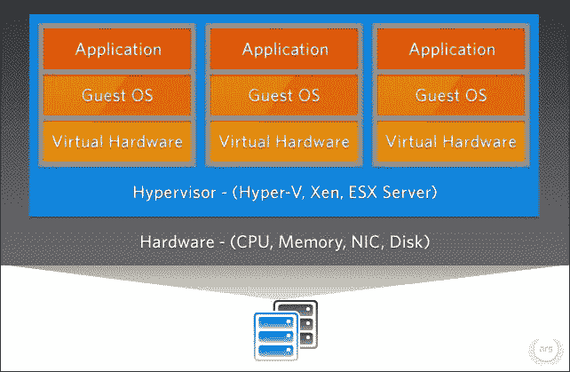

来源:[http://cdn.arstechnica.net](http://cdn.arstechnica.net)

现在，这项新技术正在蓬勃发展。我们每天都在见证一项新的虚拟化服务的诞生。虚拟化分为多种类型:

*   我们有网络虚拟化，它与虚拟网络创建和管理相关，以将机器组彼此分开。它们连接到同一个交换机和交换机组。
*   我们还有应用程序虚拟化，其中我们将一个应用程序或一组应用程序放在一个容器中，然后我们让应用程序相信它正在它原来支持的系统上运行。因此，它相信自己可以获得所需的资源。
*   最后，我们有完整的机器虚拟化。这是一种虚拟化，通过虚拟硬件和按需提供的专用服务来创建完整的虚拟机(桌面、服务器)。这种虚拟化包括从底层硬件中抽象出基于服务器的工作负载(虚拟机用户所需的工作负载)。虚拟机不会注意到它是运行在物理硬件上还是虚拟硬件上，只要硬件满足其服务对资源的需求(存储数据、对其他机器的网络访问等)。

在本章中，我们将重点介绍应用程序虚拟化和桌面虚拟化。

名为 hypervisor 的软件在物理机上执行，以帮助实现数据中心的虚拟化，目标是为虚拟机提供一个平台。虚拟机管理程序的主要工作是在其控制下运行的不同虚拟机之间动态组织物理资源。这使他们能够独立于物理机运行，系统管理员可以在不影响虚拟机的情况下将虚拟机从一台主机重新定位到另一台主机。虚拟机管理程序，也称为虚拟机管理器，是一种允许多个操作系统共享单个硬件主机的程序。

在使用虚拟机器或容器时，我们期望为应用程序或服务提供一个能够托管它们并简化它们与硬件通信的操作系统。由于这些机器并不真正运行在物理硬件上，虚拟化允许它们根据需要动态灵活地访问 CPU、内存、存储和网络资源。

虚拟化可以提高灵活性和管理能力，并提供更好的可扩展性，同时大大节省成本。该服务的工作负载部署更快，按需性能可用性明显提高，同时可扩展性功能实现自动化，以简化 IT 支持人员的基础架构管理。

让我们列举一下在服务器基础架构上安装虚拟化解决方案的一些主要优势:

*   减少硬件数量和运营成本
*   应用程序和服务的高可用性交付
*   最大限度地减少或消除停机时间(采用最佳实践方法)
*   提高 IT 团队的生产力、效率、敏捷性和响应能力
*   提高速度，简化应用程序和资源调配
*   支持业务连续性和灾难恢复，提高系统安全性
*   实现集中管理
*   构建真正的软件定义的数据中心
*   充分利用多核处理器机器的优势

下图显示了在一台 Linux 服务器上运行的三个 Linux 虚拟机的示例。这些机器由一种类型的虚拟机管理程序控制和管理，具体取决于所选择的虚拟化:

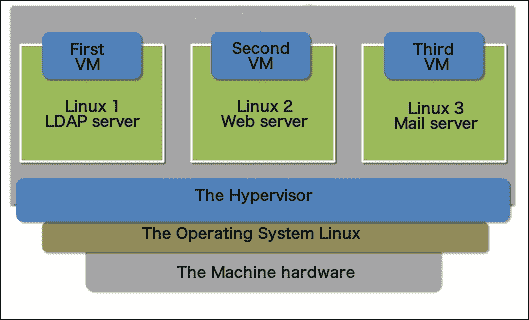

虚拟机实际上只是以某种格式存储在主机上特定位置的一些文件。对于某些技术，它也可以是 LVM 逻辑卷或直接设备。虚拟机使用的虚拟磁盘只是封装在其中的另一个文件。在虚拟机内部，可以简化对操作系统和应用程序的管理(在某些方面；在其他情况下是复杂的)。

但好的一面是，将虚拟机作为一个充满可复制和移动文件的文件夹，可以在物理机发生硬件故障时更容易地进行备份。在这种情况下，管理人员只需购买一台新的服务器，在其上加载备份的虚拟机，然后像什么都没发生一样再次运行整个环境。

使用 CentOS 存储库，我们可以在两种虚拟化技术之间进行选择: **Xen** 和 **KVM** 。要了解这些虚拟化技术，您需要了解两种不同的虚拟化方法:完全虚拟化和半虚拟化。

### 注

半虚拟化和完全虚拟化的结合被创造出来，称为 **混合虚拟化**。其中，客户操作系统的某些部分对某些硬件驱动程序使用半虚拟化，而主机对其他功能使用完全虚拟化。这通常会在客户机上产生卓越的性能，而不需要客户机完全半虚拟化。

# 完全虚拟化

完全虚拟化是一种虚拟化技术，它完全模拟虚拟机下面的虚拟硬件，不与物理硬件交互。它要求虚拟机下面的整个硬件变得不引人注意。该技术可以按需模拟任何种类的物理硬件，以满足虚拟机上运行系统的需求，从而满足特定裸机硬件的任何服务或应用需求。换句话说，完全虚拟化是一种虚拟化能力，可以完全运行客户机，而不会让它意识到自己正在虚拟环境中运行。在这种情况下，虚拟机有一个完全虚拟化的硬件来运行其服务。它们与物理硬件没有任何交互。

下图显示了在完全虚拟化过程中，底层平台如何运行来宾操作系统，而不被修改或意识到它正在虚拟化上运行:

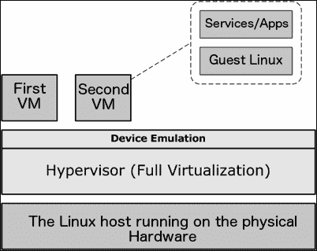

有一种特定类型的完全虚拟化称为硬件辅助虚拟化。在这种情况下，中央处理器架构通过一些特殊指令来帮助执行硬件虚拟化，这些指令可能允许来宾机器直接在中央处理器上执行特权指令，即使它是虚拟化的。

使用 CentOS 7 服务器，我们可以使用 Xen 或 KVM 进行完全虚拟化或硬件辅助的完全虚拟化。我们将在*中看到如何为 CentOS 7* 设置 Xen。

在更大的范围内，可以实施完全虚拟化的解决方案包括 VMware 的虚拟机管理程序系列、Xen 和 XenServer、VirtualBox、QEMU 和 KVM。

# 半虚拟化

准虚拟化是对虚拟化技术的一种新的增强。它能够使来宾操作系统在安装到为虚拟机提供服务的垂直机器上之前重新编译，以识别虚拟和物理硬件。通过使用这种虚拟化，我们可以通过节省计算资源来更好地优化系统性能。正是由于这项技术，我们不需要为虚拟机专门分配资源，只在必要时使用。与完全虚拟化不同，在完全虚拟化中，我们需要创建虚拟资源并将其专用于虚拟机，而不是使用或不使用。

在半虚拟化中，来宾操作系统由虚拟机管理程序(位于物理机和虚拟机之间的一层)管理，以高效地启用和共享物理设备访问。虽然执行特权指令通常不需要完全的设备仿真或动态重新编译，但半虚拟化通常以接近本机的速度执行。

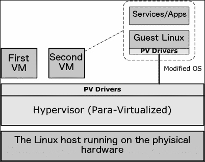

前面的架构展示了半虚拟化虚拟机如何通过特殊的管理程序与物理硬件交互，该管理程序直接与修改器操作系统通信以优化通信。

半虚拟化是 IBM 发明的一项技术的扩展。Xen 是一个结合了半虚拟化的开源软件项目。Xen 虚拟机管理程序带来了术语*半虚拟化*。如今，大多数虚拟化解决方案通常支持半虚拟化。许多 Linux 开发供应商合作开发了一种新形式的半虚拟化，最初由 Xen 集团开发，它在虚拟机管理程序和来宾操作系统内核之间提供了一个与虚拟机管理程序无关的接口。

# 在 CentOS 7 上设置 Xen

Xen 是一个开放的源码解决方案，用于在一台机器上运行多个虚拟系统。它支持半虚拟化和硬件辅助的全虚拟化。Xen 是一个非常强大的虚拟化解决方案。它能够同时使用两种虚拟化技术，始终满足用户的需求。

为了使用 Xen 创建我们的虚拟化环境，我们需要确保 Xen Hypervisor 将在机器自己的内核启动之前启动，以访问尽可能多的物理硬件，因此它可以用于服务我们环境的虚拟机。

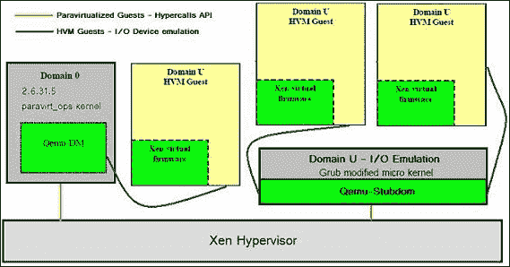

来源:[http://www.2virt.com](http://www.2virt.com)

在本节中，我们将为 CentOS 7 设置 Xen4。默认的 CentOS 7 存储库不支持 Xen4，所以我们需要添加 CentOS Xen 存储库。但是首先，我们需要确保安装了一些软件包。这些将在 Xen 的安装过程中需要:

```sh
$ sudo yum install bridge-utils SDL net-tools

```

然后，我们使用 YUM 添加最新的 Xen 存储库:

```sh
$ sudo yum install centos-release-xen

```

在本教程中，我们将安装 Xen 版本 4.5，因此我们需要运行如下安装命令:

```sh
$ sudo yum install xen

```

为了验证安装是否完成，我们需要列出 Xen 内核档案，它位于`/boot`文件夹中:

```sh
$ ls –l /boot/xen.gz

```

我们应该看到以下代码:

```sh
lrwxrwxrwx. 1 root root       12 Aug 23 02:10 /boot/xen.gz -> xen-4.5.1.gz

```

现在，我们继续安装`kernel-xen`包。此安装应与 Xen 安装分开执行，并在安装之后执行，以便系统引导加载程序 grub 可以检测新内核并正确配置:

```sh
$ sudo yum install kernel-xen

```

安装新内核后，我们应该解决 SELinux 问题。我们可以通过确定 SELinux 阻塞了哪些模块来解决问题，或者如果我们有更好的方法来保护我们的服务器，我们可以禁用它。要禁用 SELinux，我们只需要转到它的配置文件并禁用它:

```sh
$ sudo nano /etc/sysconfig/selinux

```

然后，考虑这一行:

```sh
SELINUX=enforcing

```

将其更改为以下内容:

```sh
SELINUX=disabled

```

否则，如果我们需要检查问题，我们可以这样做。首先，我们检查日志文件，找出问题的原因:

```sh
$ sudo cat /var/log/messages

```

然后，我们激活堵塞:

```sh
$ sudo grep xend /var/log/audit/audit.log | audit2allow -M custom_xen
$ sudo semodule -i custom_xen.pp

```

这应该能解决问题。最后，我们可以重启系统，启动新的 Xen 内核。重启后，我们需要检查 Xen 内核是否安装正确:

```sh
$ sudo xl info

```

为了使用 Xen，我们需要安装一些工具和软件包来使虚拟机运行良好。首先，我们需要确保安装了基本的使用软件包:

```sh
$ sudo yum install bridge-utils tunctl wget vim-enhanced rsync openssh-clients libvirt python-virtinst libvirt-daemon-xen 

```

然后，我们需要配置网络。但在此之前，我们必须创建桥接口:

```sh
$ sudo nano /etc/sysconfig/network-scripts/ifcfg-brid0

```

接下来，我们在刚刚使用 nano 打开的文件中添加以下行并保存它:

```sh
DEVICE=brid0
TYPE=Bridge
BOOTPROTO=dhcp
ONBOOT=yes

```

然后，我们对默认网络接口配置文件进行一些小的更改，以使用桥接接口:

```sh
$ sudo nano /etc/sysconfig/network-scripts/ifcfg-eth0
DEVICE=eth0
HWADDR=XX:XX:XX:XX:XX:XX
ONBOOT=yes
TYPE=Ethernet
IPV6INIT=no
USERCTL=no
BRIDGE=brid0

```

### 注

我们需要用以太网接口的媒体访问控制地址来更改媒体访问控制地址。我们可以用`ifconfig`来检查。

之后，我们重启系统。有了这个，桥接网络就可以使用了。然后，我们下载任何 Linux 系统进行测试。接下来，我们需要使用`dd`命令使其成为【using 文件:

```sh
$ sudo dd if=/dev/zero of=Centos.img bs=4K count=0 seek=1024K
qemu-img create -f raw Centos.img 8G

```

然后，我们下载任何一个 Linux 系统进行测试。此外，我们必须创建一个启动文件，并将其放在相同的位置:

```sh
$ sudo nano ks.cfg

```

然后，我们添加带有所需修改的以下代码:

```sh
kernel = "/boot/vmlinuz-xen-install"
ramdisk = "/boot/initrd-xen-install"
extra = "text"
name = "mailserver"
memory = "256"
disk = [ 'tap:aio:/srv/xen/mailserver.img,xvda,w', ]
vif = [ 'bridge=brid0', ]
vcpus=1
on_reboot = 'destroy'
on_crash = 'destroy'

```

最后，我们使用`virt-install`来创建虚拟机:

```sh
$ sudo virt-install -d -n CentOS7VM1 -r 1024 --vcpus=2 \
--bridge=brid0 --disk ./Centos.img \
--nographics -p -l "./Centos" \
--extra-args="text console=com1 utf8 console=hvc0 ks=./ks.cfg"

```

现在虚拟机应该启动，并且能够从 DHCP 服务器获得一个 IP；所以我们可以继续调整它并添加所需的服务。

对于 Xen 的使用，我们需要使用以下命令(我们将呈现最常见的命令。更多，您可以随时关注[https://www . centos . org/docs/5/html/virtuality-en-US/virt-task-XM-create-manage-doms . html](https://www.centos.org/docs/5/html/Virtualization-en-US/virt-task-xm-create-manage-doms.html)):

*   要连接到虚拟机:

    ```sh
    $ sudo xm console CentOS7VM1

    ```

*   关闭或重启机器:

    ```sh
    $ sudo xm shutdown CentOS7VM1
    $ sudo xm reboot CentOS7VM1

    ```

*   移除(终止)机器:

    ```sh
    $ sudo xm destroy CentOS7VM1

    ```

*   暂停和恢复机器:

    ```sh
    $ sudo xm suspend CentOS7VM1
    $ sudo xm resume CentOS7VM1

    ```

*   给机器重新命名

    ```sh
    $ sudo xm rename CentOS7VM1 CentOS7VM2

    ```

*   暂停，然后打开机器:

    ```sh
    $ sudo xm pause CentOS7VM1
    $ sudo xm unpause CentOS7VM1

    ```

# 在 CentOS 7 上为完全虚拟化设置 KVM

KVM 只能支持硬件辅助的全虚拟化。支持半虚拟化的工作仍在进行。KVM 是一个内核模块，只与默认的 Linux 内核一起工作(我们不应该将其安装在 Xen 内核上)。KVM 使用个性化版本的 Qemu 为 KVM 创建虚拟机，称为 **Qemu-kvm** 。


来源:[http://www.virtualopensystems.com](http://www.virtualopensystems.com)

KVM 有许多有用的特性和优势由其虚拟机管理程序支持:

*   **精简资源调配**:这是分配灵活存储和管理虚拟机可用空间的能力
*   **过度承诺**:这是分配更多 CPU 和内存的能力超过物理机器上的可用资源
*   **自动 NUMA 平衡**:这个是对运行在 NUMA 硬件上的应用程序的改进
*   **磁盘 I/O 节流**:这是管理虚拟机发送的物理系统磁盘输入输出请求限制的能力
*   **虚拟 CPU 热添加能力**:这个是在不停机的情况下调整虚拟机处理能力的能力

在开始 KVM 安装之前，我们需要检查一些预安装步骤。首先，我们检查机器 CPU 是否能够处理虚拟化技术:

```sh
$ sudo grep -e '(vmx|svm)' /proc/cpuinfo

```

要知道这是否正确，我们需要看到命令输出中突出显示的`vmx`或`svm`字:

然后，我们确保系统包都已更新:

```sh
$ sudo yum update

```

接下来，我们将 SELinux 的工作模式更改为许可，以确保它不会干扰 KVM 的执行:

```sh
$ sudo nano /etc/sysconfig/selinux

```

然后，考虑这一行:

```sh
SELINUX=enforcing

```

将其更改为以下内容:

```sh
SELINUX=permissive

```

我们现在可以开始安装了。首先，我们将安装`Qemu`包，为 KVM 及其磁盘映像管理器提供用户级:

```sh
$ sudo yum install qemu-img qemu-kvm 

```

然后，我们需要安装用于虚拟机管理的 GUI、用于管理虚拟环境的命令行工具、帮助从 CLI 创建虚拟机的工具以及虚拟机管理程序库:

```sh
$ sudo yum install virt-manager libvirt libvirt-python libvirt-client xauth dejavu-lgc-sans-fonts

```

最后，对于 CentOS 7，我们添加了虚拟化客户端、虚拟化平台和虚拟化工具:

```sh
$ sudo yum groupinstall virtualization-client virtualization-tools virtualization-platform 

```

完成这一步后，我们可以说已经完成了所需工具和软件包的安装。现在，我们进入配置部分。首先，我们需要重新启动虚拟化守护程序，以确保整个配置设置良好:

```sh
$ sudo systemctl restart libvirtd

```

然后，我们检查它是否运行良好:

```sh
$ sudo systemctl status libvirtd

```

我们应该将此视为输出:


现在，我们进入网络配置。我们需要创建一个桥接接口来允许客户系统访问外部网络。为此，我们必须启用 IP 转发:

```sh
$ sudo echo "net.ipv4.ip_forward = 1"|sudo tee /etc/sysctl.d/99-ipforward.conf

```

然后，我们检查它是否设置良好:

```sh
$ sudo sysctl -p /etc/sysctl.d/99-ipforward.conf

```

之后，我们需要通过保持原来的接口不变来改变网络配置，但是我们会将其 IP 地址分配给这个网桥:

```sh
$ sudo nano /etc/sysconfig/network-scripts/ifcfg-eth0

```

接下来，我们将以下行添加到文件的末尾并保存它:

```sh
BRIDGE=virbrid0

```

然后，我们创建桥接口配置文件:

```sh
$ sudo nano /etc/sysconfig/network-scripts/ifcfg-brid0

```

之后，我们将以下代码放入刚刚打开的文件中进行编辑，并保存它:

```sh
DEVICE="brid0"
TYPE=BRIDGE
ONBOOT=yes
BOOTPROTO=static
IPADDR="10.0.0.2"
NETMASK="255.255.255.0"
GATEWAY="10.0.0.1"
DNS1="8.8.8.8"

```

重新启动系统后，我们可以说网络配置设置良好。

在我们完成 KVM 安装和配置之后，就该开始使用主机了。我们需要做的第一件事是创建一个新的域或虚拟机。为此，使用命令行界面，我们将使用`virt-install`命令。首先，我们需要查看 KVM 安装已知的模板列表:

```sh
$ sudo virt-install --os-variant=list

```

我们需要一个 Linux 操作系统的国际标准化组织来安装它。然后，我们可以开始设置新的虚拟机:

```sh
$ sudo virt-install  --name=CentOS7guest  --ram=1024  --vcpus=2  --cdrom=./CentOS-7.1-x86_64-minimal.iso --os-type=linux --os-variant=rhel7  --network bridge=brid0 --graphics=spice  --disk path=/var/lib/libviimg/CentOS7.dsk,size=10

```

在前面的命令中写入的选项如下:

*   `name`:这是虚拟机的名称
*   `ram`:这是内存大小，单位为 MB
*   `vcpus`:这是虚拟 CPU 的数量
*   `cdrom`:这是 ISO 图像的位置
*   `os-type`:这是操作系统类型，比如 Linux、Windows 或者 Unix
*   `os-variant`:这是 OS 变体，比如 rhel 6 或者 Solaris
*   `network`:这是网络接口和连接
*   `graphics`:这是客人显示设置
*   `disk path`:这是 10 GB 大小的磁盘的位置

发出上述命令后，`virt-install`将创建一个虚拟机，并启动`virt`查看器控制台进行操作系统安装。

### 注

总是有一个图形模式执行前面的处理。这个图形工具叫做 virt-manager，它是一个系统工具。

以下命令旨在部署后更好地管理 KVM 虚拟机:

*   要列出在 KVM 上运行的虚拟机:

    ```sh
    $ sudo virsh --connect qemu:///system list

    ```

*   要获得关于虚拟机的更多信息:

    ```sh
    $ sudo virsh dominfo CentOS7guest

    ```

*   要停止正在运行的来宾机器:

    ```sh
    $ sudo virsh --connect qemu:///system shutdown CentOS7guest

    ```

*   要启动虚拟机:

    ```sh
    $ sudo virsh --connect qemu:///system start CentOS7guest

    ```

*   要删除来宾机器:

    ```sh
    $ sudo virsh --connect qemu:///system destroy CentOS7guest
    $ sudo virsh --connect qemu:///system undefineCentOS7guest
    $ sudo rm -f /var/lib/libviimg/CentOS7guest.img

    ```

*   最后，代码用于随着主机系统启动自动启动虚拟机器:

    ```sh
    $ sudo virsh --connect qemu:///system autostart CentOS7guest
    $ sudo virsh --connect qemu:///system dominfo CentOS7guest | grep Auto

    ```

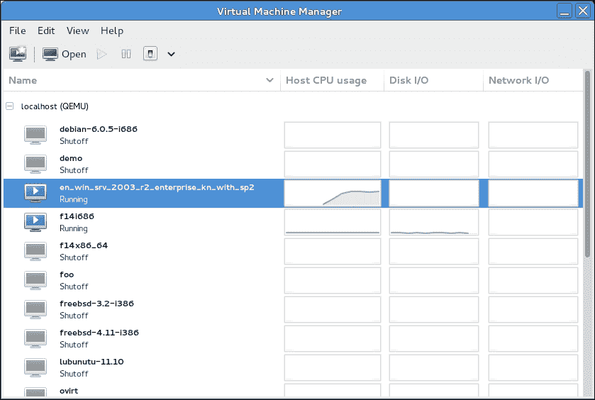

来源:[https://virt-manager.org/](https://virt-manager.org/)

# 在 CentOS 7 上设置 OpenVZ 虚拟化

OpenVZ 是一种新的虚拟化形式，我们称之为基于容器的技术。它基本上创建了运行在单个 Linux 服务器上的多个安全且隔离的 Linux 容器。这种容器技术允许更好的服务器利用率，因为我们没有安装一个完整的虚拟机，只是一个容器来容纳它的一部分，并且它消除了应用程序冲突。运行在 OpenVZ 平台上的虚拟机处于独立模式，在这种模式下，它能够在不与运行在同一平台上的任何其他虚拟机发生任何类型冲突的情况下运行。那些机器彼此独立。

运行在 OpenVZ 上的虚拟机都有自己的操作系统、IP 地址、进程、内存或者存储空间、应用和配置文件等等。


来源:[http://www.quantact.com](http://www.quantact.com)

使用 OpenVZ 时，虚拟化通过系统级虚拟化技术运行，其中来宾系统使用与物理机系统相同的内核，而不像 KVM 和 VirtualBox，这有助于提高物理机处理能力和存储能力的使用效率。

为了更好地使用 OpenVZ，我们可能需要使用 QEMU 和 Virtuozzo 作为管理实用程序。我们非常推荐在 Virtuozzo 映像安装中使用 OpenVZ 容器和虚拟机。

对于 CentOS 7，目前还没有可用的 OpenVZ 发行版。因此，我们将安装它的分叉项目 Virtuozzo 7，它能够提供所有 OpenVZ 选项和更多选项。然而，我们将只使用 OpenVZ 工具。

要安装 Virtuozzo 7，我们需要安装基于 RPM 的发行包。首先，我们需要将`virtuozzo-release`包的元信息带入 YUM 库:

```sh
$ sudo yum localinstall http://download.openvz.org/virtuozzo/releases/7.0/x86_64/os/Packages/v/virtuozzo-release-7.0.0-10.vz7.x86_64.rpm

```

然后，我们安装强制的 Virtuozzo RPM 软件包:

```sh
$ sudo yum install -y prlctl prl-disp-service vzkernel

```

现在，我们已经安装了 OpenVZ 内核。我们继续讨论内核参数配置:

```sh
$ sudo nano /etc/sysctl.conf

```

然后，我们添加以下代码:

```sh
# On Hardware Node we generally need
# packet forwarding enabled and proxy arp disabled
net.ipv4.ip_forward = 1
net.ipv6.conf.default.forwarding = 1
net.ipv6.conf.all.forwarding = 1
net.ipv4.conf.default.proxy_arp = 0

# Enables source route verification
net.ipv4.conf.all.rp_filter = 1

# Enables the magic-sysrq key
kernel.sysrq = 1

# We do not want all our interfaces to send redirects
net.ipv4.conf.default.send_redirects = 1
net.ipv4.conf.all.send_redirects = 0

```

之后，我们让 SELinux 行为自由，以确保 OpenVZ 正常工作:

```sh
$ sudo nano /etc/sysconfig/selinux

```

接下来，我们需要配置行，使其如下所示:

```sh
SELINUX=permissive

```

这部分是可选的。如果需要，我们可以安装 OpenVZ 使用统计工具:

```sh
$ sudo yum install vzctl vzquota ploop

```

现在，由于我们已经成功安装了 OpenVZ，我们可以重新启动系统并通过 OpenVZ 内核登录。我们需要编辑 OpenVZ 配置文件，为物理机和虚拟机设置相同的子网:

```sh
$ sudo nano /etc/vz/vz.conf

```

然后，我们找到并取消注释下面的行，并将其选项更改为:

```sh
NEIGHBOUR_DEVS=all

```

现在，我们可以为 OpenVZ 设置一个基于网络的界面来帮助管理它。我们需要下载安装脚本并运行它:

```sh
$ sudo wget -O - http://ovz-web-panel.googlecode.com/svn/installer/ai.sh | sh

```

然后，使用 Firewalld 添加该 web 界面将要服务的端口:

```sh
$ sudo firewall-cmd --zone=public --permanent --add-port=3000/tcp

```

然后，重新加载防火墙:

```sh
$ sudo firewall-cmd --reload

```

基于网络的接口将在机器主机名或 IP 地址后跟端口号`3000`处提供其网络接口:

```sh
http://<the-hostname>:3000

```

现在，我们要去开始使用 OpenVZ 下载一个容器并开始使用。首先，我们需要指定一个文件夹来放置我们的容器:

```sh
$ mkdir OpenVZCont
$ cd OpenVZCont

```

然后，我们下载一个示例容器:

```sh
$ wget http://download.openvz.org/template/precreated/centos-7-x86_64-minimal.tar.gz

```

接下来，我们打开`tar`文件:

```sh
$ tar –xzvf centos-7-x86_64-minimal.tar.gz

```

然后，我们键入以下命令来创建我们的第一台虚拟机:

```sh
$ sudo vzctl create 101 --ostemplate centos-7-x86_64-minimal

```

我们的容器标识是`101`，因为它们通常从`100`开始。现在，我们为容器设置一个 IP 地址:

```sh
$ sudo vzctl set 101 --ipadd 10.0.0.14 --save

```

然后是一个域名服务器:

```sh
$ sudo vzctl set 101 --nameserver 8.8.8.8 --save

```

准备好网络配置后，我们可以启动新创建的容器:

```sh
$ sudo vzctl start 101

```

我们可以通过 ping 它的 IP 地址来验证它是否正在运行:

```sh
$ ping 10.0.0.14

```

现在，我们可以登录我们的容器来探索它:

```sh
$ sudo vzctl enter 101

```

我们在新创建的容器中。我们可以用它做任何我们想做的事。要退出虚拟机，我们只需在终端键入 exit 即可。此外，使用 OpenVZ 网络界面，我们可以可视化其状态，并通过它进行一些行政管理。

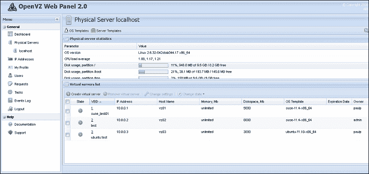

资料来源:https://bdrzahaves . WordPress . com/

# 在 CentOS 7 上设置 VirtualBox 虚拟化

Oracle VirtualBox 是一个虚拟化应用程序，能够在多种计算机架构(基于英特尔、AMD 的系统)和几乎所有可用的操作系统(OSX、Linux、Windows、Solaris 等)上运行，它允许其用户在同一台物理机上运行多个操作系统。基本上，虚拟盒子是一种完全虚拟化的技术。

大多数人在使用多个系统时都会依赖它，并且需要导出和导入模板虚拟机，其中虚拟盒提供了各种选项来在各种基础架构之间交换虚拟机。

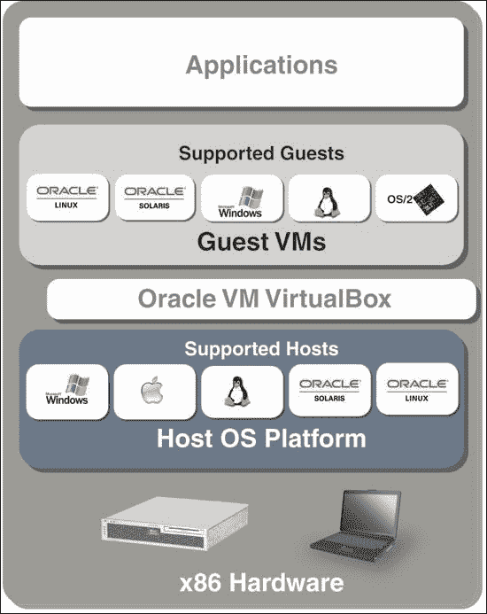

来源:[http://www.oracle.com](http://www.oracle.com)

本节将向您展示如何在 CentOS 7 上安装 Oracle VirtualBox 5.0.2。首先，我们需要将 VirtualBox yum 存储库添加到我们的系统中。因此，我们需要在 YUM 存储库目录中创建它的 repo 文件:

```sh
$ sudo nano /etc/yum.repos.d/virtualbox.repo

```

然后，我们需要将以下代码放入文件并保存它:

```sh
[virtualbox]
name=Oracle Linux / RHEL / CentOS-$releasever / $basearch - VirtualBox
baseurl=http://download.virtualbox.org/virtualbox/rpm/el/$releasever/$basearch
enabled=1
gpgcheck=1
gpgkey=http://download.virtualbox.org/virtualbox/debian/oracle_vbox.asc

```

我们还应该安装 EPEL 存储库:

```sh
$ sudo rpm -ivh http://ftp.jaist.ac.jp/pub/Linux/Fedora/epel/7/x86_64/e/epel-release-7-5.noarch.rpm

```

在开始安装之前，我们需要安装一些必要的软件包，以确保 VirtualBox 正常工作:

```sh
$ sudo yum install gcc make kernel-headers kernel-devel fontforge binutils patch  dkms glibc-headers glibc-devel qt libgomp

```

然后，我们设置一个名为`KERN_DIR`的环境变量，VirtualBox 将从中获取内核源代码:

```sh
$ export KERN_DIR=/usr/src/kernels/3.10.0-229.14.1.el7.x86_64

```

### 类型

我最新的内核版本存储在这个目录:`3.10.0-229.14.1.el7.x86_64`。由于升级，它可能会随着时间的推移而改变。

然后，我们可以使用 YUM 开始 VirtualBox 的安装:

```sh
$ sudo yum install VirtualBox-5.0

```

安装完成后，我们需要使用以下命令重建内核模块:

```sh
$ sudo systemctl start vboxdrv

```

现在，我们已经安装了 VirtualBox 并准备使用。尽管如此，VirtualBox 只支持图形界面，所以我们需要安装一个，然后我们可以启动它并使用它。

我们需要在我们的服务器上安装一个图形界面，我们有一长串可供选择。我会推荐 Gnome，因为它是最常用的界面之一，用户友好，资源消耗低。

使用 Gnome 作为图形界面，我们可以启动 VirtualBox:

```sh
$ sudo virtualbox &

```

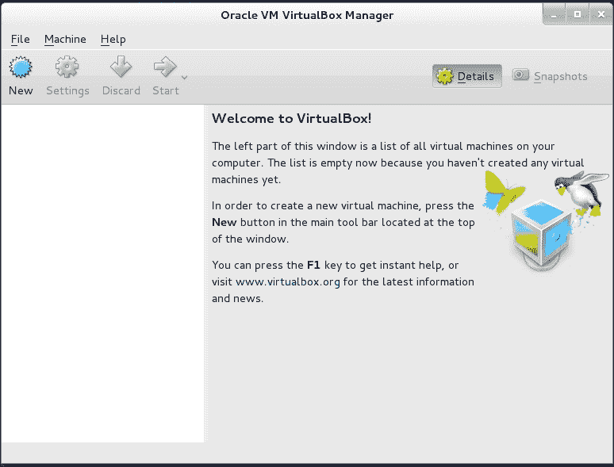

然后，我们可以继续并创建一个新的虚拟机。我们给它一个名字和一个类型，如下图所示:

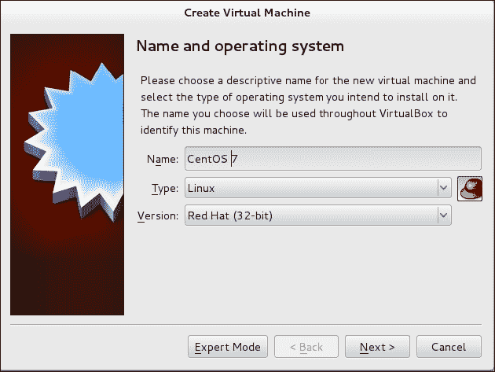

接下来，我们继续配置给的 RAM 量，如下图截图所示:

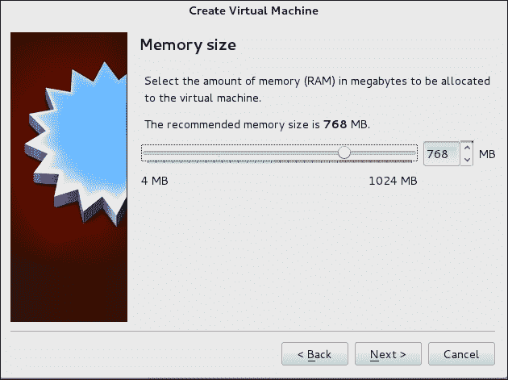

接下来是的磁盘空间量，如下所示:

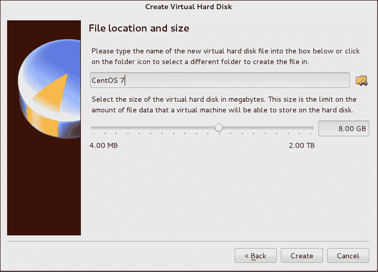

VirtualBox 提供了一些额外的服务，允许原系统的鼠标和键盘在物理机和虚拟机之间切换。要安装这些工具，我们可以进入 VM 菜单，然后进入 **Guest** 选项，然后安装虚拟机 Guest 工具。安装需要一段时间，然后我们需要重启虚拟机，这样那些工具才能开始工作。

最后，我们准备好要执行的虚拟机，如下图所示:

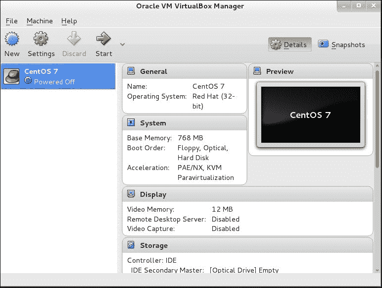

# 在 CentOS 7 上设置 Docker

在使用容器技术上，Docker 与 OpenVZ 共享相同的技术，是基于容器的软件虚拟化的另一种选择。Docker 以其自动部署应用程序的能力而闻名。那些模板或容器被划分为由 Docker 社区提供的模板形式的社区容器，或者由个人用户提供的私有容器。一些用户个性化的容器可以公开使用，其他的可以存储在一个私人文件夹中，这些文件夹可以被它们的创建者或者他想与之共享的人访问。Docker 容器是可移植的、轻量级的和封装的应用程序模块。

根据行业分析公司，451 研究:

> *“Docker 是一种工具，可以将应用程序及其依赖项打包到一个虚拟容器中，该容器可以在任何 Linux 服务器上运行。这有助于在应用程序可以运行的位置实现灵活性和可移植性，无论是在内部、公共云、私有云、裸机等位置。”*

要安装 Docker，我们将使用 Docker 安装脚本。这里，我们有另一种通过 YUM 安装 Docker 的方法——传统方法:

1.  首先，我们需要确保我们的系统包已经更新:

    ```sh
    $ sudo yum update

    ```

2.  Then, we run the Docker installation script:

    ```sh
    $ sudo curl -sSL https://get.docker.com/ | sh

    ```

    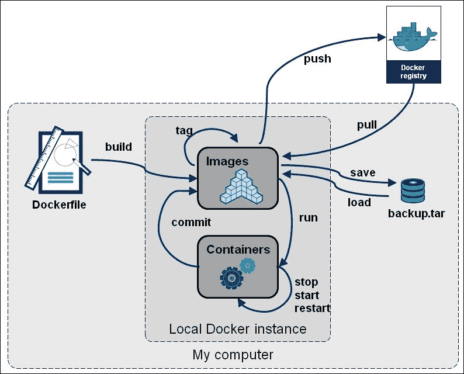

    来源:[http://blog.ouseful.info/](http://blog.ouseful.info/)

3.  该脚本将把 Docker 存储库添加到系统存储库中，然后安装 Docker。
4.  如果有太多的用户要在我们的系统中使用 Docker，我们需要将他们添加到 Docker 组:

    ```sh
    $ sudo usermod -aG docker packt

    ```

5.  然后，我们启动 Docker 守护程序。添加到系统启动脚本中:

    ```sh
    $ sudo systemctl docker start
    $ sudo systemctl enable docker.service

    ```

6.  为了验证 Docker 是否正确安装，我们有一个简单的图像容器可以测试:

    ```sh
    $ sudo docker run hello-world

    ```

7.  要下载 Docker 容器，我们需要查找它的名称，然后键入以下命令:

    ```sh
    $ sudo docker pull centos7

    ```

8.  要运行容器，我们需要使用带有`-i`选项的`docker run`命令将`stdin`和`stdout`附加到容器，并使用`-t`选项分配一个`tty`接口:

    ```sh
    $ sudo docker run -i -t centos7 /bin/bash

    ```

9.  要离开码头集装箱而不丢失空壳码头，我们需要同时遵循以下顺序:`Ctrl-p`和`Ctrl-q`。
10.  For more community containers that are publicly available on the Web, we can always use the following command:

    ```sh
    $ sudo docker search centos7

    ```

    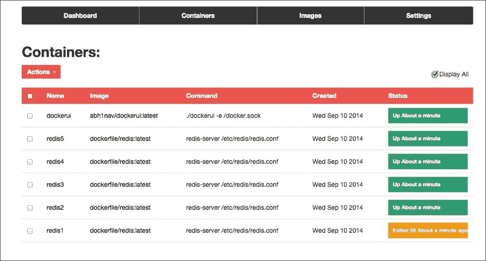

    来源:[http://blog.ouseful.info/](http://blog.ouseful.info/)

# 使用 HAProxy 建立服务的高可用性

在这一节中，我们将简要展示如何设置高可用性/负载平衡器来控制特定服务上的流量；在我们的例子中，我们将使用 HTTP 作为 web 服务器的流量。


来源:[assets.digitalocean.com](http://assets.digitalocean.com)

对于这项工作，我们使用 HAProxy 作为开源解决方案，通过多台服务器实现负载平衡和服务的高可用性。它通常用于网站的流量负载平衡。HAProxy 将工作负载分布在许多提供相同服务的服务器上(基本上是 web 服务器、数据库等)，以提高服务的整体性能及其可靠性。

如前所述，本节将安装和配置一个高可用性负载平衡器，以便在服务器或服务出现故障时，在三个 web 服务器和一个备份服务器之间分担负载。

因此，我们将有一个如下所示的基础架构:

*   HAProxy 服务器:
    *   **OS** :美分 7
    *   **IP 地址** : 172.25.25.166 和 10.0.0.10
    *   **主机名称**:haproxy . package . co . uk
*   Web 服务器 1:
    *   **OS** :美分 7
    *   **IP 地址** : 10.0.0.11
    *   **主机名称**:web server 1 . package . co . uk
*   Web 服务器 2:
    *   **OS** :美分 7
    *   **IP 地址** : 10.0.0.12
    *   **主机名称**:web server 2 . package . co . uk
*   Web 服务器 3:
    *   **OS** :美分 7
    *   **IP 地址** : 10.0.0.13
    *   **主机名称**:web server 3 . package . co . uk
*   Backup web server:
    *   **OS** :美分 7
    *   **IP 地址** : 10.0.0.20
    *   **主机名**:backupwebserver.packt.co.uk

    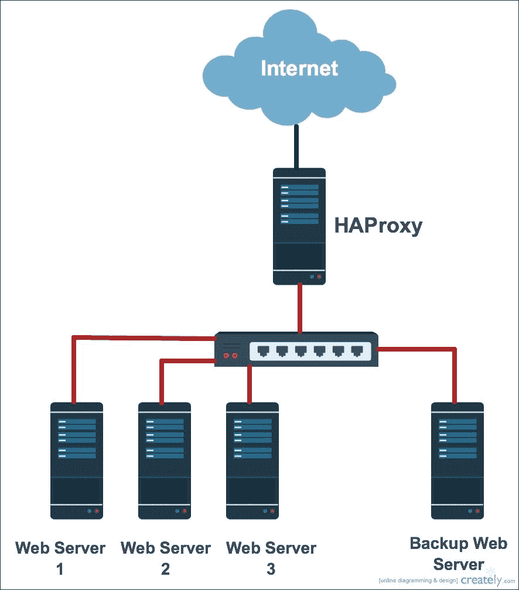

首先，我们将从设置网络服务器开始，为此，我们将只使用 Apache 在安装后生成的默认页面。有关如何设置网络服务器的更多信息，您可以随时参考[第 3 章](3.html#PNV62-f9a6cd90c19b48959347647adb332073 "Chapter 3. Linux for Different Purposes")、*不同用途的 Linux】。所以，我们只需要安装 Apache并运行，我们需要配置网络和机器的主机名。*

首先，我们将使用 CentOS 7 YUM 的默认包管理器来安装 Apache web 服务器:

```sh
$ sudo yum install httpd

```

然后，我们配置主机名:

```sh
$ sudo nano /etc/hostname

```

我们确保它看起来像这样:

```sh
Webserver1.packt.co.uk

```

之后，我们转到每个主机文件，将域配置为默认的本地主机，同时添加所有服务器及其 IP 地址的列表:

```sh
$ sudo nano /etc/hosts

```

### 注

只有在基础设施内部没有可靠的可以解析所有基础设施服务器的 DNS 服务器的情况下，才需要这个部分。

我们更改默认本地主机地址`127.0.0.1`域名:

```sh
127.0.0.1  webserver1  Webserver1.packt.co.uk

```

然后，我们添加以下几行:

```sh
10.0.0.10  haproxy  haproxy.packt.co.uk
10.0.0.11  Webserver1  Webserver1.packt.co.uk
10.0.0.12  Webserver2  Webserver2.packt.co.uk
10.0.0.13  Webserver3  Webserver3.packt.co.uk
10.0.0.20  backupWebserver   backupWebserver.packt.co.uk

```

在结束之前，我们需要打开网络服务器防火墙上的 HTTPS 和 HTTPS 端口，使访问者可以访问该服务:

```sh
$ sudo firewallcmd permanent zone=public addport=80/tcp
$ sudo firewallcmd permanent zone=public addport=443/tcp
$ sudo firewallcmd reload

```

通过这一步，我们可以说我们已经准备好了所有的网络服务器。我们现在可以转移到我们的 HAProxy 服务器安装。首先，我们需要为 HAProxy 使用的 web 服务和日志接收打开所需的端口:

```sh
$ sudo firewallcmd permanent zone=public addport=80/tcp
$ sudo firewallcmd permanent zone=public addport=443/tcp
$ sudo firewallcmd permanent zone=public addport=514/udp
$ sudo firewallcmd reload

```

然后，我们可以开始安装:

```sh
$ sudo yum install haproxy

```

现在，我们进入配置部分。在进行主 HAProxy 配置之前，我们需要设置用于调试的 HAProxy 日志功能配置:

```sh
$ sudo nano /etc/haproxy/haproxy.cfg

```

在**#全局设置**选项下，我们需要确保以下行没有注释:

```sh
log         127.0.0.1 local2 info

```

在`Rsyslog`配置文件中也需要进行一些小的修改:

```sh
$ sudo nano /etc/rsyslog.conf

```

这就是我们需要取消以下两行注释的地方:

```sh
$ModLoad imudp
$UDPServerRun 514

```

在结束之前，我们需要在`Rsyslog log`文件夹中有一个代表`HAProxy`的文件:

```sh
$ sudo nano /etc/rsyslog.d/haproxy.conf

```

在使用 Nano 创建它的时候，我们需要在里面放入下面的一行:

```sh
local2.*  /var/log/haproxy.log

```

保存文件，然后应用更改并重新启动`Rsyslog service`:

```sh
$ sudo systemctl restart rsyslog.service

```

现在，我们可以转到 HAProxy 全局设置配置:

```sh
$ sudo nano /etc/haproxy/haproxy.cfg

```

首先，在默认部分，我们需要为更个性化的解决方案设置超时。由于我们的服务器只是进行负载平衡，我们可以一直使用端口 80。因此，我们需要接管该端口，消除它与`Httpd`服务的关联:

```sh
$ sudo nano /etc/httpd/conf/httpd.conf

```

然后，我们将监听端口更改为 80 以外的任何端口。在我们的示例中，`8080`:

```sh
Listen 8080 

```

然后，我们转到 **【主前端】**部分，更改 web 界面服务的端口。因此，我们需要将整个部分更改为如下所示:

```sh
Frontend  HAProxy
bind  *:80
reqadd X-Forwarded-Proto:\ http
default_backend  HAProxy

```

我们需要注释掉**后端**部分，替换为以下内容:

```sh
# use_backend static  if url_static
backend HAProxy *:80
mode http
stats enable
stats hide-version
stats uri /stats
stats realm Haproxy\ Statistics
stats auth haproxy:password    # Change "password" with a well secured password
balance roundrobin 
option httpchk
option  httpclose
option forwardfor
cookie LB insert
 server webserver1 10.0.0.11:80 cookie webserver1 check
server webserver3 10.0.0.12:80 cookie webserver2 check
server webserver3 10.0.0.13:80 cookie webserver3 check
server backupwebserver 10.0.0.20:80 check backup

```

我们需要确保文件的结尾与我们的基础架构 IP 地址和主机名相匹配。然后，我们可以启动 HAProxy 服务器，并将其添加到启动系统服务中:

```sh
$ sudo systemctl start haproxy.service
$ sudo systemctl enable haproxy.service

```

要验证配置文件中没有错误，我们可以使用以下命令检查服务状态:

```sh
$ sudo systemctl status haproxy.service -l

```

然后，我们获取每个 web 服务器，并放置一个测试页面，以便访问它并收集测试结果。然后，我们打开 HAProxy 的 web 界面，可视化负载均衡`http://10.0.0.10/stats`或`http://172.25.25.166/stats`的状态。


如果我们看到下面的界面，这意味着我们的高可用性服务器运行良好。如果我们需要启用 https 来使用 SSL 访问 HAProxy 的 web 界面，我们总是可以安装 OpenSSL 并配置我们的服务器来使用它。

# 参考文献

现在，让我们看看本章中使用的参考文献:

*   **VMware** **文档中心**:[http://pubs.vmware.com/vsphere-51/index.jsp](http://pubs.vmware.com/vsphere-51/index.jsp)
*   **VMware** **虚拟化**:[http://www.vmware.com/virtualization.html](http://www.vmware.com/virtualization.html)
*   **全** **虚拟化维基**:[https://en.wikipedia.org/wiki/Full_virtualization](https://en.wikipedia.org/wiki/Full_virtualization)
*   **半虚拟化** **维基**:[https://en.wikipedia.org/wiki/Paravirtualization](https://en.wikipedia.org/wiki/Paravirtualization)
*   **Xen 项目****wiki**:[http://wiki.xen.org/wiki/Xen_Project_Software_Overview](http://wiki.xen.org/wiki/Xen_Project_Software_Overview)
*   **KVM 首页** **页面**:[http://www.linux-kvm.org/page/Main_Page](http://www.linux-kvm.org/page/Main_Page)
*   **OpenVZ home** **页**:https://openvz . org/main _ page
*   **VirtualBox** **首页**:[https://www.virtualbox.org](https://www.virtualbox.org)
*   **码头工人** **文件**:[http://www.modssl.org/docs/](http://www.modssl.org/docs/)
*   **快乐网页** **页面**:[http://www . haproxy . org/](http://www.haproxy.org/)

# 总结

本章首先简要介绍了虚拟化的基础知识。然后，我们定义了完全虚拟化和半虚拟化。接下来，为了更好地解释实际使用各种开源虚拟化工具的所有情况，我们从 Xen 开始，将其作为半虚拟化和完全虚拟化解决方案。我们将 KVM 作为完整的虚拟化解决方案、容器虚拟化、OpenVZ 和 VirtualBox 工具。这允许通过其漂亮的图形界面轻松设置。

我们用 Docker 及其使用网络容器的方式结束了这一章。到本章结束时，我们可以说已经看到了各种虚拟化技术以及如何使用这些技术创建虚拟机。

在下一章中，我们将有机会探索云计算技术，并使用开源解决方案 OpenStack 应用一些示例。