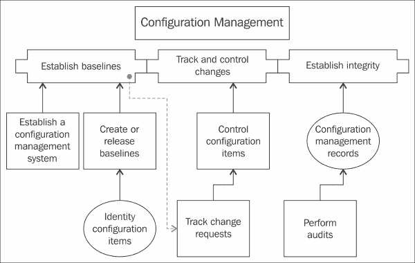
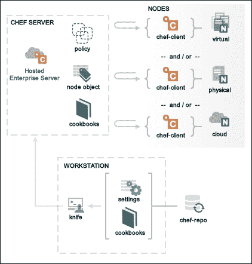
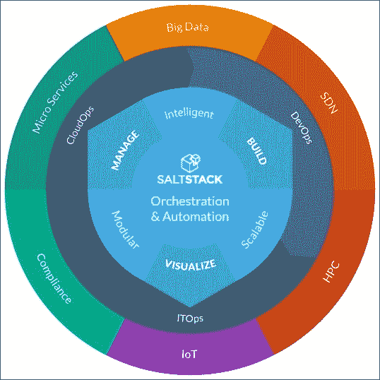
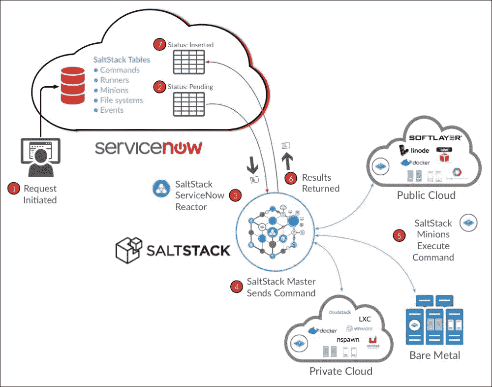
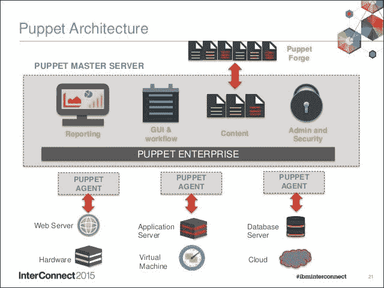
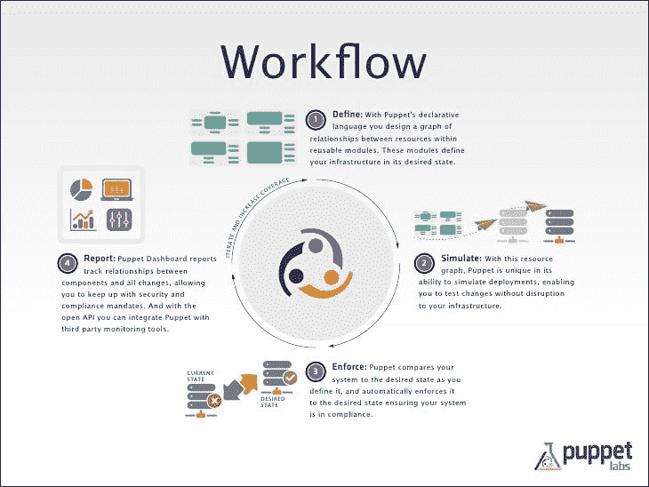
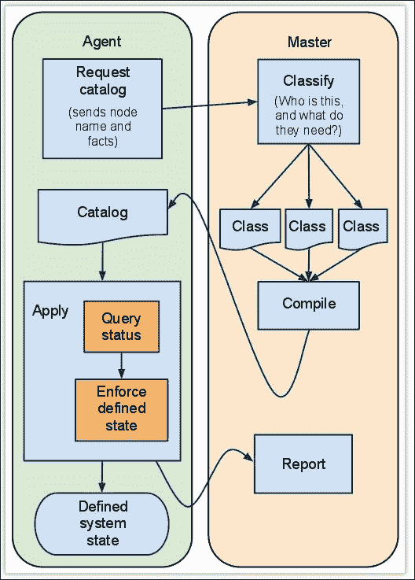
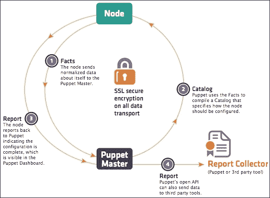
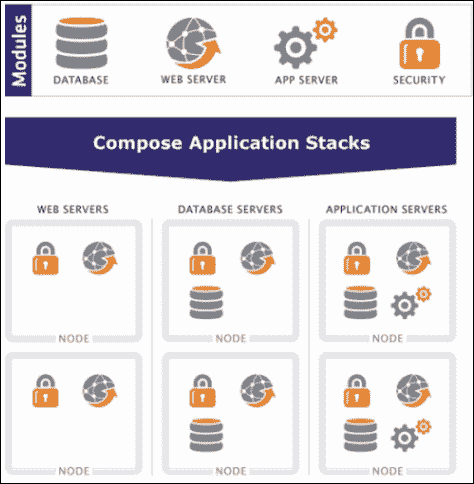

# 第八章。结构管理

根据一项研究，在大型信息技术系统中发生的大多数关键错误都是由于人员和流程造成的。这些错误中有一半是由于缺少发布同步、机器之间的协调和配置管理。对于任何一个团队来说，大型机械和基础设施都很难管理和维护。对于管理团队来说，为每台机器设置相同的配置以使它们同步工作是一个噩梦。出于这些原因，我们有一个名为**配置管理** ( **CM** )的流程。

在本章中，我们将描述如何使用 CM 流程来维护和管理 CentOS 7 Linux 服务器基础架构。我们将简要描述一些最常见的开源配置管理工具，并以一个使用 Puppet 为客户端设置管理服务器的示例为例。

通过本章，您将了解以下主题:

*   操作系统配置管理
*   开源配置管理工具
*   安装和配置 Puppet 服务器和客户端

# 引入配置管理

配置管理是一个帮助组织多个机器/系统的过程，这样它们可以相互协调来执行一个相当大的过程或运行多个冗余的过程。军事组织广泛使用它来管理他们的系统，如武器系统、车辆和信息系统。在军队之外，它被广泛用于大基础设施处理的信息技术服务管理。

仍然有许多信息技术组织使用旧的和传统的工具，如定制脚本(shell 脚本、expect 脚本等)和手动流程实现来运行重复的任务。我们已经充分认识到，这些技术不再有效，尤其是在大规模基础设施中使用时。即使对于小型基础架构，也很难跟踪和维护它们，因为配置会一直变化。所有这些都可能对基础架构本身的可靠性产生直接影响，这也可能影响组织的生产力。

自动化配置管理结束了手动脚本和配置；它还被用来执行大多数系统管理员日常执行的其他任务(系统更新、固件补丁、版本更新和管理等)。

对于新一代系统管理员来说，一切都是自动化的。大多数机器运行在相同的配置集和一组管理它们的服务器上。一切都由监控工具监控。系统管理员的工作是初始化他们的基础架构的基本配置，以启动他们的配置管理服务器，如果需要，在其他机器上设置客户端，然后开始向客户端发送配置以应用它。配置管理服务器将充当木偶的主人，并向他们发送直接命令，无论他们的架构或操作系统类型是什么。



来源:[http://flylib.com/](http://flylib.com/)

对于我们的案例，我们将设置一个 CentOS 7 服务器，使用配置管理来控制 CentOS 7 客户端，我们将向您展示手动配置是多么耗时和不可靠。在此之前，我们将向您展示用于配置管理的著名开源工具列表:


来源:[http://www . axios systems . it](http://www.axiossystems.it)

# 开源配置管理工具

在这一节中，我们将列举世界上最著名的开源配置管理工具，通过对每个工具的描述，主要重点，以及它可以很好地服务于哪里。

## 厨师

Chef 是一个配置管理工具，帮助我们配置和维护提供各种服务的服务器。厨师使用一种叫做菜谱的东西，用来描述服务器应用程序和实用程序所需的管理(配置、安装、更改)。它被广泛用于基于云计算平台的基础设施(如 Rackspace、Internap、亚马逊、谷歌、OpenStack、SoftLayer 和微软)，因为它能够在旅途中自动调配和配置新机器。Chef 的可扩展性允许其按需用于小型和大型基础设施。

厨师可以作为服务器或客户端执行。客户端在我们希望使用服务器管理的服务器/机器上执行。厨师服务器代理安装在一个集中式服务器上，根据管理员为每个节点(web 服务器、集群机、存储服务器等)定义的内容来管理菜谱。然后客户端执行服务器发送给它的食谱。默认情况下，客户端每 30 分钟从服务器更新一次其配方，以查看是否有任何需要进行的更改。

在项目开始时，Chef 过去只管理 Linux 机器，但现在它也能够管理 Windows 机器。厨师服务器现在支持多种 Linux 平台(RHEL/中央操作系统、自由软件开发、OSX、Solaris 等)。

这就是它的样子在建筑方面，安装了厨师之后。第一张图片展示了厨师和各种可以管理的节点之间的交互。



来源:[http://www.yet.org](http://www.yet.org)

下面的截图显示了 chef 和 Amazon web 服务之间的交互，用于高级配置


来源:[https://www.chef.io/](https://www.chef.io/)

### 注

关于如何设置和掌握厨师的更多详细信息，请查看帕克特关于厨师的其他书籍，网址为:[https://www.packtpub.com/all/?search=chef](https://www.packtpub.com/all/?search=chef)

## 盐堆(盐)

SaltStack 是一个基于 Python 的开源配置管理工具。它也被称为远程引擎。在某种程度上，这是一种新的基础设施管理方法。它易于运行，可扩展，可以处理数千个节点，并且可以在其节点(服务器、终端等)之间建立非常快速的通信。

这是众所周知的，因为它在它所创建的基础设施内部进行动态通信，在那里它通过节点组织、执行和建立配置管理，以及其他更多功能，从中获得了惊人的好处。

它可用于各种操作系统(CentOS、Debian、RHEL、Ubuntu，甚至 Windows)。

Salt 被设计成非常可扩展的，其中它具有使用模块管理的能力，以便可模制到各种应用。Salt 提供动态模块来管理组件的远程执行和管理。它们被分类如下:执行模块、状态模块、粒度、渲染器模块、返回器和运行器。

SaltStack 有一个付费产品，叫做 SaltStack Enterprise。它是为 It 组织中的大型基础架构、系统管理、站点可靠性工程以及现代数据中心基础架构、应用程序和代码的开发配置和管理而设计的。下图简要描述了它，显示了它如何覆盖各种领域，以帮助建立、管理和维护以下两个图中显示的以下服务:



来源:[http://www.saltstack.com](http://www.saltstack.com)

该图显示了三个主要服务(ITOps、DevOps、CloudOps)之间的交互，以及使用 SaltStack 一起管理这些服务的能力。


来源:[http://www.saltstack.com](http://www.saltstack.com)

如下图所示，SaltStack 服务在几个步骤上操作:



来源:[http://saltstack.com](http://saltstack.com)

### 注

关于如何设置和掌握盐栈的更多详细信息，请查看帕克特在盐栈上的其他一些书籍，网址为:[https://www.packtpub.com/all/?search=saltstack](https://www.packtpub.com/all/?search=saltstack)。

## 可转换

Ansible 是一款免费的和简单的配置管理解决方案。它以自动配置管理而闻名，通过这种方式，它依赖 SSH 来访问节点，并通过基于 Python 的解决方案来配置它们。它使用最少的依赖和环境工具(如客户端代理)，并且是安全的。它也非常可靠，并且不需要非常高级的学习课程就可以开始使用。

它的配置需要编辑一些人类可读的配置文件，以确保每个人都能理解它们，如果需要更新或重新配置的话。它只需要 SSH 密码或 SSH 密钥来访问要管理的节点，而不需要安装代理。因此，绝对不需要担心由于升级、补丁或守护程序故障而导致代理无法运行。

Ansible 也支持模块。基本上，它们大多数运行在 JSON 上，并且它对各种编程语言都有标准输出支持。它还包括 200 多个模块，可用于管理和自动化服务。

它得到了 RHEL 社区的大力支持(红帽、软呢帽、CentOS 和科学 Linux)。它可以通过 EPEL 知识库轻松下载。它也得到 Debian 家族的其他 Linux 发行版和其他类似 Unix 的系统的支持，如 OS X、BSD，以及最近的微软视窗系统。


来源:[https://sysadmincasts.com](https://sysadmincasts.com)

### 注

关于如何设置和掌握 Ansible 的更多详细信息，请查看 Packt 关于 Ansible 的其他书籍，网址为:[https://www.packtpub.com/all/?search=ansible](https://www.packtpub.com/all/?search=ansible)

## 木偶

Puppet 是一个开源配置管理工具，旨在管理和配置同一基础设施内的机器，以简化各种系统管理任务，其中用户使用不同的方式(Ruby DSL、Puppet 声明语言等)声明机器的状态和资源。它是在 GPL 和 Apache 许可下发布的。它主要用于管理和配置基于 Unix 的机器和微软系统。为了建立 Puppet，作为最佳实践，我们需要一个 Puppet 服务器代理来扮演配置管理服务器的角色，对于服务器将要管理的其他节点，我们需要客户端版本。Puppet 检查每个节点的配置，然后确定在其配置文件中指定的新旧配置之间的变化(如果有)。然后，它开始进行所需的更改，以将节点调整到指定的状态。这个任务很有用；不仅是为了建立新的配置，也是为了在机器出现任何问题时重新获得配置。

基本上，Puppet 的主要优势在于它自动化了软件交付过程的每一步，从物理机和虚拟机的配置到组织和报告。木偶被许多组织广泛使用，因为它有以下特点:

*   它旨在防止问题解决过程中的重复
*   它提供了自动进行快速和可重复配置的能力
*   它简化了物理和虚拟设备的管理
*   它使系统管理的任务变得更加容易

Puppet 提供两种服务:一种是开源免费解决方案，另一种是企业付费解决方案。这两者都有助于系统管理员实现基础架构配置管理的自动化。傀儡企业可以为大企业提供更多。



来源:[http://www.slideshare.net/](http://www.slideshare.net/)

傀儡不仅仅是一个简单的配置管理工具。这是一个简化的节点安装、管理和修复解决方案，简化了节点网格的管理。

如下图所示，要使用 Puppet 建立新配置，需要遵循四个重要步骤:定义、模拟、强制和报告。这里，系统管理员首先定义需要设置什么样的配置。然后，Puppet 在不损害基础设施的情况下测试部署，并确保它可以正常工作。之后，Puppet 开始比较新的东西和已经使用的东西，并开始强制执行需要做什么来满足用户的需求。最后，它在其仪表板上报告每个节点的状态。



来源:[http://www.slideshare.net](http://www.slideshare.net)

### 安装和配置傀儡

对于我们的 Puppet 安装，我们将安装免费开源版本的 Puppet。

我们选择 Puppet 作为我们的主要配置管理解决方案，因为 Puppet 是一个更具声明性的解决方案。这使得它比任何其他解决方案都更有吸引力。

傀儡有两种可能的架构:代理/主架构或独立架构。代理/主架构基于一个或多个管理服务器/节点的傀儡主服务器，该服务器/节点具有作为后台服务运行的傀儡客户端代理。在独立架构中，客户端节点同时作为主代理和从代理运行 Puppet。通常用于为安装它的机器安排管理任务或作业。

在本章中，我们将使用客户端/主服务器架构，其中我们将使用两台 CentOS 7 服务器；一个将作为主 Puppet 服务器，另一个作为 Puppet 代理将运行的客户端。

在开始安装之前，我们需要确保一些预安装任务已经完成。我们已经决定了架构，所以我们对要安装哪些软件包有了更好的想法。

然后我们应该定义哪台机器将充当 Puppet 服务器代理。我们应该总是先安装服务器，然后再安装客户端。

下图显示了当试图建立管理器从 Puppet 主界面请求的更改时，Puppet 主界面和客户端之间的交互:



来源:[http://elatov . github . io/2014/08/setting-puppet-master on-centos-7/](http://elatov.github.io/2014/08/setting-up-puppet-master-on-centos-7/)

我们的基础设施将包括以下内容:

*   傀儡主服务器:
    *   **OS** : `CentOS 7`
    *   **IP 地址** : `10.0.0.10`
    *   **主机名** : `masterpuppet.packt.co.uk`
*   第一个客户端服务器:
    *   **OS** : `CentOS 7`
    *   **IP 地址** : `10.0.0.11`
    *   **主机名** : `webserver1.packt.co.uk`
*   第二个客户端服务器:
    *   **OS** : `CentOS 7`
    *   **IP 地址** : `10.0.0.12`
    *   **主机名** : `webserver2.packt.co.uk`

通常，我们应该检查基础设施的客户端和服务器使用的是哪个 Linux 版本和系列。在我们的例子中，我们已经为我们环境中的所有机器定义了 CentOS 7。

之后，Puppet 架构将通过网络进行管理，因此我们应该确保所有节点(服务器和客户端)都配置良好，能够运行 Puppet 流量。我们需要为服务器端的传入连接打开默认的 Puppet 访问端口 8140，以便客户端可以访问:

```sh
$ sudo firewall-cmd --permanent --zone=public --add-port=8140/tcp
$ sudo firewall-cmd --reload

```

最后，对于网络，我们应该为所有节点配置一个唯一的主机名，并且每台机器都需要在其`/etc/hosts`文件中包含所有其他定义有其 IP 地址的机器:

```sh
$ sudo nano /etc/hosts
10.0.0.10  masterpuppet.packt.co.uk
10.0.0.11  webserver1.packt.co.uk
10.0.0.12  webserver2.packt.co.uk

```

为了确保节点之间的所有确认都是同步的，我们需要建立一个网络时间服务器(使用 NTP)连接，以使所有节点在同一时间同步:


我们现在可以开始安装我们的 Puppet 服务器了:

1.  第一步是启用提供 Puppet、PuppetDB 和其他包的 Puppet 开源存储库。我们将使用 RPM 将 Puppetlabs 文件添加到系统中:

    ```sh
    $ sudo rpm -ivh https://yum.puppetlabs.com/puppetlabs-release-el-7.noarch.rpm

    ```

2.  然后我们安装傀儡服务器:

    ```sh
    $ sudo yum install puppet-server

    ```

3.  我们需要接受安装经理可能会问的所有问题，例如 RPM-GPG-Key 验证，以及我们是否要安装软件包。
4.  然后我们需要配置 Puppet，了解这个节点就是主 Puppet 服务器:

    ```sh
    $ sudo nano /etc/puppet/puppet.conf

    ```

5.  接下来，我们需要在`[main]`部分添加这两行:

    ```sh
     dns_alt_names = masterpuppet,masterpuppet.packt.co.uk
     certname = masterpuppet.packt.co.uk

    ```

6.  由于这是我们的 Puppet 服务器，我们需要创建它的证书。我们需要手动启动 Puppet 服务器，直到它创建所需的证书。之后，我们需要停止它，因为我们还在运行配置:

    ```sh
    $ sudo puppet master --verbose --no-daemonize

    ```

7.  得到以下消息后，我们需要按 Ctrl + C 停止服务:

    ```sh
    Notice: Starting Puppet master version 3.8.4

    ```

在这一点上，我们可以开始木偶。但是我们希望将 Puppet 服务与 Apache 集成在一起，通过安装一个特殊的模块，使其成为一个可以同时服务两者的服务。为此，我们需要安装一些有用的软件包:

```sh
$ sudo yum install mod_passenger curl curl-devel make automake httpd httpd-devel mod_ssl ruby-devel rubygems gcc gcc-c++ pygpgme zlib-devel openssl-devel

```

然后我们需要安装乘客，这是一个开源工具，我们将使用它来安装一些 Apache 插件，以帮助开发 Puppet 网络服务器。对于安装任务，我们将使用 GEM，一个用于安装基于 Ruby 的包的 Ruby 工具:

```sh
$ sudo gem install rack passenger

```

从那时起，我们可以安装乘客阿帕奇模块。对于 CentOS 7，我们需要定位可执行文件。在安装过程中，它不会在 BIN 环境中获取其二进制集。因此，我们需要从安装它的地方执行它:

```sh
$ sudo locate passenger-install-apache2-module 
$ sudo /usr/local/share/gems/gems/passenger-5.0.21/bin/passenger-install-apache2-module

```


之后，我们按照最后一个命令提供的指令如下。

首先，我们需要编写`1`来安装 Apache 2 模块:

```sh
1\. The Apache 2 module will be installed for you.

```

然后我们只要在程序要求的时候输入*进入*。我们可以忽略这些警告，希望不会出现错误。否则，我们需要确保之前已经安装了所有需要的工具。我们知道，当我们看到错误和警告摘要时，它就完成了，我们得到这样的信息:

```sh
Phusion Passenger is a registered trademark of Hongli Lai & Ninh Bui.

```

接下来，我们创建两个目录，Puppet 将在其中生成其公共和临时文件，并将所有权设置为其配置文件:

```sh
$ sudo mkdir -p /usr/share/puppet/rack/puppetmasterd/public /usr/share/puppet/rack/puppetmasterd/tmp
$ sudo cp /usr/share/puppet/ext/rack/config.ru /usr/share/puppet/rack/puppetmasterd/
$ sudo chown puppet:puppet /usr/share/puppet/rack/puppetmasterd/config.ru

```

最后，我们在 Apache2 配置目录下创建 Puppet 虚拟主机文件，如下所示:

```sh
$ sudo nano /etc/httpd/conf.d/puppetmaster.conf

```

我们用以下配置选项填充它，根据我们在不同环境的上配置的内容更改红色文本:

```sh
# CentOS 7:
# Set those as the Gems and Passenger version installed on your system
LoadModule passenger_module  /usr/local/share/gems/gems/passenger-5.0.21/buildout/apache2/mod_passenger.so
PassengerRoot /usr/local/share/gems/gems/passenger-5.0.21/

PassengerRuby /usr/bin/ruby
# And the passenger performance tuning settings:
PassengerHighPerformance On
PassengerUseGlobalQueue On
# Passenger Max Pool should be configured as 3/2 the number of CPU cores of the master machine:
PassengerMaxPoolSize 4
# Limit number of request before recycling
PassengerMaxRequests 1000
# Limit time for process to set as idle
PassengerPoolIdleTime 600
Listen 8140
<VirtualHost *:8140>
 SSLEngine On
 # Only allow high security cryptography. Alter if needed for compatibility.
 SSLProtocol             All –SSLv3
 SSLCipherSuite          HIGH:!ADH:RC4+RSA:-MEDIUM:-LOW:-EXP
 SSLCertificateFile	/var/lib/puppet/ssl/certs/unixmen-centos7.arnhem.chello.nl.pem
 SSLCertificateKeyFile	/var/lib/puppet/ssl/private_keys/unixmen-centos7.arnhem.chello.nl.pem
 SSLCertificateChainFile /var/lib/puppet/ssl/ca/ca_crt.pem
 SSLCACertificateFile    /var/lib/puppet/ssl/ca/ca_crt.pem
 SSLCARevocationFile     /var/lib/puppet/ssl/ca/ca_crl.pem
 SSLVerifyClient         optional
 SSLVerifyDepth          1
 SSLOptions              +StdEnvVars +ExportCertData
 # These request headers are used to pass the client certificate
 # authentication information on to the puppet master process
 RequestHeader set X-SSL-Subject %{SSL_CLIENT_S_DN}e
 RequestHeader set X-Client-DN %{SSL_CLIENT_S_DN}e
 RequestHeader set X-Client-Verify %{SSL_CLIENT_VERIFY}e
 #RackAutoDetect On
 DocumentRoot /usr/share/puppet/rack/puppetmasterd/public/
 <Directory /usr/share/puppet/rack/puppetmasterd/>
 Options None
 AllowOverride None
 Order Allow,Deny
 Allow from All
 </Directory>
</VirtualHost>

```

我们将 SELinux 设置为允许新模块使用资源:

```sh
$ sudo nano /etc/selinux/config

```

接下来，我们将 SELINUX 选项更改如下:

```sh
SELINUX=permissive

```

然后，我们需要重新启动 Apache 服务，并将其添加到系统启动服务中，同时禁用 Puppet 服务:

```sh
$ sudo systemctl restart httpd.service
$ sudo systemctl enable httpd.service
$ sudo systemctl disable puppetmaster.service

```

完成这一步后，我们可以说已经完成了服务器的配置。我们现在可以开始设置和配置客户端了。



来源:[http://www.aosabook.org](http://www.aosabook.org)

如前所述，我们需要来确保`/etc/hosts`文件配置良好，并且上面有所有节点(无论是客户端还是服务器)。此外，我们需要确保 NTP 服务正在运行，并为与我们的服务器相同的时间服务器加载时间。通常，我们可以使用系统设置的默认设置，这很好:

```sh
$ sudo yum install ntp ntpdate
$ sudo systemctl start ntpd
$ sudo systemctl enable ntpd

```

对于服务器，我们做同样的事情来为客户机配置 Puppet 存储库:

```sh
$ s
udo rpm -ivh https://yum.puppetlabs.com/puppetlabs-release-el-7.noarch.rpm

```

然后我们安装 Puppet 客户端代理:

```sh
$ sudo yum install puppet

```

接下来，就在启动服务之前，我们需要将 Puppet 主服务器 id 添加到客户端代理配置文件中。因此，我们继续编辑木偶配置文件。我们在代理选项下添加服务器地址:

```sh
$ sudo nano /etc/puppet/puppet.conf
[agnet]
server = masterpuppet.packt.co.uk
report = true
pluginsync = true

```

然后，我们保存文件，启动服务，并为系统启动服务启用它:

```sh
$ sudo systemctl enable puppet.service
$ sudo systemctl start puppet.service

```

我们需要对所有客户端服务器做同样的事情。

之后，我们返回到我们的 Puppet 服务器，检查证书是否已经发送:

```sh
$ sudo puppet cert list

```

我们应该看到这样的东西:

```sh
"webserver1.packt.co.uk" (SHA256) 04:55:E0:82:4E:AD:7F:3C:9C:C7:52:79:98:ED:5E:A6:B0:B5:85:08:DC:81:E5:2D:A6:32:ED:8B:5C:F4:3B:DA

```

这意味着我们有一个客户端请求服务器批准一个证书请求。我们可以使用以下命令对每个服务器证书进行签名:

```sh
$ sudo puppet cert sign webserver1.packt.co.uk

```

我们现在可以返回客户端，使用以下命令检查证书是否设置成功:

```sh
$ sudo puppet agent -t

```

如果我们得到以下输出，我们知道它配置良好:


在这一点上，我们的傀儡主机和客户端基础设施运行良好。让我们尝试从 Puppet 服务器创建一个配置，并将其发送到客户端进行应用。

我们需要在`/etc/puppet/manifest`文件夹中创建一个名为`site.pp`的清单文件，如下所示:

```sh
$ sudo nano /etc/puppet/manifests/site.pp

```

然后我们通过制作客户端节点(`webserver1`、`webserver2`)并安装一些工具来测试服务。我们需要将以下代码添加到上次打开的文件中进行编辑:

```sh
node 'webserver1', 'webserver2 {
              package { 'php' :
              ensure => installed,
                       }
}
```

为了验证 Puppet 是否运行良好，我们总是可以转到客户端并键入以下内容:

```sh
$ sudo puppet agent --test

```


默认情况下，Puppet 代理将每 30 分钟检查一次 Puppet 服务器，以查看是否发生了任何更改，以便应用它。因此，在测试过程中，我们总是可以强制手动更新，就像我们之前做的那样。通过在`[main]`部分下的 Puppet 配置文件中更改更新时间，可以更改更新时间，如下所示:

```sh
$ sudo nano /etc/puppet/puppet.conf
runinterval = 900 # To make change every 15 minutes (60 x time in minutes)

```

然后，我们可以将其更改为安装服务，并确保它正在运行:

```sh
node 'webserver1', 'webserver2 {

              package { 'httpd' : 
              ensure => installed, 
                       } ->  # this to ensure that the order before it is executed before going to the order after it
              service {'httpd': 
              ensure => running, 
              enable => true, 
                       }
}
```


我们也可以通过在程序之前强制安装 EPEL 存储库来安装一个仅位于 EPEL 存储库的程序:

```sh
node 'webserver1', 'webserver2 {        
package { 'epel-release' : 
              ensure => installed, 
                       }  ->
              package { 'iperf' : 
              ensure => installed, 
                       }
}
```


然后我们可以执行一些用户操作，在所有客户端服务器上创建一个用户。首先，我们需要在同一台机器上创建它，通过哈希来获得它的密码。然后我们编辑`site.pp`文件，给出一些关于用户的信息:

```sh
node 'webserver1' {

                 user { "usertest":  
                 ensure => "present",
                 shell => '/bin/bash', 
                 home => '/home/usertest', 
                 managehome => true, 
                 password => '############################', }
}
```

在完成这一章之前，我们想探索一下木偶实验室提供的额外模块，我们可以使用这些模块来执行简单的日常任务，而不需要创建自己的模块。要搜索模块，我们使用以下命令:

```sh
$ sudo puppet module search ftp

```

然后，要安装所需的，我们使用`install`选项:

```sh
$ sudo puppet module install puppetlabs-apache

```

然后，为了检查安装了什么，我们转到`/etc/puppet/module`文件夹，那里我们会有所有模块及其配置文件。我们可以根据我们的需要随时改变它们。



来源:[http://static.virtualizationpractice.com](http://static.virtualizationpractice.com)

### 注

我们相信我们已经展示了一些关于如何在 CentOS 7 中使用傀儡的不错的信息，但是傀儡仍然有很多东西可以提供给。要了解更多信息，请查看帕克特关于掌握木偶的其他书籍:[https://www.packtpub.com/all/?search=puppet](https://www.packtpub.com/all/?search=puppet)

# 参考文献

现在，让我们看看本章中使用的参考文献:

*   维基百科上的配置管理:https://en.wikipedia.org/wiki/Configuration_management
*   厨师网站:[https://www.chef.io/](https://www.chef.io/)
*   盐栈网站:[http://saltstack.com](http://saltstack.com)
*   Ansible 网站:[http://www.ansible.com](http://www.ansible.com)
*   傀儡网站:[https://puppetlabs.com](https://puppetlabs.com)
*   什么是傀儡网页:[https://puppetlabs.com/puppet/what-is-puppet](https://puppetlabs.com/puppet/what-is-puppet)

# 总结

在本章中，我们介绍了配置管理及其对系统管理员的好处，尤其是在大型计算机环境中工作时。我们简要介绍了一些众所周知的开源解决方案，用于在 Linux 服务器上进行配置管理，尤其是 CentOS 7。然后，我们选择 Puppet 作为我们的候选对象，在一个逐步的教程中展示如何设置和配置主/客户端架构。最后，我们在客户端节点上测试了一些命令。

在最后一章中，我们将向您展示一些我们认为一般使用 Linux 的系统管理员以及更具体地说使用 CentOS 的系统管理员应该知道的事情，以便以最佳实践方式更好地管理和保护他们的基础架构。