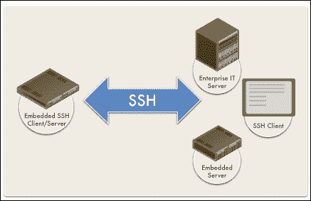
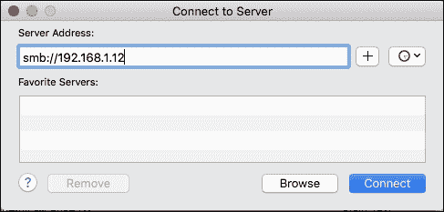
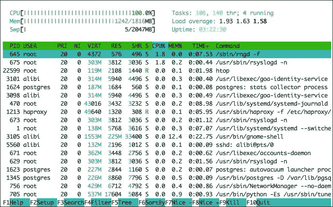
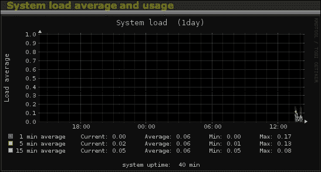
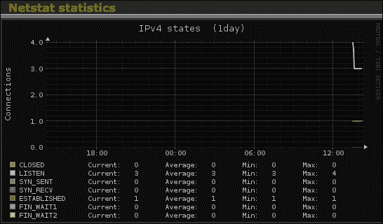
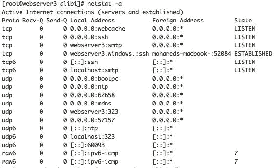
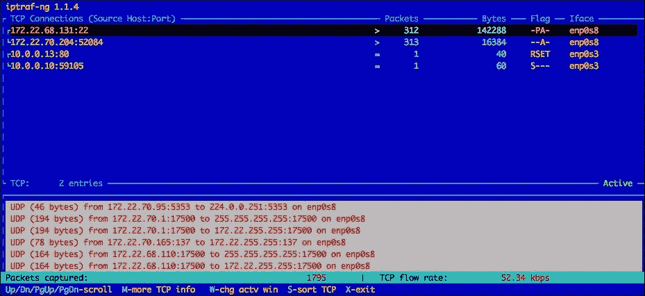
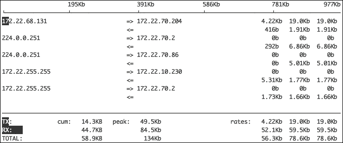

# 第九章。一些额外的技巧和工具

对于日常的 Linux 使用，大多数系统管理员/用户必须掌握一些技术来帮助他们充分利用 Linux 机器的潜力。这就像有一把瑞士军刀，用它来切菜。Linux 隐藏了许多用于日常任务的有用技术，CentOS 7 是许多用户可以用来解决大量问题的最新、最可靠的操作系统之一。

通过本章，我们将展示一些我们认为任何系统管理员都应该知道如何使用的最需要的工具。我们将展示如何使用这些技巧和工具来更好地管理 CentOS 7 服务器基础架构。

在本章中，我们将介绍以下主题:

*   使用 SSH 连接到多台 Linux 机器
*   保护 SSH 和根登录配置
*   基于 SSH 密钥的身份验证
*   SpamAssassin 的安装和配置
*   设置 Clamav 防病毒软件
*   Mytop 在 MySQL 数据库中的配置
*   为文件共享设置桑巴和 NFS
*   介绍一些 Linux 系统和网络监控工具

# 远程连接 SSH

众所周知，SSH 是我们用来远程连接到 Linux 机器的安全外壳连接。它是系统管理员用来远程管理其基础设施的主要工具。默认情况下，它是我们在 CentOS 7 和几乎所有 Linux 发行版的基本安装中找到的基本工具之一。

通常 SSH 只作为客户端安装，所以只能远程连接其他机器；但对于基本的系统安装来说，情况并非如此。安装 CentOS 7 服务器时应该已经安装并运行了 SSH 服务器。

要安装 SSH 服务器，我们只需依赖默认的包存储库，而无需添加任何额外的第三方存储库:

```sh
$ sudo yum install openssh-server

```

安装 SSH 服务器后，我们应该启动该服务，并为默认系统启动服务启用它:

```sh
$ sudo systemctl start sshd.service
$ sudo systemctl enable sshd.service

```

为了安全起见，大多数机器都关闭了默认 SSH 端口，因此我们需要从默认防火墙管理器打开它:

```sh
$ sudo firewallcmd permanent zone=public addport=ssh/tcp
$ sudo firewallcmd reload

```

这就是我们所需要做的，让机器可以远程访问。

要访问该机器，我们只需键入`ssh`，后跟用户名和 IP 地址或主机名(如果机器存储在 DNS 服务器上或列在本地`/etc/hosts`文件中)，即可连接到:

```sh
$ ssh user1@server1.packt.co.uk
$ ssh user1@10.0.0.10

```

通常，如果服务器正在运行并且`sshd`服务正在侦听，那么在第一次使用该机器连接到该服务器时，应该交换公钥。否则，服务器将只要求所需的用户密码来允许登录。

当我们使用 SSH 连接到一台远程机器时，就像我们有一个打开的窗口，我们有点坚持这样做，如果我们长时间使用它，这是一种消耗网络的连接方式，尤其是如果我们只是连接而没有真正键入任何命令。所以我们需要关闭终端窗口，离开远程连接会话，释放预留的资源。SSH 提供了一些有用的选项，比如`–t`。通过该选项，我们可以发送要在远程机器上执行的命令，并发回输出:

```sh
$ ssh -t user1@server1.packt.co.uk cat /etc/hosts

```

该命令将只显示`/etc/hosts`文件的内容，而不保持窗口打开。

我们也可以使用 SSH 在两台机器之间发送文件到远程机器或从远程机器发送文件，使用`scp`命令:

```sh
$ scp user1@server1.packt.co.uk:/home/user1/Desktop/file1.txt  ./Desktop/

```

在下一节中，我们将向您展示如何保护 SSH 和管理根登录。



来源:[https://www.allegrosoft.com/](https://www.allegrosoft.com/)

# 保护 SSH 和根登录配置

在这一节中，我们将展示一些保护 SSH 服务以减轻更多威胁的基本和高级方法。我们需要对`/etc/ssh/sshd_config`文件进行一些小的修改。我们将解释每一行，因为我们逐渐改变它:

```sh
$ sudo nano /etc/ssh/sshd_config

```

取消 SSH 版本 2 行的注释，只使用更新版本的 SSH，这样更安全可靠。该行应该如下所示:

```sh
Protocol 2

```

我们可以通过限制用户访问来限制一些用户访问服务器。我们使用 SSH 来做到这一点:

```sh
DenyUsers Baduser1 baduser2

```

然后，我们可以设置 SSH 连接的超时，以始终关闭在定义的时间段内不活动的会话。我们需要设置倒计时，从会话空闲的那一刻开始:

```sh
ClientAliveInterval 360
ClientAliveCountMax 0

```

然后我们可以使用 SSH 禁用根登录:

```sh
PermitRootLogin no

```

此外，我们可以禁用空密码使用，用户没有密码就无权登录:

```sh
PermitEmptyPasswords no

```

除此之外，我们还可以对密码验证做同样的事情。我们可以通过生成的密钥强制所有登录:

```sh
PasswordAuthentication no

```

那么警告横幅总是有用的。因此，如果我们需要创建一个，我们应该编辑`/etc/issues`并添加任何种类的横幅:

```sh
$ sudo nano /etc/issue

```

然后，我们应该重新启动服务，使其生效:

```sh
$ sudo systemctl restart sshd 

```

有些服务器是可以公开访问的，所以他们可能需要对 SSH 服务进行额外的增强。对于这项任务，我们将安装一个名为 **Fail2Ban** 的工具，这是一个非常可靠的工具，有助于保护许多服务免受暴力攻击。它基本上扫描特定服务的日志文件，并查找失败的登录尝试以阻止它们。要安装它，我们需要首先安装 EPEL 存储库:

```sh
$ sudo yum install epel-release

```

然后我们需要用 **Rsyslog** 安装它，因为它扫描从 Rsyslog 获取的日志输出:

```sh
$ sudo yum install fail2ban rsyslog

```

为了让它正常工作，我们可以更新它或更新 SELinux 策略。

然后我们继续对其进行配置，以保护 SSH。我们需要创建一个名为`Fail2Ban``sshd.local``in the jail`文件夹的文件:

```sh
$ sudo nano /etc/fail2ban/jail.d/sshd.local

```

然后我们在其中添加以下代码:

```sh
[sshd]
enabled  = true
filter   = sshd
#action  = firewallcmd-ipset
maxretry = 8
bantime  = 172800

```

这将在 48 小时内禁止攻击。然后，我们启动该服务，并为系统启动服务启用它:

```sh
$ sudo systemctl start fail2ban
$ sudo systemctl enable fail2ban

```

我们现在可以说我们已经完成了对 SSH 的保护。让我们尝试管理根登录访问。我们已经展示了如何使用 SSH 禁用根登录。让我们稍微管理一下 Sudoers 文件，让用户执行`superuser`命令，而不需要输入密码。

首先，我们需要在服务器上安装`sudo`。通常，大多数 CentOS 7 服务器安装都安装了`sudo`。

那我们就可以用组轮了。如果需要，我们可以创建一个新的:

```sh
$ sudo nano /etc/sudoers

```

我们转到描述组轮的那一行:

```sh
%wheel ALL=(ALL)  ALL

```

在这里，我们需要添加一个词，使该组下的用户使用`sudo`获得 root 访问权限，他们不需要每次都使用密码:

```sh
%wheel ALL=(ALL)  NOPASSWD: ALL

```

### 注

一些系统管理员不建议使用此选项，因为如果输入了错误，就无法返回。根据需要选择这个选项。

# 基于 SSH 密钥的认证

正如我们每次使用 SSH 所注意到的，我们需要键入密码，这在许多安全策略中是不推荐的。这就是我们将使用 SSH 功能通过使用公钥/私钥来使用身份验证的地方。

SSH 提供了一个工具来创建用于远程连接身份验证的公钥/私钥，而不需要使用密码。我们该怎么做？很简单。对于这个测试示例，我们将创建一个新的 RSA 密钥，比通常的更安全一点(我们可以创建不同类型的密钥，如`dsa`、`ecdsa`、`ed25519`):

```sh
$ ssh-keygen –t rsa -b 2048 -v

```

然后我们按照命令给出的步骤进行操作。对于默认安装，我们可以继续输入*进入*。否则，我们总是可以添加某种密码，使其更加安全。我们可能需要指定密钥文件名，以便以后使用。

然后我们需要将新创建的密钥文件复制到我们想要连接的主机。这样做有两种方法。传统的方法是将密钥文件直接复制到我们想要远程连接的服务器上，而不需要使用密码。我们需要将文件放在位于当前用户文件夹的子文件夹`.ssh`中。或者，我们可以简单地使用`ssh-copy-id`命令来完成同样的工作，而没有痛苦:

```sh
$ ssh-copy-id user1@server1.packt.co.uk

```

然后我们需要最后一次输入密码。

之后，任何 SSH 远程连接或文件传输都可以在不需要密码的情况下完成。


来源:[https://www.digitalocean.com/](https://www.digitalocean.com/)

# 安装和配置 SpamAssassin

**SpamAssassin** 是最强大的垃圾邮件过滤器之一，与 Postfix 一起过滤所有可能构成威胁的邮件。

我们将使用它来过滤邮件服务器上的所有后缀邮件(正如我们在[第 4 章](4.html#11C3M2-f9a6cd90c19b48959347647adb332073 "Chapter 4. Mail Server with Postfix")、*带有后缀的邮件服务器、*中关于如何启动和运行邮件服务器的描述)。

首先，我们需要使用默认的包管理器安装它:

```sh
$ sudo yum install spamassassin

```

然后就安装好了。现在我们进入配置部分:

```sh
$ sudo nano /etc/mail/spamassassin/local.cf

```

我们需要确认一些行在文件中。因此，如果它们被评论，我们宁愿写下它们或者取消它们的注释:

```sh
rewrite_header Subject ***SPAM***
required_hits 5.0
report_safe 0
required_score 5

```

接下来，我们创建一个新用户组和一个用户来管理服务:

```sh
$ sudo groupadd spamd
$ sudo useradd -g spamd -s /bin/false -d /var/log/spamassassin spamd
$ sudo chown spamd:spamd /var/log/spamassassin

```

然后我们的服务就配置好了。接下来是后缀部分，我们应该对它的主配置文件进行一些小的更改:

```sh
$ sudo nano /etc/postfix/master.cf

```

我们需要转到 SMTPD 配置的行，并添加以下行:

```sh
-o content_filter=spamassassin

```

因此，它应该是这样的:

```sh
smtp      inet  n       -       n       -       -       smtpd -o content_filter=spamassassin

```

之后，我们添加以下行:

```sh
spamassassin unix - n n - - pipe flags=R user=spamd argv=/usr/bin/spamc -e /usr/sbin/sendmail -oi -f ${sender} ${recipient}

```

我们保存文件并退出。现在，我们需要通过键入以下内容来更新 SpamAssassin 规则:

```sh
$ sudo sa-update --nogpg

```

现在，要对`SpamAssassin`服务和 Postfix 服务器进行更改，我们需要重新启动它，然后我们就完成了:

```sh
$ sudo systemctl restart spamassassin
$ sudo systemctl restart postfix.service

```

# 设置 Clamav 杀毒软件

**Clamav** 是一个开放的源码杀毒工具。它的基本用途是在基于 Linux 的机器上检测病毒、恶意软件和恶意软件。

要安装 Clamav，我们需要安装 EPEL 存储库:

```sh
$ sudo yum install epel-release

```

然后我们可以安装 Clamav 及其所有有用的工具:

```sh
$ sudo yum install clamav-server clamav-data clamav-update clamav-filesystem clamav clamav-scanner-systemd clamav-devel clamav-lib clamav-server-systemd

```

在我们开始配置之前，我们需要确保 SELinux 将让 Clamav 正常工作:

```sh
$ sudo setsebool -P antivirus_can_scan_system 1

```

要检查该选项是否有效，我们需要键入以下内容:

```sh
$ sudo getseboot –a | grep virus

```

然后我们删除示例配置，这样我们就可以创建自己的配置:

```sh
$ sudo sed -i '/^Example/d' /etc/clamd.d/scan.conf

```

删除示例行后，我们需要做一些修改来定义 TCP 服务器类型，并定义执行防病毒的用户根:

```sh
$ sudo nano /etc/clamd.d/scan.conf

```

我们取消对以下行的注释:

```sh
LocalSocket /var/run/clamd.scan/clamd.sock

```

我们在文件末尾添加这两行并保存:

```sh
User root
LocalSocket /var/run/clamd.<SERVICE>/clamd.sock

```

为了使 Clamav 数据库保持最新，我们需要启用一个名为 **Freshclam** 的工具。因此，我们需要从其配置文件创建一个备份文件:

```sh
$ sudo cp /etc/freshclam.conf /etc/freshclam.conf.bak

```

我们再次删除示例行:

```sh
$ sudo sed -i '/^Example/d' /etc/freshclam.conf

```

否则，如果需要，我们可以调整选项以获得更个性化的解决方案。我们需要运行 Freshclam 来手动更新数据库，并检查配置是否设置成功:

```sh
$ sudo freshclam

```

我们需要创建一个文件，作为运行 **Freshclam** 守护程序的服务文件:

```sh
$ sudo nano /usr/lib/systemd/system/clam-freshclam.service

```

然后我们把下面的代码放到文件里面保存:

```sh
[Unit]
Description = freshclam scanner
After = network.target

[Service]
Type = forking
ExecStart = /usr/bin/freshclam -d -c 4
Restart = on-failure
PrivateTmp = true

[Install]
WantedBy=multi-user.target

```

接下来，我们应该通过运行服务并检查其状态来检查服务是否配置良好:

```sh
$ sudo systemctl start clam-freshclam.service
$ sudo systemctl status clam-freshclam.service -l

```

如果一切运行正常，没有问题，我们将其添加到系统启动服务中:

```sh
$ sudo systemctl enable clam-freshclam.service

```

现在我们需要创建 Clamav 服务文件。我们有一个示例服务文件，需要复制到系统服务文件夹中。我们需要把它的名字改成可以理解的。然后，我们需要对其进行一些小的修改:

```sh
$ sudo mv /usr/lib/systemd/system/clamd@.service /usr/lib/systemd/system/clamd.service

```

由于我们已经更改了名称，我们还需要在使用此服务的文件中进行更改:

```sh
$ sudo nano /usr/lib/systemd/system/clamd@scan.service

```

我们通过删除`@`来更改第一行，如下所示:

```sh
.include /lib/systemd/system/clamd.service

```

在同一位置，我们需要更改 Clamd 服务文件:

```sh
$ sudo nano /usr/lib/systemd/system/clamd.service

```

我们在结尾处添加了以下几行:

```sh
[Install]
WantedBy=multi-user.target

```

我们从`Description`和`ExecStart`选项中删除`%i`。然后我们将它们更改为如下所示:

```sh
Description = clamd scanner daemon
ExecStart = /usr/sbin/clamd -c /etc/clamd.d/scan.conf --nofork=yes

```

在运行任何服务之前，我们需要检查是否有任何错误。我们将手动运行 Clamd:

```sh
$ sudo /usr/sbin/clamd -c /etc/clamd.d/scan.conf –nofork=yes

```

然后，如果一切顺利，我们启动服务并将其添加到系统启动服务中:

```sh
$ sudo systemctl enable clamd.service
$ sudo systemctl enable clamd@scan.service
$ sudo systemctl start clamd.service
$ sudo systemctl start clamd@scan.service

```

对于 Clamav 服务的最终验证，我们检查其状态:

```sh
$ sudo systemctl status clamd.service -l
$ sudo systemctl status clamd@scan.service -l

```

对于当前文件夹的测试扫描，我们运行以下命令:

```sh
$ sudo clamscan --infected --remove --recursive ./

```

这就是 ClamAV 应该在我们的基础设施中所处的架构:


来源[https://wiki.jenkins-ci.org/display/JENKINS/Home](https://wiki.jenkins-ci.org/display/JENKINS/Home)

下图更好地描述了邮件服务器的组件，解释了 ClamAV 如何帮助保护我们的邮件服务:


来源:[https://aphyr.com/](https://aphyr.com/)

# 为 MySQL 数据库配置 Mytop

Mytop 是一个开源的解决方案，帮助监控 MySQL 数据库的活动和性能，或者我们现在知道的 CentOS 7 的 MariaDB。它是非图形用户界面监控工具。因此，它通过 shell 命令行提供了一个界面。

要安装 Mytop，我们应该确保安装将在安装 MariaDB 数据库服务器的同一服务器上进行。然后我们添加 EPEL 存储库，如下所示:

```sh
$ sudo yum install epel-release

```

接下来，我们使用`yum`执行安装:

```sh
$ sudo yum install mytop

```

对于配置，我们只需要在`root`文件夹创建一个配置文件:

```sh
$ sudo nano /root/.mytop

```

然后我们在里面输入下面的文字:

```sh
host=localhost
db=mysql
delay=3
port=3306
socket=
batchmode=0
color=1
idle=1

```

这是将在程序执行期间使用的个性化配置。

要运行它，我们需要键入以下命令:

```sh
$ sudo mytop --prompt

```

然后我们需要输入 MariaDB 根密码。否则，如果我们使用非根用户进行访问，我们总是可以键入以下内容:

```sh
$ sudo mytop –u user1 --prompt

```

或者，如果我们需要一个特定的数据库，我们有以下内容:

```sh
$ sudo mytop –d packtdb--prompt

```

要知道它工作正常，您应该会看到以下界面:


有关如何与 Mytop 图形用户界面交互的更多信息，您可以随时查看其手册:

```sh
$ man mytop

```


来源: [http://i.gzn.jp](http://i.gzn.jp)

# 设置 Samba 和 NFS 进行文件共享

Samba 是一个开放的源项目，目标是在多个操作系统(Windows、Linux 和 Mac OS)之间提供安全且稳定的数据和打印机共享服务。

Samba 使用 **【会话消息块】** ( **SMB** )协议工作，这是大多数 Windows OS 和 Mac OS 支持的一种协议，为那些可以访问共享资源的客户端提供服务，如 Linux 存储介质、打印机、串口(硬件设备)。

在本教程中，我们将使用 CentOS 7 Samba 服务器和 Mac OS 机器来使用该服务访问共享文件夹。

首先，我们将从在我们的 CentOS 7 服务器上安装 Samba 开始:

```sh
$ sudo yum install samba samba-client samba-common

```

在开始配置之前，我们需要进行一些备份、环境创建和防火墙设置。因此，首先，我们需要为 Samba 配置文件创建一个备份，以确保不会弄乱原始配置(这在有许多更新配置的情况下非常有用)。我们最好保留更新过程中每个阶段的备份:

```sh
$ sudo cp /etc/samba/smb.conf /etc/samba/smb.conf.backup

```

然后我们需要创建我们需要共享的文件夹，或者准备好共享它(如果它已经存在的话)。我们需要设置用户权限，将所有内容授予该文件夹:

```sh
$ sudo mkdir /SharedFolder/
$ sudo chmod -R 755 /SharedFolder/

```

最后，我们需要打开服务器防火墙上的 Samba 服务端口:

```sh
$ sudo firewall-cmd --permanent --zone=public --add-service=samba
$ sudo firewall-cmd --reload

```

现在，我们可以开始对 Samba 配置文件进行必要的配置:

```sh
$ sudo nano /etc/samba/smb.conf

```

我们需要确定我们设置了合适的工作组(通常设置为`WORKGROUP`):

```sh
workgroup = WORKGROUP

```

我们定义了一个共享文件夹。

```sh
[Shared Folder]
path = /SharedFolder
read only = no
guest ok = yes
browsable =yes
writable = yes
create mask = 0755
directory mask = 0755

```

我们保存文件并创建一些 Samba 用户:

```sh
$ sudo smbpasswd –a user1

```

然后，我们输入一个密码，并重新输入以创建一个新的密码。

如果我们希望某些文件夹与特定用户共享，我们需要在文件夹定义中添加以下行，并且我们需要通过将`guest` `ok = yes`更改为`guest` `ok = no`来禁用来宾登录:

```sh
valid users = user1

```

对于测试阶段，我们需要启动服务:

```sh
$ sudo systemctl enable smb.service
$ sudo systemctl enable nmb.service
$ sudo systemctl start smb.service
$ sudo systemctl start nmb.service

```

然后我们转到客户端，在服务器连接处键入以下链接:

```sh
smb://server_ip_address

```



该测试在苹果电脑上使用。对于 Windows 机器，我们在资源管理器地址字段中键入以下链接:

```sh
\\server_ip_address

```

然后我们将有一个登录屏幕，在那里我们需要键入 Samba 用户 ID 和密码，如下所示:


输入正确的用户标识和密码后，应该会出现一个屏幕，显示该用户可以访问的可能文件夹，如下所示:


然后，我们将使用配置文件夹中定义的权限访问我们的文件夹。由于我们有写权限，我们可以创建一个文件夹，然后检查它是否确实发生在服务器上。


我们可以运行我们的服务器来验证客户端所做的更改是否已经应用。


如果我们需要更改任何文件夹共享配置，我们必须重新启动服务以应用更改:

```sh
$ sudo systemctl restart smb.service
$ sudo systemctl restart nmb.service

```

Samba 对于多环境文件共享是有好处的，但是我们不应该忘记 Linux 最著名的文件共享解决方案——**网络文件系统** ( **NFS** )。NFS 是一个客户端-服务器工具，用于在多个 Linux 系统之间共享数据，通过在网络上挂载许多远程共享文件夹和驱动器，在客户端直接访问这些文件。

我们将在 CentOS 7 上建立一个 NFS 客户端-服务器测试来展示它是如何工作的。

首先，我们需要在服务器上安装该服务:

```sh
$ sudo yum install nfs-utils nfs-utils-lib

```

然后，我们启动负责确保服务功能的服务:

```sh
$ sudo systemctl enable rpcbind
$ sudo systemctl start rpcbind
$ sudo systemctl enable nfs-server
$ sudo systemctl start nfs-server
$ sudo systemctl start nfs-lock
$ sudo systemctl start nfs-idmap

```

我们准备了一个共享文件夹:

```sh
$ sudo mkdir /NFSsharedFolder
$ sudo chmod –R 0755 /NFSsharedFolder

```

然后，为了导出这个文件夹，并使其可以在客户端安装，我们继续编辑`/etc/export`文件:

```sh
$ sudo nano /etc/export

```

我们添加以下一行:

```sh
/NFSsharedFolder 172.25.0.0/16(rw,sync,no_root_squash,no_all_squash)

```

这一行意味着我们正在将此文件夹导出到网络中的所有 IP 地址。`rw`选项给予对文件夹的写权限，`sync`保证文件夹始终同步，`no_root_squash`在客户端给予文件夹 root 权限，最后`no_all_squash`启用用户权限。

对导出文件进行每次更改后，我们需要重新启动 NFS 服务器:

```sh
$ sudo systemctl restart nfs-server

```

最后，我们需要打开服务器防火墙上的 NFS 服务端口。重新加载防火墙以应用更改:

```sh
$ sudo firewall-cmd --permanent --add-port=111/tcp
$ sudo firewall-cmd --permanent --add-port=875/tcp
$ sudo firewall-cmd --permanent --add-port=2049/tcp
$ sudo firewall-cmd --permanent --add-port=20048/tcp
$ sudo firewall-cmd --permanent --add-port=42955/tcp
$ sudo firewall-cmd --permanent --add-port=46666/tcp
$ sudo firewall-cmd --permanent --add-port=54302/tcp
$ sudo firewall-cmd --reload

```

通过这一步，我们可以说已经完成了服务器的配置。现在我们转向客户。就像服务器一样，我们需要安装 NFS 实用程序:

```sh
$ sudo yum install nfs-utils nfs-utils-lib

```

然后启动相应的服务:

```sh
$ sudo systemctl enable rpcbind
$ sudo systemctl start rpcbind
$ sudo systemctl enable nfs-server
$ sudo systemctl start nfs-server
$ sudo systemctl start nfs-lock
$ sudo systemctl start nfs-idmap

```

在挂载网络共享文件夹之前，我们需要确定有一个位置可以挂载:

```sh
$ sudo mkdir /NFSfolder
$ sudo chmod –R 755 /NFSfolder

```

要测试挂载文件夹，我们可以使用`mount`命令或者通过编辑`/etc/fstab`文件让系统自动挂载:

```sh
$ sudo mount -t nfs 172.25.22.10:/NFSsharedFolder/ /NFSfolder/
$ sudo nano /etc/fstab

```

此外，我们插入以下一行:

```sh
172.25.22.10:/NFSsharedFolder/ /NFSfolder/ nfs defaults 0 0

```

为了实现更快的连接，我们始终可以通过键入以下内容来使用第四版 NFS:

```sh
172.25.22.10:/NFSsharedFolder/ /NFSfolder/ nfs4 defaults 0 0

```

NFS4 比 NFS3 提供的东西更多。我们建议将其用于具有支持 NFS4 的 Linux 服务器的环境。

最后，如果我们需要来检查我们在特定 NFS 客户端上装载了什么，我们使用 mount:

```sh
$ sudo mount

```

# 介绍 Linux 系统和网络监控工具

在本章的最后一节中，我们将展示一些非常有用的工具来监控我们的 CentOS 7 服务器的系统和网络。

我们将从开始展示一些系统监控工具。我们认为这些工具中的大多数都需要安装 EPEL 存储库，因此我们可以在尝试安装这些工具之前先安装它:

```sh
$ sudo yum install epel-release

```

我们要讲的第一个工具是 Htop。它有点像旧的`top`命令，但是它有一个非常用户友好的界面，其中它有很多快捷键，一个进程的图形彩色表示，以及以条形方式显示的中央处理器、内存和交换内存，以显示其中有多少被使用。要安装 Htop，我们只需要使用 Yum:

```sh
$ sudo yum install htop

```

而要运行它，我们只需要输入`htop`。没有配置需要:

```sh
$ htop

```

我们应该看到这种界面:



清单上的第二个系统监控工具是 Iotop。它看起来确实像旧的 top 命令，但它专门用于实时显示系统可用的磁盘输入和输出访问。它显示每个进程活动，以及它使用硬盘的程度(读/写速度和实际使用情况)。要安装它，我们需要再次使用 YUM，但通常默认情况下，它安装在大多数 CentOS 7 服务器上:

```sh
$ sudo yum install ioptop

```

要使用它，我们需要键入名称:

```sh
$ ioptop

```

我们将有以下界面:


在进入网络监控工具之前，我们应该先快速了解一下这个对系统和网络都执行监控的工具。Monitorix 是一个开放的源码，轻量级的系统和网络监控工具。它定期收集系统和网络活动，以便通过基于网络的界面以良好的图形显示它们。这对于检测瓶颈和系统故障以便更好地管理非常有帮助。

要安装 Monitorix，我们需要先安装几个必要的包:

```sh
$ sudo yum install rrdtool rrdtool-perl perl-libwww-perl perl-MailTools perl-MIME-Lite perl-CGI perl-DBI perl-XML-Simple perl-Config-General perl-HTTP-Server-Simple

```

然后我们安装 Monitorix:

```sh
$ sudo yum install monitorix

```

这是一种服务，因此我们需要启动它，并为登录服务启动启用它:

```sh
$ sudo systemctl start monitorix
$ sudo systemctl enable monitorix

```

我们可能需要禁用 SELinux 或将其设置为许可，以使我们的服务正常工作。此外，由于 Monitorix 服务于端口 8080，我们需要在防火墙处打开它，如下所示:

```sh
$ sudo firewall-cmd --permanent --zone=public —add-port=8080/tcp
$ sudo firewall-cmd --reload

```

然后我们可以通过使用浏览器开始使用它。我们在地址部分键入以下内容:

```sh
http://Server_IP_address:8080/monitorix

```

因此，我们将有以下界面:


我们将看到多条信息的各种图形，如下所示:



这是关于系统负载平均使用率，下一个是关于网络状态:



现在，我们来谈谈一些有用的网络监控工具。我们将首先讨论 Netstat，它是监控网络传入和传出流量的最常见工具之一。这对网络故障排除非常有用。它通常是安装在系统上的，所以我们只需要执行它:

```sh
$ netstat -a

```

然后我们会有这样的输出:



在此之后，我们有了 IPTraf，这是一个实时网络监控工具。它收集有关网络流量活动的信息，如 TCP、UDP、IP 和 ICMP 统计数据，然后在其界面中呈现这些数据。要安装它，我们需要使用 YUM:

```sh
$ sudo yum install iptraf

```

然后我们只需键入它的名称来运行它。



最后还有 IfTop，这是一个开源工具，可以实时报告网络活动。它对于排除与外部服务器的连接非常有用，因为它使用`Pcap`库来捕获所需网络接口上的传入和传出数据包。要安装它，我们再次使用 yum:

```sh
$ sudo yum install iptop

```

然后，要使用它，我们需要键入带有所需接口的命令来监听:

```sh
$ sudo iptop -i eth0

```



# 参考文献

现在，让我们看看本章中使用的参考文献:

*   OpenSSH 网站:[http://www.openssh.com](http://www.openssh.com)
*   SpamAssassin 网站:[http://spamassassin.apache.org/](http://spamassassin.apache.org/)
*   Clamav 网站: [http://www.clamav.net/](http://www.clamav.net/)
*   我的地图手册:[http://jeremy.zawodny.com/mysql/mytop/](http://jeremy.zawodny.com/mysql/mytop/)
*   桑巴网站:[https://www.samba.org/](https://www.samba.org/)
*   NFS 维基:[http://nfs.sourceforge.net/nfs-howto/ar01s03.html](http://nfs.sourceforge.net/nfs-howto/ar01s03.html)
*   交通展览维基:[https://www.freshports.org/net/trafshow/](https://www.freshports.org/net/trafshow/)
*   Monitorix 主页:[http://www.monitorix.org/](http://www.monitorix.org/)

# 总结

本章总结了我们认为应该向任何愿意管理 CentOS 7 的系统管理员提及的主题。我们首先介绍了一种从一个地方轻松访问多台机器的方法。我们看到了如何保护服务，确保服务器的配置和安全是一种最佳实践。然后，我们提出了一种跨多台服务器共享数据的方法，这对于安装阶段和日常使用都非常有用。最后，我们介绍了如何在系统和网络上监控我们的服务活动。

系统管理员的工作因时而异。有时变得更容易，有时变得更难，尤其是在新的安装过程中。因此，我们已经介绍了那些有助于缓解困难时期并使其更易于管理的工具。

我们认为这本书相当于掌握红帽或科学 Linux，这是 Linux 系统管理领域非常需要的资源。作为系统管理员和开源用户，我们相信掌握这个领域需要的不仅仅是阅读这本书。您需要探索我们简要讨论的关于创建您自己的测试场景的部分，并尝试将其变得更加复杂。毕竟，我们总是从职业生涯中艰难的经历中学习，而不是从最容易的经历中学习。