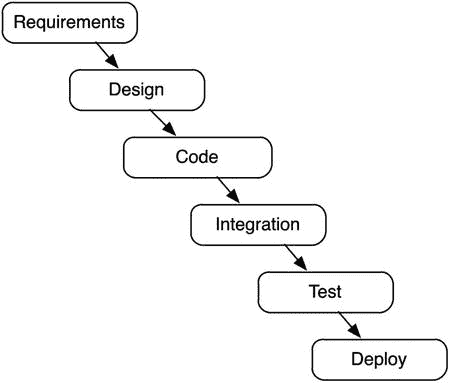
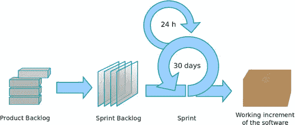
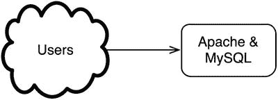
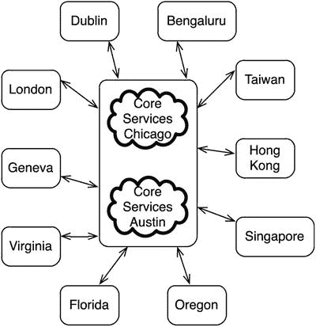
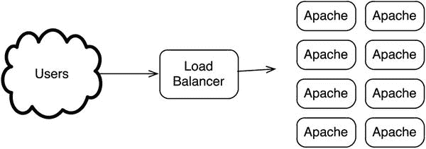
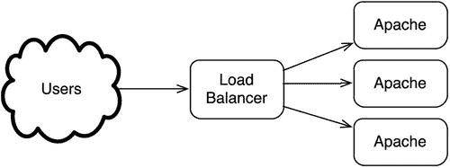
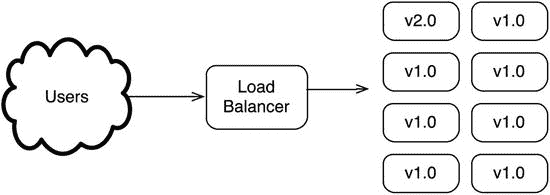
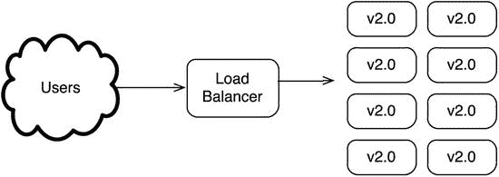

# 1.管理大规模基础设施

本章是关于大规模基础设施管理中出现的问题。基础设施架构等关键任务决策，以及许可和支持等事项的决策，都是基础设施设计的一部分。在管理小型基础设施时，这些问题中的许多并不像在大型企业中那样重要。可伸缩的架构是成功的大型基础设施的重要基础。

基础设施管理可以分为两个部分:应用程序部署和基础设施架构。首先，我们回顾一下应用程序部署，然后看看不同的基础架构模型。我们还将回顾构成可扩展基础架构的组件。

## 应用程序部署

从设计到生产，可扩展的基础设施使开发人员能够快速编码、测试和部署应用程序。传统的部署模式在加速从设计到生产的过程中并不有效。图 [1-1](#Fig1) 显示了传统的部署模式，在这种模式下，实现生产的主要障碍是测试。开发人员编写完代码后，他们将代码交给质量保证(QA)团队，由该团队手动测试代码，然后将代码发送回开发团队进行修复。修复完成后，再次测试代码。当测试通过时，代码被发送到试运行阶段。暂存是生产的复制。在代码通过准备阶段后，运营团队使用变更管理流程将代码部署到生产环境中。一行代码更改的整个过程可能需要两到四周的时间。

图 1-1。

Traditional design-to-production model

意识到这个模型不是一个非常有效的模型，一个更新的模型出现了——持续集成和持续交付(CI/CD)。有了这个模型，一旦单元测试完成，代码被检入到源代码库中，CI/CD 管道就开始工作。流水线由一个自动化的构建系统组成，使用诸如 Jenkins ( [`http://jenkins-ci.org`](http://jenkins-ci.org/) )这样的工具。构建系统获取代码并构建它，输出编译后的二进制文件。然后二进制文件可以以自动化的方式投入生产(图 [1-2](#Fig2) )。

图 1-2。

Continuous integration and continuous delivery

CI/CD 管道自动化尽可能多的测试，以获得对代码的信心。此外，它执行软件系统的完整构建，并确保已签入的代码不会导致任何中断。任何故障都必须由开发人员进行调查。有许多软件产品可以帮助实施 CI/CD 管道，包括:

*   詹金斯( [`http://jenkins-ci.org`](http://jenkins-ci.org/) )
*   巡航控制( [`http://cruisecontrol.sourceforge.net`](http://cruisecontrol.sourceforge.net/) )
*   建筑机器人( [`http://buildbot.net`](http://buildbot.net/)

## 软件开发自动化

软件开发自动化是将尽可能多的软件开发组件自动化的过程。软件开发自动化的目标是最大限度地缩短从开发人员签入代码到产品到达最终用户手中或用于生产的时间。如果没有软件开发自动化，将软件产品交付给最终用户会有很大的延迟。软件开发自动化有各种各样的组件，在下面的章节中列出了其中的一些，以及可以帮助实现所需自动化的工具。

### 构建自动化

构建自动化是将开发人员签入代码后需要立即执行的任务自动化的过程。这个过程包括实际构建代码。构建由开发人员在签入时触发。构建自动化的一些特性如下:

*   频繁构建以尽早发现代码问题
*   增量构建管理，尝试构建模块，然后集成它们
*   构建加速，因此大型代码库不会降低构建速度
*   构建状态报告和故障检测

有助于构建自动化的一些工具如下:

*   度( [`http://www.gradle.org`](http://www.gradle.org/)
*   Apache Ant ( [`http://ant.apache.org`](http://ant.apache.org/)
*   Apache Maven ( [`http://maven.apache.org`](http://maven.apache.org/)
*   Gnu Make ( [`http://www.gnu.org/software/make/`](http://www.gnu.org/software/make/)

### 软件配置管理

软件配置管理(SCM)是软件开发自动化不可或缺的组成部分。软件配置管理中需要回答的几个问题是

*   我们使用哪个源代码管理系统？
*   我们怎么做代码分支？
*   我们将支持什么样的软件版本？

任何与管理实际代码本身有关的事情都被认为是 SCM 的一部分。下面是一些工具的列表，它们可以帮助 SCM 的源代码控制部分:

*   去吧( [`http://git-scm.com`](http://git-scm.com/)
*   SVN(“t1”【t0”
*   水银( [`http://mercurial.selenic.com`](http://mercurial.selenic.com/) )

SCM 更多的是一个过程，而不是工具的选择，包括如何管理分支、版本、合并和代码冻结的问题，应该用政策而不是产品来回答。

### 连续累计

一个大型软件项目可以有许多不同的组成部分。在开发人员签入代码后，它必须与代码库的其余部分集成。一个开发人员将他或她的组件与所有其他组件集成在一起是不可行的。持续集成(CI)确保所有不同的代码组件最终合并成一条主线，然后可以构建并发布一个完整的产品。有效配置项的组成部分如下:

*   CI 流程应该随着代码的成功构建而自动开始。
*   开发人员应该经常提交代码以尽早发现问题。
*   CI 构建应该是自测的。
*   CI 构建应该很快。

CI 流程的一个例子是，web 服务应用程序分为 PHP 前端和 Java 后端，MariaDB 作为数据库。PHP 前端代码的任何更改都应该触发一个完整的 CI 管道构建，该构建还会构建 Java 并进行包括数据库调用在内的完整测试。

### 连续交货

到目前为止，我们已经使用构建自动化实现了自动化构建，我们已经使用 CI 将我们的代码与其他组件集成，并且我们现在已经到达了持续交付(CD)的最后一步。CD 是在成功的 CI 完成后立即将代码投入生产的过程。这是软件开发中最关键的步骤之一；一张拙劣的 CD 会导致您的环境中断。CI 的输出可以打包成二进制。有助于 CD 的软件包括:

*   Gnu 自置词( [`https://www.gnu.org/software/autoconf/`](https://www.gnu.org/software/autoconf/)
*   围棋( [`http://www.go.cd`](http://www.go.cd/) )
*   厨师〔t1〕〔t0〕T2〕
*   盐堆( [`http://www.saltstack.com`](http://www.saltstack.com/)

对于 Java，CI 管道的输出可以是一个`war`文件，或者是一个`tar.gz`文件，或者是一个基于您的产品发行版的包。CD 进程必须接受这个输出，并进入正在运行的生产服务器。这应该在发布管理的范围内完成。

### 变更管理

变更控制在有效的基础设施管理中起着非常重要的作用。变更管理是审查、批准和执行与基础设施组件相关的变更的过程。要大规模运营，必须有一个有效的变革管理流程。这个过程不应该是不经审查就橡皮图章式的修改。它也不应该是如此沉重的负担，以至于工程师们因为推动变更所需要的负担而对变更变得小心翼翼。

变更可以分为以下几类:

*   低风险
*   中等风险
*   高危

低风险变更是指不影响基础设施正常运行时间的变更。一个例子是在生产环境中向代码添加一些注释，并将它们部署到生产环境中。软件工程师可能会忘记添加表示注释的适当代码块，但这最多会导致构建失败，而不是应用程序失败。因此，这种类型的变更可以归类为低风险。

中等风险的变更可以归类为可能影响生产的变更。一个例子是向负载平衡器组添加新的虚拟机。负载平衡器上的错误配置可能会破坏整个群集；但是，这种可能性很低，因为这种变化不会修改负载平衡器背后的现有服务器。

高风险变更的一个例子是将整个应用程序升级到代码库的新版本，其中包含重大变更。这肯定会影响生产，因为它涉及代码更改，并且涉及整个应用程序集群。

组织应该已经发布了关于哪些类型的变更属于低、中、高风险类别的策略。不遵循变更流程，任何人不得对生产进行变更。

无论变更的类型如何，大中型组织都有一个变更控制委员会，每天或一周几次审查变更。董事会批准变更，然后由工程师执行。在一年中的某些时候可能不允许改变。如果你在为一家在线零售商工作，那么为了尽量减少影响销售的事情，在假期期间不允许对基础设施进行任何改动。在美国,“冻结”可能会从 11 月 1 日开始生效，并持续到 1 月 5 日，因为在这段时间里，许多在线零售购物发生在假期。

可能会出现一个关于变更控制如何集成到 CI/CD 或模型中的问题，在模型中，代码一旦准备好就以自动化的方式被推送到生产中。有些时候，CI/CD 模型应该暂停，例如在线零售商的冻结期。在其他时候，软件本身可以与变更控制系统集成，以便记录所有的变更，即使它们是自动推出的。此外，诸如升级整个代码库这样的大规模变更也许应该由一个工程师团队来审查和监督，而不是允许它完全自动化。

### 发布管理

发布管理是计划、设计和构建将产品或软件投入生产所需的框架的过程。说到基础设施管理，发布管理扮演着确保基础设施组件以高效的方式部署到生产中的角色。与软件相关，发布管理确保新的代码被交付给最终用户或者将使用该代码的最终系统。应该作为发布管理的一部分进行跟踪的一些项目如下:

*   功能请求
*   软件打包工具
*   交付方法
*   该版本的问题和风险

## 瀑布方法

当管理项目、基础设施或软件部署时，传统的方法被称为瀑布方法，它由图 [1-3](#Fig3) 所示的步骤组成。首先，收集项目的需求。之后，基于初始需求创建设计。设计完成后，开始实施，然后测试或验证实施。最后，软件或基础设施进入维护模式。

这种方法有其局限性，因为它假设所有的需求都是预先已知的——这不一定是真的。此外，当一个阶段结束了——比如需求阶段——而下一个阶段开始时，就没有空间重新访问前面的阶段，以防遗漏了什么。如果需求被重新访问，那么实现就会停止，直到需求收集完成。因此，实现瀑布方法需要很多时间。

图 1-3。

Waterfall methodology

对于软件和基础设施设计，瀑布模型由于其局限性已经失宠；敏捷变得越来越流行。

## 敏捷方法

敏捷是众多基于敏捷宣言的项目管理方法的总括框架。敏捷宣言如下:

> "We find better ways to develop software by doing software and helping others do software. Through this work, we realize the value:
> 
> *   个体和交互优于过程和工具
> *   工作软件比综合文档好
> *   客户合作胜于合同谈判
> *   对变化的反应优于计划
> 
> That is to say, although the items on the right are valuable, we pay more attention to the items on the left. ( [`http://en.wikipedia.org/wiki/Agile_software_development`](http://en.wikipedia.org/wiki/Agile_software_development) )

敏捷比瀑布方法更受欢迎，因为当敏捷被正确遵循时，项目成功的机会会大大增加。成功机会增加的原因之一是，使用敏捷，并不假设所有的需求都是预先知道的，在每个冲刺阶段的开始，可以再次审查需求。敏捷包括许多方法:

*   看板( [`http://en.wikipedia.org/wiki/Kanban_(development`](http://en.wikipedia.org/wiki/Kanban_(development) `)`
*   Scrum ( [`http://en.wikipedia.org/wiki/Scrum_(software_development`](http://en.wikipedia.org/wiki/Scrum_(software_development) `)`
*   枭雄( [`http://en.wikipedia.org/wiki/Lean_software_development`](http://en.wikipedia.org/wiki/Lean_software_development) )

还有很多更敏捷的方法。你可以在 [`http://en.wikipedia.org/wiki/Agile_software_development`](http://en.wikipedia.org/wiki/Agile_software_development) 了解他们。

由于开发人员需要同时完成开发和运营任务，基础设施工程的敏捷方法正越来越多地被采用。

### 混乱

让我们来看看 Scrum 方法论，它是敏捷框架的一部分。Scrum 是一个学习产品和用于构建产品的过程的框架。图 [1-4](#Fig4) 展示了 Scrum 的运行。

图 1-4。

Scrum at work

Scrum 提供了角色、会议和工件。Scrum 中定义了三个角色:产品所有者、Scrum 开发团队和 Scrum master。

产品负责人关注的是“什么”而不是“如何”他与客户交流，并设计出产品路线图。他对产品待办事项列表进行优先级排序，产品待办事项列表包含客户想要的软件特性列表。他是与团队沟通的唯一联系人。

开发团队是跨职能的，由开发人员、测试人员和 Scrum master 组成。这个团队最好由四至九人组成。

Scrum 主管对团队没有管理权限。他或她是一个推动者，保护团队不受干扰和干扰，并消除团队遇到的障碍。他或她还促进良好的工程实践，并作为一个制衡的人。你可以在 [`http://scrummasterchecklist.org`](http://scrummasterchecklist.org/) 阅读更多关于 Scrum 大师的内容。

Scrum 由两个重要的工件组成:产品待办事项和冲刺待办事项。backlog 是需要完成的所有事情的排序列表。如果它不在 backlog 中，那么它就不是团队应该做的事情。待办事项列表中的项目是以用户故事格式或用例场景编写的。用户故事是从用户角度写的最终用户的文档化需求。例如，“我想要一个允许我在线销售服装的网站”可能是一个用户故事，它可以转化为一个更明确的待办事项。

sprint backlog 是团队当前致力于做的事情，因此它有一个结束日期。短跑通常不会超过两周。Sprints 由一个工作的、经过测试的、可交付的产品组成。冲刺是一个短的迭代。

在 sprint backlog 中有“什么”和“如何”的问题。“什么”是这个 sprint 的产品待定项。“如何”是 sprint 中尚未开始、正在进行和已经完成的任务。

Scrum 定义了四种会议(图 [1-5](#Fig5) ):

Sprint planning meeting   Daily Scrum   Sprint review meeting   Sprint retrospective meeting  

可能还会有一个会议，叫做积压工作整理会议。我们假设这个冲刺是一个为期两周的冲刺。在两周的开始，召开一个冲刺计划会议。在会议期间，高优先级的项目被从待办事项中取出并进行讨论。会议的结果是特定 sprint 的任务排序列表。

每天都有 15 分钟的每日 Scrum 会议。在会议中，会讨论三件事:你昨天做了什么，你今天计划做什么，以及阻碍因素是什么。

冲刺评审会议在每次冲刺结束时，在冲刺回顾会议之前。在评审会议中，从待办事项列表中完成的项目会被显示出来，任何未能完成的项目都会被讨论并放入产品待办事项列表中。

sprint 以 sprint 回顾会议结束，在会议期间，团队讨论在给定的 sprint 中哪些进展顺利，哪些可以做得更好。

在 sprint backlog-grooming 会议期间，对产品 backlog 进行评审。大项目被分解成可以在两周内完成的小项目。此外，可以对待办事项中的项目进行排序。图 [1-5](#Fig5) 提供了会议的概述。

Scrum 是敏捷中的一个框架，你的团队应该回顾一下前面提到的其他方法，比如精益、看板等等，然后根据最适合团队的方法选择一个。你也可以挑选这些方法中的最佳过程，并将它们组合成一个适合你的新方法。

遵循敏捷可以加速基础设施项目交付，并帮助您的企业大规模运营。即使对于小团队来说，遵循敏捷也有助于更快地向内部和外部客户交付基础设施。

图 1-5。

Scrum meetings

了解更多关于敏捷的资源可以在

*   [T2`http://agilemethodology.org`](http://agilemethodology.org/)
*   [T2`http://scrummethodology.com`](http://scrummethodology.com/)
*   [T2`http://agilemanifesto.org`](http://agilemanifesto.org/)

## 网络架构

到目前为止，在这一章中，我们已经看到了可伸缩基础设施设计的软件开发和项目管理方法。本章的下一节将重点介绍可伸缩的 web 架构。有许多设计可以用于 web 架构。我首先解释最基本的一种——单层——然后介绍更复杂的设计。

## 单层架构

在单层体系结构中，有一台服务器托管应用程序并被远程访问。这是 web 服务基础设施工程中最基本的设计。如果需要，单个服务器可以托管一个 web 服务器和一个数据库服务器。没有故障转移功能，并且很难横向扩展该体系结构。图 [1-6](#Fig6) 显示了这种类型的设计。不建议使用这种设计，除非您有一个非关键任务的、使用量非常小的应用程序，您希望将其用于测试和开发。

图 1-6。

Single-tier architecture

## 双层架构

除了单层架构之外，还有两层架构。通过这种设计，我们将数据库从 web 服务器中分离出来。这种类型的设计增加了一点容错能力，因为如果数据库关闭，web 服务器仍然可以提供不依赖于数据库的静态内容。或者，如果 web 服务器关闭，仍然可以通过设置另一个 web 服务器来访问数据库。图 [1-7](#Fig7) 显示了如何进行设置。这种设计有一些与单层架构相同的缺陷；这不是一个非常可扩展的设计，因为我们不能水平或垂直增长。

图 1-7。

Two-tier architecture

## 三层架构

对于三层架构模型，我们开始在 web 服务器前面引入负载平衡器(图 [1-8](#Fig8) )。这种策略使我们的设计更具可扩展性。随着我们负载的增加，我们可以添加更多的 web 服务器并进行扩展。我们还可以设置自动缩放，这样 web 服务器的数量可以根据需要自动增加，也可以根据需要减少。这种设计的一个警告是，随着更多 web 服务器的增加，我们可能会使数据库过载。

图 1-8。

Three-tier architecture

## 四层架构

我们可以在 web 服务器和数据库之间再增加一层，使我们的设计更具可伸缩性。这一层是 Memcache ( [`http://memcached.org`](http://memcached.org/) )等数据库缓存技术。我们可以开始扩展，不仅是 web 服务器层，还有数据库层，以处理负载并提高容错能力。我们添加了更多的数据库服务器，并在它们之间分配工作负载。例如，这可以通过 Cassandra ( [`http://cassandra.apache.org`](http://cassandra.apache.org/) )多节点实现来完成。这种设计现在更加复杂，但也更具容错性，能够根据需要进行扩展(图 [1-9](#Fig9) )。

图 1-9。

Four tier architecture

## 五层架构

当提供 web 内容时，我们可以有动态和静态的 web 内容。例如，如果你看一下图 [1-10](#Fig10) ，web 服务层被分成 Apache 和运行 Jetty 或 JBoss 的 Java 应用服务器。Apache 提供任何静态内容，而应用服务器提供任何动态或动态生成的内容。这种类型的一个例子可能是支持网站的 FAQ 部分。因为 FAQ 页面的内容是相当静态的，所以 Apache 提供的列表可能要快得多。然而，允许与客户交互的票务系统可能是由 Jetty 的应用层提供的。

图 1-10。

Five-tier architecture

## 六层架构

我们可以得到比五层架构更好的东西，并添加一个内容交付网络(CDN ),用户可以从该网络下载内容。假设客户从您的网站下载 Android 图像。与其从你的网站上下载数百兆字节的数据，不如将这些内容推送到 CDN 上，让 CDN 提供下载服务。网站的其余部分仍然可以在您的基础设施中运行(图 [1-11](#Fig11) )。这对于提供视频或需要大量下载的任何其他类型数据的网站非常有用。

图 1-11。

Six-tier architecture

## 全球建筑

在当今的全球化世界中，您的用户可能在任何地方。整合数据中心并通过一个或多个托管内容的中央数据中心推送内容可能还不够。提高效率的一个方法是在全球范围内建立接入点。这些都是小型的只缓存网站，它们离你的用户很近，可以低延迟地向用户推送内容。图 [1-12](#Fig12) 展示了这种设计的一个例子，有两个核心数据中心——一个在芝加哥，另一个在奥斯丁。其他站点，如位于台湾或日内瓦的站点，是仅缓存站点，它们与两个主数据中心联系，下载该特定区域的用户更频繁使用的数据，并存储这些数据。您需要一个运行在您的存在点站点上的应用程序，比如 Apache Traffic Server([`http://trafficserver.apache.org`](http://trafficserver.apache.org/))来支持这样的设计。如果构建这样的基础设施成本过高，那么可以考虑使用 CDN，如 Akamai、Amazon、Rackspace 和其他提供商提供的 CDN，以达到相同的效果。

图 1-12。

Global scalable architecture

## 自动缩放

自动扩展是增加或减少基础设施资源以满足不断变化的流量需求的过程。让我们以网飞为例。他们的基础设施可能会在周六早上看到大量传入的流媒体请求，当时许多孩子都在家，想看动画片。另一方面，在周一早上，当大多数人都在工作，孩子们都在上学时，他们的使用率可能会低得多。为了处理这种流量变化，自动缩放可能会派上用场。在高峰时段，负载平衡器可以检查实际 web 服务器的正常运行时间或其他指标，并根据阈值启动 web 服务器的新实例(图 [1-13](#Fig13) )。当流量变慢时，可以删除虚拟实例(图 [1-14](#Fig14) )。这种策略允许网飞的成本根据需要而变化，并且他们不必启动和保持高水位实例一直运行。

图 1-13。

Peak usage

Amazon Web Services 和其他云(如 Google Cloud)都提供自动缩放功能。对于私有云，除非您的私有云供应商提供，否则您必须创建自己的自动扩展机制。

图 1-14。

Autoscaling during normal traffic patterns

## 滚动部署

当新版本的代码在生产中可用于部署时，升级生产中现有代码的传统方法是安排一些停机时间，在此期间服务不可用。这通常被称为维护窗口，现在仍被一些组织使用。在维护窗口期间，服务的所有用户都将被清空，并且对服务的访问将被禁用。代码被升级和测试，然后流量被允许返回生产集群。这种方法的一个缺点是，如果您的网站正在创收，您将在维护窗口期间损失收入。尤其是在今天的全球化环境中，您的面向外部的网站可能从世界上的任何地方被访问，保持您的网站 100%的时间运行变得更加重要。

另一种方法是滚动部署。滚动部署需要升级一小部分基础设施，对其进行测试，然后升级更多的服务器。有两种方法可以做到这一点:一种方法是在新的服务器或虚拟机上部署代码，这些服务器或虚拟机将被添加到负载平衡器后面的池中。如果在新的服务器上一切正常，那么您可以继续使用新的代码库添加更多的新服务器。在您达到 100%的新代码库服务器之后，您可以开始关闭旧的代码库服务器。另一种方法是用新版本的代码替换池中现有的服务器(图 [1-15](#Fig15) )。在给定应用程序的八台服务器中，所有八台都运行 1.0 版代码，但是我们必须将代码升级到 2.0 版。

图 1-15。

Server running 100% of v1.0 code

在图 [1-16](#Fig16) 中，我们用 2.0 版的代码替换了一台服务器。我们可以通过两种方式做到这一点:要么将代码直接升级到服务器上，要么关闭服务器并使用 2.0 版的代码创建一个新的服务器。然后，如果负载平衡器使用循环负载平衡方法，我们将监控接收八分之一流量的新服务器。

图 1-16。

One-eighth of servers running the new version 2.0 of code

如果新版本的代码运行良好，我们将继续用新代码更换 50%的服务器(图 [1-17](#Fig17) )。像以前一样，我们可以简单地部署新的虚拟机并替换旧的，或者我们可以升级其上的代码，而无需实际安装新的虚拟机。

图 1-17。

Fifty percent of servers running version 2.0 of code

最后，如果情况看起来不错，我们继续在 100%的虚拟机上部署新代码，从而在不影响最终用户的情况下完成我们的升级(图 [1-18](#Fig18) )。

图 1-18。

One hundred percent of servers running new code version 2.0

滚动升级的一个重要部分是持续监控并确保新代码不会导致任何问题。在新代码与现有版本不兼容，并且两者不能同时存在的情况下，另一种选择是在负载平衡器后创建一组新的虚拟机或服务器，并将该负载平衡器添加到全局流量管理器。或者，您可以使用循环域名系统(DNS ),让两个负载平衡器的 IP 地址具有相同的`A`记录。

## 批准

在为企业决定软件解决方案时，在决定特定产品之前，应该审查并考虑软件可用的各种许可证。为了让企业安全地大规模运营，必须有一个自上而下的策略，在该策略中，公司可以接受哪些许可证。类似地，应该有一个使用特定许可证为开源项目做贡献的策略。

要解决的一个大问题是商业软件是否比开源软件更受青睐，或者相反。在 Linux 世界中，开源软件非常流行，尤其是因为 Linux 本身就是开源的。Linux 是在 GPL v2 下授权的。

自由软件有许多开放源码许可。其中一些包括以下内容:

*   Apache 许可证 2.0
*   通用公共许可证
*   通用开发和分发许可证
*   BSD {2，3}许可证

您可以在 [`http://opensource.org/licenses/alphabetical`](http://opensource.org/licenses/alphabetical) 查看更完整的列表。

GNU Affero 通用公共许可证(AGPL)就是一个例子，它说明了选择使用带有特定开源许可证的软件会如何影响一个组织。AGPL 要求，如果您修改开放源代码软件，您必须让该软件的所有网络用户都可以使用它。这样做的问题是，如果你的公司有任何专有软件，而你使用 AGPL 许可的开源软件，那么你的专有软件可能会面临被迫进入开源世界的风险。公共网站尤其受到这一条款的影响。一些比较流行的使用 AGPL 的开源软件有:

*   莽哥布( [`http://www.mongodb.org`](http://www.mongodb.org/)
*   发射台( [`https://launchpad.net/`](https://launchpad.net/) )
*   PHP 融合()
*   SugarCRM ( [`http://www.sugarcrm.com`](http://www.sugarcrm.com/)

类似地，在为开放源码项目做贡献时，应该解决所贡献代码的许可问题。许多开源项目都有一个贡献者许可协议，根据该协议，您可以做出贡献。如果您以个人身份缴费，则可以签订个人缴费协议，也可以签订公司缴费协议。一般来说，当你对一个开源项目做出贡献时，你就放弃了你的代码的版权。

## 支持

解决了许可问题之后，还有支持问题需要考虑。规模化经营意味着要有一个明确的策略，来决定公司使用的软件可以获得什么样的支持。随着开源软件的激增，对软件的支持已经成为一个更加重要的问题。

如果您使用的软件没有支持，并且您的生产环境依赖于它，那么您可能会面临无法减轻的风险。作为公司战略的一部分，如果您使用的是 Linux 操作系统，那么对于关键任务系统来说，有支持的发行版可能更有意义，对于非关键任务系统来说，没有支持的发行版可能更有意义。

另一种可能性是雇佣正在使用的开源软件的主题专家，从而降低风险。如果软件出现问题，可以依靠主题专家的帮助。一些基于互联网的大公司雇佣 Linux 内核开发人员，并使用他们自己定制的发行版，从而确保了更高水平的支持。

当然，对于没有商业支持的软件，你可以依赖开源社区本身。通常，用户组、互联网中继聊天(IRC)频道和邮件列表是获得问题支持的良好来源。不幸的是，没有一个是有保证的，当一个企业因为软件缺陷而亏损时，你想知道有人可以修复它。

各种 Linux 发行版有不同的支持模型。有些根本没有商业支持，而有些却有商业支持。Fedora 没有商业支持，但 RedHat 有。

### 客户支持模型

支撑可以分为两大类:一类是面向内部的，另一类是面向外部的。面向外部的支持面向组织的客户。面向内部的支持在公司的不同团队中进行。跟踪支持请求非常重要，应该通过票务系统来完成。一些开源票务系统包括

*   东票〔t1〕〔t0〕〔T2〕
*   请求跟踪器( [`http://www.bestpractical.com/rt/`](http://www.bestpractical.com/rt/) )
*   毒素(t1)`http://www.otrs.com/software/open-source/`

同一解决方案有时也适用于观点不同的内部和外部客户。您也可以拥有自己开发的系统或购买商业产品。无论您的选择是什么，为了进行扩展，您必须跟踪问题并使用广泛的报告，以便能够尽早发现并解决问题点。

### 网络操作中心

规模化经营的另一个重要组成部分是为您的产品或服务提供全天候支持。这可以通过多种方式实现，包括以下方式:

*   跟随太阳的旋转:让员工在有阳光的地方工作——例如，从旧金山的团队开始，然后移交给印度，然后移交给爱尔兰。
*   拥有一个 24/7/365 全天候覆盖的全球单一位置:这意味着在单一位置也有一个夜班。
*   重叠轮班:一个轮班与另一个轮班部分重叠。一个例子是从旧金山出发，然后把电话转到爱尔兰。这意味着旧金山和爱尔兰的员工需要长时间工作。

### 自助服务支持

在当今的互联世界中，仅有一种支持选项(如电话或电子邮件)是不够的。内部和外部客户期望通过各种方式获得支持:

*   在线用户和支持论坛
*   Twitter 和脸书等社交媒体
*   在线知识门户
*   基于网络和电话
*   基于远程屏幕共享

为了规模化经营，企业必须采用前面提到的一种或多种方法。随着给定应用程序的用户群的增长，不同的用户转向不同的寻求帮助的方法。您越能让您的最终用户解决他们的问题，您的组织就越容易支持他们。

## 错误报告

跟踪错误并确保它们得到解决有助于提高运营效率。这反过来使得大规模操作成为可能。一些开源错误跟踪工具包括:

*   Bugzilla ( [`http://www.bugzilla.org/`](http://www.bugzilla.org/)
*   螳螂( [`http://www.mantisbt.org/`](http://www.mantisbt.org/)
*   Trac ( [`http://trac.edgewall.org/`](http://trac.edgewall.org/)

即使对于基础设施相关的问题，这些错误跟踪工具也可以与标签工具一起使用，以跟踪基础设施问题。或者，您可以使用这些 bug 报告工具来代替故障单工具，尽管您可能会丢失一些特定于故障单软件且不属于 bug 报告软件的必要功能。

## 存货管理

数据中心库存管理(DCIM)是库存管理的一部分。财务部门通常使用库存管理来跟踪资产，DCIM 在这方面很有用；但是，它在基础架构管理的基础上又增加了一层。事实证明，DCIM 工具在以下情况下非常有用:

*   容量规划
    *   电源要求
    *   空间规划
*   系统供应
*   合同谈判
*   硬件生命周期管理
    *   旧硬件采购
    *   新硬件采购

在与硬件供应商打交道时，能够向他们提供平均故障间隔时间的数字，有助于与供应商就更好的价格或产品改进进行谈判。

如果企业知道有多少台服务器以及它们消耗多少电力，那么与电力和空间相关的容量规划就会变得容易得多。

DCIM 系统中应该呈现哪种数据？在这种情况下，越多越好是正确的政策。至少应具备以下项目:

*   服务器品牌、型号、购买年份、成本以及采购订单的链接
*   存储、处理器、内存和任何外围设备
*   操作系统风格和版本，以及系统上运行的应用程序
*   服务器管理员的技术联系人和上报联系人
*   以太网地址、电源和远程控制台信息

DCIM 中可以存储更多的信息，它还应该与您的服务器供应系统(如 Kickstart)集成。要配置系统，脚本可以从 DCIM 中提取媒体访问控制地址，并创建 PXE 配置文件。然后，使用控制台信息，您可以重新启动系统进行操作系统安装。

## 五金器具

硬件的选择在组织基础设施的扩展中起着非常重要的作用。处理器、内存和存储技术可以决定应用程序和预算的成败。在接下来的部分中，我将尝试理解不同的选择，以及如何选择最适合您需求的解决方案。

### 处理器

在服务器处理器行业的两大供应商 Intel 和 AMD 之间，存在着各种各样的处理器系列。在大规模购买硬件时，您必须小心购买哪个处理器家族，以及在处理器周期的什么时间购买。如果你看看英特尔微架构( [`https://en.wikipedia.org/wiki/Intel_Tick-Tock`](https://en.wikipedia.org/wiki/Intel_Tick-Tock) )，每 12 到 18 个月就会有一个新的微架构或处理器技术的芯片缩小。您可以利用这一点，在周期的不同时间购买硬件，以优化性价比。

除了成本，功耗也是选择处理器架构的关键因素。与高功率处理器一样快的低功率处理器可能更适合大规模部署，以降低运行数据中心的成本。基于 ARM 的低功耗( [`http://www.arm.com`](http://www.arm.com/) )处理器也获得了市场份额。

在撰写本文时，当前的英特尔微体系结构是 Haswell，2014 年底即将推出的微体系结构是 Broadwell。Haswell 是和之前相比的一个新架构，叫做 Ivy Bridge。布罗德韦尔是哈斯韦尔的心理医生。模具收缩可以降低成本。

购买服务器时，请考虑其微体系结构和微体系结构所处的阶段。这会影响您的应用程序性能和财务成本。在大规模运营时，您不能忽视这一因素。

### 记忆

大规模运营的另一个方面是以合适的价格选择合适的内存类型。内存的价格全年变化很大。正确的内存类型取决于服务器主板上的芯片组以及应用程序的要求。是的，在这种情况下越快越好，但是成本和功耗都是重要的考虑因素。

内存有不同的类型，例如

*   DDR4 （1600 兆赫-3200 兆赫）
*   DDR3 PC3-6400，-8500，-10600 和-12800
*   DDR2 PC2-4200，-5300，-6400 和 8000
*   DDR PC1600、PC2100、PC2700 和 PC3200
*   SDRAM PC100、125 MHz 和 PC133

截至本文撰写时，DDR4 是最新的内存类型；它不向后兼容 DDR3。与 DDR3 相比，DDR4 具有更高的模块密度和更低的电压要求。

如果 DDR4 的成本是一个问题，那么考虑使用 DDR3。DDR3 的速度如表 [1-1](#Tab1) 所示。

表 1-1。

Memory Speeds

<colgroup><col> <col> <col> <col></colgroup> 
| 友好的名称 | 行业名称 | 峰值传输速率(MB/秒) | 每秒数据传输量(百万) |
| --- | --- | --- | --- |
| DDR3-800 | PC3-6400 | Six thousand four hundred | eight hundred |
| DDR3-1066 | PC3-8500 | Eight thousand five hundred and thirty-three | One thousand and sixty-six |
| DDR3-1333 | PC3-10600 | Ten thousand six hundred and sixty-seven | One thousand three hundred and thirty-three |
| DDR3-1600 | PC3-12800 | Twelve thousand eight hundred | One thousand six hundred |

测试应用程序对内存类型的要求有助于获得最佳的内存类型。如果您要在一年内购买 10，000 台服务器，基于适当内存的节省即使没有数百万美元，也有数十万美元。

其他参考资料可从以下网址获得

*   [T2`http://www.crucial.com/usa/en/support-memory-speeds-compatability`](http://www.crucial.com/usa/en/support-memory-speeds-compatability)
*   [T2`http://en.wikipedia.org/wiki/DDR4_SDRAM`](http://en.wikipedia.org/wiki/DDR4_SDRAM)

### 仓库

选择合适的存储技术有助于保持您的应用正常运行并降低成本。企业有多种类型的磁盘技术，也有多种磁盘配置。一些常见的磁盘技术类型有

*   ATA、并行和串行( [`http://en.wikipedia.org/wiki/Serial_ATA`](http://en.wikipedia.org/wiki/Serial_ATA) )
*   SAS()
*   SSD ( [`http://en.wikipedia.org/wiki/Solid-state_drive`](http://en.wikipedia.org/wiki/Solid-state_drive)
*   SCSI ( [`http://en.wikipedia.org/wiki/SCSI`](http://en.wikipedia.org/wiki/SCSI)

我将详细解释固态硬盘(SSD ),因为在撰写本文时，它是最新的存储技术。SSD 由电路板、NAND 闪存、串行高级技术附件(SATA)控制器和 SATA 连接器组成。闪存是非易失性电子存储。硬盘驱动器(HDD)由盘片、主轴、传动臂、SATA 连接器和传动装置组成。

固态硬盘相对于硬盘的优势如下:

*   更快的
*   更耐用
*   功耗更低
*   驳船
*   成本效益高
*   冷却器
*   消声器

基于闪存的固态硬盘面临的挑战:

*   数据保持:随着时间的推移，闪存电池会失去电荷。较弱的电池失去电荷更快。询问您的供应商，他们多久刷新一次数据，以说明费用的损失。
*   耐用性:随着时间的推移，当你擦除和重写闪存上的数据时，闪存会磨损。你对一个细胞写得越多，它就变得越弱。
*   更快的失效:多级电池可能比单级电池更快地开始失效。
*   表现的变化:阅读和写作在大小和持续时间上是不对称的；因此，您可能会获得显著的性能差异。

闪存产品包括:

*   闪存阵列
*   闪光灯装置
*   PCIe 卡片

表 [1-2](#Tab2) 显示了不同闪存解决方案之间的简要比较。IOPS 代表每秒的输入输出操作。

表 1-2。

Comparing Flash solutions

<colgroup><col> <col> <col> <col></colgroup> 
| 友好的名称 | 表演 | 成本(美元/GB) | 可量测性 |
| --- | --- | --- | --- |
| 闪存阵列 | 40 万 IOPS；延迟时间，< 1 毫秒 | 5–10 | 100TBs 可用容量 |
| 闪光灯装置 | 50 万 IOPS；延迟，100 毫秒 | 20–40 | 5–20TB 可用容量 |
| PCIe 闪存卡 | 50 万 IOPS；延迟时间< 1 毫秒，可能为 100 毫秒 | Ten | 2TB |

选择闪存供应商时，请询问以下问题:

*   你的系统如何写入闪存？
*   随着时间的推移，您如何解释闪存单元中的位干扰和丢失？
*   您如何最大限度地减少写入导致的闪存单元磨损？
*   如何最小化写放大？
*   如何从一个忙着写的 SSD 中读取？
*   您如何确保在提供数据之前拥有正确的数据？
*   你用的是什么类型的闪光灯？
*   您正在使用的闪存的预期寿命是多少？
*   您如何确保不会丢失数据？

更多参考，请参见 [`http://ocz.com/consumer/ssd-guide/ssd-vs-hdd`](http://ocz.com/consumer/ssd-guide/ssd-vs-hdd) 。

## 系统配置文件

大规模运行要求所有系统在最佳设置下运行。大型基础架构有虚拟主机、虚拟机和各种各样的系统。

与性能相关的问题是基础设施中很高比例的故障点。为了预先减少因系统未正确调整而导致的问题数量，CentOS/RedHat 中的 configure `tuned. tuned`是一个守护程序，它可以与`ktune`一起动态修改系统设置。清单 1-1 显示了如何与`tuned`交互。

清单 1-1。调整的配置文件

首先，查看所有可用的不同配置文件。这些配置文件为网络、磁盘、电源和内存应用特定的内核级调优参数，以使性能符合配置文件的要求。

`# tuned-adm list`

`Available profiles:`

`- sap`

`- virtual-guest`

`- spindown-disk`

`- default`

`- server-powersave`

`- latency-performance`

`- enterprise-storage`

`- laptop-ac-powersave`

`- throughput-performance`

`- laptop-battery-powersave`

`- desktop-powersave`

`- virtual-host`

接下来，查看哪个概要文件是活动的。在我们的例子中，虚拟主机配置文件是活动的。这可能是一个管理程序，因此这个概要文件是活动的。

`# tuned-adm active`

`Current active profile: virtual-host`

`Service tuned: enabled, running`

`Service ktune: enabled, running`

要选择另一个配置文件，只需在配置文件关键字后键入配置文件名称。

`# tuned-adm profile throughput performance`

`Reverting to saved sysctl settings:                        [  OK  ]`

`Calling '/etc/ktune.d/tunedadm.sh stop':                   [  OK  ]`

`Reverting to cfq elevator: dm-0 dm-1 dm-2 dm-3 dm-4 dm-5 dm[  OK  ]dm-8 sda`

`Stopping tuned:                                            [  OK  ]`

`Switching to profile 'throughput-performance'`

`Applying deadline elevator: dm-0 dm-1 dm-2 dm-3 dm-4 dm-5 d[  OK  ] dm-8 sda`

`Applying ktune sysctl settings:`

`/etc/ktune.d/tunedadm.conf:                                [  OK  ]`

`Calling '/etc/ktune.d/tunedadm.sh start':                  [  OK  ]`

`Applying sysctl settings from /etc/sysctl.d/libvirtd`

`Applying sysctl settings from /etc/sysctl.conf`

`Starting tuned:                                            [  OK  ]`

如果您想要查看给定配置文件已更改的所有不同设置，您可以通过查看`/etc/tune-profiles/`目录来实现，该目录列出了每个配置文件以及基于该配置文件更改的设置。

### 调整 TCP/IP

除了使用系统配置文件之外，您还应该查看系统上的 TCP 参数，并确定是否需要调整它们。作为供应系统的一部分，预调优系统有助于维护大规模网络，减少问题。

Linux 为 TCP/IP 包维护一个缓冲区。缓冲区大小是动态调整的；但是，您可以对其设置一些限制。有两个不同的参数可以调整。一个是接收窗口，另一个是发送窗口。接收窗口是接收方愿意接受的数据量。发送窗口是发送方在给定时间可以接收的数据量。清单 1-2 显示了如何查看和调整这些 TCP 参数。

清单 1-2。调整 TCP

使用`netstat`检查系统上的 TCP 套接字缓冲状态。如果我们看到被修剪或折叠的数据包，我们将不得不调整 TCP 发送和接收窗口以防止修剪。在本例中，我们可以看到 70 个数据包被删除，9325 个数据包被压缩。

`# netstat -s | grep socket`

`3118 resets received for embryonic SYN_RECV sockets`

`70 packets pruned from receive queue because of socket buffer overrun`

`75756 TCP sockets finished time wait in fast timer`

`23 delayed acks further delayed because of locked socket`

`9325 packets collapsed in receive queue due to low socket buffer`

查看`rmem`和`wmem`参数的现有大小。`rmem`是接收窗口，`wmem`是发送窗口。第一个数字是缓冲区获得的最小值，中间的数字是套接字打开的默认大小，最后一个数字是缓冲区获得的最大值。

`#  cat /proc/sys/net/ipv4/tcp_rmem`

`4096    87380    4194304`

`# cat /proc/sys/net/ipv4/tcp_wmem`

`4096    16384   4194304`

让我们增加尺寸并重置`netstat`的计数器。对于配有 1GB 或 10GB 网卡的服务器，缓冲区的最大大小为 16MB。要重置计数器，您必须重新启动系统。要在重启后保留这些设置，请在`/etc/sysctl.conf`中输入。

`# echo "4096 87380 16777216" > /proc/sys/net/ipv4/tcp_wmem`

`# echo "4096 87380 16777216" > /proc/sys/net/ipv4/tcp_rmem`

`#  cat /proc/sys/net/ipv4/tcp_rmem`

`4096    87380   16777216`

`# cat /proc/sys/net/ipv4/tcp_wmem`

`4096    87380   16777216`

将这些值增加到一个较大的数字会导致高延迟和抖动(数据包延迟变化)，也称为缓冲区膨胀( [`https://en.wikipedia.org/wiki/Bufferbloat`](https://en.wikipedia.org/wiki/Bufferbloat) )。由于缓冲区膨胀，网络的总吞吐量可能会降低。VoIP 等应用对抖动非常敏感。可以用来检查缓冲区膨胀的一个应用程序是 ICSI Netalyzr ( [`http://netalyzr.icsi.berkeley.edu/`](http://netalyzr.icsi.berkeley.edu/) )。

### CPU 调度

CPU 调度是在处理器上调度作业的过程。内核的工作是确保 CPU 尽可能忙碌。有两种调度类别:

*   实时
    *   `SCHED_FIFO`
    *   `SCHED_RR`
*   标准
    *   `SCHED_OTHER`
    *   `SCHED_BATCH`
    *   `SCHED_IDLE`

首先使用一个实时 CPU 调度程序来调度实时线程。普通调度程序用于所有不需要实时处理的线程。

在大规模计算中，您可能需要调整 CPU 调度策略。您可以通过在`nonvoluntary_ctxt_switches`参数上保持一个标签来检查是否需要调整，如清单 1-3 所示。这里我们检查进程 ID (PID)为 1 的`init`进程的上下文切换。您可以用系统上任何其他正在运行的 PID 替换该 PID，以获得关于该 PID 的上下文切换的信息。

清单 1-3。查看 CPU 调度

`# grep voluntary /proc/1/status`

`voluntary_ctxt_switches:        136420`

`nonvoluntary_ctxt_switches:     59`

如果非自愿上下文切换很高，那么您可能需要考虑更改调度程序。对于与网络带宽和磁盘输入/输出相关的数据吞吐量，使用`SCHED_OTHER`调度程序。

如果延迟是一个问题，那么使用`SCHED_FIO`。延迟被定义为事件响应时间。它不同于吞吐量，因为吞吐量的目标是发送尽可能多的数据，而延迟是尽可能快地发送。

普通策略比实时策略产生更好的吞吐量，因为它们不抢占进程，而实时调度程序可能会这样做以确保实时处理。

命令`chrt` ( [`http://linux.die.net/man/1/chrt`](http://linux.die.net/man/1/chrt) )可用于操纵进程的调度策略。清单 1-4 显示了如何操作一个进程的 CPU 调度。

清单 1-4。修改 CPU 调度

查看 PID 1 的现有优先级(`init`)。

`# chrt -p 1`

`pid 1's current scheduling policy: SCHED_OTHER`

`pid 1's current scheduling priority: 0`

每个调度策略都有限制。我们可以使用`-m`选项来查看它们。数字越大意味着优先级越高。

`# chrt -m`

`SCHED_OTHER min/max priority    : 0/0`

`SCHED_FIFO min/max priority     : 1/99`

`SCHED_RR min/max priority       : 1/99`

`SCHED_BATCH min/max priority    : 0/0`

`SCHED_IDLE min/max priority     : 0/0`

使用优先级 50，将调度程序从`SCHED_OTHER`切换到`SCHED_FIFO`。

`# chrt -f -p 50 1`

切换到`SCHED_FIFO`后，查看正在使用的调度程序。

`# chrt -p 1`

`pid 1's current scheduling policy: SCHED_FIFO`

`pid 1's current scheduling priority: 50`

将调度程序改回`SCHED_OTHER`。

`# chrt -o -p 0 1`

确认对`SCHED_OTHER`的更改已经发生。

`# chrt -p 1`

`pid 1's current scheduling policy: SCHED_OTHER`

`pid 1's current scheduling priority:` `0`

## 结论

在这一章中，我们研究了大规模计算中出现的一些问题。这些问题可以分为以下几类

*   应用开发
*   项目管理
*   多层 web 架构
*   围绕许可、支持和库存的日常管理问题
*   大规模硬件选择

当您管理大型基础架构环境时，所有这些问题都是重要的考虑因素。通过仔细的考虑，以及基于数据的决策，您可以构建并支持一个实用的 Linux 基础设施，并持续很长时间。