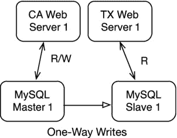
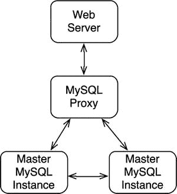
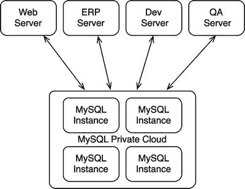
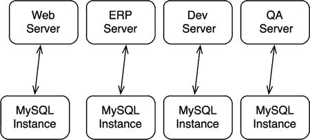
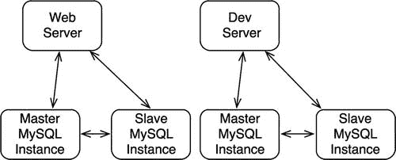
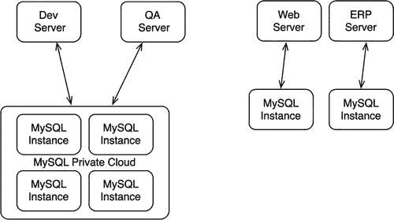
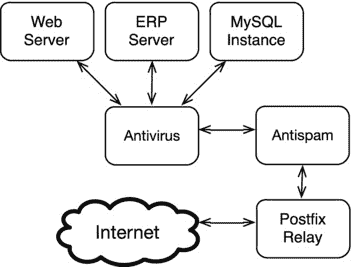
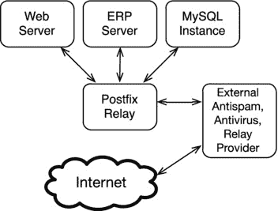
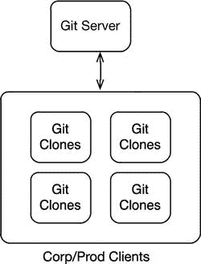
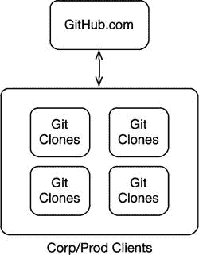

# 四、MySQL、Git 和 Postfix

数据库、修订控制和电子邮件服务器是组织基础结构的重要组成部分。本章涵盖了三个主题:MySQL、Git 和 Postfix。无论是在内部托管还是在公共云中托管，您都应该根据技术、业务和工程资源做出明智的选择。

MySQL 是一个非常流行的开源关系数据库。它从 1995 年就存在了，直到最近，它还是大量 Linux 发行版事实上的数据库。当提到 LAMP 架构时，M 代表 MySQL。Git 是领先的开源版本控制软件。它的分布式特性使它成为开源开发者的热门选择。它在基础设施管理中的应用也越来越受欢迎。

Postfix 已经取代 Sendmail 成为许多 Linux 发行版的邮件传输代理(MTA)的选择。Postfix 快速、安全、易于使用，并且得到了很好的支持。

## 数据库类别

数据库至少可以分为以下几类:

*   有关系的
*   目标
*   NoSQL
*   云
*   分布式的
*   NewSQL

关系数据库已经流行了很长一段时间，并且是迄今为止最广为人知的。一个众所周知的开源关系数据库的例子是 MySQL。这些类型的数据库存储信息和信息组件之间的关系。用于关系数据库的软件被称为关系数据库管理系统(RDBMS)。人力资源数据库非常适合存储在 RDBMS 中，因为雇员和他们的数据之间有很强的关系，数据库可以表示这种关系。

对象数据库不存储关系；相反，它们存储对象。任何可以存储为对象的东西都是对象数据库的良好候选对象。多媒体应用程序是对象数据库的理想候选对象。内容管理系统也可以使用对象数据库。对象数据库的一个例子是 db4o ( [`http://www.db4o.com/`](http://www.db4o.com/) )。

NoSQL 数据库是非结构化数据的良好候选，这些数据的组件之间可能没有很强的关系。此外，与 RDBMS 相比，NoSQL 数据库通常可以处理更大的数据量。一个流行的 NoSQL 数据库是 MongoDB ( [`http://www.mongodb.org/`](http://www.mongodb.org/) )。你可以在 [`http://nosql-database.org/`](http://nosql-database.org/) 找到 NoSQL 数据库列表。

云数据库托管在公共云中。谷歌托管云数据库，如谷歌云存储和谷歌云数据存储。也有其他云数据库，如亚马逊 DynamoDB，这是一个 NoSQL 数据库。

分布式数据库跨多个实例存储数据，因此它们被称为分布式数据库。开源分布式数据库的一个例子是 Cassandra ( [`https://cassandra.apache.org/`](https://cassandra.apache.org/) )。对于海量数据，分布式数据库是 RDBMSs 和对象数据库的替代方案。例如，数百万用户的社交网络数据可能是 Cassandra 的潜在合适候选对象。

NewSQL 数据库提供了 NoSQL 的可伸缩性以及 RDBMSs 的原子性、一致性、隔离性和持久性保证。VoltDB ( [`http://voltdb.com/`](http://voltdb.com/) )和 Clustrix ( [`http://www.clustrix.com/`](http://www.clustrix.com/) )就是 NewSQL 数据库的例子。

## 挑选数据库

有许多可用的开源数据库解决方案。一些受欢迎的方法包括:

*   关系型数据库
*   Maria db(MySQL 的一个分支；很像)
*   卡桑德拉
*   一种数据库系统
*   MongoDB
*   数据库
*   数据库
*   使用心得

还有很多其他的数据库。根据我的经验，我列举了几个拥有广泛安装基础的产品。您可以在 [`https://en.wikipedia.org/wiki/List_of_relational_database_management_systems`](https://en.wikipedia.org/wiki/List_of_relational_database_management_systems) 以及 [`http://www.fromdev.com/2012/07/best-open-source-nosql-database.html`](http://www.fromdev.com/2012/07/best-open-source-nosql-database.html) 查看更完整的列表。

运行在 Linux 上的几个主要商业数据库是

*   甲骨文( [`http://www.oracle.com/index.html`](http://www.oracle.com/index.html)
*   Informix ( [`http://www-01.ibm.com/software/data/informix/`](http://www-01.ibm.com/software/data/informix/)
*   IBM DB2 ( [`http://www-01.ibm.com/software/data/db2/`](http://www-01.ibm.com/software/data/db2/)

数据库的选择应基于以下因素:

*   批准
*   易用性
*   来自社区的支持
*   商业支持可用性
*   所需的数据库类型(对象、关系、NoSQL)
*   更新频率
*   数据库对应用程序的适用性

在设计人力资源应用程序时，如前所述，数据本质上是关系型的——雇员有姓名、社会保险号、工资和其他类似的相关信息。因此，选择关系数据库是合适的。对于多媒体应用程序，如照片、视频和艺术，对象数据库更受欢迎，因为这些媒体可以很容易地存储为对象。云数据库具有由云提供商管理的优势；然而，你的数据最终掌握在云提供商手中，这可能并不是所有情况下都是理想的。

## 安装 MySQL

安装 MySQL 至少有两种选择:

Using the Yellowdog Updater, Modified (YUM) repositories with CentOS/RedHat   Downloading source code and compiling on your own  

`# yum install mysql-server`

`Loaded plugins: fastestmirror`

`...[SNIP]...`

`Installed:`

`mysql-server.x86_64 0:5.5.39-1.el6.remi`

`Dependency Installed:`

`mysql.x86_64 0:5.5.39-1.el6.remi`

`Dependency Updated:`

`mysql-libs.x86_64 0:5.5.39-1.el6.remi`

`Complete!`

您可能还会注意到，如果您执行`yum install mysql-server`，MariaDB 会被安装。正如“MySQL 的未来”一节中所解释的那样，一些发行版已经弃用 MySQL 而使用 MariaDB，Maria db 是一种简单的替代品。

`# yum install mysql-server`

`Loaded plugins: fastestmirror, security`

`Setting up Install Process`

`Package mysql-server is obsoleted by MariaDB-server, trying to install MariaDB-server-10.0.12-1.el6.x86_64 instead`

`...[SNIP]...`

`Installed:`

`MariaDB-compat.x86_64 0:10.0.12-1.el6 MariaDB-server.x86_64 0:10.0.12-1.el6`

`Dependency Installed:`

`MariaDB-client.x86_64 0:10.0.12-1.el6 MariaDB-common.x86_64 0:10.0.12-1.el6`

`Replaced:`

`mysql-libs.x86_64 0:5.1.66-2.el6_3`

`Complete!`

如果可能的话，使用 Linux 发行版提供的 MySQL 预编译二进制文件。维护和管理要容易得多。但是，如果你想构建自己的 MySQL，你必须下载源代码，编译它，然后安装编译后的版本。从 [`https://dev.mysql.com/downloads/`](https://dev.mysql.com/downloads/) 可以下载 MySQL。MySQL 社区服务器是一个很好的起点。

COMPILING MYSQL

下载最新版本。在撰写本文时，最新版本是 5.6。

`# wget --no-check-certificate`[`https://dev.mysql.com/get/Downloads/MySQL-5.6/MySQL-5.6.20-1.el6.src.rpm`T3】](https://dev.mysql.com/get/Downloads/MySQL-5.6/MySQL-5.6.20-1.el6.src.rpm)

`--2014-09-10 16:44:06--`[`https://dev.mysql.com/get/Downloads/MySQL-5.6/MySQL-5.6.20-1.el6.src.rpm`T3】](https://dev.mysql.com/get/Downloads/MySQL-5.6/MySQL-5.6.20-1.el6.src.rpm)

`...[SNIP]...`

`2014-09-10 16:44:13 (4.72 MB/s) - “MySQL-5.6.20-1.el6.src.rpm” saved [31342030/31342030]`

`# ls`

`MySQL-5.6.20-1.el6.src.rpm`

`# rpm -Uvh ./MySQL-5.6.20-1.el6.src.rpm`

`1:MySQL                  ########################################### [100%]`

取消分配。

`# cd /usr/local/src`

`# cp /root/rpmbuild/SOURCES/mysql-5.6.20.tar.gz.`

`# ls`

`MySQL-5.6.20-1.el6.src.rpm  mysql-5.6.20.tar.gz`

`# tar xvfz mysql-5.6.20.tar.gz`

`mysql-5.6.20/`

`mysql-5.6.20/Docs/`

安装`cmake`和`ncurses-devel`。

`# cd mysql-5.6.20`

`# yum install cmake`

`Loaded plugins: fastestmirror, security`

`Loading mirror speeds from cached hostfile`

`...[SNIP]...`

`Installed:`

`cmake.x86_64 0:2.6.4-5.el6`

`# yum install ncurses-devel -y`

`Loaded plugins: fastestmirror, security`

`Loading mirror speeds from cached hostfile`

`Setting up Install Process`

`...[SNIP]...`

`Installed:`

`ncurses-devel.x86_64 0:5.7-3.20090208.el6`

运行`cmake`。

`# cmake.`

`-- Running cmake version 2.6.4`

`-- The C compiler identification is GNU`

`-- The CXX compiler identification is GNU`

`...[SNIP]...`

`-- Googlemock was not found. gtest-based unit tests will be disabled. You can run cmake. -DENABLE_DOWNLOADS=1 to automatically download and build required components from source.`

`-- If you are inside a firewall, you may need to use an http proxy: export http_proxy= http://example.com:80`

`-- Library mysqlserver depends on OSLIBS -lpthread;m;rt;crypt;dl`

`-- Configuring done`

`-- Generating done`

`-- Build files have been written to: /usr/local/src/MySQL/mysql-5.6.20`

运行`make`。

`# make`

`Scanning dependencies of target INFO_BIN`

`[  0%] Built target INFO_BIN`

`...[SNIP]...`

`[100%] Building CXX object mysql-test/lib/My/SafeProcess/CMakeFiles/my_safe_process.dir/safe_process.cc.o`

`Linking CXX executable my_safe_process`

`[100%] Built target my_safe_` `process`

编译后安装软件。

`# make install`

`[  0%] Built target INFO_BIN`

`...SNIP]...`

`[100%] Built target my_safe_process`

`Install the project...`

`-- Install configuration: "RelWithDebInfo"`

`-- Installing: /usr/local/mysql/./COPYING`

`...[SNIP]...`

`-- Installing: /usr/local/mysql/sql-bench/test-wisconsin`

添加`mysql`用户。

`# getent group mysql`

`mysql:x:27:`

`# useradd -r -g mysql mysql`

`# getent passwd mysql`

`mysql:x:495:27::/home/mysql:/bin/bash`

`# cd /usr/local`

`# chown -R mysql.mysql mysql/`

`# pwd`

`/usr/local`

`# cd mysql`

通过引导数据库初始化`mysql`。

`# scripts/mysql_install_db --user=mysql`

`Installing MySQL system tables...2014-09-10 17:25:07 0 [Warning] TIMESTAMP with implicit DEFAULT value is deprecated. Please use --explicit_defaults_for_timestamp server option (see documentation for more details).`

`2014-09-10 17:25:07 32087 [Note] InnoDB: Using atomics to ref count buffer pool pages`

`2014-09-10 17:25:07 32087 [Note] InnoDB: The InnoDB memory heap is disabled`

`...[SNIP]...`

`# chown -R root .`

更改`mysql`的 root 密码。

`# ./bin/mysqld_safe &`

`# ./bin/mysqladmin -u root password 'new-password'`

`# ./bin/mysqladmin -u root -h <hostname> password 'new-password'`

`# cd mysql-test ; perl mysql-test-run.pl`

`# cp support-files/mysql.server /etc/rc3.d/S90mysql`

## MySQL 故障转移

MySQL 支持带复制的主/主和主/从故障转移。在主/主模式下，写入可以发生在一个或多个主服务器上，复制会跟踪它们之间的更新。在主机/从机模式下，写操作必须到主机；主机和从机都可以进行读取。

图 [4-1](#Fig1) 显示了一个加州的 web 服务器向 CA 的 MySQL 主服务器写入数据，以及一个德克萨斯州的 web 服务器向 TX 的主服务器写入数据。CA 和 TX MySQL 服务器使用复制保持彼此同步。CA 和 TX web 服务器从数据库中读取相同的数据。两个 web 服务器都可以写入数据库。

图 4-1。

MySQL master/master design

图 [4-2](#Fig2) 显示了一个主/从设置。写只能发生在加利福尼亚的主数据库上。TX web 服务器只从德克萨斯州的 MySQL 从属服务器读取数据。如果需要从 TX web 服务器写入，我们必须将它们定向到 CA MySQL 服务器，或者将 MySQL 故障转移的类型从主/从改为主/主。加州的主 MySQL 服务器向德克萨斯州的 MySQL 从服务器发送更新。

图 4-2。

MySQL master/slave design

MySQL 代理是另一个在 alpha 版本中的软件。代理自动处理两台主服务器之间的读/写拆分。当然，代理是一个单点故障。因为该软件处于 alpha 版本，所以在生产中使用它可能不合适。如果你决定在非生产环境中使用它，那么如图 [4-3](#Fig3) 所示进行设置。web 服务器不知道它正在使用代理，也不必让它知道。由于 MySQL 代理的 alpha 特性，它应该只在非关键环境中使用。在您开始积极使用 MySQL 代理之前，应该测试它的可伸缩性和速度。确保正在使用的 MySQL 版本至少是 5.0 版，以便它可以与 MySQL 代理一起工作。MySQL 代理也可以安装在给定的 MySQL 服务器上；但是，如果它安装在另一个服务器上会更好，因为在一个 MySQL 服务器崩溃的情况下，您不会失去代理服务器，您可以继续工作。关于 MySQL 代理的更多信息可以在 [`https://dev.mysql.com/doc/refman/5.0/en/mysql-proxy.html`](https://dev.mysql.com/doc/refman/5.0/en/mysql-proxy.html) 获得。

图 4-3。

MySQL failover with MySQL Proxy

另一个选择是使用 HAProxy 代替 MySQL 代理(图 [4-4](#Fig4) )。web 服务器将所有 MySQL 请求发送到 HAProxy IP。反过来，HAProxy 检查两个 MySQL 服务器的可用性。，并根据指定的负载平衡算法将请求转发到可用的 MySQL 服务器。HAProxy 在 [`http://www.haproxy.org/`](http://www.haproxy.org/) 有售

图 4-4。

MySQL failover with HAProxy

## MySQL 企业设计

设计一个企业 MySQL 安装是具有挑战性的。一个企业设计至少有两种不同的模型，如果不是更多的话。一种选择是为企业中的每个人提供 MySQL 即服务或数据库即服务(DBaaS)。一个或多个团队将管理几个 MySQL 数据库服务器集群，并将提供应用程序开发人员可以连接和使用的数据库登录、密码和服务器名称。后端数据库、备份、维护和升级都由提供服务的团队维护。这种模式的优点是成本效益高。维护相对容易，因为它是在单点完成的。单个应用程序团队不必担心设置自己的实例和管理它们。安全问题可以更快地得到解决，因为所有企业 MySQL 实例都由管理它们的团队进行跟踪。

图 4-5。

MySQL in-house private cloud (DBaaS) for Web, Enterprise Resource Planning (ERP), Development (Dev) and Quality Assurance (QA)

另一种选择是让每个应用程序拥有单独的 MySQL 数据库实例，并让应用程序所有者管理实例和他们自己的数据(图 [4-6](#Fig6) )。这意味着每个应用程序所有权团队都必须有 MySQL 管理经验。

图 4-6。

Per-application MySQL servers and no in-house MySQL cloud

一种更健壮的方法是获取每个应用程序的实例，并使它们冗余。在这种情况下，每个团队维护自己的数据库。然而，数据库以主/主或主/从配置运行，以实现故障转移功能(图 [4-7](#Fig7) )。

图 4-7。

Per-application redundant MySQL servers

混合模式包括两者——对小规模应用程序使用 DBaaS，对大规模应用程序使用专用实例(图 [4-8](#Fig8) )。考虑到技术正朝着提供基础设施即服务的方向发展，企业采用 DBaaS 模型已经变得很普遍。

图 4-8。

MySQL Hybrid with DBaaS as well as dedicated instances

设置 MySQL 复制的过程可以在 [`https://dev.mysql.com/doc/refman/5.0/en/replication.html`](https://dev.mysql.com/doc/refman/5.0/en/replication.html) 找到。

## 管理 MySQL

MySQL 自带命令行工具来管理它。除了这些实用程序，还可以使用以下工具:

*   MySQL 实用程序，这是一组附加的实用程序，有助于管理 MySQL ( [`https://dev.mysql.com/downloads/utilities/`](https://dev.mysql.com/downloads/utilities/) )
*   MySQL 工作台，这是一个图形用户界面，使用 MySQL ( [`https://www.mysql.com/products/workbench/`](https://www.mysql.com/products/workbench/) )进行管理、设计和开发
*   percona 工具包( [`http://www.percona.com/software/percona-toolkit`](http://www.percona.com/software/percona-toolkit)

除了自制的工具之外，企业最有可能最终使用这些实用程序的组合来管理其环境。

## 备份 MySQL

MySQL 的定期备份对于业务连续性规划至关重要。理想情况下，备份应该运送到另一个位置，远离数据库。甚至可以将数据库备份到云数据存储中。MySQL 提供多种类型的备份:

*   冷备份:当服务器关闭时。这确保了数据的一致性。对于依赖 MySQL 进行日常活动的全球性组织或拥有在线业务的组织来说，该选项通常是不可行的。
*   热备份:数据库表没有被锁定(换句话说，读写继续进行)。我不推荐这种类型的备份，因为您可能会损坏备份或错过一些重要的数据库更新。
*   热备份:允许读取，但禁止写入。这是一个非常受欢迎的解决方案，因为它可以在确保数据一致性的同时非常快速地完成。

在主/从配置中，冷备份或热备份也可以在从服务器上进行。这允许继续使用主数据库；当从设备重新联机时，它会赶上主设备。

在备份 MySQL 时，您可以备份数据文件本身，这被视为原始备份，或者您可以执行逻辑备份，这包括重新创建数据库模式所需的 SQL 语句。我的建议是做一个逻辑备份，因为这样更容易恢复。要获得一致的备份，您有两个选择:一个是进行冷备份；另一种是锁定表并刷新它们。

`mysql>LOCK TABLES``tablelist`T2】

`mysql>FLUSH TABLES``tablelist`T2】

许多软件工具可以用来制作 MySQL 备份。其中包括`mysqldump`、`ibbackup`、`mysqlhostcopy`。这里显示的是一个使用`mysqldump`和一致备份副本的例子。这个例子是一个名为 webapps 的小型测试数据库，其中只有一行。正如您在示例中看到的，`mysqldump`在进行备份之前为写操作锁定了表。

`$ mysqldump webapp --user root --password`

`Enter password:`

`-- MySQL dump 10.15  Distrib 10.0.12-MariaDB, for Linux (x86_64)`

`--`

`-- Host: localhost    Database: webapp`

`-- ------------------------------------------------------`

`-- Server version        10.0.12-MariaDB`

`/*!40101 SET @OLD_CHARACTER_SET_CLIENT=@@CHARACTER_SET_CLIENT */;`

`/*!40101 SET @OLD_CHARACTER_SET_RESULTS=@@CHARACTER_SET_RESULTS */;`

`/*!40101 SET @OLD_COLLATION_CONNECTION=@@COLLATION_CONNECTION */;`

`/*!40101 SET NAMES utf8 */;`

`/*!40103 SET @OLD_TIME_ZONE=@@TIME_ZONE */;`

`/*!40103 SET TIME_ZONE='+00:00' */;`

`/*!40014 SET @OLD_UNIQUE_CHECKS=@@UNIQUE_CHECKS, UNIQUE_CHECKS=0 */;`

`/*!40014 SET @OLD_FOREIGN_KEY_CHECKS=@@FOREIGN_KEY_CHECKS, FOREIGN_KEY_CHECKS=0 */;`

`/*!40101 SET @OLD_SQL_MODE=@@SQL_MODE, SQL_MODE='NO_AUTO_VALUE_ON_ZERO' */;`

`/*!40111 SET @OLD_SQL_NOTES=@@SQL_NOTES, SQL_NOTES=0 */;`

`--`

`-- Table structure for table `webservers``

`--`

`DROP TABLE IF EXISTS `webservers`;`

`/*!40101 SET @saved_cs_client     = @@character_set_client */;`

`/*!40101 SET character_set_client = utf8 */;`

`CREATE TABLE `webservers` (`

``name` varchar(255) DEFAULT NULL,`

``location` varchar(32) DEFAULT NULL`

`) ENGINE=InnoDB DEFAULT CHARSET=latin1;`

`/*!40101 SET character_set_client = @saved_cs_client */;`

`--`

`-- Dumping data for table `webservers``

`--`

`LOCK TABLES `webservers` WRITE;`

`/*!40000 ALTER TABLE `webservers` DISABLE KEYS */;`

`INSERT INTO `webservers` VALUES ('web1.example.com` `','TX');`

`/*!40000 ALTER TABLE `webservers` ENABLE KEYS */;`

`UNLOCK TABLES;`

`/*!40103 SET TIME_ZONE=@OLD_TIME_ZONE */;`

`/*!40101 SET SQL_MODE=@OLD_SQL_MODE */;`

`/*!40014 SET FOREIGN_KEY_CHECKS=@OLD_FOREIGN_KEY_CHECKS */;`

`/*!40014 SET UNIQUE_CHECKS=@OLD_UNIQUE_CHECKS */;`

`/*!40101 SET CHARACTER_SET_CLIENT=@OLD_CHARACTER_SET_CLIENT */;`

`/*!40101 SET CHARACTER_SET_RESULTS=@OLD_CHARACTER_SET_RESULTS */;`

`/*!40101 SET COLLATION_CONNECTION=@OLD_COLLATION_CONNECTION */;`

`/*!40111 SET SQL_NOTES=@OLD_SQL_NOTES */;`

`-- Dump completed on 2014-09-13 19:24:23`

当 MySQL 作为 DBaaS 提供时，企业备份策略要容易得多，因为您可以在 DBaaS 中使用多个主服务器中的一个，并在不影响应用程序的情况下使用写锁进行备份。如果我们只有一个主服务器，那么 lock table 命令可能会导致大型表的应用程序问题。

## 获得 MySQL 的帮助

MySQL 支持选项包括以下内容:

*   来自甲骨文的商业支持( [`https://www.mysql.com/support/`](https://www.mysql.com/support/) `)`
*   社区论坛( [`http://forums.mysql.com/`](http://forums.mysql.com/)
*   文档( [`https://dev.mysql.com/doc/`](https://dev.mysql.com/doc/) )
*   互联网中继聊天(IRC)频道( [`https://dev.mysql.com/doc/refman/5.0/en/irc.html`](https://dev.mysql.com/doc/refman/5.0/en/irc.html) )
*   邮件列表( [`http://lists.mysql.com/`](http://lists.mysql.com/) )
*   MySQL 开发项目托管在 [`https://launchpad.net/mysql`](https://launchpad.net/mysql) ，如果你想为项目做贡献。
*   专家 MySQL 是 MySQL 的好向导( [`http://www.apress.com/9781430246596`](http://www.apress.com/9781430246596) )

## MySQL 的未来

在 2008 年被 Sun Microsystems 收购之前，MySQL 一直由瑞典公司 MySQL AB 拥有和运营。Sun 后来在 2009 年被甲骨文收购。开源社区认为甲骨文对 MySQL 的所有权本质上是一种利益冲突，并提出了一个名为 MariaDB ( [`https://mariadb.org/`](https://mariadb.org/) )的替代 MySQL 的方法。MySQL 的主要作者 Michael“Monty”wide nius 支持将 MySQL 拆分成 MariaDB。流行的 Linux 发行版已经转而提供 MariaDB 作为发行版的一部分，而不是 MySQL。然而，MySQL 继续享有大量的安装基础，仍然非常受欢迎。

企业应该选择 MySQL 还是 MariaDB？这个问题的最好答案是回顾关于开放源码软件的企业政策。如果一个企业有使用开源软件的文化，并且认同 Oracle 对 MySQL 的所有权为 MySQL 创造了不确定的未来的观点，那么 MariaDB 就是正确的选择。另一方面，在过去的几年里，Oracle 一直在继续开发 MySQL，所以有人可能会说这是投资 MySQL 的充分理由。随着时间的推移，MariaDB 有可能变得比 MySQL 更加不同。

## 企业中的电子邮件

电子邮件在企业中至少扮演着两个重要的角色。其中一个角色是显而易见的——对内和对外的沟通。另一个是使用电子邮件进行基础架构管理。在基础架构管理中使用电子邮件的一些示例包括:

*   对于使用 Nagios 等监控工具的公司来说，电子邮件是发送警报的一种方式。
*   来自 cron 等系统服务的电子邮件可以在一个中心位置收集，并进行故障排除分析。
*   服务器上的应用程序可以使用电子邮件网关来转发特定于应用程序的信息。
*   安全团队可能希望分析与系统相关的电子邮件，以确定是否有任何服务器或应用程序遭到破坏。

企业在处理来自服务器的邮件时有不同的策略。其中一些策略是

*   向`/dev/null`发送所有与系统相关的电子邮件，并使用广泛的带外服务监控和基于 SMS 的警报
*   将与系统相关的电子邮件留在各自的系统上，对它们进行安全处理，对系统本身进行故障排除，然后根据需要进行清理
*   将来自系统的所有电子邮件转发到电子邮件网关，然后由该网关存储和处理电子邮件

作为一名现场可靠性工程师，您的行动选择至少应考虑以下几点:

*   您拥有的系统数量，因为如果您管理数千台服务器，从每台服务器接收电子邮件可能不太实际
*   与系统相关的电子邮件对您有多重要，因为您可以通过全面的监控体系结构获得与系统相关的电子邮件相同的信息
*   在应用程序中配置 MTA，而不是依赖系统提供的 MTA。如果应用程序可以在不依赖系统邮件程序的情况下向网关发送电子邮件，那么这个选项可以省去您在服务器上配置电子邮件的麻烦。

## 电子邮件解决方案战略

有效的企业电子邮件解决方案战略对企业至关重要。对于电子邮件解决方案，有两种主要选择:

*   使用开放源码软件或商业软件在内部设置电子邮件；这方面的一个例子是使用 Postfix 或 Microsoft Exchange
*   使用电子邮件云提供商，如谷歌、微软或 Rackspace

选择内部构建还是使用公共云取决于许多因素。在决策过程中，花大量时间分析利弊，然后做出决定。请记住以下几点:

*   组织受到的任何法规都会阻止其在云提供商中托管电子邮件
*   云解决方案相对于内部解决方案的成本(例如，Gmail for Work 的标价约为每人每月 5 美元)
*   现有的解决方案是否是内部的，因为迁移到云的努力可能太痛苦了
*   云电子邮件提供商的客户端访问方法(例如，如果您的用户希望将电子邮件/日历与其智能手机同步)

托管电子邮件提供商数量众多，成本差异巨大。其中许多都提供电子邮件、日历和智能手机同步功能。Exchange 托管也非常受欢迎，有许多 Microsoft 合作伙伴提供托管的 Exchange 帐户。托管电子邮件的一些选项包括:

*   谷歌 Gmail for Work ( [`https://www.gmail.com/intl/en/mail/help/about.html`](https://www.gmail.com/intl/en/mail/help/about.html) )
*   托管交易所( [`https://office.microsoft.com/en-us/`](https://office.microsoft.com/en-us/) )
*   rackspace–托管的电子邮件( [`http://www.rackspace.com/email-hosting/webmail/`](http://www.rackspace.com/email-hosting/webmail/) )

将电子邮件放在公共云中非常方便。使用托管电子邮件的几个优点是

*   没有硬件或软件方面的资本支出
*   不需要工程人员维护邮件基础设施
*   托管的总拥有成本可能低于内部基础架构

把你的电子邮件放在公共云中，并不是一切都是美好的。托管电子邮件的缺点包括:

*   你的电子邮件安全掌握在别人手中。
*   经常性运营成本可能高于内部解决方案。
*   并非所有的电子邮件要求(如存档)都可以通过托管提供商获得。
*   失去公司办公室的互联网连接也可能导致无法访问电子邮件。

## 企业邮件传输代理

MTA 是一种在服务器之间传输邮件的软件。邮件用户代理是最终用户用来下载和阅读电子邮件的软件。MTA 的选择是巨大的；一些比较受欢迎的方法包括:

*   发送邮件
*   后缀
*   Qmail
*   阿帕奇·詹姆斯
*   进出口银行

Sendmail 曾经是 CentOS 上默认的 MTA，直到 CentOS 6.x 发布，Postfix 才成为默认的 MTA。当决定为您的组织选择 MTA 时，请记住以下几点:

*   开源还是商业？
*   如果开源，需要商业支持吗？
*   最终用户社区有多活跃？
*   安全漏洞能多快被堵住？
*   产品的发布周期是怎样的？
*   MTA 能否满足贵组织对速度和可靠性的技术需求？

## Postfix 企业设计

最基本的 Postfix 设计是为每个需要的服务器提供直接邮件传递，包括出站和入站邮件传递。这种设计的优点如下:

*   这很简单，如果接收邮件的服务器数量不多的话。因为每个服务器处理它自己的邮件或它所负责的域的邮件，所以不会遇到路由复杂性。
*   它是独立的。一台服务器不依赖于另一台服务器；可以在一台服务器上进行更改，而不会影响另一台服务器。
*   它很快。因为路由更直接且没有代理，所以邮件传递很快。

这种设计的缺点包括以下几点:

*   它不可扩展。除了少数几台服务器之外，可能很难管理。
*   这不安全。每台处理邮件的服务器都必须有一个开放的互联网端口。因此，服务器容易受到来自互联网的攻击。
*   很难维持。每台服务器都必须单独更新和单独管理。

虽然直邮的设计很简单，但对于大型企业来说并不流行，因为它允许进入企业的多个入口点(图 [4-9](#Fig9) )。

图 4-9。

Postfix with direct outbound and inbound mail delivery

另一种方法是为进入企业的邮件提供单一的入口和出口。这是一种更常见的方法。这种方法的优点如下:

*   因为只有一个瓶颈，所以很容易维护。
*   电子邮件流量的监控很简单，因为所有流量都通过一个网关。
*   报告是准确的，因为只有一个入口/出口。
*   因为只有一台服务器对互联网开放邮件，所以安全性得到了增强。
*   成本降低是因为需要更少的邮件服务器，如果使用商业解决方案，这也降低了许可成本。

这种解决方案比直邮更受欢迎，因为它比直邮有许多优势(图 [4-10](#Fig10) )。企业也可以使用专用的反垃圾邮件和反病毒解决方案，如 Barracuda networks ( [`https://www.barracuda.com/`](https://www.barracuda.com/) )或 Mailfoundry ( [`http://www.mailfoundry.com/`](http://www.mailfoundry.com/) )的解决方案。对于开源解决方案，可以建立一个运行 SpamAssassin ( [`https://spamassassin.apache.org/`](https://spamassassin.apache.org/) )和 ClamAV ( [`http://www.clamav.net/index.html`](http://www.clamav.net/index.html) )的服务器。

图 4-10。

Postfix with internal antivirus, antispam, and outbound and inbound relay

另一种方法是使用第三方供应商，如 Websense ( [`https://www.websense.com/content/websense-email-security-products.aspx`](https://www.websense.com/content/websense-email-security-products.aspx) )来处理反垃圾邮件和反病毒(图 [4-11](#Fig11) )。该解决方案的优点如下:

图 4-11。

Postfix with external hosted antispam, antivirus, and outbound and inbound relay

*   不需要维护任何硬件或软件。
*   反垃圾邮件和防病毒定义的更新是自动的。
*   自动扩展利用了云的力量。
*   您的网络受到保护，只允许云提供商访问它。

## 安装 Postfix

Postfix 是 CentOS/RedHat 上的默认 MTA，因此它存在于大多数服务器安装中，除非您删除它。

使用`yum`安装很简单。只需运行`yum install postfix`。

`# yum install postfix -y`

`Loaded plugins: fastestmirror`

`...[SNIP]...`

`--> Running transaction check`

`---> Package postfix.x86_64 2:2.6.6-6.el6_5 will be installed`

`--> Finished Dependency Resolution`

`...[SNIP]...`

`Installed:`

`postfix.x86_64 2:2.6.6-6.el6_5`

`Complete!`

如果您想要与 yum 存储库中的版本不同的版本，那么首先下载该版本。

`# wget`[`http://mirrors-usa.go-parts.com/postfix/source/official/postfix-2.10.3.tar.gz`T3】](http://mirrors-usa.go-parts.com/postfix/source/official/postfix-2.10.3.tar.gz)

`--2014-09-11 23:40:37--`[`http://mirrors-usa.go-parts.com/postfix/source/official/postfix-2.10.3.tar.gz`T3】](http://mirrors-usa.go-parts.com/postfix/source/official/postfix-2.10.3.tar.gz)

`...[SNIP]...`

`2014-09-11 23:40:39 (3.42 MB/s) - “postfix-2.10.3.tar.gz” saved [3828808/3828808]`

Untar 和`make`进行编译。

`# tar xvfz postfix-2.10.3.tar.gz`

`postfix-2.10.3/`

`...[SNIP]...`

`postfix-2.10.3/README_FILES/XFORWARD_README`

`# make`

`make -f Makefile.in MAKELEVEL= Makefiles`

`...[SNIP]...`

`gcc -Wmissing-prototypes -Wformat -Wno-comment  -g -O -I. -I../../include -DLINUX2 -o tlsproxy tlsproxy.o tlsproxy_state.o ../../lib/libtls.a ../../lib/libmaster.a ../../lib/libglobal.a ../../lib/libutil.a -ldb -lnsl -lresolv`

`cp tlsproxy ../../libexec`

`make install`安装。这将使用前缀/安装，因此它将替换您的系统后缀。

`# make install`

`set -e; for i in src/util src/global src/dns src/tls src/xsasl src/milter src/master src/postfix src/fsstone src/smtpstone src/sendmail src/error src/pickup src/cleanup src/smtpd src/local src/trivial-rewrite src/qmgr src/oqmgr src/smtp src/bounce src/pipe src/showq src/postalias src/postcat src/postconf src/postdrop src/postkick src/postlock src/postlog src/postmap src/postqueue src/postsuper src/qmqpd src/spawn src/flush src/verify src/virtual src/proxymap src/anvil src/scache src/discard src/tlsmgr src/postmulti src/postscreen src/dnsblog src/tlsproxy; do \`

`(set -e; echo "[$i]"; cd $i; make 'CC=gcc -Wmissing-prototypes -Wformat -Wno-comment ' update MAKELEVEL=) || exit 1; \`

`done`

`...[SNIP]...`

`Editing /etc/postfix/master.cf, adding missing entry for tlsproxy unix-domain service`

## 配置后缀

Postfix 有数百种配置选项。我从`/etc/postfix/main.cf`文件中概述了一些常见的。

### 用于出站邮件的域名

将此选项设置为您的出站邮件的域名。默认情况下，此选项使用出站电子邮件的主机名。该选项还指定附加到非限定收件人地址的域。

`#default value is:`

`#myorigin = $myhostname`

`#myorigin = $mydomain`

`#we are going to send outbound mail as originating from example.com`

`mydomain = example.com`

`myorigin = $` `mydomain`

#### 接收电子邮件的域名

此选项指定 Postfix 接收电子邮件的域名。默认情况下，Postfix 只接收主机名的电子邮件。对于域邮件服务器，请更改该值以包含域名。

`#default value`

`mydestination = $myhostname, localhost.$mydomain, localhost`

`#we are going to change it so that we can receive email for example.com`

`mydestination = $myhostname, localhost.$mydomain, localhost, $mydomain`

#### 允许中继的网络

默认情况下，Postfix 允许 Postfix 服务器的本地子网上的客户端将其用作中继——换句话说，就是那些在`$mynetworks`配置参数中定义的网络。对此进行更改，以包括组织内允许使用此 Postfix 服务器发送电子邮件的所有网络。

`#default value`

`#mynetworks_style = class`

`#mynetworks_style = subnet`

`#mynetworks_style = host`

`#mynetworks = 168.100.189.0/28, 127.0.0.0/8`

`#mynetworks = $config_directory/mynetworks`

`#mynetworks = hash:/etc/postfix/network_table`

`#change the default values to be your network, assuming your network is 10.0.0.0/8`

`mynetworks = 10.0.0.0/8`

`#another way of accomplishing the above is:`

`mynetworks_style = class`

`#if you want to forward e-mail only from the Postfix host:`

`mynetworks_style = host`

`#if you want only the Postfix server subnet to forward e-mail via the Postfix server:`

`mynetworks_style = subnet`

#### 将邮件中继到目的地

当邮件来自授权网络之外的客户端时，Postfix 仅将电子邮件转发到授权域。您可以使用`relay_domains`参数指定哪些域可以作为未经身份验证的发件人的收件人域。

`#default value is:`

`#relay_domains = $mydestination`

`#if you do not want to forward e-mail from strangers, then change it as follows (recommended for outgoing mail servers, not for incoming):`

`relay_domains =`

`#if you want to forward e-mail from strangers to your domain:`

`relay_domains = $` `mydomain`

#### 交付方式

邮件由 Postfix 使用收件人的邮件交换器(MX)记录直接发送。您可能不需要此功能，因为转发给也过滤出站邮件的外部邮件托管提供商可能会更好。

`#default value is:`

`#relayhost = $mydomain`

`#relayhost = [gateway.my.domain]`

`#relayhost = [mailserver.isp.tld]`

`#relayhost = uucphost`

`#relayhost = [an.ip.add.ress]`

`#change the value to be`

`relayhost = external.mail.provider.ip.address`

#### 报告故障

您可能想要定义的另一个值是在出现任何问题时向谁发送电子邮件。邮局主管的电子邮件地址在`/etc/aliases`中指定，而不是在`/etc/postfix/main.cf`中指定。

`#default value is:`

`$ grep -i postmaster /etc/aliases`

`mailer-daemon:  postmaster`

`postmaster:     root`

`#change to an e-mail address in your org that is an alias for the team responsible for Postfix`

`postmaster:` `email-admins@example.com`

#### 使用 NAT

如果 Postfix 服务器正在使用 NAT(换句话说，它在一个私有 IP 空间中)，并且它正在接收到一个公共 IP 地址的电子邮件地址，您也需要指定这一点。

`#default value is:`

`#proxy_interfaces =`

`#proxy_interfaces = 1.2.3.4`

`#change it to your external IP address to which e-mail is sent`

`proxy_interfaces = your.public.email.server.ip.address`

#### 记录

后缀记录通过`/etc/rsyslog.conf`中的系统日志完成。默认情况下一般会将所有邮件日志发送到`/var/log/maillog`，这是存储您邮件日志的好地方。

`#default value is:`

`mail.* -/var/log/maillog`

## 电子邮件协议

Postfix 设置好之后，下一个要解决的问题是如何让客户访问电子邮件。谈到客户端访问，一些流行的协议包括

*   因特网邮件访问协议
*   POP(也称为 POP3)

一般来说，为了保持简单，避免直接交付到组织中的目标服务器；相反，应用程序服务器从邮箱服务器提取电子邮件。应用服务器可以使用一种或多种协议，如 IMAP 或 POP。除了应用程序服务器，您还可以让最终用户使用这些协议来访问他们的邮箱。IMAP 是在 RFC 3501 ( [`http://tools.ietf.org/html/rfc3501`](http://tools.ietf.org/html/rfc3501) )中定义的，比 POP 有更多的特性。POP 是在 RFC 1939 ( [`https://www.ietf.org/rfc/rfc1939.txt`](https://www.ietf.org/rfc/rfc1939.txt) )中定义的，由来已久。

如果您有需要提取电子邮件的应用服务器，图 [4-12](#Fig12) 显示了一个可能有所帮助的设计。邮件传递代理(MDA)和邮件提交代理(MSA)都可以是 Postfix 服务器。MDA 是将邮件传递到邮箱的代理；MSA 接受来自邮件用户代理的电子邮件。

图 4-12。

Application servers using e-mail

对于 MSA，有许多选项，包括

*   多佛港(123t2)`http://www.dovecot.org/``)`
*   信使( [`http://www.courier-mta.org/imap/`](http://www.courier-mta.org/imap/) )
*   赛勒斯( [`https://www.cyrusimap.org/`](https://www.cyrusimap.org/) `)`

这些 MSA 选项都是开源和免费的。所有这些都支持数千个邮箱，可以帮助您轻松管理您的电子邮件环境。

## 获得关于后缀的帮助

后缀支持有许多选项。在线文档是非常好的，就像任何开源自由软件一样，用户社区是你阅读文档后获得帮助的最佳选择。一些在线帮助选项包括:

*   邮件列表( [`http://www.postfix.org/lists.html`](http://www.postfix.org/lists.html) )
*   IRC 频道( [`http://irc.lc/freenode/postfix/irctc@@@`](http://irc.lc/freenode/postfix/irctc@@@) `)`
*   在线文档( [`http://www.postfix.org/documentation.html`](http://www.postfix.org/documentation.html) )

## 企业中的修订控制

修订控制在企业基础设施中有许多用途。传统的方法是对源代码管理使用修订控制。然而，修订控制也可以在基础设施管理中发挥重要作用。例如，如果环境中正在使用绑定，那么绑定配置可以存储在 Git 中。Postfix 等软件和 OpenVPN、iptables 和 Hadoop 等其他软件的配置也可以存储在版本控制中。Puppet 和 Salt 等配置管理工具也可以轻松地与 Git 集成。

Git 中存储了大量开源软件源代码。在企业中使用 Git 的一个优势是与互联网社区的协作变得更加容易。一些使用 Git 的主要开源项目包括

*   Linux 内核
*   OpenStack
*   openvz
*   土地神
*   妙的

更完整的列表见 [`https://git.wiki.kernel.org/index.php/GitProjects`](https://git.wiki.kernel.org/index.php/GitProjects) 。

## 修订控制管理选择

在开源世界和商业世界中，有大量的修订控制软件可用。一些可用的开源代码管理选项包括:

*   CVS ( [`http://www.nongnu.org/cvs/`](http://www.nongnu.org/cvs/)
*   去吧( [`http://git-scm.com/`](http://git-scm.com/)
*   水银( [`http://mercurial.selenic.com/`](http://mercurial.selenic.com/) )
*   阿帕奇颠覆( [`https://subversion.apache.org/`](https://subversion.apache.org/) )

流行的并在 Linux 上运行的商业版本控制软件包括

*   BitKeeper ( [`http://www.bitkeeper.com/`](http://www.bitkeeper.com/)
*   Rational ClearCase ( [`http://www-03.ibm.com/software/products/en/clearcase`](http://www-03.ibm.com/software/products/en/clearcase) )
*   穿孔( [`http://www.perforce.com/`](http://www.perforce.com/) )

更完整的列表见 [`https://en.wikipedia.org/wiki/Comparison_of_revision_control_software`](https://en.wikipedia.org/wiki/Comparison_of_revision_control_software) 。

您选择使用哪个软件应取决于以下因素:

*   与您可能正在使用的任何持续集成和持续部署软件集成
*   与您可能正在使用的基础设施软件兼容，例如 Puppet/Salt
*   软件的成本
*   你是否需要商业支持
*   可能需要不同的操作系统支持
*   易用性
*   软件中的缺陷修复得有多快
*   组织中工程师的知识库

## 你为什么要走？

Git 从根本上不同于其他版本控制软件。Git 的一些不同之处如下:

Git maintains snapshots of the file system, instead of just differences.   Nearly every operation in Git is local and does not require connectivity to a remote Git server.   Git uses checksum of files before it stores the file, and references the file using that checksum.  

在这三个区别中，Git 使其成为基础设施管理的理想候选的最重要的方面是，即使不能连接到远程存储库，您也可以继续使用 Git。因为您不能假设服务器之间的网络总是可靠的，所以我们必须确保您的服务器上的 Git 存储库独立运行，并且如果它们无法到达 Git 服务器，它们不会对您的服务造成问题。Git 的分布式特性使其成为基础设施使用的理想选择。Git 是由 Linux 的创始人 Linus Torvalds 开发的，这也有助于它的流行。

## 安装 Git

Git 开源易于安装。与大多数开源软件一样，您可以使用 Linux 发行版中的`yum`库，也可以下载并编译该软件。最简单的方法是使用`yum`存储库。

INSTALLING GIT

安装 Git 最简单的方法是使用`yum`。

`# yum install git`

`Loaded plugins: fastestmirror`

`Loading mirror speeds from cached hostfile`

`...[SNIP]...`

`Setting up Install Process`

`Resolving Dependencies`

`--> Running transaction check`

`---> Package git.x86_64 0:1.7.1-3.el6_4.1 will be installed`

`--> Processing Dependency: perl-Git = 1.7.1-3.el6_4.1 for package: git-1.7.1-3.el6_4.1.x86_64`

`--> Processing Dependency: perl(Git) for package: git-1.7.1-3.el6_4.1.x86_64`

`--> Running transaction check`

`---> Package perl-Git.noarch 0:1.7.1-3.el6_4.1 will be installed`

`--> Finished Dependency Resolution`

`Dependencies Resolved`

`...[SNIP]...`

`Installed:`

`git.x86_64 0:1.7.1-3.el6_4.1`

`Dependency Installed:`

`perl-Git.noarch 0:1.7.1-3.el6_4.1`

`Complete!`

如果您更愿意使用源代码，那么首先安装依赖项。

`$ sudo yum install curl-devel expat-devel gettext-devel openssl-devel zlib-devel -y`

`Loaded plugins: fastestmirror`

`Loading mirror speeds from cached hostfile`

`...[SNIP]...`

`Updated:`

`libcurl-devel.x86_64 0:7.19.7-37.el6_5.3 openssl-devel.x86_64 0:1.0.1e-16.el6_5.15`

`Dependency Updated:`

`curl.x86_64 0:7.19.7-37.el6_5.3 libcurl.x86_64 0:7.19.7-37.el6_5.3 openssl.x86_64 0:1.0.1e-16.el6_5.15`

`Complete!`

下载 Git。

`# wget`[`https://github.com/git/git/archive/master.zip`T3】](https://github.com/git/git/archive/master.zip)

`--2014-09-10 12:22:46--`[`https://github.com/git/git/archive/master.zip`T3】](https://github.com/git/git/archive/master.zip)

`...[SNIP]...`

`2014-09-10 12:22:48 (3.37 MB/s) - "master.zip" saved [6192829/6192829]`

`# unzip master.zip`

`Archive:  master.zip`

`0c72b98f31bf6eabd75be565a08ffcf0d8e74b1f`

`...[SNIP]...`

`git-master/RelNotes -> Documentation/RelNotes/2.2.0.txt`

运行`make`。

`# make prefix=/usr/local all`

`GIT_VERSION = 2.1.0.GIT`

`...[SNIP]...`

`GEN bin-wrappers/test-subprocess`

`GEN bin-wrappers/test-svn-fe`

`GEN bin-wrappers/test-urlmatch-normalization`

`GEN bin-wrappers/test-wildmatch`

`GEN git-remote-testgit`

安装 Git。

`# make prefix=/usr/local install`

`GEN perl/PM.stamp`

`SUBDIR perl`

`...[SNIP]...`

## 设置 Git 服务器

建立 Git 服务器来简化 Git 存储库是一种常见的做法。创建 Git 服务器的步骤包括:

Dedicate a server to Git.   Install Git.   Create a `git` user.   Copy your secure shell (SSH) public keys into authorized keys for `git` user.   Initialize a bare repository on the server.   Clone the repository from your desktop.   Check in files in the repository.   Push the repository back to the server.  

`# yum install git –y`

`# useradd git`

`# su - git`

`$ mkdir .ssh`

`$ cd .ssh`

`$ cat <your-ssh-public-key> >> authorized_keys`

`$ cd $HOME`

`$ mkdir postfix.git`

`$ cd postfix.git`

`$ git -–bare init`

`$ exit`

`# su – <your-user-name>`

`$ git clone git@localhost:/home/git/postfix.git`

`$ touch myfile`

`$ git add myfile`

`$ git commit –am “initial commit”`

`$ git push origin` `master`

## Git 企业设计

规划 Git 企业部署可能是一项复杂的任务。最简单的设计是一个单一的 Git 服务器托管所有的 Git 存储库(图 [4-13](#Fig13) )。客户端从这个单一的 Git 服务器克隆，并推送到它。如果一个企业有许多地理上分散的位置，这个解决方案可能很难实现，因为许多位置只有一个服务器。它可以判断站点之间的网络连接是否可靠和快速，以及 Git 在远程站点是否经常使用。

图 4-13。

A single Git server

更现实的解决方案是拥有多个 Git 存储库——比方说，每个站点一个——并保持这些存储库同步(图 [4-14](#Fig14) )。客户端克隆并推送至其站点中的服务器。这种解决方案的优点是比以前的解决方案更快。另外，也比较靠谱。缺点是您必须设法保持不同站点之间的 Git 主存储库同步。

图 4-14。

Multisite Git servers

另一个解决方案是使用托管的 Git——比如说，用 [`GitHub.com`](http://github.com/) (图 [4-15](#Fig15) )。这个选项可以让你用 GitHub 维护所有的库，不同的站点可以直接从 [`GitHub.com`](http://github.com/) 拉取。您将支付这笔费用，但是您不需要维护硬件或软件，GitHub 会为您处理所有的认证和升级。其他服务如 Bitbucket ( [`https://bitbucket.org/`](https://bitbucket.org/) )、GitLab ( [`https://about.gitlab.com/`](https://about.gitlab.com/) )和 Atlassian Stash ( [`https://www.atlassian.com/software/stash`](https://www.atlassian.com/software/stash) )都是 [`GitHub.com`](http://github.com/) 的可行替代方案。

图 4-15。

Hosted Git

## Git 协议

Git 使用 GNU priway Guard(GPG)密钥签署提交，以确认作者/工具的真实性。用于访问 Git 的协议如下:

*   本地:本地协议在本地机器上工作，而不是远程工作。如果您有一个共享文件系统，可以被所有需要 Git 的客户机访问，这可能是一个选项。这样做的一个优点是设置简单。
*   SSH:使用 Git 的一种非常常见和安全的方式是使用 SSH，它为您提供了到 Git 服务器的经过认证和加密的连接。这种方法的缺点是您不能共享未经认证的存储库，所以对于想要共享存储库的公共项目来说，这可能并不理想。如果您在`$HOME/.ssh/authorized_keys`的`git`用户目录中为用户设置了 SSH 密钥，那么您可以使用 SSH 无密码认证，这非常容易管理。
*   Git:Git 有一个特殊的守护进程；它监听端口 9418。它不提供任何身份验证；然而，它非常快。由于缺乏身份验证，您通常不希望在使用此协议共享的存储库上启用推送。
*   HTTP/S:使用 HTTP 的优点是可以利用现有的 Apache 或其他 web 服务器基础设施。HTTP 也很方便快捷，再加上可以使用安全套接字层证书。您必须启用 Git 挂钩来使用 HTTP，除此之外没有其他配置。您只需将 Git 目录放在 web 服务器提供的路径中。

`# using local protocol from the directory /gitrepos`

`$ git clone` `file:///gitrepos/project.git`

`or`

`$ git clone /opt/git/project.git`

`# using ssh protocol from``git@example.com`T2】

`$ git clone` `ssh://git@git.example.com:project.git`

`# this example uses the git protocol on`

`$ git clone` `git://git.example.com/gitproject.git`

`$ git clone` `https://git.example.com/project.git`

## 获得 Git 的帮助

Git 最近变得非常流行，因为很容易找到对它的支持。一些可用的支持选项包括

*   邮件列表( [`http://git-scm.com/community`](http://git-scm.com/community) )
*   IRC ( [`http://git-scm.com/community`](http://git-scm.com/community)
*   文档( [`http://git-scm.com/documentation`](http://git-scm.com/documentation) )
*   使用 GitHub 时，附加支持选项，其中包括商业支持( [`https://enterprise.github.com/support`](https://enterprise.github.com/support) )
*   Pro Git，是一本非常有用的关于 Git 的书( [`http://www.apress.com/9781484200773`](http://www.apress.com/9781484200773) )

## 结论

有三个非常强大的数据管理平台:MySQL 用于数据库，Git 用于源代码和配置数据，Postfix 用于电子邮件。它们中的每一个都是成功的 Linux 基础设施的重要组成部分。结合使用，它们可以作为业务的推动者，并成为您的业务战略的重要组成部分。