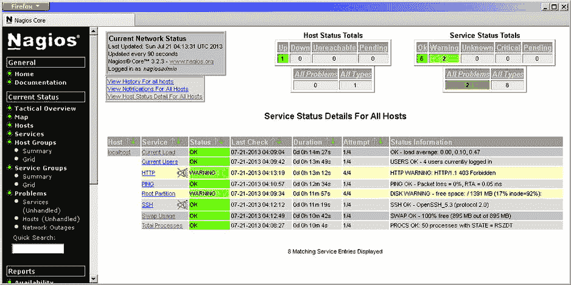
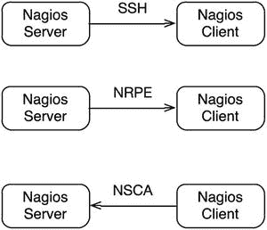
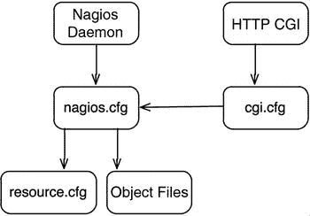
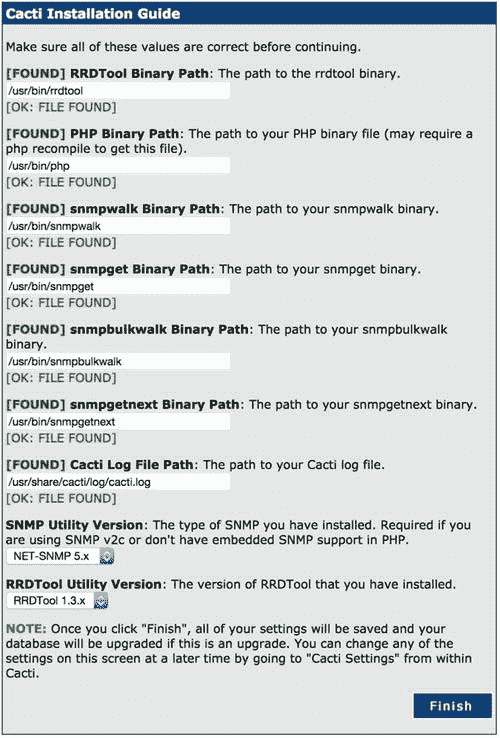
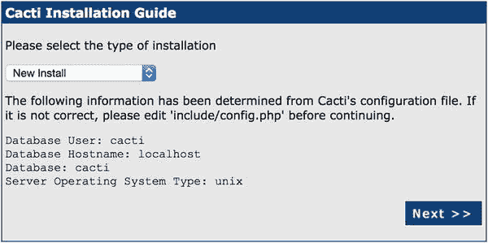
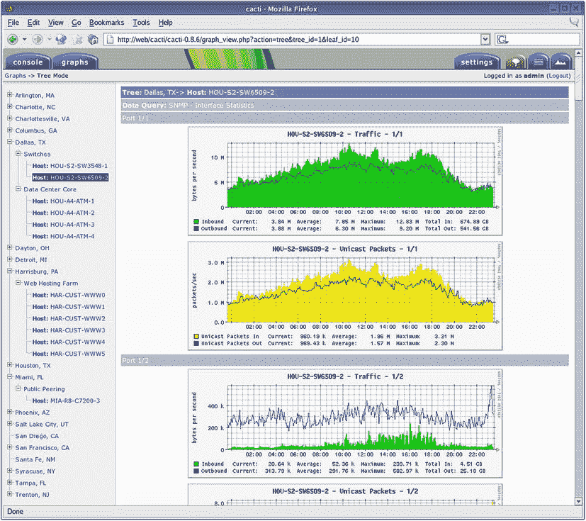
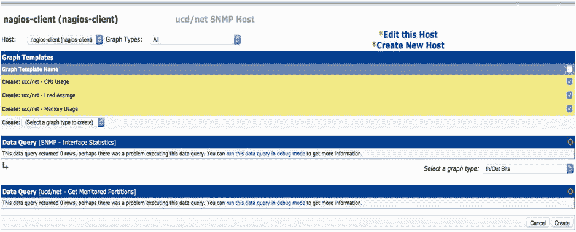

# 七、将 Nagios 用于监控，Cacti 用于趋势分析

监控可能是基础设施管理中最重要的部分之一。当系统停机时，监控应该提醒站点可靠性工程师(SREs ),以便他们可以调查受影响的服务，并尝试使系统恢复在线。之后，应进行根本原因分析，并采取措施防止将来出现类似问题。理想情况下，监控会在问题导致服务中断之前发出警报。

趋势分析能够查看给定应用程序或系统的历史和当前指标。趋势分析有助于故障排除和容量规划。查看一周或更长时间内的内存使用情况有助于分析应用程序，并规划未来的升级和性能增强。

这一章是关于在使用开源软件——特别是 Nagios——的基础设施中监控什么和如何监控。它还涵盖了使用另一个名为 Cacti 的开源软件进行趋势分析。

## 监控什么

监控什么是运营团队一直在问的问题。为了帮助决定监视什么，请考虑以下一些问题:

*   对应用程序的批评
*   服务水平协议
*   监控所需的资源

生产应用程序，即那些产生收入的应用程序，应在确保最大正常运行时间所需的程度上受到监控。如果应用程序有服务级别协议，那么监控应该有助于维护协议。此外，请记住监控您的基础设施所需的资源，因为到处都有警报弹出，但没有足够的工程师来响应会导致工程师的寻呼机疲劳。

### 系统监视器

关于 Linux 系统，有许多可以监控的服务和可以跟踪的指标。下面列出了其中一些:

*   CPU 忙/闲:如果 CPU 接近 100%忙，也许是时候给系统增加更多的处理能力了。通常的做法是为 80%的 CPU 占用率设置警告，为 100%的 CPU 占用率设置严重警报。
*   空闲/已用内存:应该监控物理内存和交换空间。内存使用的一个可能的阈值是:如果内存使用超过 80%，则发送警告警报；如果使用率为 100%，则发送严重警报。
*   已用/可用磁盘:监控可用磁盘空间有助于防止文件系统变满。可以使用类似于 CPU/内存的阈值，80%和 95%分别用于警告和严重警报。
*   网络使用:根据网络的带宽，您可能希望设置警告/严重阈值的警报。使用 80%/100%规则是标准做法。

#### 应用程序监视器

与系统监视器一起，应用程序监视器可以帮助检测应用程序的故障点。监控和度量应该纳入应用程序设计本身；它们不应该是事后的想法。如果您正在构建一个 web 应用程序，让 web 应用程序跟踪它的关键指标并将它们输出到一个日志文件中，或者可能通过一个 API 来帮助监视和跟踪应用程序。Apache 的状态页面包含有用的指标，可用于监视 Apache。示例页面位于 [`https://www.apache.org/server-status`](https://www.apache.org/server-status) 。这里列出了一些可以对 Apache 进行监控的指标:

*   正在运行的 Apache 进程的数量:如果使用`prefork.c`模块，这个数量应该至少与`MinSpareServers`匹配，并且不超过`ServerLimit`。
*   连接的客户端数量:该数量应小于`MaxClients`。如果等于`MaxClients`，那么可能应该触发一个警告警报，以便可以启动更多的 Apache 实例。
*   URL:这个指标通过 Apache 访问 web 页面，并确保页面在预期的时间范围内得到服务。

## 如何监控

在决定了“监控什么”之后，下一步是想出如何监控。“如何做”至少有三种不同的方式:

Active checks   Passive checks   SNMP based  

主动检查是由监控平台发起的检查。如果您有一个 Nagios 服务器，并且它连接到客户机来执行一个测试，那么它被认为是一个主动检查。主动检查的优点如下:

*   易于管理:因为所有检查都集中在一台服务器上，所以升级很容易。此外，设置监控相对容易，因为您只需配置服务器。
*   有助于简化防火墙规则:受监控的客户端必须信任单个服务器或服务器群集，并允许传入检查，这减少了防火墙规则的数量。

集中式主动检查的缺点如下:

*   随着客户端数量的增长，它们会给中央服务器带来大量负载。
*   主动检查可能无法监控客户端上不基于网络的进程，除非它们通过网络公开。

被动检查是监控代理提交给监控服务器的检查。服务器不联系客户端；相反，客户端会定期向服务器登记。被动检查的优点是

*   比主动检查更容易扩展，因为客户端向服务器提交检查
*   更安全，因为非网络进程不向网络公开，并且可以向服务器提交它们的状态。

被动检查的缺点包括

*   无法从服务器控制客户端，因为服务器无法启动任何检查
*   随着客户端数量的增加，服务器被淹没。

SNMP ( [https:// en。维基百科。org/wiki/Simple _ Network _ Management _ Protocol](https://en.wikipedia.org/wiki/Simple_Network_Management_Protocol))或简单网络管理协议，是监控基础设施的另一种方式。SNMP 可以进行主动和被动检查，下一节将详细介绍。

## 简单网络管理协议(Simple Network Management Protocol)

SNMP 是一种管理 IP 网络设备的机制。事实上，你可以用它来监控设备是一个巨大的优势。路由器、交换机、防火墙和打印机等大量网络设备都支持 SNMP。另外，Linux 系统也支持 SNMP。Linux 上最流行的 SNMP 实现是 Net-SNMP ( [`http://www.net-snmp.org/`](http://www.net-snmp.org/) )。SNMP 有三个版本:v1、v2c 和 v3。SNMP 支持 IPv4 和 IPv6。有一个丰富的命令行界面可用于在 Linux 系统上使用 SNMP。

## 了解 SNMP

SNMP 在开放系统互连(OSI)模型的第 7 层运行，是一种基于客户端-服务器的协议。SNMP 使用两个端口—161 和 162—它既可以使用 TCP 也可以使用 UDP。端口 162 用于`snmptrap`，端口 161 用于`snmp`。当主设备需要联系客户端时，它会在客户端的端口 161 上进行联系。当客户端需要向主服务器发送陷阱时，它会在主服务器的端口 162 上发送。

当与传输激光安全或数据报传输层安全一起使用时，主服务器在端口 10161 上联系代理，代理在端口 10162 上向主服务器发送陷阱。

如前所述，SNMP 有三个不同的版本:v1、v2c 和 v3。版本 1 是初始版本；它支持 UDP，不支持 TCP。身份验证通过在网络上以明文形式发送的社区字符串进行。尽管仍在使用，但最好避免使用此版本，因为它在通过网络以明文形式发送身份验证字符串时存在固有的安全问题。

版本 2 为 v1 增加了更多的功能和安全性。然而，v2 没有被广泛接受；取而代之的是 v2c，去掉了 v2 的一些难以使用的安全特性。版本 2 和 v2c 不向后兼容版本 1。

版本 3 是 SNMP 的当前版本。它包括加密、消息完整性和身份验证。对于企业来说，v3(如果网络设备支持的话)是应该使用的版本，因为它是唯一支持加密的版本。

## 正在安装 Net-SNMP

安装 Net-SNMP 最简单的方法是通过 YUM repo。您至少需要的两个包是`net-snmp-libs`和`net-snmp`。Net-SNMP 的 5.7.2.1 版本是编写本章时的最新版本。

## 配置网络 SNMP

SNMP 有两个配置文件，都位于`/etc/snmp`目录中。第一个文件是`/etc/snmp/snmpd.conf`，是 SNMP 代理配置文件。另一个文件是`/etc/snmp/snmptrapd.conf`，它控制如何处理进入的陷阱。只有在设计用于接收陷阱的主机上才需要`snmptrapd.conf`文件。所有响应 SNMP 查询和发送陷阱的代理都需要`snmpd.conf`文件。

Note

如果运行了 iptables，请确保允许端口 161 UDP/TCP 从轮询服务器入站到运行 SNMP 代理软件的服务器。您可以使用清单 7-1 中的命令来启用入站 SNMP 连接。

清单 7-1。入站 SNMP 的 iptables 规则

`# iptables -I INPUT -m state --state NEW -m tcp -p tcp --dport 161 -j ACCEPT`

`# iptables -I INPUT -m state --state NEW -m udp -p udp --dport 161 -j ACCEPT`

您可以从一个非常基本的 snmpd.conf 开始，并在进行过程中添加更多的配置选项。清单 7-2 显示了一个工作的`snmpd.conf`。

清单 7-2。样本`snmpd.conf`

`# cat snmpd.conf`

`##### SNMP Configuration Versions 1 and 2 #####`

`##### Community String #####`

`com2sec notConfigUser 172.16.127.0/24 public`

`##### Security Name #####`

`group notConfigGroup v1 notConfigUser`

`group notConfigGroup v2c notConfigUser`

`##### View of Tree #####`

`view all included .1 80`

`#####`

`access notConfigGroup "" any noauth exact all none none`

`rwuser snmpuser`

该文件基于使用 SNMP v1、v2c 和 v3。对于 v3，用户名是`snmpuser`，密码如清单 7-3 所示是`notarealpassword`。

清单 7-3。有用的 SNMP 相关命令

要查看`snmpd`查找管理信息库(MIB)的目录，运行

`# snmptranslate -Dinit_mib .1.3 2>&1 |grep MIBDIR`

`init_mib: Seen MIBDIRS: Looking in '/root/.snmp/mibs:/usr/share/snmp/mibs' for mib dirs ...`

要查看可以从代理读取或设置的不同 SNMP 对象标识符(OID ),请执行以下操作:

`$ snmpwalk -c public <ipaddress-of-agent>`

要查看`UCD-SNMP-MIB::memory`oid:

`$ snmpwalk -v1 -c public 172.16.127.212 UCD-SNMP-MIB::memory`

`UCD-SNMP-MIB::memIndex.0 = INTEGER: 0`

`UCD-SNMP-MIB::memErrorName.0 = STRING: swap`

`UCD-SNMP-MIB::memTotalSwap.0 = INTEGER: 4095996 kB`

`UCD-SNMP-MIB::memAvailSwap.0 = INTEGER: 4095996 kB`

`UCD-SNMP-MIB::memTotalReal.0 = INTEGER: 1914428 kB`

`UCD-SNMP-MIB::memAvailReal.0 = INTEGER: 1705492 kB`

`UCD-SNMP-MIB::memTotalFree.0 = INTEGER: 5801488 kB`

`UCD-SNMP-MIB::memMinimumSwap.0 = INTEGER: 16000 kB`

`UCD-SNMP-MIB::memBuffer.0 = INTEGER: 34432 kB`

`UCD-SNMP-MIB::memCached.0 = INTEGER: 82616 kB`

`UCD-SNMP-MIB::memSwapError.0 = INTEGER: noError(0)`

`UCD-SNMP-MIB::memSwapErrorMsg.0 = STRING:`

要添加 SNMP v3 用户，请使用`net-snmp-create-v3-user`命令。

`# net-snmp-create-v3-user`

`Enter a SNMPv3 user name to create:`

`snmpuser`

`Enter authentication pass-phrase:`

`notarealpassword`

`Enter encryption pass-phrase:`

`[press return to reuse the authentication pass-phrase]`

`adding the following line to /var/lib/net-snmp/snmpd.conf:`

`createUser snmpuser MD5 "notarealpassword" DES`

`adding the following line to /etc/snmp/snmpd.conf:`

`rwuser snmpuser`

## SNMP MIB

SNMP MIB 是关于特定设备的分层组织信息的集合。有许多基于设备的 MIB 可用。在 Linux 世界中，您应该非常熟悉主机资源 MIB，因为它为您提供了许多关于 Linux 系统的有价值的信息。您可以从 MIB 获得的一些内容如下:

*   `HOST-RESOURCES-MIB::hrSystem`:与正常运行时间、用户数量和正在运行的进程数量相关的一般信息
*   `HOST-RESOURCES-MIB::hrStorage`:文件系统使用和内存数据
*   `HOST-RESOURCES-MIB::hrDevices`:处理器、网络设备和文件系统
*   `HOST-RESOURCES-MIB::hrSWRun`:运行过程
*   `HOST-RESOURCES-MIB::hrSWRunPerf`:来自`HOST-RESOURCES-MIB::hrSWRun`的进程表上的内存和 CPU 统计
*   `HOST-RESOURCES-MIB::hrSWInstalled`:已安装软件包的 RPM 软件包管理器(RPM)数据库列表

## 监控软件

谈到开源监控软件，有很多选择。这里列出了一些可用的选项，是截至编写本章时的最新版本:

Nagios: latest release, August 2014 ( [`http://www.nagios.org`](http://www.nagios.org/) )   Zabbix: latest release, November 2014 ( [`http://www.zabbix.com`](http://www.zabbix.com/) )   openNMS: latest release, November 2014 ( [`http://www.opennms.org`](http://www.opennms.org/) )   Munin: latest release, October 2014 ( [`http://munin-monitoring.org`](http://munin-monitoring.org/) )   Ganglia: latest release, August 2014 ( [`http://ganglia.info`](http://ganglia.info/) )  

应该通过考虑以下因素来回答为您的环境选择哪一个的问题

*   易用性
*   你的团队使用给定软件的经验
*   软件的活跃最终用户社区
*   发布历史

您也可以下载该软件并将其安装到您的环境中，在做出决定之前对其进行测试。

## 基于云的监控

随着云计算的出现，现在云中也有可用的解决方案。这种在线托管的解决方案在云中有一个服务器，您可以在您的网络中下载并安装代理，然后将报告发送到云中。这种解决方案的一个优点是，您不必维护用于监控的服务器基础设施。一些这样的云提供商是

*   逻辑监视器( [`http://www.logicmonitor.com/`](http://www.logicmonitor.com/) )
*   Pingdom ( [`https://www.pingdom.com/`](https://www.pingdom.com/) )
*   网络监视器( [`https://www.dotcom-monitor.com/`](https://www.dotcom-monitor.com/) )
*   服务器密度( [`https://www.serverdensity.com/`](https://www.serverdensity.com/)

除了使用基于代理的监视器之外，其中一些公司还支持无代理监视。这将有助于从不同地理区域监控外部网站的延迟和可用性。

## 了解 Nagios

Nagios 基于客户机-服务器模型。在前面的如何监控一节中，我概述了三种可用于基础设施监控的检查类型:主动、被动和基于 SNMP 的检查。Nagios 支持所有这三种类型。以下步骤将帮助您开始使用 Nagios:

Install Nagios on the server.   Configure the server.   Install the Nagios plug-in on the client.   Add the client to the server.  

为了监控服务和应用程序，Nagios 使用插件。例如，有一个名为`check_ssh`的插件可以用来检查特定主机上是否运行了安全外壳(SSH)。

## 商业版对社区版

Nagios 有两个版本；一个是被称为 Nagios XI 的商业版本，另一个是 Nagios Core。表 [7-1](#Tab1) 中列出了两个版本之间的一些差异。

表 7-1。

Comparing Nagios Core and Nagios XI 2014

<colgroup><col> <col> <col></colgroup> 
| 特征 | 那吉乌斯十一世 | Nagios 核心 |
| --- | --- | --- |
| 基础设施监控 | 是 | 是 |
| 发信号 | 是 | 是 |
| 高级报告 | 是 | 不 |
| 可定制的用户界面 | 是 | 不 |
| 高级分布式监控 | 是 | 不 |
| 发送/接收 SNMP 陷阱 | 是 | 不 |
| 第三方票务集成 | 是 | 不 |

有关 Nagios 的更多信息，请访问:

*   对比 Nagios XI 2014 和 Nagios Core ( [`http://assets.nagios.com/handouts/nagiosxi/Nagios-XI-vs-Nagios-Core-Feature-Comparison.pdf`](http://assets.nagios.com/handouts/nagiosxi/Nagios-XI-vs-Nagios-Core-Feature-Comparison.pdf) )
*   Nagios 核心，免费版( [`http://www.nagios.com/products/nagioscore`](http://www.nagios.com/products/nagioscore) )
*   Nagios XI 2014 年( [`http://www.nagios.com/products/nagiosxi/`](http://www.nagios.com/products/nagiosxi/)

## 安装 Nagios 服务器

与大多数其他软件一样，您可以下载并编译 Nagios，或者简单地安装软件包。CentOS/RedHat 最方便的解决方案是使用`yum`进行安装，如清单 7-4 所示。

清单 7-4。从`yum`安装 Nagios 和插件

`# yum install nagios –y`

`# yum install nagios-plugins-all -y`

使用`yum`在`/etc/nagios`中安装 Nagios 配置文件。如果您更愿意自己编译 Nagios，那么需要遵循许多步骤。我在清单 7-5 中概述了一些基本的编译和安装步骤。首先安装构建依赖项，比如 PHP、gcc 和 httpd。完成之后，您就可以下载最新版本了，在撰写本文时是 4.0.8。在您解包发行版之后，您配置它，然后运行`make`，接着运行`make fullinstall`。`htpasswd`行创建一个用户，允许我们使用 web 用户界面登录 Nagios。

清单 7-5。编译和安装 Nagios

`# yum install -y wget httpd php gcc glibc glibc-common gd gd-devel make net-snmp`

`# wget`[`http://prdownloads.sourceforge.net/sourceforge/nagios/nagios-4.0.8.tar.gz`T3】](http://prdownloads.sourceforge.net/sourceforge/nagios/nagios-4.0.8.tar.gz)

`# tar xvfz nagios-4.0.8.tar.gz`

`# cd nagios-4.0.8`

`# ./configure`

`# make all`

`# make fullinstall`

`# htpasswd -c /usr/local/nagios/etc/htpasswd.users nagiosadmin`

下一步是手动安装插件(如果您没有使用`yum`路径)，如清单 7-6 所示。

清单 7-6。编译和安装插件

`# cd /usr/local/`

`# wget`[`http://nagios-plugins.org/download/nagios-plugins-2.0.3.tar.gz`T3】](http://nagios-plugins.org/download/nagios-plugins-2.0.3.tar.gz)

`# tar xvfz nagios-plugins-2.0.3.tar.gz`

`# cd nagios-plugins-2.0.3`

`# make`

`# make install`

`## You also need the check_nrpe plug-in, which you can download from`[`http://sourceforge.net/projects/nagios/files/nrpe-2.x/`](http://sourceforge.net/projects/nagios/files/nrpe-2.x/)T2】

`# yum install nagios-plugins-nrpe -y`

其他资源可在以下网址找到

*   [T2`http://nagios.sourceforge.net/docs/3_0/quickstart-fedora.html`](http://nagios.sourceforge.net/docs/3_0/quickstart-fedora.html)
*   [T2`http://assets.nagios.com/downloads/nagioscore/docs/Installing_Nagios_Core_From_Source.pdf`](http://assets.nagios.com/downloads/nagioscore/docs/Installing_Nagios_Core_From_Source.pdf)
*   [T2`http://www.nagios.org/download/plugins/`](http://www.nagios.org/download/plugins/)

## 启动 Nagios 服务器

安装完成后，下一步是启动 Apache 和 Nagios，如清单 7-7 所示。在启动 Nagios 之前，更改管理员联系人的电子邮件地址，以便从 Nagios 获得通知，如清单 7-7 所示。另外，记得在端口 80 上启用 iptables 规则，如同一清单所示。`chkconfig`命令允许 Apache 和 Nagios 在系统重启时启动。

清单 7-7。启动 Nagios

`# sed -ie 's/nagios@localhost/yourname@domain.com/'  /usr/local/nagios/etc/objects/contacts.cfg`

`# iptables -I INPUT -m state --state NEW -m tcp -p tcp --dport 80 -j ACCEPT`

`## This rule is needed on all clients to allow the Nagios server to connect to them for NRPE`

`# iptables -A INPUT -s <nagios-server-ip> -p tcp -m tcp --dport 5666 -m state --state NEW,ESTABLISHED -j ACCEPT`

`# service httpd  start`

`# service nagios start`

`# chkconfig httpd on`

`# chkconfig nagios on`

要确保 Nagios 启动并运行，请使用浏览器在 Nagios 服务器上查看`http://<ip-address>/nagios`。用户名和密码是基于您在安装过程中运行的`htpasswd`命令的`nagiosadmin/nagiosadmin`。如果您选择了另一个用户名/密码，那么就使用它。Nagios 服务器的一个例子如图 [7-1](#Fig1) 所示。

图 7-1。

Sample Nagios server (Source: [https://​upload.​wikimedia.​org/​wikipedia/​commons/​4/​48/​ScalableGridEngi​neNagios2.​png](https://upload.wikimedia.org/wikipedia/commons/4/48/ScalableGridEngineNagios2.png))

## Nagios 检查类型

Nagios 中至少有三种检查，如图 [7-2](#Fig2) 所示。

图 7-2。

Nagios chtck Types

SSH 和 Nagios 远程插件执行器(NRPE)检查是主动的，Nagios 服务检查接受者(NSCA)检查是被动的。服务器启动主动检查；然而，被动检查是由客户发起的。在大规模环境中，被动检查可能更适合，因为它们的伸缩性更好。如果您有数千个客户端，一个服务器打开数千个 SSH 或 NRPE 连接来检查客户端状态可能会导致服务器过载。

### 主动检查

Nagios 服务器按照主机和服务定义中的`check_interval`选项和`retry_interval`选项的定义，定期进行主动检查。默认情况下，`check_interval`在`templates.cfg`文件中的时间是五分钟，`retry_interval`是一分钟。每`check_interval`秒检查一次处于硬状态的主机；每隔`retry_interval`秒检查一次处于软状态的主机。主动检查也可以根据服务器的要求进行。按需检查发生

*   当与主机相关联的服务改变状态时
*   作为主机可达性的结果
*   作为预测主机相关性检查的一部分

## 配置 Nagios 服务器

配置 Nagios 可能会变得复杂，因为它基于许多配置文件。图 [7-3](#Fig3) 显示了 Nagios 配置中的流程工作流。

图 7-3。

Nagios configuration work flow

主配置文件是`nagios.cfg`，是开始配置的好地方。如果使用`yum`安装，该文件位于`/etc/nagios`中。如果您编译了 Nagios 并将其安装在默认目录中，它将位于`/usr/local/nagios/etc/nagios.cfg`中。

nagios 守护进程读取`nagios.cfg`文件。这个文件指定在哪里寻找资源和对象。此外，它还有许多控制 Nagios 行为的其他设置，比如日志目录、启用通知、以哪个用户的身份运行 Nagios，以及许多其他选项。请参考位于 [`http://nagios.sourceforge.net/docs/3_0/configmain.html`](http://nagios.sourceforge.net/docs/3_0/configmain.html) 的 Nagios 配置文件文档，了解该文件中所有选项的更多信息。

还有一个名为`cgi.cfg`的 CGI 配置文件，HTTPD 使用它来确定 Nagios 前端的 CGI 配置。

Note

进行配置更改后，在重启 Nagios 之前验证您的更改。您可以使用`-v`选项来验证更改—例如，`/usr/local/nagios/bin/nagios -v /usr/local/nagios/etc/nagios.cfg`。

## 对象配置

对象是 Nagios 的核心组件。有不同种类的对象，如主机、服务、联系人和时间段。对象在对象目录中定义。在`nagios.cfg`中，如果你查看`OBJECT CONFIGURATION FILE(S)`部分，你会发现一些目标文件的列表，如清单 7-8 所示。

清单 7-8。`nagios.cfg`中的对象定义

`cfg_file=/usr/local/nagios/etc/objects/commands.cfg`

`cfg_file=/usr/local/nagios/etc/objects/contacts.cfg`

`cfg_file=/usr/local/nagios/etc/objects/timeperiods.cfg`

`cfg_file=/usr/local/nagios/etc/objects/templates.cfg`

主机是监控基础设施的核心组件。主机组中可以有一台或多台主机。如果您有 webserver[1-100]，它们可以都属于一个名为 web servers 的主机组。在 Nagios 世界中，主机也可以是路由器、交换机和打印机。

服务是主机的属性。CPU 使用、负载、内存和正常运行时间都是主机的属性。主机提供 HTTP、FTP 和 SMTP 等服务。服务可以分组到服务组中。SMTP 可能是包含所有被监控的邮件服务的服务组。

联系人是当主机或服务更改状态时需要联系的个人或电子邮件别名。你可能有一个叫 SRE 的联系人，他是网站可靠性工程师，如果网站服务器出现故障，他需要得到通知。可以将联系人分组到联系人组中。网络操作中心可以与 SRE 组合在一起，以获得有关服务中断的通知。

时间段是监控主机和服务并发出通知的时间。您可能有一个非关键任务的应用程序，对它的监控和警报应该只在工作时间发生。通过定义工作时间时间段，您可以将其应用于非关键任务服务器。

命令是您想要执行来检查主机和服务的插件的名称，以及传递给它们的命令行参数。

## Nagios 宏

宏是从命令和插件的检查中引用信息的一种非常有用的方式。让我们回顾一下清单 7-9 中的例子。有两个片段来自两个不同的文件。一个是`servers.cfg`，包含主机和服务的定义。首先定义一个名为`nagios-client`的主机。这个主机是基于一个叫做`linux-server`的模板。该主机的 IP 地址为 172.16.127.212。

您还定义了一个名为`PING`的服务，如清单 7-9 的`define service`部分所示。让我们对名为`nagios-client`的主机进行 ping 检查。你应该使用的命令叫做`check_ping`。这个命令应该在`/usr/local/nagios/libexec`目录中。该命令接受由`commands.cfg`文件定义的四个参数。`$HOSTADDRESS$`是用主机定义的`address`字段替换宏的宏。在本例中，它是 172.16.127.212。接下来是第一个参数，即警告阈值，然后是临界阈值，最后是要发送的 ping 数据包的数量。

清单 7-9。Nagios 宏

`## In /usr/local/nagios/etc/servers.cfg`

`define host{`

`use                     linux-server            ; Name of host template to use`

`host_name               nagios-client`

`alias                   nagios-client`

`address                 172.16.127.212`

`}`

`define service{`

`use                             local-service         ; Name of service template to use`

`host_name                       nagios-client`

`service_description             PING`

`check_command                   check_ping!100.0,20%!500.0,60%`

`}`

`## In /usr/local/nagios/etc/objects/commands.cfg`

`# 'check_ping' command definition`

`define command{`

`command_name    check_ping`

`command_line    $USER1$/check_ping -H $HOSTADDRESS$ -w $ARG1$ -c $ARG2$ -p 5`

`}`

要确定使用哪个宏，首先运行带有`--help`选项的命令。这使您对所需的宏的数量有了一个概念。清单 7-10 显示了`check_ping`需要的参数。

清单 7-10。`check_ping`论据

`check_ping -H <host_address> -w <wrta>,<wpl>% -c <crta>,<cpl>%`

`[-p packets] [-t timeout] [-4|-6]`

`THRESHOLD is <rta>,<pl>% where <rta> is the round-trip average travel`

`time (in milliseconds), which triggers a WARNING or CRITICAL state, and <pl> is the`

`percentage of packet loss to trigger an alarm state.`

## Nagios 服务器插件

Nagios 中的检查是借助插件完成的。安装 Nagios 之后，必须安装插件。如果你用的是`yum`，那么就和运行# `yum install nagios-plugins-all –y`一样简单。默认情况下，插件位于`/usr/lib64/nagios/plugins/`目录中。如果使用源代码，安装插件，下载的文件是 [`http://nagios-plugins.org/download/nagios-plugins-2.0.3.tar.gz`](http://nagios-plugins.org/download/nagios-plugins-2.0.3.tar.gz) 。对于插件，源代码的默认安装是`/usr/local/nagios/libexec/`。

让我们回顾一个简单的插件来理解 Nagios 是如何工作的。清单 7-11 显示了如何使用`check_dig`插件。如果检查成功，Nagios 插件返回`OK`，如果超过临界阈值，返回`CRITICAL`，如果超过警告阈值，返回`WARNING`。此外，它们还会返回一些关于所执行检查的指标。`check_dig`查询指定域名系统(DNS)的某条记录。我们来查询(`-H`)一个公共 DNS，8.8.4.4，也就是`google-public-dns-b.google.com`。查询(`-T`)的类型是`A`，所以给定一个主机名会返回一个 IP。警告(`-w`)时间段是五秒，因此如果查询超过五秒，那么将返回一个`WARNING`值。临界阈值(`-c`)是 7 秒，之后检查返回一个`CRITICAL`值，查询记录本身是`(-l)` `www.example.com`。

清单 7-11。使用 Nagios 插件

`# /usr/local/nagios/libexec/check_dig -T A -w 5 -c 7 -H 8.8.4.4 -4 -l www.example.com`

`DNS OK - 0.070 seconds response time (``www.example.com`T2】

从清单 7-11 可以看出，检查成功，并返回一个`OK`值。这证明，从运行检查的主机上，我们可以访问公共 DNS，并且能够获得返回值。这是验证 DNS 运行状况的一个很好的检查。

如果检查在给定的时间范围内失败或不成功，那么就会返回一条警告消息，如清单 7-12 所示。

清单 7-12。Nagios 插件警告

`# /usr/local/nagios/libexec/check_file_age -w 300 -c 2000 -f /var/log/messages`

`FILE_AGE WARNING: /var/log/messages is 835 seconds old and 674989 bytes`

`# /usr/local/nagios/libexec/check_file_age -w 100 -c 200 -f /var/log/messages`

`FILE_AGE CRITICAL: /var/log/messages is 873 seconds old and 674989 bytes`

在清单 7-12 中，使用了一个名为`check_file`的插件来检查文件的年龄。在这种情况下，正在检查`/var/log/messages`文件。在第一种情况下，如果文件超过 300 秒，则显示一条`WARNING`消息(`-w`)；如果超过 2000 秒，则显示一条`CRITICAL`信息。因为该文件的时间为 835 秒，小于临界阈值，大于警告阈值，所以显示一条`WARNING`消息。

在后一种情况下，您希望在文件超过 100 秒时发出警告，并在文件超过 200 秒时发出严重消息。因为该文件已存在 873 秒，超过了 200 秒的阈值，所以会发出严重警报。

## 安装 Nagios 客户机

对于 Nagios 的客户机安装，您需要监视客户机的插件，以及 NSCA 和/或 NRPE。清单 7-13 显示了如何安装客户端。

清单 7-13。安装 Nagios 客户机

`# yum install nagios-plugins-all`

`# yum install nrpe nsca`

`# service nrpe start`

`# service nsca start`

`# chkconfig nrpe on`

`# chkconfig nsca on`

默认情况下，NRPE 客户端只允许来自`localhost`的连接，因此您必须更改`nrpe.cfg`中的配置以接受来自 Nagios 服务器的连接。清单 7-14 是更改配置以接受来自 Nagios 服务器的连接的例子。

清单 7-14。NRPE 构型

`## By default, only localhost on the client is allowed to connect`

`client# grep -i 'allowed_hosts=127.0.0.1' /etc/nagios/nrpe.cfg`

`allowed_hosts=127.0.0.1`

`## Change the configuration to accept connections from the Nagios server`

`client# sed -ie 's/allowed_hosts=127.0.0.1/allowed_hosts=172.16.127.210/' /etc/nagios/nrpe.cfg`

`client# grep -i allowed_hosts /etc/nagios/nrpe.cfg`

`allowed_hosts=172.16.127.210`

`## Restart the NRPE service after making the configuration change`

`client# service nrpe restart`

`## From the server, use the check_nrpe plug-in to the client—i.e., to 172.16.127.212`

`server# /usr/lib64/nagios/plugins/check_nrpe -H 172.16.127.212`

`NRPE v2.15`

## 向 Nagios 添加客户端

在客户机上安装了 Nagios 插件和 Nagios NRPE/NSCA 之后，就可以将客户机添加到 Nagios 服务器了。有多种方法可以将客户端添加到服务器。一种方法是将所有客户机配置隔离在 Nagios 服务器上的一个目录中，这使得管理客户机变得容易(清单 7-15)。

清单 7-15。添加 Nagios 客户端

`# grep -i '^cfg_dir' /usr/local/nagios/etc/nagios.cfg`

`cfg_dir=/usr/local/nagios/etc/servers`

`# ls /usr/local/nagios/etc/servers/`

`nagios-client.cfg`

`# head -15 /usr/local/nagios/etc/servers/nagios-client.cfg`

`define host{`

`use                     linux-server            ; Name of host template to use`

`host_name               nagios-client`

`alias                   nagios-client`

`address                 172.16.127.212`

`}`

`define service{`

`use                             local-service         ; Name of service template to use`

`host_name                       nagios-client`

`service_description             PING`

`check_command                    check_ping!100.0,20%!500.0,60%`

`}`

如清单 7-15 所示，一个新的`cfg_dir`指令被添加到 Nagios 的`nagios.cfg`文件中。这告诉 Nagios 读取该目录中所有以`*.cfg`结尾的文件并处理它们。在目录`/usr/local/nagios/etc/servers`中，为每个主机创建一个文件，由您管理。本案中的文件是`nagios-client.cfg`。随着您添加更多的客户端，您会向该目录添加更多的文件，每个文件都有一个客户端名称，并在其后附加了`*.cfg`。

该文件的内容定义了主机并添加了需要监控的服务。在这种情况下，主机正在使用一个名为`linux-server`的模板，它由`use`指令识别。`linux-server`模板在`/usr/local/nagios/etc/objects/templates.cfg`中定义。它包含被监控的 Linux 服务器上最常见的设置。之后，用`host_name`指令指定主机名，然后指定别名。别名显示在图形用户界面中，可以不同于实际主机名。最后，是客户端的 IP 地址；在这种情况下，它是 172.16.127.212。然后在主机上添加一个要监控的服务，这就是 ping 检查，它使用模板`local-service`来定义 ping 检查的公共设置。

## Nagios 模板

模板使得跨多个主机定义设置变得容易。无需多次指定通用设置，只需在模板中定义它们，然后就可以定义使用这些模板的主机和服务。

默认情况下，模板在`/usr/local/nagios/etc/objects/templates.cfg`文件中，尽管您可以通过指定指令`cfg_file=/usr/local/nagios/etc/objects/templates.cfg' in '/usr/local/nagios/etc/nagios.cfg`文件来更改这个文件和位置。清单 7-16 显示了 Nagios 默认安装的主机和服务模板。您不必使用默认模板；如果你愿意，你可以创造你自己的。但是请记住，在进行更改之前，您应该理解模板中的所有选项。您可以通过阅读 [`http://nagios.sourceforge.net/docs/3_0/configmain.html`](http://nagios.sourceforge.net/docs/3_0/configmain.html) 的配置文件了解更多选项。

清单 7-16 Nagios 模板

`define host{`

`name                            generic-host     ; The name of this host template`

`notifications_enabled           1                ; Host notifications are enabled`

`event_handler_enabled           1                ; Host event handler is enabled`

`flap_detection_enabled          1                ; Flap detection is enabled`

`process_perf_data               1                ; Process performance data`

`retain_status_information       1                ; Retain status information across program restarts`

`retain_nonstatus_information    1                ; Retain nonstatus information across program restarts`

`notification_period             24x7             ; Send host notifications at any time`

`register                        0                ; Template only, no registration required`

`}`

`define host{`

`name                            linux-server     ; The name of this host template`

`use                             generic-host     ; Inherits other values from generic-host`

`check_period                    24x7             ; Linux hosts are checked around the clock`

`check_interval                  5                ; Actively check the host every 5 minutes`

`retry_interval                  1                ; Schedule host check retries at 1 minute`

`max_check_attempts              10               ; Check each Linux host 10 times (max)`

`check_command                   check-host-alive ; Default command to check Linux hosts`

`notification_period             workhours        ; Notify only during work hours`

`notification_interval           120              ; Resend notifications every 2 hours`

`notification_options            d,u,r            ; Send notifications for specific host states`

`contact_groups                  admins           ; Notifications sent to the admins by default`

`register                        0                ; Template, hence no registration required`

`}`

`define service{`

`name                            generic-service  ; The name of this service template`

`active_checks_enabled           1                ; Active service checks are enabled`

`passive_checks_enabled          1                ; Passive service checks are enabled/accepted`

`parallelize_check               1                ; Active service checks should be parallelized`

`obsess_over_service             1                ; We should obsess over this service`

`check_freshness                 0                ; Default is NOT to check service "freshness"`

`notifications_enabled           1                ; Service notifications are enabled`

`event_handler_enabled           1                ; Service event handler is enabled`

`flap_detection_enabled          1                ; Flap detection is enabled`

`process_perf_data               1                ; Process performance data`

`retain_status_information       1                ; Retain status information across restarts`

`retain_nonstatus_information    1                ; Retain nonstatus information across restarts`

`is_volatile                     0                ; The service is not volatile`

`check_period                    24x7             ; Service can be checked at any time of the day`

`max_check_attempts              3                ; Recheck the service up to 3 times`

`normal_check_interval           10               ; Check the service every 10 minutes under normal conditions`

`retry_check_interval            2                ; Recheck the service every 2 minutes`

`contact_groups                  admins           ; Notifications get sent out to admins`

`notification_options            w,u,c,r          ; Notify warning, unknown, critical, recovery`

`notification_interval           60               ; Renotify about service problems every hour`

`notification_period             24x7             ; Notifications can be sent out at any time`

`register                        0                ; Template, hence no registration required`

`}`

`define service{`

`name                       local-service         ; The name of this service template`

`use                        generic-service       ; Inherit values from generic-service`

`max_check_attempts         4                     ; Recheck the service up to 4 times`

`normal_check_interval      5                     ; Normally check the service every 5 minutes`

`retry_check_interval       1                     ; Recheck the service every minute`

`register                   0                     ; Template, hence no registration required`

`}`

## Nagios 附加组件

附加组件是可以用来扩展 Nagios 功能的软件。一些最常见的包括

*   NRPE:广泛用于监控和执行远程主机上的插件。对于磁盘、CPU、内存和其他类似的监控指标非常有用。NRPE 支持从 Nagios 服务器发起的主动检查。
*   NSCA:允许在客户端运行被动检查，并将信息传递给服务器。对于大规模的 Nagios 实现非常有用。
*   Nagiosgraph:一个图形工具，它使用 Nagios 检查的度量，以循环数据库(RRD)格式存储数据并绘制图形。用于 Nagios 的可视化表示；检查一段时间内 CPU 负载或内存使用的历史记录等指标。

你可以在 [`http://www.nagios.org/download/addons`](http://www.nagios.org/download/addons) 找到更完整的列表。

## Nagios 检查示例

Nagios 附带了许多插件，可以帮助您开始监控基础设施中的大多数服务。要开始使用这些插件，可以看看`commands.cfg`文件。清单 7-17 显示了一些常见的检查。

清单 7-17。常见的 Nagios 检查

`# Found in /usr/local/nagios/etc/objects/commands.cfg`

`# 'check_ssh' command definition`

`define command{`

`command_name    check_ssh`

`command_line    $USER1$/check_ssh $ARG1$ $HOSTADDRESS$`

`}`

`# 'check_ping' command definition`

`define command{`

`command_name    check_ping`

`command_line    $USER1$/check_ping -H $HOSTADDRESS$ -w $ARG1$ -c $ARG2$ -p 5`

`}`

`# 'check_http' command definition`

`define command{`

`command_name    check_http`

`command_line    $USER1$/check_http -I $HOSTADDRESS$ $ARG1$`

`}`

`# 'check_local_load' command definition`

`define command{`

`command_name    check_local_load`

`command_line    $USER1$/check_load -w $ARG1$ -c $ARG2$`

`}`

## Nagios 前端

Nagios 带有一个默认的前端，用于其 web 用户界面。如果您愿意，可以用其他前端替换此前端。一些比较常见的问题包括:

*   Nagios V-Shell:一个轻量级的基于 PHP 的前端( [`https://github.com/NagiosEnterprises/nagiosvshell`](https://github.com/NagiosEnterprises/nagiosvshell) )
*   鸟瞰:给出了 Nagios ( [`http://nagiosbirdseye.sourceforge.net/`](http://nagiosbirdseye.sourceforge.net/) )的高级视图
*   Check_MK Multisite:一个非常强大的前端，帮助从一个用户界面( [`http://mathias-kettner.com/check_mk.html`](http://mathias-kettner.com/check_mk.html) )管理多个 Nagios 服务器

您可以在 [`http://www.nagios.org/download/frontends/`](http://www.nagios.org/download/frontends/) 查看更完整的列表。

## 获得帮助

下面是一些获得 Nagios 帮助的资源:

*   文档( [`http://www.nagios.org/documentation`](http://www.nagios.org/documentation) )
*   支持论坛( [`http://support.nagios.com/forum/viewforum.php?f=7`](http://support.nagios.com/forum/viewforum.php?f=7) )
*   Nagios 社区交流( [`http://www.nagios.org/about/community`](http://www.nagios.org/about/community) )
*   邮件列表( [`https://lists.sourceforge.net/lists/listinfo/nagios-users`](https://lists.sourceforge.net/lists/listinfo/nagios-users) )

## 趋势分析

使用图形进行趋势分析能够查看与应用程序或服务的给定指标相关的当前和历史数据。例如，能够查看给定系统上过去一天、一周、一个月或一年的 CPU 负载可以让您很好地了解系统有多忙。此外，能够查看一年或更长时间的磁盘使用情况有助于组织规划存储。

带有图形的趋势分析是基础设施管理的一个非常有价值的组成部分。趋势分析的一些优势如下:

*   正确的容量规划可以通过显示系统和网络使用情况的图表来完成。
*   故障排除会变得更容易，因为您可以将给定指标的增加或减少视为问题原因或症状的指示器。
*   漂亮的图表作为一种报告基础设施使用情况的方式总是受欢迎的。

## 趋势分析软件

开源世界中有许多软件可以帮助用图表进行趋势分析，下面列出了其中一些:

*   RRDtool ( [`http://oss.oetiker.ch/rrdtool/`](http://oss.oetiker.ch/rrdtool/)
*   石墨( [`http://graphite.wikidot.com`](http://graphite.wikidot.com/)
*   MRTG ( [`http://oss.oetiker.ch/mrtg/`](http://oss.oetiker.ch/mrtg/)
*   仙人掌( [`http://www.cacti.net`](http://www.cacti.net/)
*   Zenoss ( [`http://www.zenoss.com`](http://www.zenoss.com/)
*   收〔t1〕t1〔t0〕T2〕
*   P4Nagios ( [`https://docs.pnp4nagios.org/`](https://docs.pnp4nagios.org/)
*   Nagiosgraph ( [`http://nagiosgraph.sourceforge.net/`](http://nagiosgraph.sourceforge.net/)

这里列出的所有软件都有专门的用户群。有些项目比其他项目存在的时间更长。RRDtool 是许多图形软件包的基础。

## 安装仙人掌

要安装 Cacti，您可以使用 RPM 包或下载源代码并构建它。安装 Cacti v0.8.8.b 的要求包括:

*   PHP 5.1 以上
*   MySQL 5.0 以上版本
*   建议使用 RRDtool 1.0.49+和 1.4+版本
*   Net-SNMP 5.2+版本
*   支持 PHP 的 Web 服务器

使用`yum`安装 Cacti 的一个很大的优点是所有的依赖项都是自动安装的。如果您自己构建 Cacti，那么在尝试构建 Cacti 之前，请确保安装了先决条件。清单 7-18 显示了如何下载和安装 Cacti。

清单 7-18。安装仙人掌

要从`yum`安装 Cacti，启用 EPEL `yum`库。这假设了 CentOS 6。x 作为你的操作系统。首先，下载 RPM，然后使用 RPM 安装它。

`# wget`[`http://download.fedoraproject.org/pub/epel/6/x86_64/epel-release-6-8.noarch.rpm`](http://download.fedoraproject.org/pub/epel/6/x86_64/epel-release-6-8.noarch.rpm)T2】

`# yum install cacti`

如果您已经有一个想要使用的 MySQL 服务器，那么您可以跳过安装 MySQL 服务器；否则，也安装它。您可以将 MySQL server 安装在 Cacti 所在的主机上，也可以选择其他主机。

`# yum install mysql-server`

有关下载 Cacti 的更多信息，请访问 [`http://www.cacti.net/download_cacti.php`](http://www.cacti.net/download_cacti.php) 。

## 配置仙人掌

大量的 Cacti 配置是通过 web 用户界面完成的。然而，您仍然需要手动配置数据库，如清单 7-19 所示。

清单 7-19。配置仙人掌

安装 Cacti 后，您需要配置它。首先让我们从 Apache，MySQL，和 SNMPD 开始。Apache 用于用户界面，MySQL 用于存储关于绘制的值的数据，SNMPD 用于查询本地主机。

`$ sudo service httpd start`

`$ sudo service mysqld start`

`$ sudo service snmpd start`

您还需要确保在系统重新启动时所有三个服务都启动，您可以通过使用`chkconfig`命令来实现这一点。

`$ sudo /sbin/chkconfig --levels 345 httpd on`

`$ sudo /sbin/chkconfig --levels 345 mysqld on`

`$ sudo /sbin/chkconfig --levels 345 snmpd on`

需要为 Cacti 创建一个 MySQL 数据库。您可以登录 MySQL 并使用`create database`命令来实现这一点。之后，用户`cacti`必须被授予对 Cacti 数据库的完全访问权限。

`mysql> create database cacti;`

`mysql> GRANT ALL ON cacti.* TO cacti@localhost IDENTIFIED BY 'your-password-here';`

`mysql> FLUSH privileges;`

`mysql> quit;`

现在已经创建了数据库，您必须创建数据库模式。Cacti 包含一个名为`cacti.sql`的文件，该文件包含模式。通过使用`rpm -ql`命令，你可以定位`cacti.sql`并将其加载到 MySQL 中。

`$ rpm -ql cacti | grep cacti.sql`

`$ mysql -D cacti -u cacti -p  < /usr/share/doc/cacti-0.8.8b/cacti.sql`

Cacti 使用 PHP 作为其 web 前端，您必须让 PHP 知道如何访问您创建的数据库，因此编辑`db.php`文件并输入数据库配置中的值。在这种情况下，假设数据库和 Cacti 运行在同一个主机上；所以，`database_hostname`就是`localhost`。

`$ sudo vi /etc/cacti/db.php`

`/* make sure these values reflect your actual database/host/user/password */`

`$database_type = "mysql";`

`$database_default = "cacti";`

`$database_hostname = "localhost";`

`$database_username = "cacti";`

`$database_password = "your-password-here";`

`$database_port = "3306";`

`$database_ssl = false;`

因为使用了 Apache，所以您必须配置 Apache 以允许访问 Cacti。您可以通过在`/etc/httpd/conf.d`的 Apache 配置目录中创建一个名为`cacti.conf`的文件来做到这一点。如果你安装了`yum`，这个文件已经存在；只要确保将`/usr/share/cacti`的`Allow from`字段修改为包含您的网络，这样您就可以浏览用户界面。

`$ sudo vi /etc/httpd/conf.d/cacti.conf`

`Alias /cacti /usr/share/cacti`

`<Directory /usr/share/cacti/>`

`Order Deny,Allow`

`Deny from all`

`Allow from <your-network-range>`

`</Directory>`

将 Cacti 配置添加到 Apache 之后，重新启动 Apache。

`$ sudo /etc/init.d/httpd restart`

Cacti 使用一个`cron`任务通过 SNMP 轮询客户端。您必须为用户`cacti`编辑`cron`，并“取消注释”轮询器以开始轮询。

`$ sudo vi /etc/cron.d/cacti`

`#Uncomment the following line`

`*/5 * * * *    cacti   /usr/bin/php /usr/share/cacti/poller.php > /dev/null 2>&1`

## 基于 Web 的配置

完成基于命令行的配置后，您必须从基于 web 的用户界面继续配置。在`http://<cacti-server-ip>/cacti`进入用户界面。您应该看到的第一个屏幕如图 [7-4](#Fig4) 所示。单击下一步继续。

下一个屏幕应该如图 [7-5](#Fig5) 所示。如果尚未选择，请确保选择“全新安装”,然后单击“下一步”。

最重要的设置在第三个屏幕，如图 [7-6](#Fig6) 所示。在这里，您应该验证显示的所有二进制文件的路径。如果一个或多个二进制文件没有找到，返回到您的系统，使用`yum`安装二进制文件，然后重新加载 Cacti 页面，看看是否找到了二进制文件。如果您错过了任何一个二进制文件，那么稍后 Cacti 就会出现问题，所以现在就修复它，然后再继续。

图 7-6。

Cacti configuration screen

图 7-5。

Second screen after installation

图 7-4。

Initial screen after Cacti installation

此时，仙人掌已经准备好了。现在，您可以开始添加主机来查看趋势分析信息，这将在下一节中介绍。一个样本 Cacti 服务器如图 [7-7](#Fig7) 所示。

图 7-7。

Sample Cacti server (source: [https://​en.​wikipedia.​org/​wiki/​Cacti_​(software)#mediaviewer/​File:​Cacti_​(software)_​screenshot.​png](https://en.wikipedia.org/wiki/Cacti_(software)#mediaviewer/File:Cacti_(software)_screenshot.png))

## 仙人掌图

Cacti 使用 SNMP 连接到远程主机，并基于 SNMP 查询创建图形。创建图形的基本步骤是首先创建一个设备，然后创建该设备的图形。登录 Cacti 后，从主页单击创建设备，然后单击右上角的添加。填写设备名称，然后单击创建。这一系列步骤添加了设备，并为您提供了添加图形的选项。

单击链接 Create Graphs for this host，Cacti 为您提供了可以绘制的各种 SNMP 轮询数据的选择。点击右侧，选择您想要的图形，然后点击创建，如图 [7-8](#Fig8) 所示。

图 7-8。

Creating Cacti graphs

此时，您应该已经有了功能图。下一节将向您展示如何在图形树中查看图形。

## 图表树

添加一个设备，然后向其中添加图形，Cacti 就会开始为该设备收集数据。下一步是将图表添加到树中，以便于查看。为此，请单击左侧导航菜单上的图表树。之后，单击默认树，然后单击树项目下右侧的添加。在树项目类型中选择 Host，这将刷新页面，您可以选择您添加的新主机。点击创建(图 [7-9](#Fig9) )。

图 7-9。

Adding Cacti graphs to trees

## Cacti 命令行界面

使用基于 web 的用户界面时，添加设备、图表和修改树会变得很麻烦。Cacti 有一个命令行界面(CLI ),可以让您添加新设备、添加新图形以及做更多事情。您可以在`/var/lib/cacti/cli/`目录中找到不同的可用命令。清单 7-20 显示了几个使用命令行界面的例子。

清单 7-20。使用 Cacti CLI

Note

使用 CLI 工具时，如果您看到类似于`PHP Warning: date(): It is not safe to rely on the system's time zone settings...`的警告，请编辑`/etc/php.ini`并取消对`date.timezone`行的注释，并填写您的时区。

### 添加设备

列出所有可用的模板。

`# cd /var/lib/cacti/cli`

`# php -q add_device.php --list-host-templates`

`Valid Host Templates: (id, name)`

`0        None`

`1        Generic SNMP-enabled Host`

`3        ucd/net SNMP Host`

`4        Karlnet Wireless Bridge`

`5        Cisco Router`

`6        Netware 4/5 Server`

`7        Windows 2000/XP Host`

`8        Local Linux Machine`

列出您知道的 SNMP 社区字符串。

`# php -q add_device.php --list-communities`

`Known communities are: (community)`

`public`

使用模板`3`和 SNMP 社区字符串`public`添加一个名为`Web Server`的设备。模板`3`是`ucd/net SNMP Host`。

`# php -q add_device.php --description="Nagios Client" --ip="nagios-client" --template=3 --community="public"`

### 向设备添加图表

接下来，为刚刚添加的设备添加一个图表。列出你目前所知的设备。

`# php -q add_graphs.php --list-hosts`

`Known Hosts: (id, hostname,  template,  description)`

`1             127.0.0.1      8          Localhost`

`2             nagios-client  3          nagios-client`

列出我们所知道的制图模板。

`# php -q add_graphs.php --list-graph-templates`

`Known Graph Templates:(id, name)`

`2        Interface - Traffic (bits/sec)`

`3        ucd/net - Available Disk Space`

`4        ucd/net - CPU Usage`

`5        Karlnet - Wireless Levels`

`6        Karlnet - Wireless Transmissions`

`7        Unix - Ping Latency`

`8        Unix - Processes`

`9        Unix - Load Average`

`10        Unix - Logged in Users`

`11        ucd/net - Load Average`

`12        Linux - Memory Usage`

`13        ucd/net - Memory Usage`

`14        Netware - File System Cache`

`15        Netware - CPU Utilization`

`16        Netware - File System Activity`

`17        Netware - Logged In Users`

`18        Cisco - CPU Usage`

`19        Netware - Volume Information`

`20        Netware - Directory Information`

`21        Unix - Available Disk Space`

`22        Interface - Errors/Discards`

`23        Interface - Unicast Packets`

`24        Interface - Non-Unicast Packets`

`25        Interface - Traffic (bytes/sec)`

`26        Host MIB - Available Disk Space`

`27        Host MIB - CPU Utilization`

`28        Host MIB - Logged in Users`

`29        Host MIB - Processes`

`30        Netware - Open Files`

`31        Interface - Traffic (bits/sec, 95th Percentile)`

`32        Interface - Traffic (bits/sec, Total Bandwidth)`

`33        Interface - Traffic (bytes/sec, Total Bandwidth)`

`34        SNMP - Generic OID Template`

因为返回的列表相当长，并且您希望只添加 Linux 主机，所以您可以通过查看为主机模板`3`(即`ucd/net SNMP Host`)生成的图表来减少列表的大小。

`# php -q add_graphs.php --list-graph-templates --host-template-id=3`

`Known Graph Templates:(id, name)`

`4        ucd/net - CPU Usage`

`11       ucd/net - Load Average`

`13       ucd/net - Memory Usage`

让我们给名为`nagios-client`的主机添加一个 CPU 图。根据您的`--list-hosts`查询，主机 ID 是`2`。对于 CPU，基于前面的`--list-graph-templates`查询，图形类型是`cg`，图形模板是`4`。

`# php -q add_graphs.php --host-id=2 --graph-type=cg --graph-template-id=4`

### 向图形树添加节点

首先，列出 Cacti 中的所有主机。在这种情况下，有两个主机:一个是本地主机，Cacti 在其上运行，另一个是名为`nagios-client`的主机。

`# php -q add_tree.php --list-hosts`

`Known Hosts: (id, hostname,  template,  description)`

`1             127.0.0.1      8          Localhost`

`2             nagios-client  3          nagios-client`

接下来，列出你所知道的图表树。默认情况下，Cacti 自带一个名为 Default Tree 的树；这棵树的 ID 是`1`。

`# php -q add_tree.php --list-trees`

`Known Trees:`

`id        sort method                         name`

`1         Manual Ordering (No Sorting)        Default Tree`

让我们回顾一下默认树中的所有节点。您可以看到您有两个节点:Cacti 主机本身和前面添加的`nagios-client`。

`# php -q add_tree.php --list-nodes --tree-id=1`

`Known Tree Nodes:`

`type        id       parentid     title          attribs`

`Host        7        N/A          127.0.0.1      Graph Template`

`Host        8        N/A          nagios-client  Graph Template`

查看我们的 Cacti 节点的图表。

`# php -q add_tree.php --list-graphs --host-id=1`

`Known Host Graphs: (id, name, template)`

`1        Localhost - Memory Usage        Linux - Memory Usage`

`2        Localhost - Load Average        Unix  - Load Average`

`3        Localhost - Logged in Users     Unix  - Logged in Users`

`4        Localhost - Processes           Unix  - Processes`

添加一个名为“Linux 服务器”的新树

`# php -q add_tree.php --type=tree --name="Linux Servers" --sort-method=alpha`

`Tree Created - tree-id: (2)`

将 Cacti 节点添加到名为“Linux 服务器”的图形树中

`# php -q add_tree.php --type=node --node-type=host --tree-id=2 --host-id=1`

## 仙人掌支架

Cacti 支持可从以下来源获得:

*   支持论坛( [`http://forums.cacti.net`](http://forums.cacti.net/) )
*   文档( [`http://docs.cacti.net`](http://docs.cacti.net/) [`http://www.cacti.net/downloads/docs/html/`](http://www.cacti.net/downloads/docs/html/) )
*   邮件列表( [`http://www.cacti.net/mailing_lists.php`](http://www.cacti.net/mailing_lists.php) )

## RRDtool(刀具)

round robin 数据库工具(RRDtool)是一个非常强大的记录和绘制数据的软件。Cacti、Munin 和 Collectd 使用 RRDtool 来存储数据。RRDtool 可以存储任何数值，比如从 SNMP 返回的数值。RRDtool 的一些用途包括存储 CPU 负载、内存使用、磁盘使用和网络使用。

RRDtool 包含的一些命令如下:

*   `rrdcreate`:用于建立新的循环数据库( [`http://oss.oetiker.ch/rrdtool/doc/rrdcreate.en.html`](http://oss.oetiker.ch/rrdtool/doc/rrdcreate.en.html) )
*   `rrdupate`:用于更新已有的数据库( [`http://oss.oetiker.ch/rrdtool/doc/rrdupdate.en.html`](http://oss.oetiker.ch/rrdtool/doc/rrdupdate.en.html) )
*   `rrdgraph`:用于从数据库创建图形( [`http://oss.oetiker.ch/rrdtool/doc/rrdgraph.en.html`](http://oss.oetiker.ch/rrdtool/doc/rrdgraph.en.html) )

## 结论

本章提供了对监控和图形世界的深入了解。我们研究了使用 Nagios 和 SNMP 等工具以及基于云的监控解决方案来监控什么以及如何监控，并研究了 Cacti 的图形化。我们还简要研究了 RRDtool，它广泛用于数据收集和绘图。尽管在开源世界中有很多监控和趋势分析的选项，但本章中提到的一些软件项目比其他项目拥有更广泛的受众，或者存在的时间更长。我选择了 Nagios 和 Cacti，因为我发现它们在我的职业生涯中拥有更广泛的受众。您应该评估其中的几个，并选择最适合您的环境的一个。