# 9.日志收集、OpenVPN 和 iptables

本章涵盖了与安全性相关的三个主题:日志收集、虚拟专用网络(VPN)和防火墙。日志收集和分析是有效的基础架构支持策略不可或缺的一部分。OpenVPN 支持安全的 VPN，iptables 是内置于 Linux 的快速而强大的防火墙。

## 为什么要收集日志？

日志管理是基础设施工程的重要组成部分。日志由许多来源生成，如应用程序、操作系统、网络、系统设备和服务。日志可用于以下用途:

*   排除应用程序故障:当试图找出应用程序的问题时，日志文件是首先要查看的地方。通过支持各种调试级别，您可以留下一个痕迹，以便查找问题。
*   安全审查:日志文件提供了有关安全相关问题的有用信息。例如，`/var/log/secure`文件让我们知道谁运行了`sudo`命令，谁登录了系统。
*   取证分析:在系统入侵的情况下，日志文件提供了攻击如何发生的线索。当然，攻击者也可能操纵了日志文件。
*   监视和警报:虽然这不是最理想的方法，但是您可以使用诸如 Logwatch 之类的工具来监视事件的日志文件，然后基于此发出警报。
*   趋势分析:如果度量被输出到日志文件，它们可以被收集并使用图形显示。例如，Apache 状态页面显示了有关 Apache 性能的指标。

作为一名开发人员和站点可靠性工程师，您必须精通在开发应用程序时写入日志文件，以及在调试应用程序时读取日志文件。RFC 5424 ( [`https://tools.ietf.org/html/rfc5424`](https://tools.ietf.org/html/rfc5424) )中定义的 Syslog 协议 as 被网络设备广泛用于向集中式日志服务器发送日志。

## 日志解决方案

有各种各样的日志记录解决方案:

*   rsyslog ( [`http://www.rsyslog.com/`](http://www.rsyslog.com/)
*   系统日志(“t1”`https://wiki.archlinux.org/index.php/systemd#Journal`
*   syslog-ng ( [`http://www.balabit.com/network-security/syslog-ng`](http://www.balabit.com/network-security/syslog-ng) )
*   Splunk ( [`http://www.splunk.com/`](http://www.splunk.com/)
*   流利 （ [`http://www.fluentd.org/`](http://www.fluentd.org/) ）
*   日志率( [`http://logstash.net`](http://logstash.net/)
*   Graylog2 ( [`http://www.graylog2.org`](http://www.graylog2.org/)
*   Apache Flume ( [`http://flume.apache.org`](http://flume.apache.org/)
*   logwatch ( [`http://sourceforge.net/projects/logwatch/files/`](http://sourceforge.net/projects/logwatch/files/)

应用程序日志记录可以使用专门为应用程序设计的系统日志或日志记录解决方案，包括

*   Logback ( [`http://logback.qos.ch/`](http://logback.qos.ch/)
*   Log4j ( [`https://logging.apache.org/log4j/2.x/`](https://logging.apache.org/log4j/2.x/)

日志解决方案的选择可能很复杂。它们都支持 Syslog 格式的日志。其中一些也有商业版本，如 syslog-ng 和 Splunk。为了简单起见，rsyslog 可能是最简单的选项，因为它默认随 CentOS/RedHat 一起安装。您必须安装和配置的所有其他工具。

Splunk 之所以广受欢迎，是因为它有很好的日志图形化表示。然而，免费版 Splunk 支持每天高达 500MB 的索引，而企业版没有限制。你可以在 [`http://www.splunk.com/view/SP-CAAAE8W`](http://www.splunk.com/view/SP-CAAAE8W) 了解更多关于免费版和企业版的区别。logstash 和 Graylog2 是 Splunk 的热门替代品。两者都是开源和免费的。logstash 使用 ElasticSearch ( [`http://www.elasticsearch.org`](http://www.elasticsearch.org/) )进行索引，使用 Kibana 进行可视化绘图( [`http://www.elasticsearch.org/overview/kibana/`](http://www.elasticsearch.org/overview/kibana/) )。Log4j 是一种非常流行的基于 Java 的日志机制，可用于将日志发送到 Syslog 或应用程序中的其他日志后端。Apache Flume 在 Hadoop 世界中非常流行，它用于收集日志并发送到 Hadoop 进行处理。日志观察是一个可定制的解决方案，允许您根据日志文件中的事件发送警报。一个企业可能安装了许多日志记录解决方案。但是，作为一个 IT 标准，如果您选择一个或两个解决方案并在整个组织中使用它们，您可能会发现更容易。

## rsyslog(rsyslog)

rsyslog 是许多 Linux 发行版(如 CentOS 和 RedHat)中的默认日志机制。rsyslog 的配置通过`/etc/rsyslog.conf`文件处理。因为 rsyslog 包含在大多数 Linux 发行版中，所以您不必手动安装它，除非您想下载一个不同的版本。您可以访问位于 [`http://www.rsyslog.com`](http://www.rsyslog.com/) 的 rsyslog 网站，然后下载并安装最新版本。

大量的 Linux 服务默认使用 rsyslog。查看 CentOS 上的`/var/log/messages`,您可以看到使用 rsyslog 的不同服务:

`# awk '{print $5}' /var/log/messages | awk -F'[' '{print $1}' | sort -u  | head -5`

`abrtd:`

`acpid:`

`audispd:`

`auditd`

`bluetoothd`

rsyslog 的配置文件可能相当复杂。该文件分为三个部分:

Modules   Global directives   Rules  

模块允许 rsyslog 与外部资源进行通信，并将 rsyslog 的工作分成不同的组件。一些模块类型如下:

*   投入
*   输出
*   句法分析程序
*   消息修改
*   字符串生成器
*   图书馆

例如，输入模块用于从各种来源收集输入，比如文本文件的`imfile`、TCP 系统日志的`imtcp`和内核日志的`imklog`。还有更多输入模块，您可以在 CentOS/RedHat 分发系统上的`file:///usr/share/doc/rsyslog-<version>/rsyslog_conf_modules.html`中了解它们。

全局指令适用于所有模块。全局指令的一个例子是`$IncludeConfig /etc/rsyslog.d/*.conf`，它向 rsyslog 指示应该读取`/etc/rsyslog.d/`目录中的配置文件。另一个有趣的全局指令是`$ActionResumeInterval <seconds>`，它用于指定 rsyslog 在重试第一次没有成功的操作之前应该等待多长时间。例如，如果与主机的连接丢失，rsyslog 会在尝试重新连接之前等待该指令中指定的秒数。您可以在 CentOS/RedHat 系统上的`file:///usr/share/doc/rsyslog-<version>/rsyslog_conf_global.html`中阅读有关这些指令的更多信息。

规则指定将日志文件发送到何处，由选择器和操作组成。向`/var/log/maillog`发送所有邮件日志的邮件规则示例如下

`mail.*   /var/log/maillog`

有关模块、指令和规则的其他信息在本章后面的“rsyslog 配置”一节中。

## 日志架构

日志架构最简单的设计是每个数据中心有一个 rsyslog 服务器，假设日志服务器足够强大，可以处理来自数据中心系统的所有日志(图 [9-1](#Fig1) )。

图 9-1。

One log server per data center

这种设计不可扩展，也不具备容错能力。通过添加负载平衡器和增加 rsyslog 服务器的数量，可以使它具有可伸缩性和容错性。负载平衡器的问题是，并非所有的负载平衡器都支持 UDP，默认情况下，日志消息都是 UDP 格式的。您可以更改通过 TCP 发送的日志消息；但是，应该记住与 TCP 相关的协议开销。

另一种方法是使用短期和长期日志存储。如图 [9-2](#Fig2) 所示，您可以将数据发送到 rsyslog，然后从那里将不需要的日志移动到亚马逊 S3 或类似的地方。

图 9-2。

Using near-term and long-term log storage

您还可以将日志分析添加到这个场景中，如图 [9-3](#Fig3) 所示。

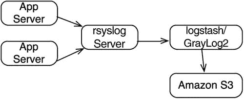

图 9-3。

Using rsyslog with logstash/Graylog2 and Amazon S3

图 [9-4](#Fig4) 显示了一个基于 TCP 的负载平衡器示例，带有 rsyslog。可以使用的一些比较流行的负载平衡器包括:

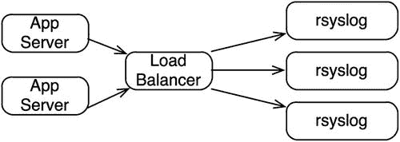

图 9-4。

Using a load balancer with rsyslog

*   HAProxy ( [`http://www.haproxy.org`](http://www.haproxy.org/)
*   Linux 虚拟服务器( [`http://www.linuxvirtualserver.org`](http://www.linuxvirtualserver.org/) )
*   基尼系数〔t1〕〔t0〕T2〕
*   Apache mod_proxy ( [`http://httpd.apache.org/docs/2.2/mod/mod_proxy.html`](http://httpd.apache.org/docs/2.2/mod/mod_proxy.html) )

## rsyslog 配置

默认情况下，rsyslog 的配置文件是`/etc/rsyslog.conf`。任何附加配置都可以存储在`/etc/rsyslog.d`目录中。清单 9-1 解释了`rsyslog.conf`文件的格式。

LISTING 9-1\. RSYSLOG CONFIGURATION FILE

第一部分是模块部分。让我们加载三个模块:一个用于 Unix 套接字(`imuxsock`)，另一个用于内核日志记录(`imklog`)。然后，我们需要告诉 UDP 模块接受端口 514 上的传入 UDP 连接。

`$ModLoad imuxsock`

`$ModLoad imklog`

`$ModLoad imudp`

`$UDPServerRun 514`

在下一节中，我们需要指定全局指令。让我们列出两个指令，第一个指定日志文件格式。在我们的例子中，它是传统的 syslog 格式。为了获得更精确的时间戳，移除传统的文件格式，rsyslog 默认为 RFC 3339 时间戳格式( [`https://www.ietf.org/rfc/rfc3339.txt`](https://www.ietf.org/rfc/rfc3339.txt) )。让我们也要求 rsyslog 在`/etc/rsyslog.d`目录中包含任何配置设置。

`$ActionFileDefaultTemplate RSYSLOG_TraditionalFileFormat`

`$IncludeConfig /etc/rsyslog.d/*.conf`

最后一部分指定了规则。这里的每一行都有两部分:一个初始选择器和一个动作。选择器本身分为两部分:一个工具和一个优先级。例如`mail`是一个设施，优先级是`*`，表示任何优先级。`mail.*`的动作是发送到一个名为`/var/log/messages`的文件。您可以在 [`http://wiki.gentoo.org/wiki/Rsyslog#Facility`](http://wiki.gentoo.org/wiki/Rsyslog#Facility) 查看所有设施列表；syslog(3)主页中有一个优先级列表。

我们现在列出了四个规则:一个是从任何来源发送所有的`info`消息，除了`mail`、`authpriv`和`cron`要发送到`/var/log/messages`。这是因为我们有这些消息的其他文件。

所有邮件信息都发送到`/var/log/maillog`。任何紧急消息都发往所有目的地，所有的`uucp`和`news.crit`都发往`/var/log/spooler`。最后，任何`local7`消息都将发送到`/var/log/boot.log`。

`*.info;mail.none;authpriv.none;cron.none                /var/log/messages`

`mail.*                                                  -/var/log/maillog`

`*.emerg                                                 *`

`uucp,news.crit                                          /var/log/spooler`

`local7.*                                                /var/log/boot.log`

规则部分可用的操作如下:

*   常规文件:指定文件的完整路径。
*   命名管道:使用管道(`|`)符号指定。首先使用`mkfifo`创建管道。这个动作对调试很有用。
*   终端和控制台:使用`–tty`或`/dev/console`指定。
*   远程机器:使用端口 514 上的 UDP，使用`@@remote-host-name`发送到远程主机。
*   用户列表:指定登录的用户，格式为:omusrmsg:root，user1
*   登录的每个人:使用与用户列表相同的格式，用通配符:`:omusrmsg:*`替换用户名
*   数据库表:用于将输出发送到数据库，如 MariaDB
*   丢弃:用于丢弃不想要的消息。
*   输出通道:用于指示输出通道，通过`$outchannel`指令定义。语法是`$outchannel name,file-name,max-size,action-on-max-size`
*   Shell execute:用于在子 Shell 中执行程序，例如，`^program-to-execute;template.`程序接收消息作为一个字符串:`argv[1]`。

选择哪种操作取决于您收集的日志数量和可用的存储类型。例如，如果您使用的是可以动态增长的网络连接存储(NAS ),那么使用文件可能就可以了。如果 rsyslog 服务器上的磁盘很小，一定不要在本地存储日志文件。一些可能的日志存储策略包括

*   将文件存储在本地，然后每小时将它们轮流记录到 NAS 设备上
*   根本不在本地存储文件，而是将所有文件都存储在 NAS 设备上
*   上传文件到在线云，如亚马逊 S3

## 日志保留

日志保留多长时间是一个问题，应该根据许多因素来回答，包括以下因素:

*   行业监管要求
*   本组织的安全需求
*   存储日志的成本
*   管理复杂性

监管要求可能适用于金融、保险或其他类似行业的公司。在美国，证券交易委员会可能有关于交易应用程序的应用程序日志保留多长时间的规则，政府部门也可能有关于日志应保留多长时间的特定要求。图 [9-5](#Fig5) 显示了一种不同保存期限的存储日志的可能性。

图 9-5。

Log retention policies

## 原木旋转

日志轮换是将当前日志移动到旧日志文件中的过程。例如，因为 Linux 系统消息存储在`/var/log/messages`中，使用日志轮换，它们可以移动到`/var/log/messages.<date>`，代表一周中的每一天。用于旋转原木的命令是`logrotate`。默认情况下，CentOS/RedHat 有一个每天运行的`logrotate`脚本，如`/etc/cron.daily`中所指定的(清单 9-2)。

清单 9-2。`/etc/cron.daily`中的`logrorate`脚本

`#!/bin/sh`

`/usr/sbin/logrotate /etc/logrotate.conf >/dev/null 2>&1`

`EXITVALUE=$?`

`if [ $EXITVALUE != 0 ]; then`

`/usr/bin/logger -t logrotate "ALERT exited abnormally with [$EXITVALUE]"`

`fi`

`exit 0`

`logrotate`配置存储在`/etc/logrotate.conf`中。附加配置设置存储在`/etc/logrotate.d`目录中。清单 9-3 显示了一个`logrotate.conf`文件的例子。

LISTING 9-3\. `LOGROTATE.CONF`

关键字`weekly`表示日志文件应该每周轮换一次。其他选项包括`daily`和`monthly`，或者基于尺寸。

`# rotate log files weekly`

`weekly`

关键字`rotate`表示应该保留多少个日志实例。在我们的例子中，我们希望保留——最多——四个实例，之后最早的实例将被覆盖。

`# keep 4 weeks worth of backlogs`

`rotate 4`

考虑到某个进程可能打开了一个日志文件，重命名该进程可能会导致日志文件出现文件句柄问题。因此，我们需要在旋转旧的日志文件后创建一个新的日志文件。

`# create new (empty) log files after rotating old ones`

`create`

需要添加一个关于使用日期的不言自明的声明，以附加到日志文件中，指示其旋转的日期。例如`/var/log/messages-20141012`，表示 2014 年 10 月 12 日为日志轮换日期。

`# use date as a suffix of the rotated file`

`dateext`

轮换后压缩日志。如果你想避免压缩，你可以使用关键字`nocompress`。

`# compress log files`

`compress`

让`logrotate`知道它还应该读取`/etc/logrotate.d`目录以获得额外的配置选项。

`# additional configuration directory`

`include /etc/logrotate.d`

`...[SNIP]...`

尽管在清单 9-3 中我们为`logrotate.conf`中的`logrotate`指定了一些通用选项，但是我们没有指定它需要旋转哪些文件。这可以在`/etc/logrotate.d`目录中完成。例如，CentOS 上有一个名为`/etc/logrotate.d/syslog`的文件，它指定了日志循环中包含的文件数量(清单 9-4)。在 syslog 文件中，让我们指定要循环的五个不同的日志文件。

文件名后面是这些文件的指令。全局指令继承自`/etc/logrotate.conf`，然后应用文件特定的指令。对于所有这五个文件，有一组指令，由开始的`{`和结束的`}`表示。关键字`sharedscripts`向`logrotate`表明`postrotate`脚本应该在所有五个文件轮换后只运行一次，而不是每个文件轮换一次。`postrotate`脚本被指定为向 syslog 发送 HUP 信号，以便它重新读取日志文件。关键字`endscript`表示 postscript 部分的结束。

清单 9-4。`/etc/logrotate.d/syslog`

`# cat syslog`

`/var/log/cron`

`/var/log/maillog`

`/var/log/messages`

`/var/log/secure`

`/var/log/spooler`

`{`

`sharedscripts`

`postrotate`

`/bin/kill -HUP `cat /var/run/syslogd.pid 2> /dev/null` 2> /dev/null || true`

`endscript`

`}`

你可以在手册页中了解更多关于`logrotate.conf`格式的信息。

### 日志轮换策略

在 Linux 中，默认情况下提供了许多日志轮换脚本。它们涵盖了大量的系统日志文件。对于应用程序日志文件，您有两种选择:一种是在`/etc/logrotate.d`目录中添加特定于应用程序的日志轮转，另一种是使用 log4j 或其他应用程序内方法进行日志轮转。使用`logrotate`的一个优点是它内置了很多成熟度，您可以集中处理日志。

## VPN 在企业中的作用

VPN 在一个组织中至少扮演两个重要的角色。首先，它们为用户提供远程连接；其次，它们支持组织的远程网络之间的站点到站点连接。用户的远程连接可能允许从家里、路上或公司办公室之外的任何其他位置进行访问。站点到站点的连接可能在两个数据中心之间，也可能在总部和另一个办公室站点之间。

距离一般不是 VPN 考虑的因素；相反，必须考虑传输介质。一旦一个组织的流量离开了它的网络，使用 VPN 就成了必须。VPN 对于远程终端的授权、认证和记账非常有用。爱德华·斯诺登(Edward Snowden)透露，美国国家安全局(NSA)一直在窥探企业办公室，尤其是属于同一家公司的不同数据中心之间的未加密链接，如谷歌和雅虎！。使用 VPN 可以确保加密，保护你的数据免受政府的窥探。( [`http://www.theguardian.com/us-news/the-nsa-files`](http://www.theguardian.com/us-news/the-nsa-files) )。)

对于远程工作的员工，VPN 可以通过使用授权、认证和记帐来帮助保护公司的电子资产。一家大型公司通过对 VPN 的审计发现在家工作的员工很少连接到 VPN，于是禁止了远程员工。

即使在公司网络中，尽可能使用加密也是一种更安全的业务方式。向应用程序添加加密的成本通常不高，值得一试。

## 挑选 VPN 技术

可用的两种流行的 VPN 技术是:

Secure socket layer (SSL)   Internet Protocol Security (IPSec)  

IPSec 运行在第 3 层，即网络层；SSL 运行在第 6 层，即表示层。SSL VPNs 比 IPSec VPNs 更容易部署，主要是因为它们之间的这种差异。此外，在跨越网络地址转换(NAT)边界时，您不需要对 SSL 进行任何额外的配置，但是您可能需要对 IPSec 进行配置。SSL VPN 可以在您希望它们运行的任何端口上工作——通常 OpenVPN 的端口为 1194，其他 SSL VPN 的端口为 443。IPSec 需要下列端口:

*   Internet 密钥交换:UDP 端口 500
*   封装安全负载:IP 协议编号 50
*   认证头:IP 协议号 51
*   IPSec NAT 穿越:使用 NAT 穿越时，UDP 端口 4500

IPSec VPN 的局限性源于它们位于开放系统互连(OSI)层的第 3 层，即网络层。这意味着应用的策略必须在第 3 层。另一方面，使用基于 SSL 的 VPN，您在策略和保护方面有更多的选择。

IPSec 的实现可能因供应商而异；因此，为 VPN 隧道的两个端点选择相同的供应商非常重要。然而，SSL 更加宽容，您会发现使用 SSL 比使用 IPSec 更容易集成不同的软件提供商。

## SSL 是如何工作的？

如前所述，SSL 代表安全套接字层。传输层安全性(TLS)是 SSL 的替代品。SSL 基于证书工作，证书可以由公钥基础设施系统发布。设置和使用 SSL 的步骤包括:

Generate a certificate signing request and submit it to the certificate authority (CA).   Receive from the CA a certificate based on the submitted certificate signing request and install the certificate.   The client initiates an SSL hello to server, in which the client provides the SSL version number, cipher settings, session-specific data, and other relevant information to the server.   The server responds with its own hello to client, including the SSL version number, cipher settings, and its certificate.   The client then validates the certificate by using the CAs it trusts.   So far, all the communication has been unencrypted. The next step is for the client to create a premaster secret for the session, encrypt it with the server’s public key (provided in step 5), and send it to the server. This is the first encrypted packet.   The server then uses the premaster secret to generate a session key, which is symmetric. The client does the same on its end.   The client then sends a message to the server, indicating that all future communication is to be encrypted with the session key, and it also sends another message, indicating the client portion of the handshake is over.   The server sends a message to the client, indicating that future messages are to be encrypted with the session key, and it also lets the client know the server portion of the handshake is over.  

清单 9-5 显示了一个客户端和 [`www.google.com`](http://www.google.com/) 之间的 SSL 握手示例。

清单 9-5。客户端与 [`www.google.com`](http://www.google.com/) 之间的 SSL 握手

`$ OpenSSL s_client -connect``www.google.com:443`T2】

`CONNECTED(00000003)`

`SSL_connect:before/connect initialization`

`SSL_connect:SSLv3 write client hello A`

`SSL_connect:SSLv3 read server hello A`

`depth=2 /C=US/O=GeoTrust Inc./CN=GeoTrust Global CA`

`verify error:num=20:unable to get local issuer certificate`

`verify return:0`

`SSL_connect:SSLv3 read server certificate A`

`SSL_connect:SSLv3 read server done A`

`SSL_connect:SSLv3 write client key exchange A`

`SSL_connect:SSLv3 write change cipher spec A`

`SSL_connect:SSLv3 write finished A`

`SSL_connect:SSLv3 flush data`

`SSL_connect:SSLv3 read finished A`

`---`

`Certificate chain`

`0 s:/C=US/ST=California/L=Mountain View/O=Google Inc/CN=`[`www.google.com`T3】](http://www.google.com/)

`i:/C=US/O=Google Inc/CN=Google Internet Authority G2`

`1 s:/C=US/O=Google Inc/CN=Google Internet Authority G2`

`i:/C=US/O=GeoTrust Inc./CN=GeoTrust Global CA`

`2 s:/C=US/O=GeoTrust Inc./CN=GeoTrust Global CA`

`i:/C=US/O=Equifax/OU=Equifax Secure Certificate Authority`

`---`

`Server certificate`

`-----BEGIN CERTIFICATE-----`

`...[SNIP]...-----END CERTIFICATE-----`

`subject=/C=US/ST=California/L=Mountain View/O=Google Inc/CN=`[`www.google.com`T3】](http://www.google.com/)

`issuer=/C=US/O=Google Inc/CN=Google Internet Authority G2`

`---`

`No client certificate CA names sent`

`---`

`SSL handshake has read 3242 bytes and written 430 bytes`

`---`

`New, TLSv1/SSLv3, Cipher is RC4-SHA`

`Server public key is 2048 bit`

`Secure Renegotiation IS supported`

`Compression: NONE`

`Expansion: NONE`

`SSL-Session:`

`Protocol  : SSLv3`

`Cipher    : RC4-SHA`

`Session-ID: 53D6430533F752C4C5790A849B8C25613B45A8C03CFCD4BC51CF07F458698798`

`Session-ID-ctx:`

`Master-Key: 377EEC39AB7BA705836F1C47794DD307E16889F401C8E2C897687869A2B2A75BD9423B8B1CD6CD2FD383B140DD172041`

`Key-Arg   : None`

`Start Time: 1413660093`

`Timeout   : 7200 (sec)`

`Verify return code: 0 (ok)`

`---`

OpenVPN 使用 SSL 的方式是向服务器和客户端都颁发证书。为简单起见，我们假设组织中有一个 CA。CA 向 OpenVPN 服务器和每个希望连接的用户颁发证书。

最初，当客户机和服务器相互对话时，它们交换 SSL 加密信息；这包括密码类型和强度。使用证书建立安全连接后，两端交换对称密钥进行加密。

## VPN 软件

开源 VPN 服务器软件的选择将取决于 VPN 技术的选择。最常见的开源 VPN 服务器如下:

*   OpenVPN:使用 SSL ( [`https://openvpn.net/`](https://openvpn.net/) )
*   strongSwan:使用 IPSec ( [`https://www.strongswan.org/`](https://www.strongswan.org/) )
*   软以太网:使用 SSL ( [`https://www.softether.org/`](https://www.softether.org/) )

还有很多商业 VPN 提供商，除了开源的 VPN 软件。VPN 设备也越来越受欢迎，因为它们有专门的硬件来加速加密。

## VPN 设计

一个简单的 VPN 设计包括一台 VPN 服务器，用于远程用户连接和不同办公地点之间的站点到站点连接(图 [9-6](#Fig6) )。这不是一个理想的设计，因为它不是容错的。此外，由于最终用户和远程办公室都使用同一设备，因此安全性不够。

理想情况下，VPN 服务器位于隔离区(DMZ ),只有特定的协议才允许从 DMZ 进入内部网络。有一个防火墙保护 VPN 服务器不被互联网访问，只允许 OpenVPN 使用 1194 TCP 端口。此外，还有防火墙保护内部网络免受 OpenVPN 服务器的攻击。在 VPN 服务器被入侵的情况下，内部网络没有受到危害。为了额外的安全，您可以有一个跳转主机，允许从内部网络访问 VPN 服务器进行管理。这种策略防止从内部网络直接访问 VPN 服务器。

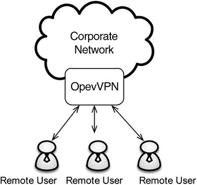

图 9-6。

Remote user VPN

另一种方法是建立一个专用于办公室内部连接的站点到站点 VPN。这可以是与远程用户连接的服务器不同的服务器(图 [9-7](#Fig7) )。

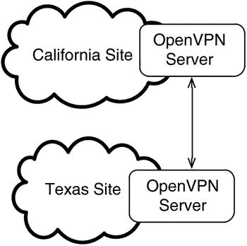

图 9-7。

Site-to-site VPN

对于容错，可以使用 Keepalived，如图 [9-8](#Fig8) 所示。两台 VPN 服务器共享一个虚拟 IP，并且在两台服务器上都安装了 Keepalived。如果一台 VPN 服务器出现故障，第二台 VPN 服务器上的 Keepalived 实例将接管 IP。

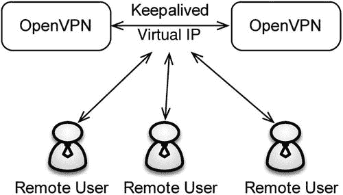

图 9-8。

OpenVPN with Keepalived

容错的一个更简单的方法是拥有多个 OpenVPN 服务器，并将客户端配置为单独使用它们。OpenVPN 服务器可能通过 Git 共享相同的配置。一个 OpenVPN 服务器不知道另一个 OpenVPN 服务器。

## 分裂隧道

默认情况下，OpenVPN 客户端软件会将所有流量直接从客户端路由到互联网，并且只将 VPN 定向的流量发送到 VPN。这被称为“分裂隧道”，如图 [9-9](#Fig9) 所示。这种方法的一个优点是，您可以避免任何不是针对您的网络的最终用户流量进入您的网络。

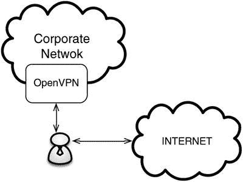

图 9-9。

Split tunnel

分割隧道的优势包括:

*   降低带宽成本
*   提高安全性，因为您的网络看不到不是发往它的流量
*   保护最终用户的隐私

另一种方法是通过 VPN 服务器路由所有流量，如图 [9-10](#Fig10) 所示。通过 VPN 路由所有流量的缺点如下:

图 9-10。

Enabling gateway redirect

*   如果 DHCP 服务器位于远程客户端网络的本地，则远程客户端可能无法续订其 DHCP 租约，因为 OpenVPN 会尝试通过 VPN 路由流量
*   远程用户浏览网页可能会很慢，因为所有流量现在都通过公司网络路由
*   Windows 客户端在接收域名系统(DNS)更新时遇到一些问题

要启用网关重定向，请将以下行添加到 OpenVPN 的`server.conf`文件中:

`push "redirect-gateway def1"`

`push "dhcp-option DNS <ip-of-corp-dns-server>"`

如果您的 VPN 在无线网络上，无线客户端和服务器在同一个无线子网上，那么将以下内容添加到您的`server.conf`文件中:

`push "redirect-gateway local def1"`

`push "dhcp-option DNS <ip-of-corp-dns-server>"`

## OpenVPN 配置文件

OpenVPN 使用配置文件来指定其设置。请小心在该文件中放置的内容，因为配置错误可能会带来安全风险。这个文件的默认位置是`/etc/openvpn`。您可以随意命名该文件，但规范是将其命名为`server.conf`。清单 9-6 显示了一个样本文件，并解释了文件中可用的不同选项。

LISTING 9-6\. OPENVPN CONFIGURATION FILE

OpenVPN 监听的接口是由关键字`local`定义的。典型的 OpenVPN 服务器有两个接口——一个外部接口和一个内部接口。外部接口是您希望 OpenVPN 监听的接口。

`local 100.94.1.2`

端口是标准的 OpenVPN 端口 1194。如果您愿意，您可以指定一个替代端口，只是要记住让客户端也知道这个替代端口。

`port 1194`

为了提高 OpenVPN 的性能，让我们使用共享内存作为临时目录。如果你愿意，我们可以为 OpenVPN 使用任何挂载为`tmp`的文件系统。

`tmp-dir /dev/shm`

OpenVPN 支持 TCP 和 UDP 连接。TCP 更可靠，但比 UDP 稍慢。您可以尝试这两种方式，并选择一种适合您网络需求的方式。

`proto tcp`

OpenVPN 支持桥接和路由模式，下一节将对每种模式进行解释。通过指定`dev tun`，我们配置我们的服务器使用路由模式。

`dev tun`

这里我们指定服务器的密钥。本章中的“OpenVPN 证书”一节解释了如何生成这些密钥。

`ca /etc/openvpn/keys/ca.crt`

`cert /etc/openvpn/keys/server.crt`

`key /etc/openvpn/keys/server.key  # This file should be kept secret`

`dh /etc/openvpn/keys/dh1024.pem`

证书撤销列表对于安全性至关重要，它是使用`crl-verify`参数指定的。

`crl-verify  /etc/openvpn/keys/crl.pem`

`server`指令用于指定网络和网络掩码范围，OpenVPN 从该范围向连接的客户端分配 IP 地址。

`server 10.1.1.0 255.255.255.0`

任何与 DHCP 相关的选项都可以使用`push dhcp-option`指令推出。这包括 DNS、Windows Internet 名称服务(WINS)或 DHCP 中的任何其他选项。

`push "dhcp-option DNS 10.1.2.10"`

`push "dhcp-option DNS 10.1.3.10"`

VPN 客户端需要进入内部网络的路由。`push route`配置指令负责将路由推送到客户端。让我们在这里设置两条路线:

`push "route 192.168.0.0 255.255.0.0"`

`push "route 10.0.0.0  255.0.0.0"`

通常，OpenVPN 不允许客户端到客户端的通信，但是下面的选项允许这样做。

`client-to-client`

我们将每 10 秒发送`keepalive`次 pings。如果在 120 秒内没有收到回答，我们就认为链接断开了。您可以根据客户端连接到 OpenVPN 服务器的可靠性来调整这些值。

`keepalive 10 120`

然后，我们需要在服务器和客户机之间启用压缩。此外，我们必须记住在客户端启用该设置。

`comp-lzo`

以 root 用户身份运行 OpenVPN 存在安全风险，所以我们使用`nobody`用户。运行 OpenVPN 时，`persist-key`和`persist-tun`命令是能够切换到特权模式的一部分。

`user nobody`

`group nobody`

`persist-key`

`persist-tun`

`status`文件列出了当前的客户端连接，每分钟一次。`log-append`指令用于不将日志发送到 syslog 相反，它用于记录到指定的文件。状态版本指定日志格式版本，动词指令指定您希望 OpenVPN 有多详细。您可以增加这个数字，以便进行更详细的日志记录。值的范围从 0 到 9。

`status /etc/openvpn/status/tcp-1194.log`

`log-append /etc/openvpn/status/openvpn.log`

`status-version 2`

`verb` `5`

您可以“telnet”到 OpenVPN 的一个给定端口——在我们的例子中是端口 7505——并发出管理命令，该命令只在`localhost`上绑定。

`management localhost 7505`

## 路由或桥接

OpenVPN 可以在路由模式或桥接模式下运行。如果您需要以下任何内容，请使用桥接:

*   VPN 需要处理非 IP 流量，如 IPX。
*   网络广播需要在 VPN 上启用，例如对于局域网游戏。
*   Windows 文件共享浏览需要跨 VPN 工作，而不使用 Windows Internet 名称服务(WINS)服务器。

路由使用隧道接口。在 OpenVPN 服务器上，当您运行一个`ip addr show`命令时，您会看到一个名为`tun0`的界面，这意味着正在使用隧道。使用路由的优点如下:

*   没有广播流量通过 VPN 隧道。
*   仅传输第 3 层数据包。

要使用路由模式，请确保在 OpenVPN 服务器上启用了路由:

`## enable routing on OpenVPN server`

`# sysctl -w net.ipv4.ip_forward=1`

接下来，在`/etc/openvpn/server.conf`文件中，输入行`dev tun`。这导致 OpenVPN 使用路由模式。

如果你想使用桥接模式，那么用`dev tap0`代替`dev tun`线。此外，要使用桥接，将显示`server <ip> <netmask>`的行替换为`server-bridge <ip> <netmask>`。

桥接要求网桥的 IP 地址在 OpenVPN 之外配置，因为 OpenVPN 不能自动设置网桥的 IP。要查看设置网桥及其 IP 的示例脚本，请转到 [`https://openvpn.net/index.php/open-source/documentation/miscellaneous/76-ethernet-bridging.html`](https://openvpn.net/index.php/open-source/documentation/miscellaneous/76-ethernet-bridging.html) 。

## OpenVPN 证书

使用基于证书的身份验证有两种选择:一种是创建自己的证书颁发机构并自签名证书，另一种是使用第三方 CA。第三方 ca 的一些示例包括

*   Thawte ( [`https://www.thawte.com/`](https://www.thawte.com/)
*   威瑞信( [`https://www.verisign.com/`](https://www.verisign.com/) )
*   岩土锈〔t1〕〔t0〕T2〕

使用自签名证书可以节省资金。如果您不是通过 VPN 将企业连接到另一个供应商的网络，那么自签名可能是一种方法。如果您在企业中已经有一个现有的公钥基础设施，那么您也可以使用它来向 OpenVPN 服务器和需要连接的个人用户颁发证书。

对于自签名证书，可用于管理证书的一些工具包括:

*   OpenSSL ( [`https://www.openssl.org/`](https://www.openssl.org/)
*   gnoint(“t1”`http://gnomint.sourceforge.net/`
*   EJBCA ( [`http://www.ejbca.org/`](http://www.ejbca.org/)

### 创建您自己的证书

使用 CentOS/RedHat 上的`easy-rsa`包，您可以安装自己的 CA 并为最终用户和 OpenVPN 服务器创建证书。清单 9-7 展示了如何安装`easy-rsa`以及如何创建自己的证书。

LISTING 9-7\. GENERATING YOUR OWN CERTIFICATES

首先，我们安装`easy-rsa`包。

`# yum install easy-rsa –` `y`

接下来，我们运行`clean-all`从过去的安装中删除任何密钥。不要删除`index.txt`和序列号文件；建筑证书需要它们。

`# cd /usr/share/easy-rsa/2.0`

`# . ./vars`

`# ./clean-all`

`# ls keys`

`index.txt  serial`

我们现在可以构建 CA 本身，它创建了两个文件:一个是 CA 的证书(`ca.crt`)，另一个是它的私钥(`ca.key`)。

`# ./build-ca`

`# ls keys`

`ca.crt  ca.key index.txt serial`

我们准备使用之前创建的 CA 向 OpenVPN 服务器颁发证书。该命令的输出包括服务器证书请求文件(`server.csr`)、服务器证书(`server.crt`)和服务器的私钥(`server.key`)。

`# ./build-key-server server`

`# ls keys`

`01.pem  ca.crt  ca.key  index.txt  index.txt.attr  index.txt.old  serial  serial.old  server.crt  server.csr  server.key`

现在可以使用`build-key`命令向客户端颁发证书。代替`user1-client`,键入正在被颁发证书的用户名。这将生成用户证书(`user1-client.crt`)和私钥(`user1-client.key`)。对尽可能多的要向其颁发证书的用户重复此过程。

`# ./build-key user1-client`

`# ls keys`

`01.pem  ca.crt  index.txt index.txt.attr.old  serial server.crt  server.key  user1-client.csr`

`02.pem  ca.key  index.txt.attr  index.txt.old serial.old  server.csr  user1-client.crt  user1-client.` `key`

前面的步骤完成了为 CA、服务器和用户创建第一个证书的过程。您可以将证书复制到 OpenVPN `/etc/openvpn/keys`目录中。CA 和服务器的私钥应该保密，不应该给任何人。对于最终用户，你可以给出三个文件:`ca.crt, user1-client.crt, and user1-client.key`。然后，用户将这些文件安装到他们的 OpenVPN 客户端，他们就可以连接到服务器。

## OpenVPN 安全性

OpenVPN 服务器是进入您网络的网关，加强服务器并保护其免受攻击非常重要。您可以采取一些步骤来强化服务器，包括以下步骤:

*   安装操作系统的最低服务器版本。不要安装任何不需要的软件。
*   禁用任何不需要的服务。
*   只让那些需要在系统上的用户在系统上。
*   撤销不再需要访问的用户的证书(清单 9-8)。
*   使用双因素身份验证来提高安全性。

清单 9-8。撤销客户端证书

`## in /etc/openvpn/server.conf enable the revocation list`

`crl-verify crl.pem`

`## use the easy-rsa tools to revoke the certificate`

`# cd /usr/share/easy-rsa/2.0`

`# . ./vars`

`# ./revoke-full client-name`

`# cp keys/crl.pem /etc/openvpn/keys/`

OpenVPN 服务器在以下情况下读取`crl.pem`文件:

*   每次服务器启动时
*   每当客户端连接时
*   现有连接客户端的 SSL/TLS 重新协商，通常每小时进行一次

## 具有双重认证的 OpenVPN

单独使用证书进行身份验证对于远程用户连接来说并不是一个好主意。如果用户放错了他们的笔记本电脑，那么任何可以访问他们的证书的人都可以访问您的网络。一种选择是启用用户名/密码认证和证书。此外，您可以使用双因素身份认证系统，如 RSA SecureID，以便终端用户需要令牌来访问网络。不同的插件可用于您想要使用的身份验证类型。清单 9-9 显示了除了客户端证书之外，如何启用用户名和密码认证。

清单 9-9。OpenVPN 双重认证

`# grep auth-pam /etc/openvpn/server.conf`

`plugin /usr/lib64/openvpn/plugin/lib/openvpn-auth-pam.so login`

## OpenVPN 管理界面

使用`/etc/openvpn/server.conf`中的以下内容启用管理界面:

`# grep -i management /etc/openvpn/server.conf`

`management localhost 7505`

要运行管理命令，从 OpenVPN 服务器远程登录到端口 7505 上的本地主机，如清单 9-10 所示。该端口只接受来自 OpenVPN 服务器本身的连接，而不接受来自其他主机的连接。

清单 9-10。管理 OpenVPN

`# telnet localhost 7505`

`Trying 127.0.0.1...`

`Connected to localhost.`

`Escape character is '^]'.`

`>INFO:OpenVPN Management Interface Version 1 -- type 'help' for more info`

`status`

`TITLE,OpenVPN 2.3.2 x86_64-redhat-linux-gnu [SSL (OpenSSL)] [LZO] [EPOLL] [PKCS11] [eurephia] [MH] [IPv6] built on Sep 12 2013`

`TIME,Sat Sep 27 00:06:00 2014,1411776360`

`HEADER,CLIENT_LIST,Common Name,Real Address,Virtual Address,Bytes Received,Bytes Sent,Connected Since,Connected Since (time_t),Username`

`CLIENT_LIST,<username>,<client-remote-public-ip>:33662,<client-remote-dhcp-ip>,367083,77966,Fri Sep 26 23:56:11 2014,1411775771,UNDEF`

`HEADER,ROUTING_TABLE,Virtual Address,Common Name,Real Address,Last Ref,Last Ref (time_t)`

`ROUTING_TABLE,<client-remote-dhcp-ip>,<username>,<client-remote-public-ip>:33662,Sat Sep 27 00:06:00 2014,1411776360`

`GLOBAL_STATS,Max bcast/mcast queue length,0`

`END`

有关管理界面的更多信息，请参见 [`https://openvpn.net/index.php/open-source/documentation/miscellaneous/79-management-interface.html`](https://openvpn.net/index.php/open-source/documentation/miscellaneous/79-management-interface.html) 。

### 图形用户界面管理界面

OpenVPN 不附带图形用户界面(GUI)的管理。一个选择是在 [`http://openvpn-web-gui.sourceforge.net/`](http://openvpn-web-gui.sourceforge.net/) 尝试一个开源版本的 GUI。如果你购买商业版本，也称为 OpenVPN 接入服务器，一个非常有用的用户界面是可用的。

## OpenVPN 访问服务器与社区版

OpenVPN 有两个版本:一个是免费的，一个是商用的。商业版叫 OpenVPN 接入服务器。您获得的版本应基于表 [9-1](#Tab1) 中列出的一个或多个差异。

表 9-1。

OpenVPN Community Server Versus OpenVPN Access Server

<colgroup><col> <col> <col></colgroup> 
| 特征 | 开放源码 | 企业 |
| --- | --- | --- |
| 安全 VPN 隧道 | 是 | 是 |
| 基于 Web 的 GUI | 不 | 是 |
| GUI Windows 客户端 | 是 | 是 |
| 预配置的客户端 | 不 | 是 |
| 自动创建证书 | 不 | 是 |
| 桥接 | 是 | 是 |
| 故障转移解决方案 | 不 | 是 |

你可以在 [`http://openvpn.net/index.php/access-server/section-faq-openvpn-as/32-general/225-compare-openvpn-community-and-enterprise-editions-.html`](http://openvpn.net/index.php/access-server/section-faq-openvpn-as/32-general/225-compare-openvpn-community-and-enterprise-editions-.html) 找到更详细的对比。

## 开放虚拟专用网接入服务器

您可以在 [`https://openvpn.net/index.php/access-server/download-openvpn-as-sw.html`](https://openvpn.net/index.php/access-server/download-openvpn-as-sw.html) 下载 OpenVPN 接入服务器。要安装 OpenVPN 访问服务器，请使用 OpenVPN 提供的 rpm:

`# rpm -Uvh`[`http://swupdate.openvpn.org/as/openvpn-as-2.0.10-CentOS6.x86_64.rpm`T3】](http://swupdate.openvpn.org/as/openvpn-as-2.0.10-CentOS6.x86_64.rpm)

`Retrieving`[`http://swupdate.openvpn.org/as/openvpn-as-2.0.10-CentOS6.x86_64.rpm`T3】](http://swupdate.openvpn.org/as/openvpn-as-2.0.10-CentOS6.x86_64.rpm)

`Preparing...                ########################################### [100%]`

`1:openvpn-as             ########################################### [100%]`

`The Access Server has been successfully installed in /usr/local/openvpn_as`

`Configuration log file has been written to /usr/local/openvpn_as/init.log`

`Please enter "passwd openvpn" to set the initial`

`administrative password, then login as "openvpn" to continue`

`configuration here:` `https://X.X.X.X:943/admin`

`To reconfigure manually, use the /usr/local/openvpn_as/bin/ovpn-init tool.`

`Access Server web UIs are available here:`

`Admin  UI:` `https://X.X.X.X:943/admin`

`Client UI:` `https://X.X.X.X:943/`

安装后，您可以在`https://<ip-of-server>:943/admin`访问用户界面。

## 防火墙

iptables 是 Linux 中一个免费的内置防火墙。使用 iptables 保护您的系统提供了额外的安全层。iptables 由两部分组成。第一部分是用户空间模块；它允许用户修改防火墙规则。另一个是 netfilter ( [`http://www.netfilter.org/`](http://www.netfilter.org/) )，它是一个内核模块，对数据包进行实际过滤。正在开发在未来用 nftables ( [`http://netfilter.org/projects/nftables/`](http://netfilter.org/projects/nftables/) )来替换 iptables。

iptables 由表组成，表又由链组成，链又包含规则，如图 [9-11](#Fig11) 所示。

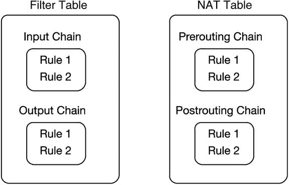

图 9-11。

iptables showing a sample of two tables

可用的五种不同类型的表格如下:

Filter: The filter table is the default table, which contains chains for input, forward, and output packets. Input packets are packets destined for local sockets, output packets are generated locally, and forward packets are routed through the box.   NAT: The NAT table is consulted when a packet that creates a new connection is encountered. It consists of prerouting, postrouting, and output chains.  Prerouting is for packets as soon as they come in, postrouting is for packets before they are about to leave the system, and output chains are for locally generated packets before routing.   Mangle: Mangle is a special table that can be used for packet alterations. It consists of prerouting, postrouting, input, output, and forward chains. Prerouting is for altering packets before routing, postrouting is for altering packets as they are about to go out, input is for packets coming into the box itself, output is for packets leaving the box, and forward chains are for packets that are being routed through the box.   Raw: The raw table is the table with the highest priority, because it is called before any other table. It is used primarily for exemptions in connection tracking.  This table provides two chains: prerouting and output. Prerouting is for packets arriving via any network interface; output is for packets generated by local processes.   Security: The security table is used for mandatory access control networking rules, such as those enabled by SECMARK and CONNSECMARK targets. It is used  for SELinux and other security modules. It consists of input, output, and forward chains.  

有关 iptables 过滤规则以及 NAT、mangle 和其他表格的更多信息，请参考位于 [`http://www.netfilter.org/documentation/index.html`](http://www.netfilter.org/documentation/index.html) 的在线文档。

## 网络中的 iptables

网络中 iptables 的最基本设计是将其用作互联网和企业网络之间的网关防火墙，如图 [9-12](#Fig12) 所示。

图 9-12。

Basic iptables gateway design

这种设计简单易用；但是，它缺乏故障转移功能。此外，当 iptables 服务器受到威胁时，网络中的每个网络设备都容易受到来自互联网的攻击。另一个更安全的设计是让 iptables 运行在网络内的每个 Linux 服务器上，此外还有一个运行 iptables 的互联网网关，如图 [9-13](#Fig13) 所示。

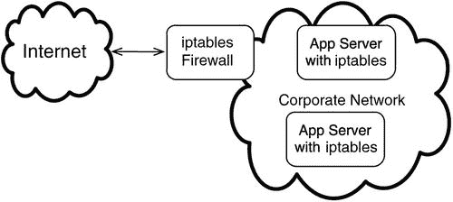

图 9-13。

iptables gateway and internal hosts

在网络中的每台服务器上运行 iptables 的好处是，您可以获得额外的保护，免受来自内部和外部网络的攻击。如果攻击者设法穿透了外部网关，那么您的每个内部服务器都有攻击者必须穿透的防火墙。这种方法的一个潜在缺点是在网络中的每个服务器上管理规则的复杂性。此外，让 iptables 检查每个数据包，然后才允许它进入系统，这是一个小小的损失。

第三种也是更安全的方法可能是在 iptables 网关上增加另一条腿，将所有面向互联网的主机放在所谓的 DMZ 中，如图 9-14 所示。这种设计将需要入站连接的网络设备从互联网中分离出来，连接到它们自己的网络区域，称为 DMZ。如果其中存在潜在的安全缺陷，也不会危及不需要入站互联网连接的内部公司网络设备。

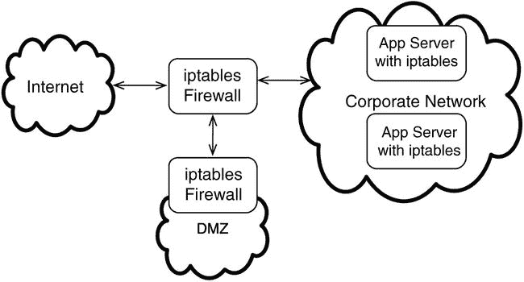

图 9-14。

iptables with DMZ

另一种方法是通过添加一个受保护的网络来增加额外的安全层，该网络用于存储网络中的财务、人力资源和其他人员相关数据，如图 [9-15](#Fig15) 所示。

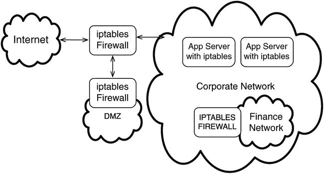

图 9-15。

Using iptables to secure financial data

可以增加一层安全措施来保护公司网络中最终用户的个人和财务数据(图 [9-16](#Fig16) )。这种设计不同于公司财务数据。最终用户的个人和财务数据可能包括客户的信用卡号、个人地址信息以及与企业客户相关的其他私人信息。

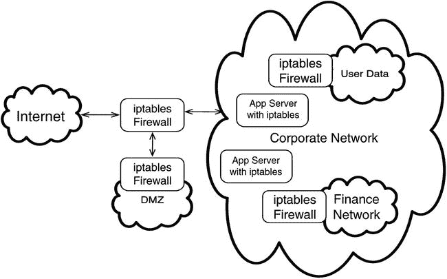

图 9-16。

Protecting customer data with iptables

## 过滤表

iptables 最常见的用途是作为防火墙。将过滤表作为默认表很有帮助，因为过滤表会进行数据包过滤。让我们来看看清单 9-11 中过滤器表的一个工作示例，从一个系统上没有规则开始，然后我们添加规则。如果您发现使用 iptables 命令很困难，可以考虑使用包装器来包装 iptables，比如 Shorewall ( [`http://shorewall.net`](http://shorewall.net/) )。

LISTING 9-11\. USING THE FILTER TABLE

首先，我们需要检查以确保系统中没有安装任何规则。

`# iptables -L`

`Chain INPUT (policy ACCEPT)`

`target     prot opt source               destination`

`Chain FORWARD (policy ACCEPT)`

`target     prot opt source               destination`

`Chain OUTPUT (policy ACCEPT)`

`target     prot opt source               destination`

接下来，我们添加一个规则来拒绝所有流量。使用`–t`选项，我们指定表格。`–A`附加到指定的链——在我们的例子中，它是输入链——`–j`跳转到一个动作。这种情况下的操作是丢弃所有数据包。运行这个命令会终止我们与主机的 SSH 连接，因此我们需要确保从控制台连接执行这个操作。

`# iptables -t filter -A INPUT  -j DROP`

让我们检查一下，确保规则被接受。`–v`选项用于详述，而`–L`选项用于列出链。在我们的例子中，它是输入链。我们可以看到有 22 个数据包被丢弃，相当于 1792 个字节。

`# iptables -t filter -vL INPUT`

`Chain INPUT (policy ACCEPT 0 packets, 0 bytes)`

`pkts bytes target     prot opt in     out     source               destination`

`22  1792 DROP       all  --  any    any     anywhere             anywhere`

我们必须允许 SSH 流量到达主机，因此让我们为此设置一个规则。因为 SSH 使用 TCP，所以我们可以使用`–p`选项指定协议，并将目的端口指定为端口 22。我们没有使用`–A`选项进行附加，而是使用了`–I`选项，它插入在顶部，因为我们希望在阻塞所有流量之前允许 SSH。

`# iptables -t filter -I INPUT -p tcp --destination-port 22 -j ACCEPT`

接下来，我们应该允许出站 DNS 和其他服务的所有出站流量工作。

`# iptables -I OUTPUT -d 0.0.0.0/0 -j ACCEPT`

`# iptables -I INPUT -m state --state ESTABLISHED,RELATED -j ACCEPT`

我们可以通过尝试“SSH”到主机，然后检查`INPUT`链，来验证主机是否接受 SSH 流量。我们可以看到 SSH 规则已经接受了 237 个数据包。

`# iptables -vL INPUT -t filter`

`Chain INPUT (policy ACCEPT 0 packets, 0 bytes)`

`pkts bytes target     prot opt in    out     source    destination`

`2787   11M ACCEPT     all  --  any   any     anywhere   anywhere    state RELATED,ESTABLISHED`

`1777  151K ACCEPT     tcp  --  any   any     anywhere   anywhere    tcp dpt:ssh`

`10612  656K DROP      all  --  any   any     anywhere               anywhere`

您可以通过以下方式查看规则的行号:

`# iptables -vL INPUT --line-number`

`pkts bytes target      prot opt in    out     source     destination`

`1 2787   11M ACCEPT     all  --  any   any     anywhere   anywhere    state RELATED,ESTABLISHED`

`2 1777  151K ACCEPT     tcp  --  any   any     anywhere   anywhere    tcp dpt:ssh`

`3 10612  656K DROP      all  --  any   any     anywhere               anywhere`

## 流行的 iptables 规则

这里列出了一些流行的 iptables 规则。

在 SaltStack 主机( [`http://www.saltstack.com`](http://www.saltstack.com/) )上，设置这两个规则以允许客户端连接到主机:

`# iptables -I INPUT -m state --state new -m tcp -p tcp --dport 4505 -j ACCEPT`

`# iptables -I INPUT -m state --state new -m tcp -p tcp --dport 4506 -j ACCEPT`

web 服务器的端口 80 和 443:

`# iptables -I INPUT -m state --state new -m tcp -p tcp --dport 80 -j ACCEPT`

`# iptables -I INPUT -m state --state new -m tcp -p tcp --dport 443 -j ACCEPT`

邮件服务器的端口 25:

`# iptables -I INPUT -m state --state new -m tcp -p tcp --dport 25 -j ACCEPT`

DNS 服务器:

`# iptables -I INPUT -m state --state new -m udp -p udp --dport 53 -j ACCEPT`

`# iptables -I INPUT -m state --state new -m tcp -p tcp --dport 53 -j ACCEPT`

OpenVPN 服务器:

`# iptables -I INPUT -m state --state new -m udp -p udp --dport 1194 -j ACCEPT`

`# iptables -I INPUT -m state --state new -m tcp -p tcp --dport 1194 -j ACCEPT`

## 删除 iptables 规则

可以使用`iptables –F`命令删除 iptables，这将删除指定表的所有链中的所有规则。请小心使用，因为如果您删除所有规则，您的系统将很容易受到攻击。对于删除单个规则，您有两个选择，如清单 9-12 所示。

清单 9-12。删除 iptables 规则

`# show the rules in the INPUT chain with line numbers prepended`

`# iptables -L INPUT --line-numbers`

`1   ACCEPT     tcp  --  anywhere             anywhere            state NEW tcp dpt:http`

`2   ACCEPT     tcp  --  anywhere             anywhere            state NEW tcp dpt:https`

`# Option 1 is to use the rule number to delete rule 2`

`# iptables –D INPUT 2`

`# verify that the rule has been deleted`

`# iptables -L INPUT --line-numbers`

`1   ACCEPT     tcp  --  anywhere             anywhere            state NEW tcp dpt:http`

`# Option 2 is to specify the rule itself instead of the rule number`

`# iptables -D INPUT -m state --state new -m tcp  -p tcp -s 0/0  --dport 443 -j DROP`

## 保存 iptables

使用`iptables`命令使用 iptables 创建的任何规则都可能在系统重新启动或刷新规则时丢失。要保存规则，运行`iptables-save`。默认情况下，`iptables-save`将规则输出到 STDOUT，STDOUT 可以重定向到一个文件，以便规则在下次重启时保持不变，如清单 9-13 所示。

清单 9-13。保存 iptables 规则以在重新启动后保留

`# iptables-save > /etc/sysconfig/iptables`

`# chkconfig iptables on`

## 结论

日志记录、VPN 远程访问和 iptables 防火墙都是组织安全性的组成部分。VPN 和防火墙是基于边界的安全工具，日志记录有助于审核它们的成功和失败。通过做出适合您的组织的选择，您可以构建一个稳定和安全的实用 Linux 基础设施。