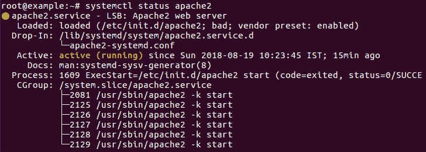
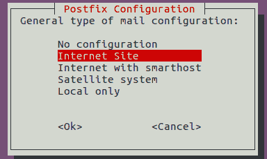
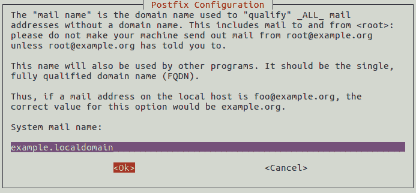
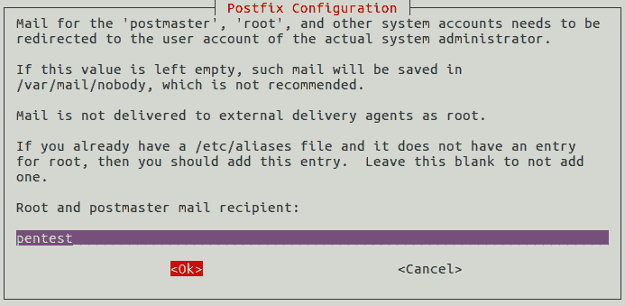
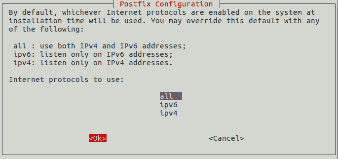
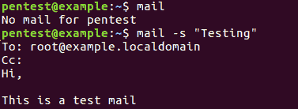

# 了解 Linux 服务安全性

在本章中，我们将讨论以下内容:

*   网络服务器-HTTPD
*   远程服务登录–远程登录
*   安全远程登录–SSH
*   文件传输安全–文件传输协议
*   保护邮件传输安全–SMTP

# 网络服务器-HTTPD

HTTPD 指的是 Apache2 网络服务器，常用于 Linux 系统。网络服务器通常使用超文本传输协议来传输网页。除了 HTTP，还支持 HTTPS 和 FTP 等协议。

# 准备好

在 Linux 系统上配置 Apache 没有具体要求。

# 怎么做...

在本节中，我们将看到如何在 Ubuntu 系统上安装和配置 Apache web 服务器:

1.  由于 Apache 在 Ubuntu 的默认软件库中可用，我们可以通过使用`apt`安装程序轻松安装它。要安装 Apache 及其所有必需的依赖项，我们运行以下命令:


2.  在安装过程中，Apache 向 Ubuntu 的默认防火墙 UFW 注册。这提供了可用于启用或禁用通过防火墙访问 Apache 的配置文件。要列出配置文件，请键入以下命令:


我们可以看到阿帕奇有三个配置文件。Apache 仅指端口`80`，Apache Full 指的是端口`80`和`443`，而 Apache Secure 仅指端口`443`。

3.  由于没有配置 SSL，我们暂时只允许端口`80`上的流量。为此，我们运行以下命令:


4.  现在，我们可以通过检查 UFW 的状态来验证是否已经授予了对 HTTP 流量的访问权限，如下所示:


5.  当 Apache 的安装完成时，Ubuntu 会自动启动它。这可以通过运行以下命令来确认:



6.  一旦 Apache 启动并运行，我们就可以启用附加模块来获得扩展功能。
7.  要查看附加模块列表，请参见`/etc/apache2/mods-available`目录。
8.  假设我们要安装 MySQL 身份验证模块；这可以通过运行以下命令来完成:

```sh
apt-get install libapache2-mod-auth-mysql
```

9.  安装后，可以使用以下命令启用该模块:

```sh
a2enmod auth_mysql
```

10.  接下来，我们需要重启 Apache 以使更改生效:

```sh
systemctl restart apache2.service
```

11.  如果我们希望加密 Apache 服务器发送和接收的流量，我们可以使用`mod_ssl`模块。由于该模块在`apache2-common`包中可用，我们可以使用以下命令直接启用它:

```sh
a2enmod ssl
```

12.  一旦启用了 SSL 模块，就需要手动配置来使 SSL 正常工作。我们在前面几章已经讨论过了。

# 它是如何工作的...

Apache 是 Ubuntu 上最常用的 web 服务器。我们从 Ubuntu 的存储库中安装它。一旦安装，我们允许通过 UFW 防火墙按照我们的要求进行访问。

一旦 Apache 启动并运行，我们可以通过安装附加模块并启用它们来定制其配置。

# 远程服务登录–远程登录

**Telnet** 是目前仍在使用的最早的远程登录协议之一。它比当今大多数系统管理员都要老，因为它是在 1969 年开发的。Telnet 允许用户在计算机之间建立基于文本的连接。由于 Telnet 不提供内置的安全措施，因此存在各种安全问题。

# 准备好

为了演示远程登录的使用，我们将使用两个系统。在第一个系统上，将运行一个远程登录服务器，在第二个系统上，我们将检查安全问题。

# 怎么做...

在本节中，我们将了解远程登录如何导致严重的安全问题:

1.  使用远程登录非常容易。只需打开终端窗口并键入以下命令:

```sh
telnet <IP Address> <Port>
```

这里举个例子:`telnet 192.168.43.100 23`

2.  当远程登录在服务器上运行时，攻击者可以使用它来执行其他服务的横幅抓取。让我们用它来查找服务器上运行的 SSH 版本。为此，请键入以下命令:


从前面的截图中我们可以看到，SSH 的版本显示的很清楚。

3.  我们还可以通过远程登录执行 SMTP 横幅抓取。为此，我们运行以下命令:


在前面的输出中，我们可以看到远程服务器正在使用主机名为`metasploitable.localdomain`的 PostFix 邮件服务器。

4.  一旦攻击者获得了有关 SMTP 服务器的信息，他们就可以尝试猜测有效的邮件帐户。他们使用`vrfy`命令，后跟一个邮件帐户来完成此操作。根据结果，他们可以了解邮件帐户是否有效:


如果响应码为`550`，则表示猜到的邮件账号无效，当响应码为`250`、`251`或`252`时，则表示邮件账号有效。

5.  由于默认情况下，远程登录不会加密通过连接发送的任何数据，攻击者可以轻松窃听通信并捕获敏感数据，包括密码。
6.  假设用户正在连接到远程登录服务器，如下所示:


系统会提示他们输入登录详细信息。输入正确的详细信息后，他们就会登录，如下所示:


7.  同时，同一网络上的攻击者通过使用 Wireshark 工具嗅探网络来捕获流量。我们可以在这里看到 Wireshark 捕获的 Telnet 流量:


8.  当我们分析捕获的数据包时，我们可以看到明文形式的登录详细信息，如下所示:


9.  这清楚地告诉我们 Telnet 是多么不安全。

# 它是如何工作的...

作为最古老的协议之一，远程登录没有内置的安全措施。攻击者可以使用远程登录进行横幅抓取。

攻击者还可以嗅探通过 telnet 连接发送的流量，并在 telnet 以明文通信时获得重要信息。

# 安全远程登录–SSH

随着互联网的发展，与使用 SSH 相关的安全风险也变得对用户可见。为了克服这些安全风险，开发人员发布了一个名为“安全Shell”或“SSH”的新工具。

它提供了与远程登录相同的功能，但在一个安全的加密隧道中。

# 准备好

对于 Linux 系统，我们可以使用 OpenSSH 进行 SSH 连接。是 Linux 的免费工具，可以使用`apt`安装。在前面的章节中，我们已经讨论了 OpenSSH 的安装和配置。

# 怎么做...

在本节中，我们将看到如何使用 SSH 而不是 Telnet 来保护我们的数据:

1.  安装并配置 SSH 后，我们可以尝试使用 SSH 连接到服务器，如下所示。出现提示时输入密码:


2.  同时，如果我们尝试使用 Wireshark 捕获流量，我们会得到以下详细信息:


在前面的截图中，我们可以在最后几行看到客户端和服务器之间启动了密钥交换。

3.  当我们浏览捕获的数据包时，我们可以看到客户端和服务器之间正在交换加密数据包，如下所示。使用远程登录时情况并非如此:


4.  即使我们试图看到数据包的细节，我们也看不到任何清晰的文本数据。我们得到一个加密输出，如下所示:


5.  因此，我们可以看到 SSH 如何帮助保护通过互联网传输的数据。

# 文件传输安全–文件传输协议

文件传输安全(FTP)是最常见的文件传输协议。当我们谈论像文件传输协议这样的文件传输协议时，它意味着该协议用于发送作为单个单元存储在特定文件系统中的比特流。然而，这个过程并不完全安全。

FTP 有很多漏洞，而且它不提供任何数据传输加密。

让我们讨论一些与使用 FTP 相关的安全风险:

*   **FTP 反弹攻击**:当使用 FTP 协议发生文件传输时，源服务器将数据发送给客户端，然后客户端将数据传输给目的服务器。但是，在慢速连接的情况下，用户可能会使用 FTP 代理，这使得客户端直接在两台服务器之间传输数据。
*   在这种情况下，黑客可能会使用`PORT`命令，通过充当特定文件传输请求的中间人来请求访问端口。然后，黑客可以在主机上执行端口扫描，并访问通过网络传输的数据。
*   **FTP 蛮力攻击**:可以针对 FTP 服务器尝试蛮力攻击来猜测密码。管理员倾向于使用弱密码，并且对多个 FTP 服务器重复相同的密码。在这种情况下，如果攻击者能够成功执行暴力攻击，所有数据都会暴露出来。
*   **数据包捕获(或嗅探)**:由于 FTP 以明文传输数据，任何攻击者都可以执行网络数据包嗅探来获取用户名和密码等敏感信息。
*   **欺骗攻击**:假设管理员根据网络地址限制了对 FTP 服务器的访问。在这种情况下，攻击者可能会使用外部计算机，并将其地址欺骗到企业网络中的任何计算机。一旦发生这种情况，攻击者现在就可以访问正在传输的所有数据。

我们已经看到了与 FTP 相关的不同安全风险。现在，让我们讨论执行安全数据传输的几种方法:

*   **禁用标准 FTP** :很多 Linux 服务器都预装了标准 FTP 服务器。作为最佳做法，建议禁用标准 FTP，因为它缺乏隐私性和完整性，使得攻击者很容易访问正在传输的数据。相反，使用更安全的替代方案，如 SFTP。
*   **使用强加密和哈希**:使用 SFTP 或任何其他安全协议时，确保禁用 Blowfish 和 DES 等较旧和过时的密码，仅使用 AES 和 TDES 等强密码。

FTP 是一个非常古老的协议，但我们仍然可以看到 FTP 在许多网络中的糟糕实现。作为一个旧协议，它的安全功能较少，因此容易受到许多安全风险的影响。

当我们使用安全协议时，例如 SFTP 协议，而不是文件传输协议，我们不太容易受到攻击。

# 保护邮件传输安全–SMTP

电子邮件服务器使用 SMTP 或**简单邮件传输协议**。SMTP 服务器通过 SMTP 协议发送和接收每封电子邮件。像 Postfix 这样的 MTA 或邮件传输代理可以配置为电子邮件服务器。

Postfix 可以在 Linux 系统上用来路由和发送电子邮件。

# 准备好

为了安装和配置 Postfix，我们将使用 Ubuntu 服务器。我们的服务器上还需要一个**完全限定域名** ( **FQDN** )。

# 怎么做...

在本节中，我们将看到如何在 Ubuntu 服务器上安装和配置 Postfix，并按照我们的要求使用:

1.  由于 Postfix 包含在 Ubuntu 的默认存储库中，安装它变得很容易。为了开始安装，我们将运行以下命令以及`DEBIAN_PRIORITY=low`环境变量来回答安装过程中的一些额外提示:


2.  一旦安装开始，第一个窗口将询问邮件配置的类型。我们将根据需要选择`Internet Site`，如下图:



3.  在下一个窗口中，输入用于`System mail name`的主机名，如下所示:



4.  接下来，输入 Linux 用户帐户，该帐户将用于转发发往 root 和 postmaster 的邮件，如下所示:



5.  下一个窗口定义 Postfix 将接受的邮件目的地。确认现有条目，并根据需要添加任何其他域:


6.  在下一个窗口中，选择`No`并继续。
7.  下一个窗口指定邮件服务器配置为中继邮件的网络列表:


8.  在下一个窗口中，我们可以限制消息的大小。我们将设置`0`禁用任何大小限制:


9.  下一步，选择 Postfix 应该支持哪个 IP 版本。在我们的案例中，我们将选择`all`:



10.  完成上述步骤后，安装程序将完成安装，如下所示:


11.  现在，我们将开始设置邮箱。为此，我们将`home_mailbox`变量设置为`Maildir/`，如下图所示:


这一步将在用户的主目录中创建一个目录结构。

12.  接下来，设置`virtual_alias_maps`表的位置。此表用于映射 Linux 系统帐户和电子邮件帐户。为此，我们将运行以下命令:


13.  现在，让我们编辑`etc/postfix/virtual`以将邮件地址映射到 Linux 帐户，如下所示:


14.  完成后，通过运行以下命令应用映射:


15.  现在，我们将重新启动后缀服务:


16.  我们的下一步将是允许 Postfix 通过 UFW 防火墙:


17.  后缀现在应该配置为发送邮件。我们可以通过从任何用户帐户向根电子邮件帐户发送测试邮件来测试这一点，如下所示:



18.  接下来，我们通过键入`mail`来检查根帐户的邮件。我们将看到一封新邮件正在等待。当我们按下*进入*，我们可以看到邮件的内容，如下图所示:


19.  在完成之前，我们将执行后缀强化。
20.  我们在前面的食谱*远程服务登录-远程登录*中看到，攻击者如何使用`vrfy`命令来猜测电子邮件帐户，如下所示:


21.  为了防止这种情况，我们需要禁用`vrfy`命令。为此，我们运行以下命令:

```sh
postconf -e disable_vrfy_command=yes
```

在此之后，我们重新启动 Postfix 服务以使更改生效。

22.  现在，如果攻击者尝试相同的步骤，他们将获得如下所示的输出:


# 它是如何工作的...

后缀用于配置我们的 SMTP 服务器。在配置过程中，我们创建电子邮件帐户到 Linux 系统帐户的映射。

为了增加 Postfix 的安全性，我们禁用`vrfy`命令，从而防止攻击者猜测服务器上配置的电子邮件帐户。