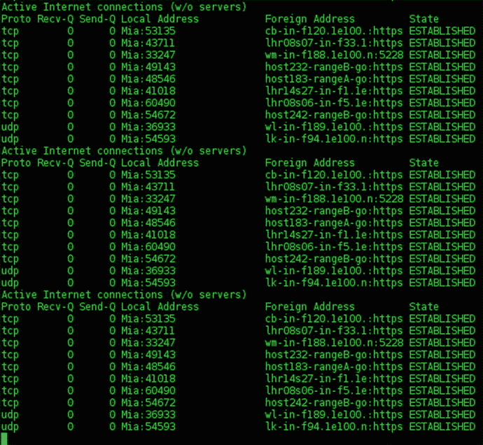
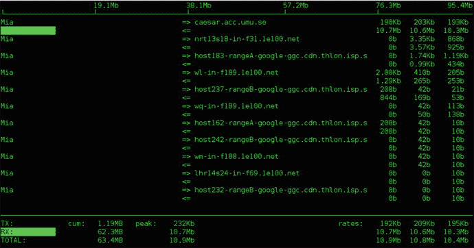
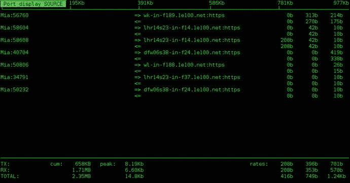
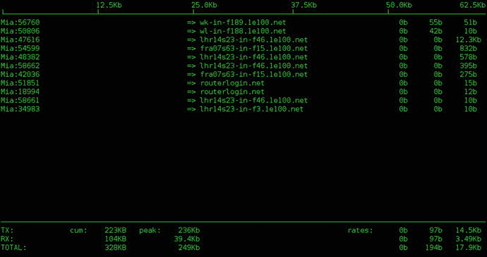
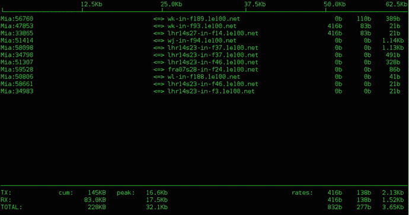
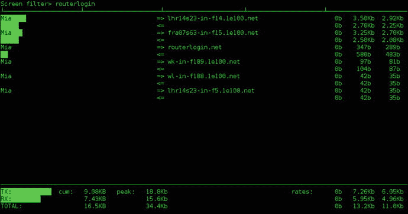

# 1.使用 Iftop 进行实时网络统计

监控网络连接肯定会令人沮丧，主要是因为它们可以在几秒钟内建立起来，然后消失。在这一章中，我将向您展示如何使用名为`iftop`的基于命令行的工具来实现一种类似 Zen 的方法来监控服务器上的网络连接。然后，我完成了配置文件的创建，一旦您按照自己的喜好设置了监控，就可以在不同的服务器上再次使用该文件。

## 使用 netstat 监控网络连接

命令行工具已经成为系统管理员的常用工具。虽然功能丰富，包括一个`auto-refresh`参数(连续模式)，`netstat`当然不能做比输出原始数字和名称(从主机和端口)更多的事情。例如，要以连续模式运行 netstat，可以使用:

`# netstat -c`

我通常会把它和`watch`放在一起运行，给我不同场景下需要的那种干净的屏幕刷新；例如:

`# watch -n2 "netstat -tu"`

在本例中，`watch`让我在再次运行命令并更新其输出之前配置一个两秒钟的间隙(见图 [1-1](#Fig1) )。

图 1-1。

The “watch” command executing “netstat -tu” every two seconds

在这个场景中，`-tu`开关告诉`netstat`输出 TCP 和 UDP 统计数据。使用`watch`选项比使用连续的`-c`参数要灵活得多，因为它将信息添加到了最后一个输出的底部，尽管输出仍然有点混乱，难以理解。顺便提一下，下面的`netstat`命令是我使用最多的一个:

`# netstat –tulpnc`

在图 [1-2](#Fig2) 中，我要求`netstat`显示所有本地监听端口，然后显示它们所属的进程。然而，`lsof -i`，一个与列出打开的文件有关的命令，可能更有效。

图 1-2。

“netstat” output displays changing information by repeating the output at the foot of the screen upon refresh

## iftop 简介

谢天谢地，有一个实用程序可以消除令人痛苦的眼睛疲劳:`iftop` ( [`http://www.ex-parrot.com/pdw/iftop/`](http://www.ex-parrot.com/pdw/iftop/) )。`iftop`之于网络就像 top 之于 CPU。同样，`ifconfig`指的是配置接口，友好的`iftop`代表“接口顶端”。

`iftop`和其他基于命令行的工具之间的主要区别是`iftop`可以立即绘制非常有用的条形图(以及其他图形选项),在诊断紧急的服务器或网络问题时，我怎么强调都不为过。

事实上，没有痛苦的设备驱动程序或库的序言——`iftop`“只是工作”——当你赶时间的时候，一切都不同了。它的小尺寸也可能有助于诊断没有安装`iftop`的客户服务器:当有问题的服务器上的网络中断时，这个小软件包可以很容易地放在记忆棒上。

## 安装 iftop

在基于 Debian 的系统上，您可以用下面的命令安装`iftop`:

`# apt-get install iftop`

在 Red Hat 衍生产品上，您可以安装 EPEL(Enterprise Linux 的额外软件包)RPM，例如使用:

`# rpm -ivh`[`http://download.fedoraproject.org/pub/epel/6/i386/epel-release-6-8.noarch.rpm`T3】](http://download.fedoraproject.org/pub/epel/6/i386/epel-release-6-8.noarch.rpm)

对于红帽家族的老版本，可以按照 [`http://www.cyberciti.biz/faq/fedora-sl-centos-redhat6-enable-epel-repo/`](http://www.cyberciti.biz/faq/fedora-sl-centos-redhat6-enable-epel-repo/) 的说明进行操作。

然后，您应该能够像往常一样安装`iftop`:

`# yum install iftop`

如果执行`iftop`时只需要检查一个接口，可以使用下面的命令生成它:

`# iftop -i eth0`

图 [1-3](#Fig3) 显示了该命令的示例输出。输出在中间一列显示了许多远程主机(包括添加到文件`/etc/hosts`中的昵称，以及完全限定的域名，它们实际上只是我缩写的普通主机名),在左边一列显示了名为`Sula`的本地机器。

图 1-3。

The default “iftop -i eth0” output listening to an interface enabled

在右边，你可以看到三列。优秀的`iftop`将其称为显示顺序，各列处理不同的时延平均值。默认情况下，这看起来(至少)是两秒、十秒和四十秒的平均值。这些值可以单独配置，所以一开始不要让这太困扰你。此外，通过按 1、2 或 3 键分别按上述 2 秒、10 秒或 40 秒的平均值进行过滤，可以很容易地使用这些列来更改整体显示。

说句题外话，两秒钟的平均值真的很短；我喜欢它的背景充满了冗长的五分钟 SNMP 平均值。我可以很快看到网络上刚刚发生的变化，虽然两秒钟不是实时的，但它非常接近实时，在当今繁忙的互联网上肯定有它的一席之地。我发现它足够长，让你能够发现一些东西，而不用担心万一你错过了屏幕会冻结。

当您在没有指定任何选项的情况下运行默认配置时，`iftop`输出最近十秒内最繁忙的主机(换句话说，使用十秒平均值)。它还将主机成对分组，以选择最繁忙的一对入站和出站组合流量。

最后，在输出的最后，您会看到一些总数。其中包括有用的统计数据，如以兆字节(Mb)为单位的数据传输量以及 42 秒平均流量，通常以兆位(MB)为单位，但有时也以千字节为单位。

## 从键盘控制 iftop

除了提供流畅的图形显示，甚至通过 SSH 终端，`iftop`还允许您按一个键来修改配置。例如，在一个系统管理员的工作日中，您可能会检查各种不良的网络习惯:从监视网络接口的错误配置到减轻可怕的危险 ARP 风暴。使用`iftop`，您可以在多个选项中循环，并自信地选择一个配置参数来立即适应您当前的场景。

以下是一些例子，说明`iftop`如何让您的系统管理员工作变得更轻松:

*   要更改源和目的地显示，在`iftop`运行时按 s 键或 d 键。这有助于隔离谁在发送什么，特别是如果`iftop`正在 Linux 路由器上运行(我将在本章后面的“在繁忙的路由器上使用 iftop”中涉及)并转发流量。
*   To quickly see which ports are in use, press the p key. You can also use the Shift+S and Shift+D keys to expose source and destination ports, respectively. Figure [1-4](#Fig4) demonstrates how friendly `iftop` is with its options and how it dutifully reports, in the top-left of the screen, the result of the keypress that it has just received.

    

    图 1-4。

    This output shows all the ports that are visible and an option selection, top-left
*   要在几个不同的显示画面(类似于水平条形图)之间循环，请按 t 键。

之前，在图 [1-3](#Fig3) 中，你看到了标准的两行显示。然而，它的目的可能并不完全明显，因为主机之间的流量很少或没有流量(所以白色条，如条形图，不存在)，但您可以看到描述流量方向的`=>`和`<=`符号。

图 [1-5](#Fig5) 显示了一个在某些情况下有用的功能。每台主机一行显示(在一行上显示`<=`和`=>`两个方向)意味着很容易发现谁占用了你的带宽。图 [1-6](#Fig6) 用一个`=>`方向指针告诉你谁的出站流量最大。这两个选项(将入站和出站流量聚合到一条线路上，并选择您感兴趣的特定方向)最适合非常繁忙的网络。

图 1-6。

Here “iftop” shows “sent” traffic only. The next selectable option is “received” traffic only

图 1-5。

Traffic is displayed with both hosts occupying one line

## 添加屏幕过滤器

屏幕过滤器的目的是整理太忙而无法跟踪的屏幕。想象一下，例如，你检查你的网络连接，突然发现一个可疑的主机。在这种情况下，快速按下 P 来暂停(或冻结)不断变化的显示，然后按下 l 键，再按下主机名，这是您刚刚发现的添加屏幕过滤器的主机名。通过这种方式，可信的`iftop`只自行传回该主机的连接信息，以供进一步检查。

图 [1-7](#Fig7) 在屏幕的左上角显示`iftop`请求匹配屏幕过滤短语或关键词。如果这是一个棘手的 IP 地址或长主机名，那么你应该能够剪切并粘贴到该领域。

图 1-7。

Filter that screen output to make more sense of it with a “screen filter”

其他过滤器和屏幕过滤器之间的一个关键区别是，屏幕底部的总计不受任何屏幕过滤功能的影响。

## 使用正则表达式

`Iftop`还支持遵循 POSIX 格式的正则表达式，也称为 regex。手册页提供了一个很好的过滤器，如果不是比其他过滤器稍微复杂一点的话，可以帮助您开始使用一些操作`iftop`的方法:

`not ether host ff:ff:ff:ff:ff:ff`

这个非常有用的过滤器会忽略所有广播数据包。像所有其他过滤器一样，这种过滤器同样可以应用为带有字母 l 或字母 f 的筛网过滤器，作为对当前启用的网过滤器的实时过滤器改变。或者，您可以在启动时在命令行上添加它，也可以在启动配置文件中添加它(稍后我将进一步介绍)。通过消除广播流量，您可以有效地将小麦从谷壳中分离出来，这样您就可以直接关注服务器上的连接，而不是通常由连接填充屏幕的大量网络噪音。

`iftop`也以与`ngrep`或`tcpdump`相同的方式接受正则表达式；例如:

`port smtp and host mail.chrisbinnie.tld`

如果我想监控我的邮件服务器的流量，但避免所有 SMTP 流量(使用 TCP 端口 25)，我可以像这样使用`and`和`not`操作符:

`host mail.chrisbinnie.tld and not port 25`

Note

您可能知道，Linux 将查找文件`/etc/services`来匹配端口号和服务名。如果您不知道服务使用哪个端口号，您可以查询该文件来找出答案。

如上所述，这些过滤器可以以多种方式运行，包括在执行时从命令行运行，如下所示，使用以下语法可以节省您的键入时间:

`# iftop -f “host mail.chrisbinnie.tld and not port smtp”`

这个启动配置只是检查邮件服务器上不是通过 TCP 端口 25 进出的所有流量。

其他聪明的过滤技巧包括“从”和“到”风格的命令，你可以通过按键忽略整个方向的交通。这些使用稍微更专业的术语`src`和`dst`来表示来源和目的地。

在`iftop`的可扩展配置中，我最喜欢的一个部分是，你可以将几乎每个过滤器与其他过滤器混合搭配，以获得你需要的精度。当然，错误是会发生的(一个打字错误或者一个丢失的点来分隔一个 IP 地址的八位字节)，但是总的来说，我发现`iftop`的语法非常直观。

这里还有一些例子。您可以使用定向过滤器来组合主机和端口，如下所示:

`dst host router.chrisbinnie.tld and src port bgpd and not host ntp.chrisbinnie.tld`

此外，有时某些范围的端口是有用的。我不禁又想到了与下一个选项相关的`ngrep`和`tcpdump`。

以下示例中包含的端口号被称为特权端口、电源端口或特殊端口。之所以这样称呼它们，是因为在缺省情况下，在 Linux 系统上只有 root 用户可以绑定到这些端口，将临时端口的上层留给非超级用户。下面显示的最低的 1024 个 TCP 端口可以按如下方式检查可疑流量。

`src host web.chrisbinnie.tld portrange 0-1024`

您还可以使用以下命令检查特定的协议(有点像前面显示的`ether`选项，但这次是传输协议，而不是链路类型):

`ip proto name-of-protocol`

如果您的服务器可以看到多个子网，无论是本地子网还是远程子网，要监视单个子网，请使用以下命令:

`# iftop -F 10.10.10.0/24`

Note

值得注意的是，大写的 F 在网络选项之前，而不是小写的 F 来启用某些过滤。

## 监听网络流量

我曾经花了大量时间检查网络异常，结果发现一个子网实际上在向另一个子网“泄漏”流量。引导我做出这一发现的工具当然是`iftop`。下面的场景将有助于解释我所说的内容。

像其他一些数据包嗅探器和网络监视器一样，您可以(以超级用户权限)配置您的网络接口进入所谓的“混杂”模式。`iftop`能够侦听通过接口所连接的网络端口(无论是网络交换机、集线器还是其他)传输的流量，但该流量的目的地不是绑定到该接口的 IP 地址。换句话说，在某些情况下，你可以选择忽略那些实际上没有到达你的服务器，而是通过你的网卡的流量。你可以试着在名为`eth0`的界面上用这样的`-p`标志找出答案:

`# iftop -p -i eth0`

此外，出于个人偏好，可以方便地添加用于查看字节的`-B`,而不是比特的网络约定(Kbps ):

`# iftop -i eth0 -B`

还有许多其他显示选项，您可能想尝试一下，以便根据自己的喜好更改屏幕。这关闭了条形图(为了清晰起见，我更喜欢条形图)。

`# iftop -b`

另外两个可能有用的参数，`-P`和`-N`:

*   大写的`-P`选项(与冻结显示的 P 不同)确保网络事务中涉及的所有端口(源和目的地)将在显示中可见。注意，如果高端端口号在文件`/etc/services`中没有相应的条目，那么您只能直接看到端口号。否则，您将看到一个端口名，如 DNS 的`www`或`domain`等。顺便说一句，除非我的显示器充满了信息，否则我从不关闭这个功能。
*   `-N`标志正好颠倒了这个选项，从而完全忽略了`/etc/services`和相关的名称，并且仅仅专注于输出原始端口号。

## 更换过滤器需要时间

请注意，根据您的设置和环境，更改实时过滤器可能不会立即产生明显的效果。这是因为像许多测量一样，您依赖于对许多结果进行平均，尽管通常是在一个很小的窗口内，因此您必须等待显示器或网络过滤器的其他部分跟上。

## 配置 iftop 方案

一旦您开始使用一些更标准的`iftop`配置选项，您可能会发现自己在许多不同的场景中使用它。而且，在这些场景中，如果重复出现，如上所述，按一两个键就可以使用设置好的配置是很有用的。

例如，您可以有一个`bash`别名或一个简单的脚本，它引用了保存在`root`用户的主目录中的几个不同的配置文件，用于`iftop`。然后，您可以通过键入类似于配置文件快捷方式的内容来触发相关的配置文件，如下所示:

`# iftop broadcast storm`

主目录中引用的默认配置文件(通常是`root`的，因为需要它的系统特权)是`.iftoprc`。

正如我所承诺的，在传递一个相当通用的配置文件之前，我想浏览几个配置选项，您可以向其中添加自己的过滤器；这是:

`# cat /root/.iftoprc`

`dns-resolution: yes`

`port-resolution: yes`

`show-bars: yes`

`promiscuous: yes`

`port-display: on`

`hide-source: no`

`hide-destination: no`

`use-bytes: no`

`sort: 2s`

`line-display: one-line-both`

`show-totals: yes`

`log-scale: yes`

这些配置选项中有许多是不言自明的。选项`line-display`允许您将入站和出站流量的总流量相加，以立即在显示屏上显示最繁忙的主机。这不是为入站流量和出站流量分别显示一个输出。这个`config`选项可以以多种方式改变:双线、单线发送、单线接收。

您可能还想添加使用`max-bandwidth`选项连接的“真实”网络容量。想象一下，您连接到 1024Mbps 的网络链路(1Gbit)，但您的外部互联网容量实际上只有 100Mbps(这可能是您承诺的数据速率)。有时，您的局域网可能会向您显示根本不存在的突发流量。换句话说，你可能会看到超过 100Mbps 的流量流向互联网，这根本不能准确反映你的流量。

优秀的`iftop`让你指定一个带宽上限，这样你可以有一个更现实的最大值显示。一个警告；这需要以位为单位，而不是字节:

`max-bandwidth: 100M`

在这里，您可以将上限下调至 100Mbps，即使您使用的是千兆局域网连接。

## 在繁忙的路由器上使用 iftop

我已经在非常繁忙的 Linux 路由器上成功地使用了`iftop`(推了几十万比特的流量，但更重要的是有几十万个并发网络连接),它一次又一次地令人钦佩地站立起来。值得强调这一点，因为其他一些工具在相当大的负载水平下使路由器崩溃。`iftop`即使在高度紧张的情况下，也能继续体面地服务并保持稳定。当然，您的收获可能会有所不同，这取决于版本和风格等，所以首先在繁忙的开发环境中尝试一下。

如果您尝试在繁忙的路由器上使用`iftop`,您可能不会立即想到，如果启用该选项，您将会生成大量的 DNS 查找。如果机器突然收到成千上万个微小的 DNS 包，它会给机器增加相当明显的负载，因此至少在测试开始时，尤其是在繁忙时期，禁用它们是明智的。您可以在启动时使用`-n`来避免您的网络接口在突然的、每秒大量的数据包涌入时惊慌失措。这是一个容易犯的错误，我不建议在生产机器上无意中犯这种错误。

## 摘要

我相信这个超级实用工具的概述已经足够激起你的欲望，让你自己去使用它。我只是触及了可供你选择的表面。这个惊人的实用程序在运行时(接近实时)符合相对复杂的过滤器变化，这个简单的事实使它真正出类拔萃。然而，加上适用于几乎所有环境的无数可配置选项，它无疑是一个不容忽视的强大网络工具。随着正则表达式的引入，在使用`iftop`的网络链接上，您几乎没有观察不到的东西。我希望你能像我经常做的那样喜欢测试它。