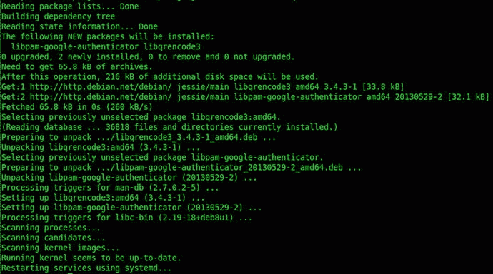
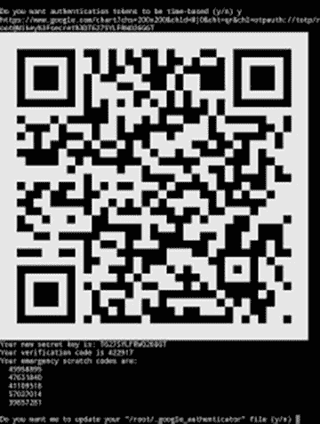

# 6.使用 PAM 保护 SSH

毫无疑问，SSH(尤其是 OpenSSH 实现)是连接到互联网和本地网络的 Unix 类型机器的远程访问方法。然而，有时候，让您的 SSH 密钥随时可用并出现在您登录的设备上并不方便。如果你曾经不得不手动键入一个 SSH 密钥，以便将它从一个设备复制到另一个设备，你知道这有点像试图将水推上山。不推荐。

这就是两步(或双因素)身份验证的用武之地。再加上 SSH 提供的已经非常好的安全性和与大多数 Linux 版本兼容的可插拔模块，由搜索巨头 Google 提供，超级安全的 Google Authenticator 意味着即使您不使用 SSH 密钥，您的登录也会更加安全。我指的是减轻对你的密码之类的暴力攻击。

在本章中，您将学习如何通过添加 TCP 包装器来强化您的 SSH 服务器配置(以便只有您信任的 IP 地址或域名可以登录)。最后，让 Google authenticator 库添加两步(或双因素)认证。Google Authenticator 支持许多设备，包括 iPhone、iPod Touch、iPad 和 BlackBerry。由于谷歌自己的智能手机品牌是安卓，其他版本都是安卓版本的端口，所以本章重点介绍那款设备。然而，除了智能手机上的软件包安装之外，其余信息应该适用。要为 Android 以外的设备安装软件包，只需从该网页中选择您的设备，然后按照说明进行操作: [`https://support.google.com/accounts/answer/1066447?hl=en`](https://support.google.com/accounts/answer/1066447?hl=en) 。

## 关于标准的一个注记

如果你对互联网上的标准如何工作的技术细节不熟悉，那么可能需要快速提及 RFC。RFC 是“征求意见稿”，由互联网工程任务组(IETF)和互联网协会(ISoc)共同发布。可以把每个 RFC 看作是由那些最了解的人组织起来的每个标准的规范，供他们相关的互联网社区讨论或采用。我提到 RFC 是因为 Linux 上可用的 Google Authenticator 实用程序是基于开放认证倡议(OATH)标准( [`http://www.openauthentication.org`](http://www.openauthentication.org/) )，不要与流行的 OAuth ( [`http://oauth.net`](http://oauth.net/) )混淆。此外，不要认为 Google Authenticator Android 应用程序与同名的 Linux 项目是一回事。他们是相当独立的实体(更多关于安卓的化身在这里: [`https://github.com/google/google-authenticator-android`](https://github.com/google/google-authenticator-android) )。

Google Authenticator 支持两种 RFC:基于 HMAC 的一次性密码(HOTP)算法，在 RFC 4226 ( [`https://tools.ietf.org/html/rfc4226`](https://tools.ietf.org/html/rfc4226) )和基于时间的一次性密码(TOTP)算法，在 RFC 6238 ( [`https://tools.ietf.org/html/rfc6238`](https://tools.ietf.org/html/rfc6238) )中指定。这两份文件都值得快速浏览一遍。即使你只是在学习新的术语，这也是一次很好的学习经历。

理论到此为止，让我们专注于通过运行 Google Authenticator([`https://github.com/google/google-authenticator`](https://github.com/google/google-authenticator))让您的 SSH 服务器更加安全。

## 配置您的 SSH 服务器

快速总结您应该对您的`/etc/ssh/sshd_config`文件进行的关键更改。您可以像以往一样，不仅仅是应用这些更改，而是在大多数情况下，它们是一个很好的起点。以下是我的个人偏好和我认为的最低要求。

您必须修改配置文件中的几行。首先确定配置文件中的下列行，然后修改它们以反映以下设置，如果它们不存在，则添加它们。

*   更改您的 SSH 服务器端口，这样自动攻击就不会让您的日志充满这样的噪音:`Port 2222`
*   通过仅允许运行第二版本的客户端使用此线路连接来避免较弱的版本 1 协议:`Protocol 2`
*   确保只有特权较低的用户可以像这样通过 SSH 进行初始连接:`PermitRootLogin No`
*   确保只允许您明确允许的用户名登录。我将该设置放在配置文件的顶部，以便在排除故障时立即指出它是启用的。这样，我一打开文件就能看到。`AllowUsers chrisbinnie sysadmin`
    *   我没有尝试过下面更高级的语法，但是(小心，不要关闭现有的 SSH 会话)您可能也想测试这些例子。这里用户`neymar`只能从 IP 地址`10.10.10.10`连接；用户`lionel`可以从任何机器连接；并且用户`luis`必须从主机名在`chrisbinnie.tld`域名下的机器连接，比如`barca.chrisbinnie.tld` : `AllowUsers neymar@10.10.10.10 lionel luis@*.chrisbinnie.tld`
    *   一个组可能更容易管理许多用户(不过我不会在这个配置中包括它)，这可以通过如下方式实现:`AllowGroup sysops`
*   接下来，验证是否禁用了以下设置。当建立远程连接时，您倾向于信任您所连接的客户端，而不是您所连接的服务器，因此除非特别需要，否则不接受 X11 通信。`X11Forwarding no`
*   它不太可能被禁用，但检查此配置设置以防万一:`UsePAM yes`
*   现在快速检查该选项是否也已启用:`ChallengeResponseAuthentication yes`
*   最后，虽然不是严格意义上的安全相关，更多的是一种倒退，但是不要使用这个设置在连接过程中等待过长的 DNS 超时:`UseDNS no`

现在是时候面对您的守护进程并重新启动您的 SSH 服务了，使用下面的命令(在运行`systemd`的新系统上):

`# systemctl restart sshd.service`

在这个阶段，尝试从不同的 IP 地址以不同的用户身份登录并不是一个坏主意，这样您就可以在两步身份验证可能使其变得更复杂之前，对新配置的安全性有信心。如果你对以上任何一点都不确定(或者不能让它工作)，那么你可能想要转移到开发机器上。或者至少，转到一台可以通过终端物理登录的机器，或者一台有虚拟控制台的机器，比如虚拟机或云实例。换句话说，您可能需要某种不依赖于 SSH 服务器的带外登录提示。

## 包装您的连接

接下来，您将通过确保只有特定的域名或 IP 地址(或 IP 地址范围)可以连接来结束您的 SSH 连接。

这很简单，但需要注意的是。在测试您的新配置工作正常之前，不要关闭您现有的 SSH 连接。您可以通过生成一个新的 SSH 会话来实现这一点。否则你可能会被锁在门外；相信我，当我说这很容易做到，即使是老前辈。对于这样的任务，我更喜欢使用 TCP 包装器，因为输入错误的可能性大大降低了。如果你想走这条路，在这一部分的最后你可以看到一个`IPtables`例子。打开文件`/etc/hosts.allow`,添加如下内容:

`sshd: .chrisbinnie.tld`

`sshd: 123.123.123.0/24`

为了演示语法上的差异，我将这两行分开了。在第一行，注意域名`chrisbinnie.tld`前的重要点。这里，主机名属于该域名的任何机器都将被允许连接，类似于在更高级的 SSH 配置中直接用作示例的配置。同样，在第二行中，`123.123.123.0`范围内的 254 个 IP 地址中的任何一个也将被给予访问权。通常，我倾向于在这个文件中使用原始 IP 地址，因为 DNS 条目可能会被欺骗。IP 地址要复杂得多。

优秀的 TCP wrappers `hosts.allow`文件对于文字来说太聪明了，您还可以包括看起来有点奇怪的设置，例如:

`sshd: 10.10.`

在这里，许多以`10.10.`开头的 IP 地址被允许访问。这使得访问相对开放，所以一定要谨慎使用这样的设置。

当然，不要认为 TCP 包装器只适用于您的 SSH 服务器；看看下面的例子，它包括了所有支持 TCP wrappers 的服务的网络掩码(进一步的细节可以在 [`http://www.admin-magazine.com/Articles/Secure-Your-Server-with-TCP-Wrappers`](http://www.admin-magazine.com/Articles/Secure-Your-Server-with-TCP-Wrappers) 找到):

`ALL: 10.10.0.0/255.255.254.0`

为了使这些更改生效，您需要编辑文件`/etc/hosts.deny.`,记住不要关闭您现有的 SSH 会话，直到您很高兴可以再次成功登录！将这一行添加到`deny`文件中:

`sshd: ALL`

同样，您当然也可以选择使用`IPtables`来保护您的 SSH 服务器。我会让你看看哪个选项适合你的需求，但下面显示的对我来说是有效的。

`# iptables -A INPUT -i eth0 -p tcp -s``123.123.123.0/24`T2】

`# iptables -A OUTPUT -o eth0 -p tcp --sport 2222 -m state --state ESTABLISHED -j ACCEPT`

## 两步身份验证入门

现在，您可以确保只有选定的用户被允许通过 SSH 登录，并且从非常特定的 IP 地址或机器登录，现在是时候使用两步身份验证了。使用 PAM 提供的优秀可插拔认证模块，Google Authenticator 支持以下特性，根据其 GitHub 页面( [`https://github.com/google/google-authenticator/wiki`](https://github.com/google/google-authenticator/wiki) ):

*   存储在用户主目录中的每个用户的机密和状态文件
*   支持 30 秒 TOTP 码
*   支持紧急划痕代码
*   防止重放攻击
*   通过显示二维码提供密钥
*   RFC 3548 ( [`http://tools.ietf.org/html/rfc3548`](http://tools.ietf.org/html/rfc3548) ) base32 键字符串的手动键输入

我喜欢提到“刮擦代码”这些可以在紧急情况下打碎玻璃时使用，这样你就不会被完全锁在外面(理论上)。在设置它之前，让我们先来看看一些术语和一个特别的特性。

我之前提到过 TOTP(时间导向)代码。考虑一下，如果您生成的代码由于客户端和服务器时间设置不同而出错，会发生什么情况。服务器根本不信任代码，当你被锁在外面时，一切都会失控。

有一些时间偏差的余地，但也有一个聪明的选择来帮助减轻预期的问题。例如，您可能没有将客户端设备连接到 NTP(网络时间协议)服务器，或者您可能从网络延迟在开始握手中起作用的位置进行远程连接。可插拔模块不会降低身份验证机制的安全性，而是在用户多次身份验证失败时专注地监听。用户显然会对输入他们认为有效的代码感到沮丧。三次尝试后，当该选项被启用时，PAM 模块会花时间检查时间偏差，并测量设备的误判尝试，以便进行补偿。如果合适，它会让用户连接。聪明吧。

在 smartphone 软件包安装过程接近尾声时，系统会询问您一些与时间设置相关的问题。幸运的是，这些问题相对详细，所以我会让您根据自己的情况选择最佳选项。

## 安装所需的软件包

如果你想通过包管理器安装需要的包，那么在 Debian derivatives 上试试这个(我在“Jessie”上):

`# apt-get install libpam-google-authenticator`

图 [6-1](#Fig1) 更详细地显示了安装过程。

图 6-1。

Detailed installation information of the PAM module

如果你愿意的话，你也可以从 GitHub 的 [`https://github.com/google/google-authenticator/`](https://github.com/google/google-authenticator/) 下载源代码，然后将`cd`切换到你保存和解压下载的目录。然后使用这些命令:

`# ./bootstrap.sh`

`# ./configure`

`# make; make install`

作为“根”用户(至少对于`make install`命令)运行这些命令可能更安全。接下来，您需要将下面一行添加到 PAM 配置文件的底部。在 Debian 和 Red Hat 上，这个文件最有可能在`/etc/pam.d/sshd`找到。

`auth required pam_google_authenticator.so`

为了保持文件的整洁，您可能需要在该行的上方添加一条注释。结果，它看起来更像这样:

`# Google Authenticator for PAM – add a comment to the following line to disable it and then restart sshd`

`auth required pam_google_authenticator.so`

接下来，重启 SSH。在运行 systemd 的较新版本的 Linux 上，比如 Debian“Jessie”，您可以使用以下代码:

`# systemctl restart sshd.service`

之后，您就可以开始尝试新的安全实现了。另一个提醒是，你不应该注销任何正在使用的 SSH 会话！

### 在 Android 上安装 Google 认证器

在跳转之前，您需要在 Google Play 应用商店中搜索“google authenticator”或简单地搜索“authenticator”，然后在您的 Android 手机上安装相关应用程序(在其他设备上安装 Google Authenticator 所需的说明在此: [`https://support.google.com/accounts/answer/1066447?hl=en`](https://support.google.com/accounts/answer/1066447?hl=en) )。

回到您的 SSH 服务器。如果你的系统支持`libqrencode`库(它在 Debian Jessie 的仓库中被称为`libqrencode3`，可以通过`apt-get install libqrencode3`进行检查)，那么你应该会在你的控制台上看到一个二维码。如果你愿意，你的 Android 手机应用程序可以扫描二维码，以节省你手动输入代码的时间(你可能需要安装另一个小型条形码读取应用程序，但操作系统应该会告诉你这是不是真的)。

如果你的系统不支持二维码，只需在你的智能手机应用程序中输入一个字母数字代码，这有点繁琐，但谢天谢地没有太费力。

输入代码后，您应该会看到每隔几秒钟就会有一个代码发生变化(计时器是右边的蓝色圆圈)，如图 [6-2](#Fig2) 所示。(如果你想知道，我倾向于尽可能混淆与安全相关的事物，因此在图 [6-2](#Fig2) 的代码下有奇怪的名字，而不是“我的银行账户的秘密代码”)

图 6-2。

On this display, two servers are updating their codes every few seconds

回到您的 SSH 服务器。作为允许的 SSH 用户登录(可以在 SSH 配置中的“AllowUsers”下登录的选择用户名之一)，现在运行以下命令:

`# google-authenticator`

如图 [6-3](#Fig3) 所示，你不需要 X Windows 或者任何花哨的桌面管理器软件在安装时显示你的二维码。

图 6-3。

What you see having run the command `google-authenticator` as the user that you want to log in over SSH with

在二维码之后，您还会看到密钥和紧急刮擦码。密钥由隐藏在二维码中的字符组成，所以如果你没有扫描二维码，只需将其输入到你的 Android 设备中。

还要注意，您刚刚禁用了“root”用户的 SSH 访问，因此永远没有理由以超级用户的身份运行`google-authenticator`命令。取而代之的是，确保您成为另一个用户(运行一个命令，比如`su - chrisbinnie`)，这样您就不会退出正在工作的 SSH 会话，直到您对测试满意，然后运行这个命令。结果是，您将有一个包含用户令牌的微型文件写入您的主目录。

## 测试 SSH 访问

记住:在测试您的访问权限时，您仍然希望保持任何现有的 SSH 会话打开，这样您就不会被锁定。通过 SSH 连接，您现在应该会看到类似下面的提示:

`# cb@chrisbox:∼$ ssh -p 2222 -l chrisbinnie prodserver1.chrisbinnie.tld`

`Password:`

`Verification code:`

`Verification code:`提示符是通过 SSH 正常登录过程中的一个新功能。如果一切顺利，你应该只能用你的密码和一个有时间限制的代码来访问。如果是这种情况，那么试着让代码出错，这样你就习惯了产生的错误。

## 摘要

现在，您已经有了可靠的 SSH 服务器安全性来帮助抵御狼群。您已经更改了最有可能受到自动攻击的端口号，并且锁定了任何通过 SSH 登录的人的三个关键方面。您已经限制了可用于在 SSH 登录提示符下输入密码的用户名。当然，这是基于首先向用户显示提示的前提，因为他们已经通过允许在 SSH 端口上打开会话的少数 IP 地址(或主机名)之一进行了连接。最后，如果满足这两个标准，则需要唯一生成的、有时间限制的访问代码来获得对系统的任何访问。总而言之，这是一扇相当坚固的前门，配有厚重的锁和插销，可以牢牢地关住任何没有证件前来敲门的人。

另一个立即想到的进一步支持 SSH 服务器面向网络方面(不使用 SSH 密钥)的方法是添加一种称为端口敲门( [`http://www.admin-magazine.com/Archive/2014/23/Port-Knocking`](http://www.admin-magazine.com/Archive/2014/23/Port-Knocking) )的技术。您可能会惊讶地发现，您可以使您的 SSH 端口对端口扫描和整个互联网完全不可见。除去它的隐形斗篷的唯一方法是按预先配置的顺序敲其他 TCP 或 UDP 端口，然后像变魔术一样，端口 2222 会像幽灵一样出现，并允许您的客户端连接。

根据您新发现的知识，我希望您可以放心，您的 SSH 服务器是完全锁定的，只有您或您允许的人才能通过 SSH 远程访问您的机器。不过，有一点需要注意，就是要留意你的紧急刮擦码，以防万一。如今，并非所有服务器都可以从物理控制台登录。