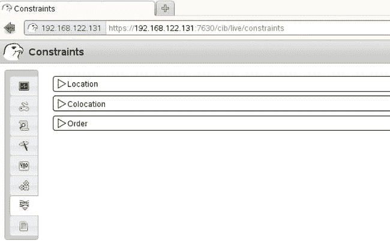
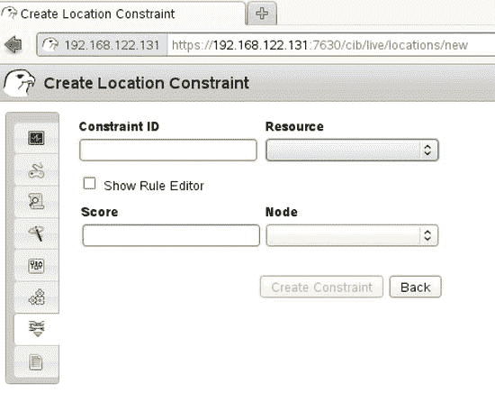
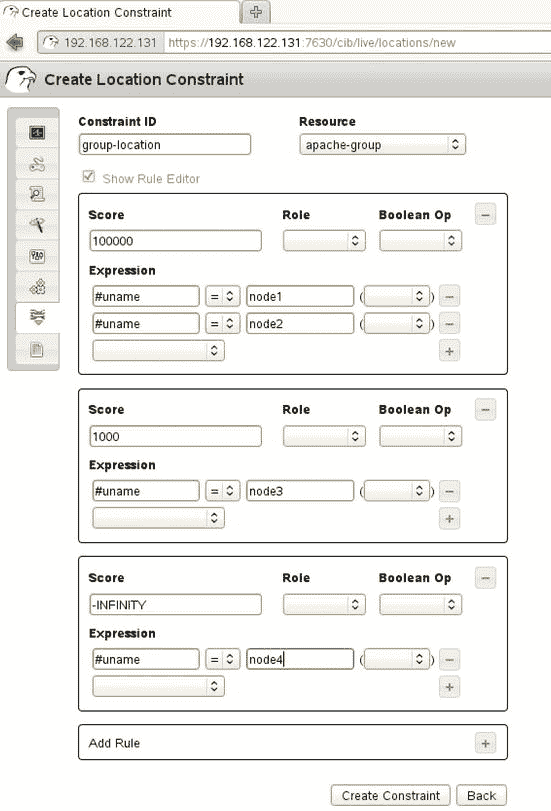

# 6.集群资源

至此，所有的先决条件都已满足，是时候开始创建一些集群资源了。在这一章中，你将读到如何创建一个基本的配置；在后面的章节中，您将学习如何使用更高级的参数。

## 是什么让集群资源与众不同

高可用性的目的是确保您的重要资源随时可用。为了实现这个目标，您必须确保资源不是由节点的 init 系统启动的，而是由集群管理的。这意味着您必须从 systemd 启用的服务中取出资源，这样集群就是唯一负责启动它们的软件。

启动资源的方法有很多种。一个简单的集群可以启动一个服务，而不需要任何进一步的依赖。但是你必须尽快处理依赖需求。这就像在本地机器上启动资源，例如，您必须注意在使用这些文件系统的服务之前加载文件系统。在集群上，这没什么不同。在接下来的部分中，我们将解决 Apache 文件服务器集群的问题。

### 集群化 Apache 文件服务器

在第一个例子中，您将学习如何集群一个典型的 Apache web 服务。这里讨论的方法不仅仅适用于 Apache web 服务；它也适用于其他服务。所以，即使你不需要 Apache，但需要其他东西——比如数据库——请阅读本章，了解如何在集群环境中设置资源。

#### 了解资源代理

要在集群中配置 Apache，您必须确保 Apache 服务可以到达，无论它在哪里运行。这意味着仅仅对 Apache web 服务进行集群化是不够的，因为无论它在哪里运行，web 服务都必须可以通过相同的 IP 地址进行访问，并且它必须能够访问其文档根目录中的相同文件。通常，这意味着您必须创建三个资源:一个 IP 地址、一个文件系统和一个 web 服务。接下来，您必须配置一个组，该组将把所有这些资源保存在一起，不管它们在集群中的什么位置被激活。

要创建资源，您需要资源代理(RAs)。资源代理类似于服务加载脚本，因为它们在 System-V 运行级别中使用，但也是包含集群参数的服务脚本。资源代理随集群一起安装，它们被细分为不同的类。

*   `service`:这些资源代理用于管理集群中的 systemd 服务脚本。与 LSB 脚本一样，如果存在 OCF 替代方案，您最好避免使用它们。
*   如前所述，这些是 STONITH 的代理人。虽然它们被配置为原语，但它们不是资源代理。它们使用完全不同的应用程序编程接口(API ),有着不同的用途。

*   `lsb` : LSB (Linux Standard Base)资源代理是可以从集群启动的 system V init 脚本。这些脚本不是随群集安装的，而是随操作系统本身安装的。当浏览这些时，您将只看到一个在`/etc/init.d`目录中的所有脚本的列表。它们不包含任何集群信息，因此应该只在没有真正的集群资源代理可用时使用。注意，在使用 systemd 的现代服务器上，您不会看到很多 LSB 服务。
*   OCF(开放集群框架)资源代理看起来很像 LSB 脚本，但是它们有与集群相关的特定参数。它们通常还包含通常存储在配置文件中的属性。通过将这些属性存储在资源代理的配置中，可以很容易地在必须运行资源代理的节点上使用它们。如果您可以在 OCF 和 LSB 资源代理之间进行选择，您应该始终使用 OCF 资源代理。OCF 脚本来自不同的来源，因此，您会发现 OCF RAs 按照其“提供者”有一个细分
    *   `heartbeat`:这些是主资源代理包提供的资源代理。(该提供商的名称具有历史内涵，因为代理最初是与 Heartbeat 项目一起打包的。)
    *   `linbit`:这些是用于设置分布式复制块设备(DRBD)和相关配置的 RAs。阅读第 9 章中使用 DRBD 的例子。
    *   `lvm2`:设置集群 LVM 逻辑卷所需的一些 RAs
    *   `OCFS2`:设置 OCFS2 集群共享文件系统需要的一些 ra。详见第 7 章。
    *   `pacemaker`:这包含了 Pacemaker 项目附带的资源代理。
    *   其他“提供商”名称也是可能的，因为第三方可能会将他们自己的代理与他们的软件一起提供。

## 创建资源

向群集中添加资源时，使用正确的参数可能会很困难。在下面的过程中，您将学习如何从`crm` shell 中发现参数，以及如何根据您发现的参数向集群添加资源。创建单个资源后，接下来您将学习如何将它们连接到一个组中。在继续之前，请确保在共享存储设备上安装了 Apache 并创建了文件系统。

Note

在群集任何东西之前，确保软件对群集中的所有节点都可用。您可以通过在集群中设置一个共享文件系统并在该共享文件系统上安装二进制文件来解决这个问题(阅读下一章了解如何做的更多细节)。或者，您可以将二进制文件安装在所有需要运行它们的集群节点上。

*   `ip`:将要用于您添加到集群的资源的 IP 地址。
*   `cidr_netmask`:您的 IP 网络中使用的 cidr 网络掩码，即 24，而不是 255.255.255.0

Log in to one of the cluster nodes, either as user root or as user hacluster.   Type the `crm` command and then `ra`. From there, type `list ocf`, to display a list of all OCF resource agents. Browse through the list and verify that you see the `IPaddr2`, `Filesystem`, and `apache` resource agents.   Still from the `crm ra` environment, type `meta IPaddr2`, to show a list of parameters that can be used by the `IPaddr` resource agents. Listing 6-1 shows what the output of this command may look like. With this procedure, we are going to use the following parameters. Read through the explanation of how to use these resource agents.  

清单 6-1。显示 RA 属性

`Manages virtual IPv4 addresses (Linux specific version) (ocf:heartbeat:IPaddr2)`

`This Linux-specific resource manages IP alias IP addresses.`

`It can add an IP alias, or remove one.`

`In addition, it can implement Cluster Alias IP functionality`

`if invoked as a clone resource.`

`Parameters (* denotes required, [] the default):`

`ip* (string): IPv4 address`

`The IPv4 address to be configured in dotted quad notation, for example`

`"192.168.1.1".`

`nic (string): Network interface`

`The base network interface on which the IP address will be brought`

`online.`

`If left empty, the script will try and determine this from the`

`routing table.`

`Do NOT specify an alias interface in the form eth0:1 or anything here;`

`rather, specify the base interface only.`

`Prerequisite:`

`There must be at least one static IP address, which is not managed by`

`the cluster, assigned to the network interface.`

`If you can not assign any static IP address on the interface,`

`modify this kernel parameter:`

`sysctl -w net.ipv4.conf.all.promote_secondaries=1`

`(or per device)`

*   `device`:这是您想要挂载的块设备的名称。确保选择一个持久的名称。像`/dev/sdb`这样的设备名称是动态生成的，可能会改变。最好使用基于不会改变的设备属性的名称，比如在`/dev/disk`目录中创建的名称。
*   `directory`:这是你要挂载共享存储设备的目录。在 Apache web 服务器的情况下，使用 Apache 配置文件中的 DocumentRoot 节作为目录是有意义的(在 SUSE 上使用`/srv/www/htdocs`，在 Red Hat 上使用`/var/www/html`)。请注意，通常情况下，建议使用特定的实例，而不是系统范围的 web 服务器。
*   `fstype`:这是您用来格式化共享存储设备的文件系统类型。

You now have to find out the attributes for the file system. Still from the `crm ra` environment, type `meta Filesystem` and read the help that is provided. To create a resource for the file system on the shared storage device, you’ll have to use the following parameters:  

如您所见，您将用来创建文件系统资源的参数与手动挂载文件系统时使用的参数是相同的。

Next, you must find the properties that are going to be assigned to the `apache` OCF resource. From the `crm resource` prompt, if you use `meta ocf:apache` to display a list of parameters, you’ll notice that there are no mandatory parameters for this resource. You’ll also notice that many parameters can be managed by the cluster, such as the Apache configuration file. This is useful if you want to take out certain parameters from the regular location and store it on the shared storage device.  

在最终选择 Apache 资源之前，您应该考虑有两种方法可以创建该资源。您可以使用 OCF 资源，也可以使用 LSB 或服务资源。区别在于，OCF 资源管理集群中的许多 Apache 属性，而 LSB(服务资源)只能启动和停止资源。

Based on the information you’ve received in the previous three steps, you can now add the resources and their configuration to the cluster. So, enter the command `crm configure edit` and add configuration to the end of the configuration file, as in Listing 6-2.  

清单 6-2。将 Apache 服务器的资源添加到集群

`primitive fs-apache ocf:heartbeat:Filesystem \`

`params fstype="xfs" device="/dev/sda1" directory="/srv/www/htdocs" \`

`op stop interval="0" timeout="60" \`

`op start interval="0" timeout="60" \`

`op monitor interval="20" timeout="40" \`

`meta target-role="Started"`

`primitive ip-apache ocf:heartbeat:IPaddr2 \`

`params cidr_netmask="24" ip="192.168.122.40" \`

`op stop interval="0" timeout="20s" \`

`op start interval="0" timeout="20s" \`

`op monitor interval="10s" timeout="20s"`

`primitive service-apache-1 ocf:heartbeat:apache \`

`op stop interval="0" timeout="60" \`

`op start interval="0" timeout="60" \`

`op monitor interval="20" timeout="40"`

After adding the configuration to the cluster, type `crm_mon`, to verify that the resource is properly activated. If you’re having problems activating the resources in the cluster, read [Chapter 8](08.html), for tips about troubleshooting. If all is well, the `crm_mon` output should look like Listing 6-3\. Note that this is not the recommended way of setting things up, because there are dependencies between the different primitives. To make sure all comes up in the right order, use grouping, as explained later in this chapter.  

清单 6-3。验证资源加载成功

`============`

`Last updated: Sat Apr 26 06:32:51 2014`

`Last change: Sat Apr 26 06:29:53 2014 by hacluster via crmd on node2`

`Stack: openais`

`Current DC: node1 - partition with quorum`

`Version: 1.1.6-b988976485d15cb702c9307df55512d323831a5e`

`2 Nodes configured, 2 expected votes`

`4 Resources configured.`

`============`

`Online: [ node1 node2 ]`

`kvm-stonith       (stonith:external/libvirt):     Started node1`

`ip-apache         (ocf::heartbeat:IPaddr2):       Started node2`

`fs-apache         (ocf::heartbeat:Filesystem):    Started node1`

`service-apache-1  (ocf::heartbeat:apache):        Started node2`

在前面过程的示例代码中，您可以看到资源定义由几行组成。第一行定义了资源的名称和必须使用的资源代理。接下来是定义资源参数的一行，比如 IP 地址的`cidr_netmask`和`ip`地址参数。接下来是定义该资源应该使用的操作的三行代码。这些定义了应该如何停止、启动和监控资源。

请注意，可以从命令行逐个输入资源，而不是在编辑器界面中输入配置。这提供了这样的优点，即制表符补全提供了进一步的参数和关于任何特定参数含义的帮助。但是，如果您希望新的配置能够基于配置中的现有行，您可能更适合使用编辑器界面，正如这里所讨论的那样。

### 定义操作

在向群集中添加资源时，正确定义资源的启动、停止和监控方式非常重要。如果一个资源正常情况下需要时间来启动，那么您也需要在集群中给它适当的时间。这是通过定义停止和启动资源的超时来实现的。以下两行给资源 60 秒的启动时间和 60 秒的停止时间:

`op stop interval="0" timeout="60" \`

`op start interval="0" timeout="60" \`

如果资源无法在启动超时间隔内启动，群集将得出资源没有在此节点上运行的结论，并尝试在其他地方启动它。(这种行为可以通过调整`start-is-fatal`属性来修改。此外，它将首先停止资源。)如果资源没有在 60 秒的超时时间内停止，默认情况下，群集将通过 STONITH 强制其停止，并带来所有相关的可能负面后果。因此，通过将资源作为独立应用程序在集群之外启动，来测量启动和停止资源所花费的时间是非常重要的。接下来，确保您的集群有足够的时间来遵守这些超时值！

另一个重要的操作是监视器操作。这定义了群集检查资源是否仍然可用的频率。超时定义了群集在尝试第一个监视操作之前应该等待的时间。时间间隔定义了群集每隔多少秒(或多少分钟或多少小时)检查一次资源是否仍然可用。如果您需要您的集群响应迅速，请确保使用低间隔值。

## 资源分组

如果资源应该总是在一起，你必须告诉集群。如果您不告诉集群任何事情，它将对资源进行负载平衡。这意味着它将在集群中的节点之间平均分配资源。在前面的过程中，您为 IP 地址、文件系统和 Apache web 服务添加了资源。现在让我们看看他们当前的状态会是什么样子(见清单 6-4)。

清单 6-4。显示当前资源状态

`Last updated: Tue Feb  4 13:03:02 2014`

`Last change: Tue Feb  4 13:02:57 2014 by root via cibadmin on node2`

`Stack: classic openais (with plugin)`

`Current DC: node1 - partition with quorum`

`Version: 1.1.9-2db99f1`

`2 Nodes configured, 2 expected votes`

`4 Resources configured.`

`Online: [ node1 node2 ]`

`stonith-libvirt   (stonith:external/libvirt):     Started node1`

`ip-apache         (ocf::heartbeat:IPaddr2):       Started node2`

`fs-apache         (ocf::heartbeat:Filesystem):    Started node1`

`service-apache-1  (ocf::heartbeat:apache):        Started node1`

失败的操作:

`service-apache-1_start_0 (node=node2, call=26, rc=5, status=complete): not i`

`nstalled`

如您所见，IP 地址由 node1 托管，而文件系统和 Apache 服务由 node2 托管。这意味着所有的连接都来自一个没有 Apache 服务支持的 IP 地址。因此，这种配置是行不通的，因为所有的资源都应该放在一起！

有两种解决方案可以确保资源始终在一起。最简单和推荐的解决方案是与团队合作。组中的资源总是保存在同一个节点上，并且它们也将按照在组中列出的顺序启动。对于我们的 Apache web 服务，这也很重要，因为在 Apache 服务启动时，IP 地址和文件系统必须是可用的。创建群组相对容易。您只需在集群配置中添加一行代码，在该配置中您定义了组名和想要放入组中的资源名。

Make sure you are logged in as root or user hacluster on one of the cluster nodes.   Type `crm configure edit` and add the following line:  

`group apache-group ip-apache fs-apache service-apache-1`

或者，您可以直接从命令行键入`crm configure group apache-group ip-apache fs-apache service-apache-1`。当直接从命令行输入时，您可以对组成员使用`tab-completion`。

Close the editor to save and apply the changes and use `crm_mon` to verify that the resources are now started from a resource group. In the output of `crm_mon`, you can see the name of the group, as well as the resources that are configured in that group (see Listing 6-5).  

清单 6-5。监控组中的资源

`============`

`Last updated: Sat Apr 26 06:36:53 2014`

`Last change: Sat Apr 26 06:35:55 2014 by root via cibadmin on node1`

`Stack: openais`

`Current DC: node1 - partition with quorum`

`Version: 1.1.6-b988976485d15cb702c9307df55512d323831a5e`

`2 Nodes configured, 2 expected votes`

`4 Resources configured.`

`============`

`Online: [ node1 node2 ]`

`kvm-stonith     (stonith:external/libvirt):       Started node1`

`Resource Group: apache-group`

`ip-apache  (ocf::heartbeat:IPaddr2):         Started node2`

`fs-apache  (ocf::heartbeat:Filesystem):      Started node2`

`service-apache-1   (ocf::heartbeat:apache):  Started node2`

## 使用约束

资源组是将资源放在一起的一种便捷方式。然而，如果你有一个复杂的依赖关系，一个组并不是最好的定义方式。如果依赖关系变得越来越复杂，你最好使用约束。约束是一组定义如何加载资源的规则。

### 约束类型

随着时间的推移，添加了一些不太常见的约束类型，但最重要的约束类型如下:

*   位置:位置约束定义了应该在哪个服务器上加载资源。您还可以使用它来定义可能永远不会加载资源的位置。
*   协同定位:协同定位约束用于定义哪些特定的资源应该一起加载，或者说，它们不应该一起加载。
*   订单:订单约束用于定义特定的订单。订单约束隐含在资源组中，但是使用订单约束可能更方便，因为您可以在不同类型的资源之间定义它们。例如，您可以定义一个资源组只能在某个特定的原语被首先加载之后才能被加载。

### 了解分数

使用约束时，可以定义优先级。为了定义优先级，使用分数。对于每个约束，可以使用从-1，000，000 (-INFINITY)到 INFINITY (1，000，000)之间的任何值。

要表达你永远不希望某个动作被执行，可以用负分。任何小于 0 的分数都将禁止节点使用该资源。

让我们看一个样本集群来更好地理解这一点。在示例集群中，使用了四个节点:节点 1、节点 2、节点 3 和节点 4。您希望在 node1 或 node2 上优先加载名为 db-group 的资源组。如果不能在任何一个节点上加载，则应该在节点 3 上加载，但绝不应该在节点 4 上加载。为了用分数表示这一点，可以给节点 1 和节点 2 分配 100，000 的分数，给节点 3 分配 1，000 的分数，给节点 4 分配-无穷大的分数。

当然，您可以从`crm` shell 创建约束，但是由于语法可能有点复杂，我建议使用 Hawk 接口来定义它们。下面的过程解释了如何做到这一点。

Log in to the Hawk interface, and from the button bar on the left, click Constraints. This will show the three different constraints that are available.   Select Location and click + to add a new constraint. This opens the interface that you can see in Figure [6-1](#Fig1).  Enter a constraints ID, and from the Resource drop-down list, select the `apache-group` you’ve just created.   At this point, you can simply enter a score and the node where you want this resource to be running on, but you can also add a more complex constraint, by selecting the Show Rule Editor box. This opens a new interface that you can see in Figure [6-2](#Fig2). If you want to configure more complex constraints, you need the rule editor. Let’s assume we want the `apache-group` to have a preference for node1 and node2, and, only if it’s not possible to run it on these, it should run on node3, and at the same time, it should never run on node4.  

图 6-1。

Creating new constraintsIn the rule editor, enter a score of 100000 and then define the expression `#uname` (which refers to the kernel node name of the node), `= node1`. If you would like to add another node with the same score, you can specify this node directly under the first expression (see Figure [6-3](#Fig3)).   To add a node with a lower score, click + and enter a score of 1000\. Now add the expression for node3\. Next, you can add another rule with a score of -INFINITY that relates to node4.  

图 6-2。

Working with the constraint rule editor

图 6-3。

Configuring complex constraints

创建约束后，在`crm`配置编辑界面也可以看到，您可以在以下界面随意修改:

`location group-location apache-group \`

`rule $id="group-location-rule" 100000: #uname eq node1 and #uname eq node2 \`

`rule $id="group-location-rule-0" 1000: #uname eq node3 \`

`rule $id="group-location-rule-1" -inf: #uname eq node4`

注意，在前面讨论的例子中，使用了位置约束。在许多情况下，使用这些是没有必要的。如果节点是对称的，集群可以自己找出如何放置资源。或者，可以使用利用率参数来做出布局决策。在这些情况下，可以用利用率信息来配置节点和资源。

在更复杂的设置中，用户可能必须指定排序和协同定位，以及可能的资源优先级，以仲裁容量短缺或非协同定位资源之间的冲突。

## 测试配置

此时，是时候对配置进行测试了。如果当前托管 Apache 组的节点出现故障，另一个节点应该会自动接管，故障节点应该通过 STONITH 操作终止。

Make sure you can see the console of both nodes and find out where the `apache-group` is currently running. Log in as root on the other node and start the command `crm_mon` here.   On the node that currently hosts the `apache-group`, use the command `echo c > /proc/sysrq-trigger` to crash the node. Watch what is happening in `crm_mon`. You should see that the resources are migrated over to the other node.   At the moment the failing node comes back, you will see it appearing in the cluster, and you’ll notice that the resource group automatically fails back to the original node.  

通常，此时您的集群应该工作正常。如果没有，请阅读第 8 章中的[，其中您将找到一些重要的故障排除技巧。](08.html)

## 了解资源代理脚本

在本章的前几节中，您已经学习了如何在集群中创建资源。这些资源背后是资源代理，资源代理是告诉集群如何处理集群服务的脚本。OCF 资源代理是一个 shell 脚本，包含一些 XML 代码，作为管理员，您可以自己创建这些脚本。在这一节中，我们将探索 RA 脚本的结构，以帮助您开发自己的 RA。

为了理解资源代理脚本是如何制作的，虚拟 RA 提供了一个不太长的很好的例子。使用`find / -name "Dummy"`找到准确位置(SUSE 上的`/usr/lib/ocf/resource.d/heartbeat/Dummy`)。在清单 6-6 中，你可以看到它的内容是什么样子的(稍微整理了一下，以免太长)。

清单 6-6。RA 脚本示例

`node1:/usr/lib/ocf/resource.d/heartbeat # cat Dummy`

`#!/bin/sh`

`#`

`#`

`#        Dummy OCF RA. Does nothing but wait a few seconds, can be`

`#        configured to fail occasionally.`

`#`

`e`是`e`

`#                    All Rights Reserved.`

`#`

`# This program is free software; you can redistribute it and/or modify`

`# it under the terms of version 2 of the GNU General Public License as`

`# published by the Free Software Foundation.`

`#`

`....`

`#######################################################################`

`# Initialization:`

`: ${OCF_FUNCTIONS_DIR=${OCF_ROOT}/lib/heartbeat}`

`. ${OCF_FUNCTIONS_DIR}/ocf-shellfuncs`

`#######################################################################`

`meta_data() {`

`cat <<END`

`<?xml version="1.0"?>`

`<!DOCTYPE resource-agent SYSTEM "ra-api-1.dtd">`

`<resource-agent name="Dummy" version="0.9">`

`<version>1.0</version>`

`<longdesc lang="en">`

`This is a Dummy Resource Agent. It does absolutely nothing except`

`keep track of whether its running or not.`

`Its purpose in life is for testing and to serve as a template for RA writers.`

`NB: Please pay attention to the timeouts specified in the actions`

`section below. They should be meaningful for the kind of resource`

`the agent manages. They should be the minimum advised timeouts,`

`but they shouldn't/cannot cover _all_ possible resource`

`instances. So, try to be neither overly generous nor too stingy,`

`but moderate. The minimum timeouts should never be below 10 seconds.`

`</longdesc>`

`<shortdesc lang="en">Example stateless resource agent</shortdesc>`

`<parameters>`

`<parameter name="state" unique="1">`

`<longdesc lang="en">`

`Location to store the resource state in.`

`</longdesc>`

`<shortdesc lang="en">State file</shortdesc>`

`<content type="string" default="${HA_RSCTMP}/Dummy-${OCF_RESOURCE_INSTANCE}.state" />`

`</parameter>`

`<parameter name="fake" unique="0">`

`<longdesc lang="en">`

`Fake attribute that can be changed to cause a reload`

`</longdesc>`

`<shortdesc lang="en">Fake attribute that can be changed to cause a reload</shortdesc>`

`<content type="string" default="dummy" />`

`</parameter>`

`</parameters>`

`<actions>`

`<action name="start"         timeout="20" />`

`<action name="stop"          timeout="20" />`

`<action name="monitor"       timeout="20" interval="10" depth="0" />`

`<action name="reload"        timeout="20" />`

`<action name="migrate_to"    timeout="20" />`

`<action name="migrate_from"  timeout="20" />`

`<action name="meta-data"     timeout="5" />`

`<action name="validate-all"  timeout="20" />`

`</actions>`

`</resource-agent>`

`END`

`}`

`#######################################################################`

`dummy_usage() {`

`cat <<END`

`usage: $0 {start|stop|monitor|migrate_to|migrate_from|validate-all|meta-data}`

希望有一个完全符合 OCF RA 标准的环境集。

`END`

`}`

`dummy_start() {`

`dummy_monitor`

`if [ $? =  $OCF_SUCCESS ]; then`

`return $OCF_SUCCESS`

`fi`

`touch ${OCF_RESKEY_state}`

`}`

`dummy_stop() {`

`dummy_monitor`

`if [ $? =  $OCF_SUCCESS ]; then`

`rm ${OCF_RESKEY_state}`

`fi`

`return $OCF_SUCCESS`

`}`

`dummy_monitor() {`

`# Monitor _MUST!_ differentiate correctly between running`

`# (SUCCESS), failed (ERROR) or _cleanly_ stopped (NOT RUNNING).`

`# That is THREE states, not just yes/no.`

`if [ -f ${OCF_RESKEY_state} ]; then`

`return $OCF_SUCCESS`

`fi`

`if false ; then`

`return $OCF_ERR_GENERIC`

`fi`

`return $OCF_NOT_RUNNING`

`}`

`dummy_validate() {`

`# Is the state directory writable?`

`state_dir=`dirname "$OCF_RESKEY_state"``

`touch "$state_dir/$$"`

`if [ $? != 0 ]; then`

`return $OCF_ERR_ARGS`

`fi`

`rm "$state_dir/$$"`

`return $OCF_SUCCESS`

`}`

`: ${OCF_RESKEY_state=${HA_RSCTMP}/Dummy-${OCF_RESOURCE_INSTANCE}.state}`

`: ${OCF_RESKEY_fake="dummy"}`

`case $__OCF_ACTION in`

`meta-data)      meta_data`

`exit $OCF_SUCCESS`

`;;`

`start)          dummy_start;;`

`stop)           dummy_stop;;`

`monitor)        dummy_monitor;;`

`migrate_to)     ocf_log info "Migrating ${OCF_RESOURCE_INSTANCE} to ${OCF_RESKEY_CRM_meta_migrate_target}."`

`dummy_stop`

`;;`

`migrate_from)   ocf_log info "Migrating ${OCF_RESOURCE_INSTANCE} from ${OCF_RESKEY_CRM_meta_migrate_source}."`

`dummy_start`

`;;`

`reload)         ocf_log info "Reloading ${OCF_RESOURCE_INSTANCE} ..."`

`;;`

`validate-all)   dummy_validate;;`

`usage|help)     dummy_usage`

`exit $OCF_SUCCESS`

`;;`

`*)              dummy_usage`

`exit $OCF_ERR_UNIMPLEMENTED`

`;;`

`esac`

`rc=$?`

`ocf_log debug "${OCF_RESOURCE_INSTANCE} $__OCF_ACTION : $rc"`

`exit $rc`

如您所见，该脚本由几个部分组成。在第一部分中，调用一个名为`ocf-shellfuncs`的包含文件。这个输入脚本文件定义了几个在 OCF 脚本中可用的函数。如果你想写你自己的 RA 脚本，确保它被包括在内。

其次，有一个包含元数据的稍长的部分。该元数据是 XML 格式的，并且是使用诸如`crm ra meta`之类的命令时显示的内容。如果没有另外定义，它还包含用于该资源类型的默认值。

接下来，定义有效的参数。可以看到，定义了`start`和`stop`这样的常见参数。此外，这里还定义了特定于集群的变量。在脚本的后面，这些参数在 bash 函数中被进一步定义，任务应该在调用这些动作之一时完成。脚本的最后一部分定义了一个`case`循环，在这里可以调用所有的参数。

如您所见，RA 脚本的构造方式并不复杂。只要确保它包含前面描述的部分，您就可以集群化任何您想要的东西。如果您必须创建自己的 RA 脚本，那么从作为示例的虚拟脚本开始，并逐步提供您需要的所有功能是一个好主意。关于开发资源代理的更多信息，我推荐你参考 Florian Haas 在 [`www.linux-ha.org/doc/dev-guides/ra-dev-guide.html`](http://www.linux-ha.org/doc/dev-guides/ra-dev-guide.html) 写的《OCF 资源代理开发者指南》。

## 摘要

在本章中，您已经学习了如何使用集群中的资源。您已经学习了如何创建原语，以及如何将几个原语放在一个组资源中。您还了解了如何使用约束来定义原语之间的复杂规则。在下一章中，您将学习如何在集群环境中使用存储。