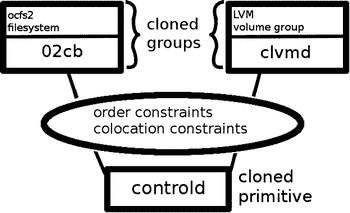
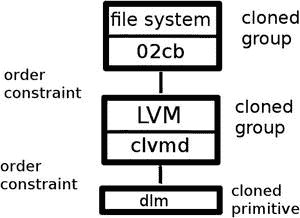

# 七、集群化存储

当使用服务的集群资源时，这些服务通常也需要访问文件。在集群环境中，您可以使用`filesystem`资源在需要的节点上运行文件系统挂载。然而，集群文件系统还有更多。在本章中，您将学习如何为共享文件系统配置集群。

## 使用集群文件系统

在某些情况下，使用支持集群的文件系统是有意义的。支持集群的文件系统的目的是允许多个节点同时写入文件系统。SUSE Linux Enterprise Server 上的默认集群感知文件系统是 OCFS2，而在 Red Hat 上，它是全局文件系统(GFS) 2。文件系统通过在立即运行`filesystem`资源的节点之间同步缓存来做到这一点，这意味着每个节点总是拥有文件系统上正在发生的事情的实际状态。

要创建支持集群的文件系统，您需要两个支持服务。第一个是分布式锁管理器`dlm`。第二个是`o2cb`，负责 OCFS2 文件系统与集群的通信。(注意，对于启动 SLES 12，只需要 DLM 服务，而不再需要 o2cb 服务。)与 OCFS2 文件系统本身一样，这些资源必须在需要访问文件系统的所有节点上启动。Pacemaker 为此提供了克隆资源。Clone resorts 可以应用于必须在多个节点上同时激活的任何资源。

尽管支持集群的文件系统听起来很有用，但并不是在所有情况下都需要它们。通常，您会在主动/主动场景中需要它们，在这种场景中，同一资源的多个实例运行在多个节点上，并且都是主动的。如果您只想同时运行一个资源实例，则不必创建集群文件系统。

除了好处之外，使用集群文件系统也有缺点。最大的缺点是缓存必须在所有相关节点之间同步。在许多情况下，这使得集群文件系统比独立文件系统慢，尤其是那些涉及大量元数据操作的文件系统。因为它们还在节点之间提供了更强的耦合，所以集群更难防止故障扩散。

人们通常认为，与本地节点文件系统相比，集群文件系统在故障转移时间方面具有优势，因为它已经被挂载。然而，这不是真的；在故障节点的隔离/STONITH 和日志恢复完成之前，文件系统仍处于暂停状态。这将冻结所有节点上的集群文件系统。它实际上是一组独立的本地文件系统，提供了更高的可用性！应该在需要的地方使用集群文件系统，但是必须经过仔细的规划。

## 配置 OCFS2 文件系统

在进入细节之前，最好对创建 OCFS2 文件系统必须遵循的过程有一个总体的了解。程序大致如下:

Create a resource group containing the `dlm` and `o2cb` resources.   Put this group in a `clone` resource, to ensure that it runs on multiple nodes.   Start the resource on all nodes that have to use the cluster file system.   Use `mkfs.ocfs2` to format the OCFS2 file system.   Create a clone resource that also mounts the OCFS2 file system.  

### 了解克隆资源

使用集群文件系统时，必须在集群中的多个节点上启动文件系统。为了实现这一点，您需要一个特殊的资源类型:`clone`资源类型。和克隆人一起工作并不困难。您将首先创建原语资源，然后配置一个克隆来同时在多个节点上运行原语。创建克隆时，您将定义指定资源启动频率的属性。

OCFS2 文件系统依赖于必须在每个 OCFS2 节点上加载的两个通用进程。第一个是分布式锁管理器控制守护进程。这是将被创建为`clone`资源的`dlm`受控流程。cLVM2(请参阅本章后面的内容)和 OCFS2 使用该进程，它协调集群节点之间的锁。

OCFS2 依赖的第二个进程是`o2cb`，OCFS2 集群基。这是告诉 OCFS2 如何找到集群的软件。在这种情况下，使用了一个`pacemaker`集群，但是 OCFS2 也可以配置自己的集群堆栈。如果是这种情况，`o2cb`告诉 OCFS2 文件系统如何找到那个集群。

Note

OCFS2 的默认配置是使用自己的集群堆栈。如果您不小心格式化了 OCFS2 文件系统，而`o2cb`模块不存在，您将收到一个集群通信错误。要解决这个问题，您可以使用`tune2fs.ocfs2`命令。如果这不起作用，当`o2cb`模块运行时，您将不得不再次格式化 OCFS2 文件系统。

下面描述了创建 OCFS2 文件系统资源的详细过程。

Type `crm configure edit` and add the following primitives:  

`primitive dlm ocf:pacemaker:controld \`

`op start interval="0" timeout="90" \`

`op stop interval="0" timeout="100" \`

`op monitor interval="10" timeout="20" start-delay="0"`

`primitive o2cb ocf:ocfs2:o2cb \`

`op stop interval="0" timeout="100" \`

`op start interval="0" timeout="90" \`

`op monitor interval="20" timeout="20"`

Create a group that contains the two primitives you’ve just added, by adding the following line as well:  

`group ocfs2-base-group dlm o2cb`

At this point, you can create a clone that contains the group and ensures that the primitives in the group are started on all nodes. While creating the clone, you can consider adding two parameters. The first is `clone-max`. This parameter tells the clone how many instances of the primitive(s) in the clone should be started. Using this parameter makes sense if you have more nodes in the cluster than the amount of nodes where you want this resource to be active on. If not set, `clone-max` defaults to the number of nodes in the cluster. The `clone-node-max` parameter tells the cluster how many instances of a primitive can run on one node. In most cases, you will probably want to set it to one, but on some occasions, it may make sense to run the primitives more than once. An important parameter to consider is `interleave="true"`. By setting this parameter, you make loading resources that have a dependency to some other resources easier. Imagine an order constraint where clone resource B is started after clone resource A. With the interleave setting to false, clone resource B would only start when all instances of resource A had been started. If you set interleave to `true`, instances of resource B can start loading before resource A has loaded everywhere. The final configuration for the clone with the OCFS2 supporting modules would look as follows:  

`clone ocfs2-base-clone ocfs2-base-group \`

`meta interleave="true"`

Write the changes and close the editor. This activates the cloned group immediately.   Type `crm_mon` to verify that the group has been started. The result should look as follows:  

`Last updated: Tue Feb  4 15:43:15 2014`

`Last change: Tue Feb  4 15:40:24 2014 by root via cibadmin on node1`

`Stack: classic openais (with plugin)`

`Current DC: node2 - partition with quorum`

`Version: 1.1.9-2db99f1`

`2 Nodes configured, 2 expected votes`

`8 Resources configured.`

`Online: [ node1 node2 ]`

`stonith-libvirt (stonith:external/libvirt):      Started node1`

`Resource Group: apache-group`

`ip-apache  (ocf::heartbeat:IPaddr2):        Started node1`

`fs-apache  (ocf::heartbeat:Filesystem):     Started node1`

`service-apache     (ocf::heartbeat:apache): Started node1`

`Clone Set: ocfs2-base-clone [ocfs2-base-group]`

`Started: [ node1 node2 ]`

As the components that are required to create an OCFS2 file system are operational, you can now proceed and create the OCFS2 file system. Note that you have two options here. By this procedure, you’ll create the OCFS2 file system directly on top of a shared disk device. It might make sense, however, to create an LVM2 sub-layer first. This makes it easier to change the size of the file system or to work with other advanced features that are offered by LVM2.  

确定要在其上创建文件系统的共享 SAN 磁盘。在这个磁盘上，使用`mkfs.ocfs2`命令`mkfs.ocfs2 /dev/sdb`。(注意，我在这里使用`/dev/sdb`只是为了便于阅读。使用基于`/dev/disk/...`中命名的设备名称，以确保设备被持久命名。)

Create a mount point for the file systems on all nodes involved: `mkdir /shared`.   Mount the file system on both nodes and write a file on both nodes. You’ll see that the file immediately becomes visible on the other node as well.   Use `crm configure edit` to add a primitive for the OCFS2 file system to the cluster. Note that you’ll add the file system by using a `filesystem` resource, as you have done previously when adding an Ext3 file system to the cluster.  

`primitive ocfs-fs ocf:heartbeat:Filesystem \`

`params fstype="ocfs2" device="/dev/disk/by-path/ip-192.168.1.125:3260-iscsi-iqn.2014-01.com.example:kiabi" directory="/shared" \`

`op stop interval="0" timeout="60" \`

`op start interval="0" timeout="60" \`

`op monitor interval="20" timeout="40"`

As this is an OCFS2 file system, you probably want to run it on multiple nodes. To do this, put the primitive you’ve just created in a clone, by adding the following lines to the configuration also:  

`clone ocfs-fs-clone ocfs-fs \`

`meta interleave="true"`

To tell the cluster that the `ocfs2-fs-clone` should only be started once the `ocfs2-base-clone` has successfully been started, you also have to add an order constraint.  

`order ocfs2-fs-after-ocfs-base Mandatory: ocfs2-base-clone ocfs-fs`

注意，在这种情况下，使用约束是定义`ocfs2-base`克隆和`ocfs2`克隆之间关系的唯一选项。这允许您定义进一步配置为独立资源的两个资源之间的关系。请注意顺序约束的语法。在定义它是一个顺序约束之后，指定一个名称，后面跟着分数。在顺序约束中使用分数是很重要的。我使用强制的约束设置来确保集群可以干净地停止。接下来，指定资源——按照它们应该被加载的顺序。

Save the changes and quit editing mode. The cloned file system has been added to the cluster, and you can now start running `active-active` resources on top of it.  

### 集群环境中的 LVM2

逻辑卷管理器(LVM2)为使用存储提供了一些优势。在集群环境中，也可以使用 LVM2，但是您必须使用集群 LVM2 来确保卷组和逻辑卷的状态在集群上正确同步。在本节中，您将学习如何设置 cLVM2。

要使用 cLVM2，您需要一些支持资源。第一个是`dlm`，您也可以用它来配置 OCFS2 文件系统。除此之外，您还需要`cLVM2d`，集群卷管理器守护进程。这个守护进程用于同步集群中的 LVM2 元数据。这些模块必须在将要提供由集群管理的 LVM2 卷访问的所有节点上可用。因为它们必须被同时加载到多个节点上，所以您必须为它们配置`clone`资源。

一旦支持模块可用，您就可以创建一个集群 LVM2 卷组。注意，克隆的是卷组，而不是 LVM2 逻辑卷，您必须首先在运行`dlm`和`cLVM2d`的一个节点的命令行上创建它。为卷组创建资源后，可以在集群中的任何节点上创建 LVM2 逻辑卷。

在 LVM2 级别创建这些对象后，您可以创建一个管理卷组的集群资源。您只需要卷组的这个资源，因为它是负责管理对其逻辑卷的集群访问的卷组。创建卷组时，您还可以决定是否将其配置为独占访问。默认情况下，集群中的所有节点都可以访问集群卷组，这使得在其上设置 OCFS2 这样的共享文件系统变得很容易。如果它配置为独占访问，则在使用时，它将对所有其他节点锁定。下面的过程描述了如何创建 cLVM2 设置。

Type `crm configure edit` and add the following code to the cluster configuration to add primitives for `cLVM2d` and `dlm`. Note that you only need to add the `dlm` primitive if you haven’t done that already in the preceding section.  

`primitive cLVM2-base ocf:LVM22:cLVM2d \`

`op start interval="0" timeout="90" \`

`op stop interval="0" timeout="100" \`

`op monitor interval="20" timeout="20"`

`primitive dlm ocf:pacemaker:controld \`

`op start interval="0" timeout="90" \`

`op stop interval="0" timeout="100" \`

`op monitor interval="10" timeout="20" start-delay="0"`

As the resources need to be configured as clones, you need to add the clones as well. Note that in the following sample code, the target-role is set to Stopped. This is because the `cLVM2-clone` can only be started after the `dlm-clone`. If you don’t do anything, the cluster will bring up the resources, and you risk the `cLVM2-clone` being started before the `dlm-clone`, in which case it fails. To prevent this, we’ll add it to the cluster in Stopped mode first and start the resource manually in the next step, to bring them up in the right order. As a permanent, fix we’ll add an order constraint later.  

`clone dlm-clone dlm \`

`meta target-role="Stopped" interleave="true"`

`clone cLVM2-clone cLVM2-base \`

`meta target-role="Stopped" interleave="true"`

Write and commit the changes to the cluster.   Type `crm resource start dlm-clone; crm resource start cLVM2-clone`. This should start both clones in the cluster. Don’t proceed before you have confirmed that the clones have indeed been started.  

`Last updated: Fri Feb  7 13:47:26 2014`

`Last change: Fri Feb  7 07:37:53 2014 by hacluster via crmd on node1`

`Stack: classic openais (with plugin)`

`Current DC: node2 - partition with quorum`

`Version: 1.1.9-2db99f1`

`2 Nodes configured, 2 expected votes`

`15 Resources configured.`

`Online: [ node1 node2 ]`

`ip-test              (ocf::heartbeat:IPaddr2):     Started node1`

`ip-test-encore       (ocf::heartbeat:IPaddr2):     Started node2`

`sbd-stonith          (stonith:external/sbd):       Started node1`

`Resource Group: apache-group`

`ip-apache       (ocf::heartbeat:IPaddr2):     Started node2`

`fs-apache       (ocf::heartbeat:Filesystem):  Started node2`

`service-apache  (ocf::heartbeat:apache):      Started node2`

`Clone Set: dlm-clone [dlm]`

`Started: [ node1 node2 ]`

`Clone Set: ocfs2-clone [ocfs2-group]`

`Started: [ node1 node2 ]`

Open the `file /etc/lvm/lvm.conf`. Look for the parameter `lock_mode` and make sure it has the value `3`.   At this point, you can create the LVM2 volume group on the command line of one of the nodes, with the cluster property enabled. The only requirement is that shared storage needs to be available. Assuming that the shared disk device is available on both nodes as `/dev/sdd`, use the following command to create the clustered volume group:  

`vgcreate -c y vgcluster /dev/sdd`

使用这个命令，您可以创建一个名为`vgcluster`的卷组，该卷组基于`/dev/sdd`共享磁盘设备。

您应该注意到，在这个示例中，使用了`/dev/sdd`设备名称。在这种情况下，那是没有问题的。`vgcreate`命令将元数据写入设备，当重启时将扫描这些元数据。即使设备名称发生变化，例如从`/dev/sdd`到`/dev/sde`，仍然会找到元数据，并且元数据中的`vg`名称不会改变。

Now you can create the LVM2 logical volume. To create an LVM2 volume that consumes all disk space that is available in the volume group, use the following command:  

`lvcreate -n lvcluster -l 100%FREE vgcluster`

Type `lvs` to verify that the volume group and the LVM2 logical volume have been created.  

`node2:∼ # lvs`

`LV        VG        Attr      LSize   Pool Origin Data%  Move Log Copy%  Convert`

`lvcluster vgcluster -wi-a---- 508.00m`

You now have to define a cluster resource that is going to manage access to the volume group. Use `crm configure edit vgcluster` and enter the following lines:  

`primitive vgcluster ocf:heartbeat:LVM2 \`

`params volgrpname="vgcluster" \`

`op start interval="0" timeout="30" \`

`op stop interval="0" timeout="30" \`

`op monitor interval="10" timeout="30"`

As the primitive that manages access to the clustered volume group needs to be available on all nodes where the logical volumes can be accessed, you have to put it in a clone before starting it. To do this, type `crm configure edit vgcluster-clone` and add the following lines:  

`clone vgcluster-clone vgcluster \`

`meta target-role="Started" interleave="true"`

Write and quit the cluster editor, which automatically commits the new volume group resource to the cluster. Type `crm resource status vgcluster-clone` to verify the current status of the newly created resource. If all went well, you’ll see that it has been started on both nodes.  

`node1:∼ #` `crm resource status vgcluster-clone`

`resource vgcluster-clone is running on: node1`

`resource vgcluster-clone is running on: node2`

Type `lvs` on both nodes to verify the availability of the logical volumes. You should see them listed on both nodes.  

在许多情况下，前面描述的过程可以很好地工作。有时不会(参见下面的代码清单)。

`Clone Set: vgcluster-clone [vgcluster]`

`Started: [ node2 ]`

`Stopped: [ vgcluster:1 ]`

失败的操作:

`vgcluster_start_0 (node=node1, call=68, rc=1, status=complete): unknown error`

如果发生了故障，您应该分析日志文件，找出故障发生的原因并修复它。分析错误并修复可能的原因后，您可以停止克隆，清除其状态，然后再次启动克隆。以下过程描述了如何做到这一点:

Type `crm resource stop vgcluster-clone` and wait for this to complete. Consider adding the option `-w` to the `crm` command, which has the `crm` wait for every preceding step to complete before going on to the next step.   Type `crm resource cleanup vgcluster-clone` to remove the current status attributes. This will remove the memory of the resource, which allows it to try to start on all nodes again, without having the memory that it was unsuccessful to start on some of them.   Use `crm start vgcluster-clone` to start the resource again.   Type `crm resource status vgcluster-clone` to verify the status of the resource. You should see it running without any errors on all of its nodes now.  

`node2:∼ #` `crm resource status vgcluster-clone`

`resource vgcluster-clone is running on: node2`

`resource vgcluster-clone is running on: node1`

此时，您将拥有工作资源。您可以开始在集群卷组中的 LVM2 卷上创建文件系统。但是，当您重新启动节点时，启动这些资源可能会失败。这是因为没有定义`cLVM2-clone`、`dlm-clone`和`vgcluster-clone`之间的启动顺序。

在上一节中，您已经了解到可以创建一个组来将资源放在一起，并按正确的顺序启动它们。在某些情况下，您不能将资源放在一个组中，并且需要约束来定义资源应该如何启动。

假设您有一个 OCFS2 文件系统，它直接配置在共享存储之上，如前一节所述。想象一下，在同一个集群中，除了 OCFS2 文件系统之外，您还需要访问集群逻辑卷。OCFS2 和 cLVM2 都要求 controld 在节点上运行。不幸的是，您不能将同一个原语放在多个组中。此外，您不能创建多个原语并在同一个节点上多次运行它们。您必须创建一个启动 controld 的克隆和两个组:一个用于 cLVM2 资源，一个用于 OCFS2 资源。(见图 [7-1](#Fig1) 。)接下来，您需要一个规则来定义必须首先启动 controld，然后才能启动组。

图 7-1。

Independent stacks configuration overview

### cLVM2 之上的 OCFS2

如前所述，OCFS2 文件系统有多种创建方式。将 OCFS2 放在 cLVM2 卷之上为管理存储提供了更多的选项，但这也使管理集群堆栈变得更加复杂。为了方便起见，图 [7-2](#Fig2) 给出了运行这种配置所必需的堆栈的概述。

图 7-2。

OCFS2 on top of cLVM2 stack overview

## 使用带 Pacemaker 的 GFS2

如果您在 Red Hat 集群上工作，GFS2 是默认的集群文件系统。在 Red Hat 集群中使用 GFS2 的过程稍有不同。首先要注意的是，GFS2 需要在 cLVM2 之上运行，而在 Red Hat Enterprise Linux 6 中，它只能在`cman`集群管理器之上运行。在第 5 章中，您将了解如何设置这个集群管理器。一旦集群 LVM2 卷在集群节点上可用，就可以在其上创建 GFS2 文件系统。默认的 Red Hat 过程超越了集群。这意味着您可以在一个集群节点上运行`mkfs.gfs2`,并在本地处理挂载:只需在`/etc/fstab`中放置一行挂载代码，以确保 GFS2 卷的正确挂载。

## 摘要

在本章中，您已经了解了如何使用集群文件系统配置集群，这些文件系统允许从多个节点同时对相同的文件进行主动/主动访问。您还了解了如何使用 cLVM2，这对独立的文件系统可能也很有用。在下一章，你将读到一些常见的集群管理任务。