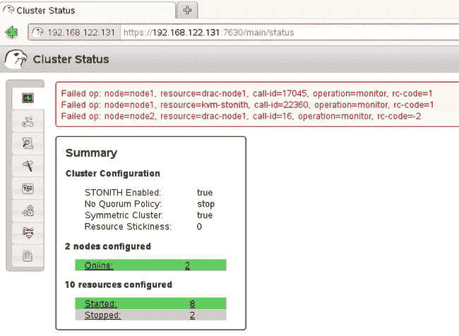
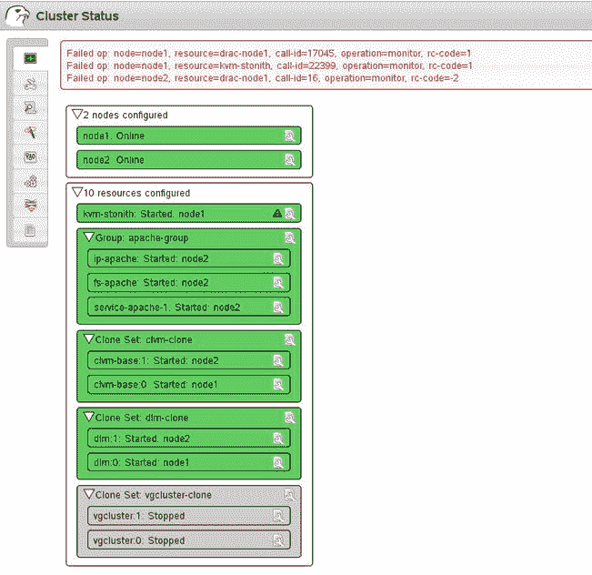
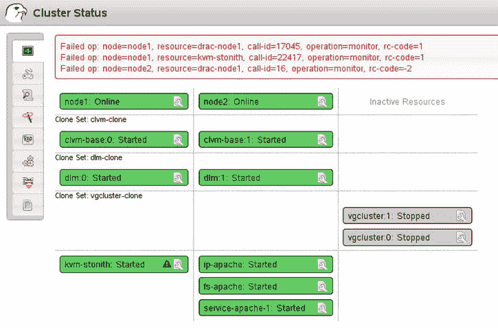

# 8.执行日常集群管理任务

此时，您的集群应该是可操作的。这意味着您作为集群管理员的工作可以开始了，您可以开始管理集群资源了。到目前为止，所有章节中的主题都是关于设计集群的。本章是关于管理集群的，它讨论了集群管理员可能必须执行的典型任务。讨论了以下任务:

*   启动和停止资源
*   监控资源状态
*   资源迁移
*   使用资源清理
*   管理节点
*   使用非管理模式和维护模式进行维护
*   了解日志文件
*   集群配置的备份和恢复
*   抹去一切，重新开始

## 启动和停止资源

最重要的日常集群管理任务是资源的启动和停止。许多管理员并不真正理解集群中资源的使用方式不同于在操作系统的本地实例上运行的资源。我经常看到有人试图使用`service stop resource`或`systemctl stop resource`来暂时停止一个资源。这是非常错误的！由于资源是由群集管理的，群集将看到资源已停止，并将立即再次启动它，因为这正是创建群集的目的！要管理资源的当前状态，应该使用集群命令，而不是本地命令。

启动和停止资源很容易，从`crm resource`界面，只需使用`start resourcename`或`stop resourcename`来启动或停止资源。使用这些命令时，将在集群中设置元目标角色属性。该属性确保资源的当前状态存储在集群中，这保证了如果集群的状态突然改变，资源会以完全相同的状态返回。这也会导致一些混乱。

想象一下这样一种情况，集群管理员正在对特定资源的当前状态进行故障排除。出于绝望，他选择使用`crm resource stop resourcename`将资源的当前状态设置为 stopped。后来，他发现没有什么真正有用的，他重新启动整个集群堆栈，只是发现这也没有用，资源仍然处于停止状态！所以，一定要记住，使用`crm resource start`和`crm resource stop`不仅仅是启动或停止资源，它还会改变资源的当前状态。因此，在某些情况下，您可能需要撤销它！

## 监控资源状态

这似乎是显而易见的，但是监视集群中资源的状态也是一项重要的任务。到目前为止，您一直使用`crm_mon`来监控集群的当前状态。`crm_mon`是一个有用的命令，因为它可以自动刷新，这使得它非常适合于监控。但并不是所有情况下都很理想。为了理解为什么，让我们看一下清单 8-1 和清单 8-2，它们都显示了同一个集群的当前状态。

清单 8-1。使用`crm_mon`监控集群状态

`Last updated: Sat Apr 26 11:35:47 2014`

`Last change: Sat Apr 26 11:32:22 2014 by root via cibadmin on node1`

`Stack: openais`

`Current DC: node1 - partition with quorum`

`Version: 1.1.6-b988976485d15cb702c9307df55512d323831a5e`

`2 Nodes configured, 2 expected votes`

`10 Resources configured.`

`============`

`Online: [ node1 node2 ]`

`kvm-stonith     (stonith:external/libvirt):       Started node1`

`Resource Group: apache-group`

`ip-apache  (ocf::heartbeat:IPaddr2):         Started node2`

`fs-apache  (ocf::heartbeat:Filesystem):      Started node2`

`service-apache-1   (ocf::heartbeat:apache):  Started node2`

`Clone Set: clvm-clone [clvm-base]`

`Started: [ node1 node2 ]`

`Clone Set: dlm-clone [dlm]`

`Started: [ node1 node2 ]`

`Failed actions:`

`drac-node1_monitor_3600000 (node=node1, call=17045, rc=1, status=complete):`

`unknown error`

`kvm-stonith_monitor_3600000 (node=node1, call=21424, rc=1, status=complete):`

`unknown error`

`drac-node1_monitor_3600000 (node=node2, call=16, rc=-2, status=Timed Out): unknown exec error`

如您所见，`crm_mon`给出了很多细节，包括集群的当前状态，以及集群中最近发生的错误(这可能会令人困惑，因为即使错误发生在很久以前，它仍然会显示出来)。

`crm status`也给出有用的信息。它显示资源在哪个(哪些)节点上启动，例如:

清单 8-2。使用`crm status`监控集群资源状态

`[root@node1 ∼]# crm status`

`Last updated: Mon Jun  9 14:15:12 2014`

`Last change: Wed May 28 11:54:21 2014 via crm_attribute on node1`

`Stack: classic openais (with plugin)`

`Current DC: node2 - partition with quorum`

`Version: 1.1.10-14.el6_5.2-368c726`

`2 Nodes configured, 2 expected votes`

`6 Resources configured`

`Online: [ node1 node2 ]`

`FenceSQ1 (stonith:fence_ipmilan): Started node2`

`Resource Group: mysql-group`

`mysql-ip  (ocf::heartbeat:IPaddr2): Started node2`

`mysql-fs  (ocf::heartbeat:Filesystem): Started node2`

`mysql-db  (ocf::heartbeat:mysql): Started node2`

`mysql-web (ocf::heartbeat:apache): Started node2`

`crm resource status`(见清单 8-3)命令没有显示那么多信息。许多人认为因为`crm_mon`提供了如此多的信息，它显示了您想知道的关于当前集群状态的一切。然而，有一条重要的信息丢失了。使用`crm_mon`，您看不到实际停止的资源，而`crm resource status`显示所有资源的状态，包括停止的资源。注意用`crm [resource] status`显示的信息也可以用`crm_mon`的适当选项显示。

清单 8-3。使用`crm resource status`监控集群资源状态

`node1:∼ #` `crm resource status`

`kvm-stonith        (stonith:external/libvirt) Started`

`Resource Group: apache-group`

`ip-apache        (ocf::heartbeat:IPaddr2) Started`

`fs-apache        (ocf::heartbeat:Filesystem) Started`

`service-apache-1 (ocf::heartbeat:apache) Started`

`Clone Set: clvm-clone [clvm-base]`

`Started: [ node1 node2 ]`

`Clone Set: dlm-clone [dlm]`

`Started: [ node1 node2 ]`

`Clone Set: vgcluster-clone [vgcluster]`

`Stopped: [ vgcluster:0 vgcluster:1 ]`

如果您喜欢图形界面，您还可以从 Hawk 监视当前的集群状态。在 Hawk 中，单击集群监视器图标，以监视集群的当前状态。默认视图给出了一般属性、配置的资源数量以及发生的错误数量的汇总(见图 [8-1](#Fig1) )。从这个界面，您可以单击链接，以获得更多详细信息。您还可以看到集群中最近发生的三个错误。请注意，这是一个历史概述；您可以看到很久以前就已经修复的错误消息。

图 8-1。

Monitoring cluster state from Hawk

Hawk 提供了三种不同的观点。如果您想查看集群中资源之间的关系，您可以通过屏幕右上方的按钮激活树视图。该视图给出了在组或克隆中配置的原语的层次关系的概述，但它没有显示通过使用约束定义的关系(见图 [8-2](#Fig2) )。

图 8-2。

The Hawk tree view shows relations between resources

如果你必须看到哪个资源在哪个节点上运行，你可以选择 Hawk 表视图，如图 [8-3](#Fig3) 所示。它以集群中的节点为起点，显示在这些节点上运行的所有资源。

图 8-3。

The Hawk table view helps in analyzing which resource is running on which node

## 资源迁移

当集群中的一个节点出现故障时，高可用性集群将采取措施。失败后，会在其他地方启动资源。该集群还可以自动迁移资源，以在不同的服务器之间实现负载平衡服务。默认情况下，群集会尝试在群集中的节点上均衡分配资源。这是默认行为，可以通过给资源粘性参数一个较高的正分值来更改。

如果您想准备维护，也可以执行手动迁移操作。通过迁移资源或资源组，您实际上对资源施加了位置约束，防止资源自动移回其原始位置。由于这种约束，您还应该始终取消资源迁移，或者手动删除位置约束，或者为约束指定一个“生存期”。这指定了约束应该保持多长时间，在此之后它将被自动删除。下一个过程展示了如何将`apache-group`资源迁移到 node1。

Type `crm resource status` to show a list of resources and their current status. Note that this doesn’t show you the actual node a resource is running on. The `crm_mon` command will do that, if you have to know.   Type `crm resource migrate apache-group node1` to migrate the `apache-group` to node1\. Alternatively, the command could be used without mentioning a target node, which follows the current constraint settings to determine where the resource should be migrated to.   Now type `crm_mon`, to verify that the migration was successful.   Type `crm configure show`, to display the contents of the current cluster configuration. Note that a location constraint was added to the cluster.  

`location cli-prefer-apache-group apache-group \`

`rule $id="cli-prefer-rule-apache-group" inf: #uname eq node1`

Close the editor interface and type `crm resource unmigrate apache-group`. This removes the location constraint and, depending on the current resource stickiness configuration, might move the resource back to its original location.  

在前面的示例中，您已经看到手动迁移操作对资源施加了位置限制。这些约束将会粘在资源上，直到您使用`crm resource unmigrate`命令将资源移回其原始位置。千万不要忘记这种行为，因为它可能会引起严重的麻烦。正如您在代码片段中看到的，已经放置的约束的分数为`inf:`，这是无穷大。这意味着，如果目标仍在运行，资源将永远不会后退。

## 使用资源清理

如果群集尝试启动某个节点上的资源，它可能会遇到问题，导致无法启动该节点上的资源。如果发生这种情况，集群会不断尝试，直到达到最大失败次数(这通常发生得很快)。达到最大失败次数后，群集将停止尝试。

从那时起，群集会记住它无法启动资源的位置，从而防止它稍后再次尝试。然而，这可能导致这样一种情况，即资源仍然认为它不能在其他地方启动，而问题很可能已经得到了解决。如果发生这种情况，您必须清理资源(或者等到失败属性自行清理)。通过对节点、资源或资源组应用清理操作，它将清除其内存中的故障，并尝试再次执行群集希望它执行的操作。在修复集群中的问题后，使用资源清理是一个非常常见和重要的操作。因此，简而言之，要采取的步骤如下:

After noticing the failure of a resource to start, fix the problem.   Perform a cleanup action.   Monitor to see if the cluster is capable of recovering automatically.  

以下过程显示了如何执行清理操作:

Open a `crm` shell.   Type `resource` to access the resource management interface.   Type `list` to show a list of the resources that are currently active.   Type `cleanup resourcename` to clean up the resource failure properties.   Wait a few seconds. The resource should automatically switch back to the state it should be in.  

## 管理节点

在集群中执行维护时，可能需要管理节点状态(见清单 8-4)。这应该总是从`crm node status`命令开始，该命令显示集群中所有节点的状态。

清单 8-4。监控节点状态

`crm(live)node# status`

`<nodes>`

`<node id="node1" type="normal" uname="node1">`

`<instance_attributes id="nodes-node1">`

`<nvpair id="nodes-node1-standby" name="standby" value="off"/>`

`</instance_attributes>`

`</node>`

`<node id="node2" type="normal" uname="node2">`

`<instance_attributes id="nodes-node2">`

`<nvpair id="nodes-node2-standby" name="standby" value="off"/>`

`</instance_attributes>`

`</node>`

`</nodes>`

如果您必须在一个节点上执行维护，但又不想关闭它，那么将该节点置于待机模式是很有用的。在这种模式下，该节点仍然算作仲裁，但它不会成为资源迁移的候选节点。要将节点置于待机模式，请使用`crm node standby nodename`命令。这会将`standby`属性添加到节点中。要使一个节点回到正常运行模式，您可以使用`crm node online nodename`。这并没有从 CIB 中删除 standby 属性，但是它会给这个属性赋值`off`，正如你在前面的清单 8-4 中看到的。

从“节点”菜单中，还可以执行其他一些操作。其中最有趣的是`fence`操作。这对于测试您的 STONITH 代理非常有用，因为该操作将立即尝试隔离有问题的节点。使用该选项时要小心，因为所选节点将被隔离，不再另行通知！

## 使用非管理模式和维护模式进行维护

在某些情况下，您必须升级集群软件。如果升级需要重新启动群集软件，您将暂时失去由群集管理的资源。在重新启动重要的群集组件之前，资源被移动到群集中的另一个节点。为了避免这种情况，您可以暂时取消对资源的管理。通过这样做，您将暂时在集群之外运行资源，就像它是在本地启动的一样。这意味着集群暂时不关心资源状态。这允许您在不停止集群堆栈上的所有资源的情况下关闭集群堆栈，如果您必须对集群软件执行升级，这是非常有益的。

一旦群集软件再次可用，您就可以管理资源，以便群集可以再次取得控制权。以下过程显示了如何做到这一点:

Type `crm` to open the `crm` shell.   Type `resource`, followed by `status`, to see the current state of your resources.   Type `unmanage apache-group` to put the resources in the `apache-group` in a temporary unmanaged state.   Type `status` again. You’ll see the resources being marked as unmanaged.   Enter the command `service openais stop`. You’ll notice that the node is not STONITHed.   Type `ps aux | grep http`. You will see that the Apache processes are still running.   Put the cluster resource back in a managed state by using the commands `service openais start`, followed by `crm resource manage apache-group`.  

您也可以将`unmanaged`设置为通用的集群属性。这将暂时断开所有资源与集群的连接，直到您删除`unmanaged`属性。将整个集群置于非托管模式的最简单方法是使用`crm configure edit`将`is-managed-default=false`属性添加到集群配置的末尾。要验证设置是否已正确应用，请键入`crm resource status`。

`crm(live)# resource status`

`kvm-stonith           (stonith:external/libvirt) Started  (unmanaged) FAILED`

`Resource Group: apache-group`

`ip-apache         (ocf::heartbeat:IPaddr2) Started  (unmanaged)`

`fs-apache         (ocf::heartbeat:Filesystem) Started  (unmanaged)`

`service-apache-1  (ocf::heartbeat:apache) Started  (unmanaged)`

`Clone Set: clvm-clone [clvm-base] (unmanaged)`

`clvm-base:0       (ocf::lvm2:clvmd) Started  (unmanaged)`

`Stopped: [ clvm-base:1 ]`

`Clone Set: dlm-clone [dlm] (unmanaged)`

`dlm:0            (ocf::pacemaker:controld) Started  (unmanaged)`

`Stopped: [ dlm:1 ]`

`Clone Set: vgcluster-clone [vgcluster] (unmanaged)`

`Stopped: [ vgcluster:0 vgcluster:1 ]`

要将集群恢复到托管模式，只需从集群配置中删除这一行。您会注意到，非托管属性会自动从群集中的所有资源中移除。

作为非托管模式的替代，您可以考虑使用维护模式。当群集处于维护模式时，群集不会尝试任何资源操作。要将集群置于维护模式，请使用`crm configure property maintenance-mode=true`。现在，您可以启动和停止资源，并做任何您想做的事情，而不会受到集群的干扰。只有一件事需要确定:在集群上开始维护任务之前，您必须始终进入维护模式！完成后，您可以使用`crm configure property maintenance-mode=false`禁用维护模式。

## 了解日志文件

默认情况下，集群组件将其所有日志事件发送到 syslog。这直接来自于`/etc/corosync/corosync.conf file`，它包含一个日志记录部分，声明日志消息将被发送到`syslog_facility`守护进程。结果可能是压倒性的:即使在正常操作下，集群也是相当冗长的，这为分析是否出现问题提供了很好的机会，前提是您知道需要查找什么。在清单 8-5 中，您可以看到一个`/var/log/messages`文件的一部分内容已经被集群的不同部分填充。(请注意，它只持续了集群生命周期的两秒钟！)

清单 8-5。分析集群日志文件

`Apr 26 13:35:08 node1 lrmd: [2746]: info: rsc:kvm-stonith monitor[22618] (pid 32083)`

`Apr 26 13:35:08 node1 stonith-ng: [2744]: info: stonith_command: Processed st_execute from lrmd: rc=-1`

`Apr 26 13:35:08 node1 external/libvirt[32090]: [32101]: ERROR: virsh not installed`

`Apr 26 13:35:09 node1 stonith: external_status: 'libvirt status' failed with rc 1`

`Apr 26 13:35:09 node1 stonith: external/libvirt device not accessible.`

`Apr 26 13:35:09 node1 stonith-ng: [2744]: notice: log_operation: Operation 'monitor' [32084] for device 'kvm-stonith' returned: -2`

`Apr 26 13:35:09 node1 stonith-ng: [2744]: ERROR: log_operation: kvm-stonith: Performing: stonith -t external/libvirt -S`

`Apr 26 13:35:09 node1 stonith-ng: [2744]: ERROR: log_operation: kvm-stonith: failed:  1`

`Apr 26 13:35:09 node1 stonith-ng: [2744]: info: stonith_device_execute: Nothing to do for kvm-stonith`

`Apr 26 13:35:09 node1 lrm-stonith: [32083]: WARN: map_ra_retvalue: Mapped the invalid return code -2.`

`Apr 26 13:35:09 node1 lrmd: [2746]: info: operation monitor[22618] on kvm-stonith for client 2750: pid 32083 exited with return code 1`

`Apr 26 13:35:09 node1 crmd: [2750]: info: process_lrm_event: LRM operation kvm-stonith_monitor_3600000 (call=22618, rc=1, cib-update=37034, confirmed=false) unknown error`

`Apr 26 13:35:09 node1 attrd: [2747]: notice: attrd_trigger_update: Sending flush op to all hosts for: fail-count-kvm-stonith (4694)`

`Apr 26 13:35:09 node1 crmd: [2750]: WARN: status_from_rc: Action 3 (kvm-stonith_monitor_3600000) on node1 failed (target: 0 vs. rc: 1): Error`

`Apr 26 13:35:09 node1 attrd: [2747]: notice: attrd_perform_update: Sent update 30951: fail-count-kvm-stonith=4694`

`Apr 26 13:35:09 node1 crmd: [2750]: WARN: update_failcount: Updating failcount for kvm-stonith on node1 after failed monitor: rc=1 (update=value++, time=1398533709)`

`Apr 26 13:35:09 node1 attrd: [2747]: notice: attrd_trigger_update: Sending flush op to all hosts for: last-failure-kvm-stonith (1398533709)`

`Apr 26 13:35:09 node1 crmd: [2750]: info: abort_transition_graph: match_graph_event:277 - Triggered transition abort (complete=0, tag=lrm_rsc_op, id=kvm-stonith_monitor_3600000, magic=0:1;3:13955:0:71bfdf97-aad9-4e7d-924c-9de2dcc30927, cib=0.45.74) : Event failed`

`Apr 26 13:35:09 node1 attrd: [2747]: notice: attrd_perform_update: Sent update 30953: last-failure-kvm-stonith=1398533709`

`Apr 26 13:35:09 node1 crmd: [2750]: info: update_abort_priority: Abort priority upgraded from 0 to 1`

`Apr 26 13:35:09 node1 crmd: [2750]: info: update_abort_priority: Abort action done superceeded by restart`

`Apr 26 13:35:09 node1 crmd: [2750]: info: match_graph_event: Action kvm-stonith_monitor_3600000 (3) confirmed on node1 (rc=4)`

`Apr 26 13:35:09 node1 crmd: [2750]: info: abort_transition_graph: te_update_diff:176 - Triggered transition abort (complete=0, tag=nvpair, id=status-node1-fail-count-kvm-stonith, name=fail-count-kvm-stonith, value=4694, magic=NA, cib=0.45.75) : Transient attribute: update`

`Apr 26 13:35:09 node1 crmd: [2750]: info: update_abort_priority: Abort priority upgraded from 1 to 1000000`

`Apr 26 13:35:09 node1 crmd: [2750]: info: update_abort_priority: 'Event failed' abort superceeded`

`Apr 26 13:35:09 node1 crmd: [2750]: info: abort_transition_graph: te_update_diff:176 - Triggered transition abort (complete=0, tag=nvpair, id=status-node1-last-failure-kvm-stonith, name=last-failure-kvm-stonith, value=1398533709, magic=NA, cib=0.45.76) : Transient attribute: update`

这种详细日志记录的好处是一切都在日志中。你总能找到你需要的信息。缺点是你可能很难找到，因为信息太多了！

因为日志记录速度非常快，所以使用`tail -f /var/log/messages`可能没什么帮助。信息传递得如此之快，以至于无法阅读。然而，如果你在你的尾巴上加一个滤镜，它们会变得更具可读性。一般来说，有两种类型的信息您可能希望使用`grep`:生成日志的集群部分的名称或者不愿意在集群中正确工作的服务的名称。

在清单 8-5 中，您可以很容易地识别出在集群中起作用的不同守护进程。

*   `stonith`和`stonith-ng`:一切与击剑有关
*   `lrmd`:本地资源管理器守护进程，负责在收到`crmd`的指令后管理资源
*   `crmd`:集群资源管理器守护进程，负责管理集群中的所有转换
*   `attrd`:属性守护进程，负责改变集群中的状态属性
*   `pengine`:负责发起集群中的状态变化
*   `cib`:与集群信息库(CIB)相关，是集群的心脏
*   `external`:与外部 STONITH 模块相关

了解这些模块的内容可以真正帮助您进行故障诊断。例如，假设您的`apache-group`资源有问题。无论您是发现与`crmd`、`lrmd`还是`attrd`相关的问题，都会有所不同。如果`crmd`正在记录您的资源的问题，您可能正在尝试做集群不理解的事情。如果`lrmd`正在抱怨资源，那么`crmd`已经同意执行操作，但是它不能被本地机器执行。如果是`attrd`，那么在更改资源的状态属性时会出现问题。

因此，如果某些东西真的不工作，使用`/var/log/messages`文件上的`grep`,找到关于没有做它必须做的事情的资源的信息，并检查集群的哪个组件有问题。一旦你以这种方式隔离了问题，你可能就在修复问题的正确轨道上了！

## 集群配置的备份和恢复

所有珍贵的东西都需要备份。从`crm` shell 中，创建备份相对容易。使用`crm configure save ∼/mycluster-$(date +%d-%m-%y).conf`编写一个包含当前日期的文件`mycluster.conf`。这会将您在使用`crm configure edit`时看到的所有内容保存到一个文件中。每天执行这个命令可能是一个好主意，这样，如果出现问题，恢复将会很容易。

要从文件中导入配置，您可以使用`crm configure load ∼/mycluster-somedate.conf`(或者您想要导入的文件的名称)。这将导入您引用的文件中的所有设置。您应该知道它会导入所有设置，因为它会导入，所以在开始之前做一些整理工作是有意义的。您必须确保不要试图导入集群中已经存在的资源和其他配置。

一般来说，使用`crm configure load`有两种方法。您可以处理仅包含特定资源的小输入文件，以便在确保这些资源不再存在于 CIB 中之后，仅导入这些资源。或者，您可以选择先擦除整个集群配置，这样您就可以轻松地导入集群以前的状态。

## 抹去一切，重新开始

如果您有一个好的备份(如前一节所述)，在某些情况下，丢弃所有当前配置并导入您已经验证过的先前配置是有意义的。不言而喻，在确保您确实有一个好的备份之前，您永远不应该这样做。如果是这样，键入`cibadmin -E --force`，清除集群中的所有内容。接下来，使用`crm configure load ∼/mycluster-some-old-and-working-config.conf`将旧配置加载到集群信息库中。当然，这只是最后的手段，如果到目前为止真的没有别的方法可以帮助你的话！

## 摘要

在本章中，您已经了解了常见的集群管理任务。您已经了解了如何管理单个资源的状态以及整个集群的状态，以执行日常的和不太常见的管理任务。在下一章中，您将学习如何使用 Pacemaker 集群软件创建一个开源存储区域网络。